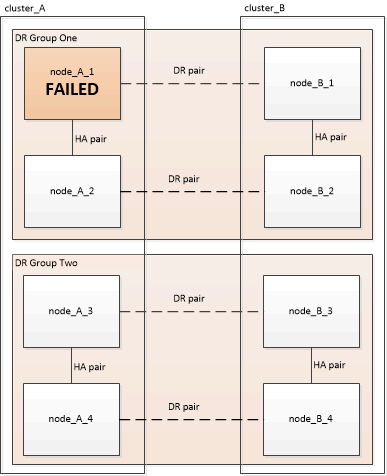
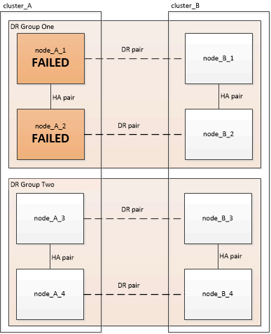
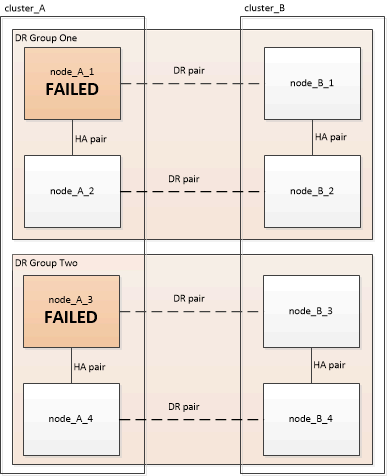
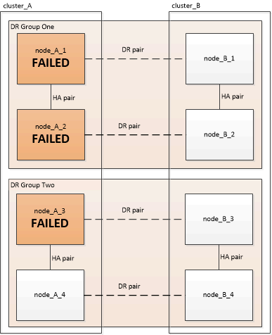
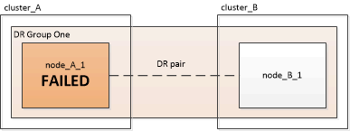

= Choosing the correct recovery procedure
:icons: font
:imagesdir: ../media/

[.lead]
After a failure in a MetroCluster configuration, you must select the correct recovery procedure. Use the following table and examples to select the appropriate recovery procedure.

[cols=2*,options="header"]
|===
| Scope of failures at disaster site| Procedure
a|

* No controller module failure
* Other hardware has failed

a|
xref:task_recover_from_a_non_controller_failure_mcc_dr.adoc[Recovering from a non-controller failure]
a|

* Single controller module failure or failure of FRU components within the controller module
* Drives have not failed

a|
If a failure is limited to a single controller module, you must use the controller module FRU replacement procedure for the platform model. In a four or eight-node MetroCluster configuration, such a failure is isolated to the local HA pair.

*Note:* The controller module FRU replacement procedure can be used in a two-node MetroCluster configuration if there are no drive or other hardware failures.

https://docs.netapp.com/platstor/index.jsp[AFF and FAS Documentation Center]

a|

* Single controller module failure or failure of FRU components within the controller module
* Drives have failed

a|
xref:task_recover_from_a_multi_controller_and_or_storage_failure.adoc[Recovering from a multi-controller or storage failure]

a|

* Single controller module failure or failure of FRU components within the controller module
* Drives have not failed
* Additional hardware outside the controller module has failed

a|
xref:task_recover_from_a_multi_controller_and_or_storage_failure.adoc[Recovering from a multi-controller or storage failure]

You should skip all steps for drive assignment.

a|

* Multiple controller module failure (with or without additional failures) within a DR group

a|
xref:task_recover_from_a_multi_controller_and_or_storage_failure.adoc[Recovering from a multi-controller or storage failure]

|===

== Controller module failure scenarios during MetroCluster FC-to-IP Transition

The recovery procedure can be used if a site failure occurs during transition. However, it can only be used if the configuration is a stable mixed configuration, with the FC DR group and IP DR group both fully configured. The output of the metrocluster node show command should show both DR groups with all eight nodes.

IMPORTANT: If the failure occurred during transition when the nodes are in the process of being added or removed, you must contact technical support.

== Controller module failure scenarios in eight-node MetroCluster configurations

* *Single controller module failures in a single DR group*
+
In this case the failure is limited to an HA pair.

 ** If no storage requires replacement, you can use the controller module FRU replacement procedure for the platform model.
+
https://docs.netapp.com/platstor/index.jsp[AFF and FAS Documentation Center]

 ** If storage requires replacement, you can use the multi-controller module recovery procedure.
+
xref:task_recover_from_a_multi_controller_and_or_storage_failure.adoc[Recovering from a multi-controller or storage failure]

+
This scenario applies to four-node MetroCluster configurations also.
+

* *Two controller module failures in a single DR group*
+
In this case the failure requires a switchover. You can use the multi-controller module failure recovery procedure.
+
xref:task_recover_from_a_multi_controller_and_or_storage_failure.adoc[Recovering from a multi-controller or storage failure]
+
This scenario applies to four-node MetroCluster configurations also.
+

* *Single controller module failures in separate DR groups.*
+
In this case the failure is limited to separate HA pairs.

 ** If no storage requires replacement, you can use the controller module FRU replacement procedure for the platform model.
+
The FRU replacement procedure is performed twice, once for each failed controller module.
+
https://docs.netapp.com/platstor/index.jsp[AFF and FAS Documentation Center]

 ** If storage requires replacement, you can use the multi-controller module recovery procedure.
+
xref:task_recover_from_a_multi_controller_and_or_storage_failure.adoc[Recovering from a multi-controller or storage failure]

+

* *Three controller module failures spread across the DR groups*
+
In this case the failure requires a switchover. You can use the multi-controller module failure recovery procedure for DR Group One.
+
xref:task_recover_from_a_multi_controller_and_or_storage_failure.adoc[Recovering from a multi-controller or storage failure]
+
You can use the platform-specific controller module FRU replacement procedure for DR Group Two.
+
https://docs.netapp.com/platstor/index.jsp[AFF and FAS Documentation Center]
+

== Controller module failure scenarios in two-node MetroCluster configurations

The procedure you use depends on the extent of the failure.

* If no storage requires replacement, you can use the controller module FRU replacement procedure for the platform model.
+
https://docs.netapp.com/platstor/index.jsp[AFF and FAS Documentation Center]

* If storage requires replacement, you can use the multi-controller module recovery procedure.

xref:task_recover_from_a_multi_controller_and_or_storage_failure.adoc[Recovering from a multi-controller or storage failure]

