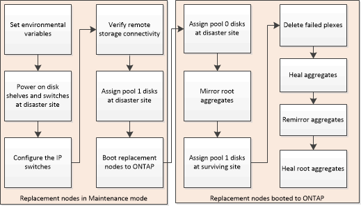

= Prepare for switchback in a MetroCluster IP configuration
:icons: font
:imagesdir: ../media/

[.lead]
You must perform certain tasks in order to prepare the MetroCluster IP configuration for the switchback operation.

.About this task
&nbsp;
// keep nbsp code, otherwise "about this task" turns into figure title.

