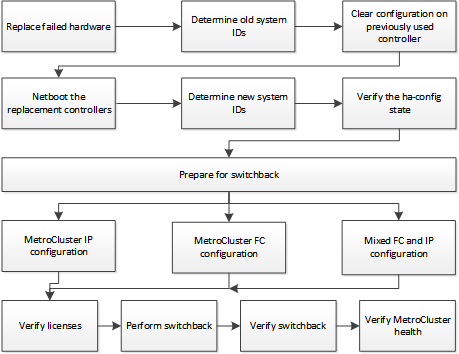

= Recovering from a multi-controller or storage failure
:icons: font
:imagesdir: ../media/

[.lead]
If the controller failure extends to all controller modules on one side of a DR group in a MetroCluster configuration (including a single controller in a two-node MetroCluster configuration), or storage has been replaced, you must replace the equipment and reassign ownership of drives to recover from the disaster.

.Before you begin

* You should review the available recovery procedures before deciding to use this procedure.
+
link:concept_choosing_the_correct_recovery_procedure_parent_concept.html[Choosing the correct recovery procedure]

* The disaster site must be fenced off.
+
link:task_perform_a_forced_switchover_after_a_disaster.html#fencing-off-the-disaster-site[Fencing off the disaster site].

* Switchover must have been performed.
+
link:task_perform_a_forced_switchover_after_a_disaster.html#performing-a-forced-switchover[Performing a forced switchover].

* Replacement drives and the controller modules must be new and must not have been assigned ownership previously.

.About this task

The examples in this procedure show two or four-node configurations. If you have an eight-node configuration (two DR groups), you must take into account any failures and perform the required recovery task on the additional controller modules.

This procedure uses the following workflow:

This procedure can be used when performing recovery on a system that was in mid-transition when the failure occurred. In that case, you must perform the appropriate steps when preparing for switchback, as indicated in the procedure.
