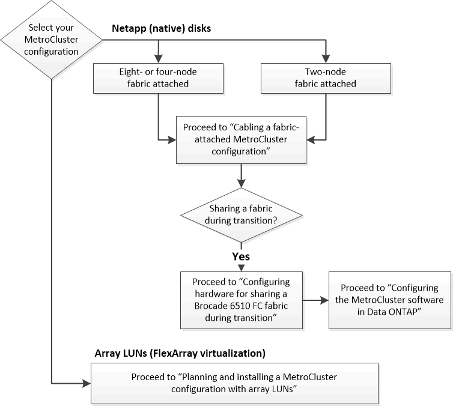

= Choosing the correct installation procedure for your configuration
:icons: font
:imagesdir: ../media/

[.lead]
You must choose the correct installation procedure based on whether you are using FlexArray LUNs, the number of nodes in the MetroCluster configuration, and whether you are sharing an existing FC switch fabric used by a 7-Mode fabric MetroCluster.

|===
| For this installation type...| Use these procedures...
a|
Fabric-attached configuration with NetApp (native) disks
a|

. link:task_configuring_the_mcc_hardware_components_fabric.md#[Cabling a fabric-attached MetroCluster configuration]
. link:concept_configuring_the_mcc_software_in_ontap.md#[Configuring the MetroCluster software in ONTAP]

a|
Fabric-attached configuration when sharing with an existing FC switch fabricThis is supported only as a temporary configuration with a 7-Mode fabric MetroCluster configuration using Brocade 6510 switches.

a|

. link:task_configuring_the_mcc_hardware_components_fabric.md#[Cabling a fabric-attached MetroCluster configuration]
. xref:task_fmc_mcc_transition_configuring_the_mcc_hardware_for_sharing_a_7_mode_brocade_6510_fc_fabric_during_transition.adoc[Configuring the MetroCluster hardware for sharing a 7-Mode Brocade 6510 FC fabric during transition]
. link:concept_configuring_the_mcc_software_in_ontap.md#[Configuring the MetroCluster software in ONTAP]

|===
