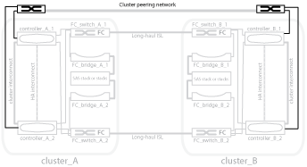

= Illustration of the cluster peering network
:icons: font
:imagesdir: ../media/

[.lead]
The two clusters in the MetroCluster configuration are peered through a customer-provided cluster peering network. Cluster peering supports the synchronous mirroring of storage virtual machines (SVMs, formerly known as Vservers) between the sites.

Intercluster LIFs must be configured on each node in the MetroCluster configuration, and the clusters must be configured for peering. The ports with the intercluster LIFs are connected to the customer-provided cluster peering network. Replication of the SVM configuration is carried out over this network through the Configuration Replication Service.

.Related information

link:concept_illustration_of_the_local_ha_pairs_in_a_mcc_configuration.html[Illustration of the local HA pairs in a MetroCluster configuration]

link:concept_illustration_of_redundant_fc_to_sas_bridges.html[Illustration of redundant FC-to-SAS bridges]

link:concept_redundant_fc_switch_fabrics.html[Redundant FC switch fabrics]

http://docs.netapp.com/ontap-9/topic/com.netapp.doc.exp-clus-peer/home.html[Cluster and SVM peering express configuration]

link:concept_considerations_peering.html[Considerations for configuring cluster peering]

link:task_cable_the_cluster_peering_connections.html[Cabling the cluster peering connections]

link:concept_configure_the_mcc_software_in_ontap.html[Peering the clusters]
