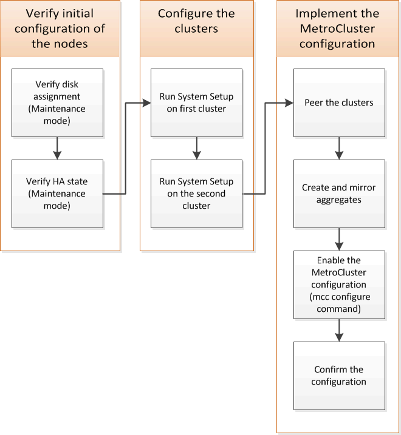

= Configuring the MetroCluster software in ONTAP
:icons: font
:imagesdir: ../media/

[.lead]
You must set up each node in the MetroCluster configuration in ONTAP, including the node-level configurations and the configuration of the nodes into two sites. You must also implement the MetroCluster relationship between the two sites. The steps for systems with native disk shelves are slightly different from those for systems with array LUNs.

== Gathering required information

[.lead]
You need to gather the required IP addresses for the controller modules before you begin the configuration process.

=== IP network information worksheet for site A

[.lead]
You must obtain IP addresses and other network information for the first MetroCluster site (site A) from your network administrator before you configure the system.

==== Site A switch information (switched clusters)

When you cable the system, you need a host name and management IP address for each cluster switch. This information is not needed if you are using a two-node switchless cluster or have a two-node MetroCluster configuration (one node at each site).

[options="header"]
|===
| Cluster switch| Host name| IP address| Network mask| Default gateway
a|
Interconnect 1
a|

a|

a|

a|

a|
Interconnect 2
a|

a|

a|

a|

a|
Management 1
a|

a|

a|

a|

a|
Management 2
a|

a|

a|

a|

|===

==== Site A cluster creation information

When you first create the cluster, you need the following information:
[options="header"]
|===
| Type of information| Your values
a|
Cluster name

Example used in this guide: site_A

a|

a|
DNS domain
a|

a|
DNS name servers
a|

a|
Location
a|

a|
Administrator password
a|

|===

==== Site A node information

For each node in the cluster, you need a management IP address, a network mask, and a default gateway.

[options="header"]
|===
| Node| Port| IP address| Network mask| Default gateway
a|
Node 1 Example used in this guide: controller_A_1

a|

a|

a|

a|

a|
Node 2Not required if using two-node MetroCluster configuration (one node at each site).

Example used in this guide: controller_A_2

a|

a|

a|

a|

|===

==== Site A LIFs and ports for cluster peering

For each node in the cluster, you need the IP addresses of two intercluster LIFs, including a network mask and a default gateway. The intercluster LIFs are used to peer the clusters.

[options="header"]
|===
| Node| Port| IP address of intercluster LIF| Network mask| Default gateway
a|
Node 1 IC LIF 1
a|

a|

a|

a|

a|
Node 1 IC LIF 2
a|

a|

a|

a|

a|
Node 2 IC LIF 1Not required for two-node MetroCluster configurations (one node at each site).

a|

a|

a|

a|

a|
Node 2 IC LIF 2Not required for two-node MetroCluster configurations (one node at each site).

a|

a|

a|

a|

|===

==== Site A time server information

You must synchronize the time, which requires one or more NTP time servers.

[options="header"]
|===
| Node| Host name| IP address| Network mask| Default gateway
a|
NTP server 1
a|

a|

a|

a|

a|
NTP server 2
a|

a|

a|

a|

|===

==== Site A AutoSupport information

You must configure AutoSupport on each node, which requires the following information:

[options="header"]
|===
2+| Type of information| Your values
a|
From email address
a|

a|

a|
Mail hosts
a|
IP addresses or names
a|

.2+a|
Transport protocol
a|
HTTP, HTTPS, or SMTP
a|

a|
Proxy server
a|

.3+a|
Recipient email addresses or distribution lists
a|
Full-length messages
a|

a|
Concise messages
a|

a|
Partners
a|

|===

==== Site A SP information

You must enable access to the Service Processor (SP) of each node for troubleshooting and maintenance, which requires the following network information for each node:

[options="header"]
|===
| Node| IP address| Network mask| Default gateway
a|
Node 1
a|

a|

a|

a|
Node 2

Not required for two-node MetroCluster configurations (one node at each site).

a|

a|

a|

|===

=== IP network information worksheet for site B

[.lead]
You must obtain IP addresses and other network information for the second MetroCluster site (site B) from your network administrator before you configure the system.

==== Site B switch information (switched clusters)

When you cable the system, you need a host name and management IP address for each cluster switch. This information is not needed if you are using a two-node switchless cluster or you have a two-node MetroCluster configuration (one node at each site).

[options="header"]
|===
| Cluster switch| Host name| IP address| Network mask| Default gateway
a|
Interconnect 1
a|

a|

a|

a|

a|
Interconnect 2
a|

a|

a|

a|

a|
Management 1
a|

a|

a|

a|

a|
Management 2
a|

a|

a|

a|

|===

==== Site B cluster creation information

When you first create the cluster, you need the following information:

[options="header"]
|===
| Type of information| Your values
a|
Cluster name

Example used in this guide: site_B

a|

a|
DNS domain
a|

a|
DNS name servers
a|

a|
Location
a|

a|
Administrator password
a|

|===

==== Site B node information

For each node in the cluster, you need a management IP address, a network mask, and a default gateway.

[options="header"]
|===
| Node| Port| IP address| Network mask| Default gateway
a|
Node 1

Example used in this guide: controller_B_1

a|

a|

a|

a|

a|
Node 2

Not required for two-node MetroCluster configurations (one node at each site).

Example used in this guide: controller_B_2

a|

a|

a|

a|

|===

==== Site B LIFs and ports for cluster peering

For each node in the cluster, you need the IP addresses of two intercluster LIFs, including a network mask and a default gateway. The intercluster LIFs are used to peer the clusters.

[options="header"]
|===
| Node| Port| IP address of intercluster LIF| Network mask| Default gateway
a|
Node 1 IC LIF 1
a|

a|

a|

a|

a|
Node 1 IC LIF 2
a|

a|

a|

a|

a|
Node 2 IC LIF 1

Not required for two-node MetroCluster configurations (one node at each site).

a|

a|

a|

a|

a|
Node 2 IC LIF 2

Not required for two-node MetroCluster configurations (one node at each site).

a|

a|

a|

a|

|===

==== Site B time server information

You must synchronize the time, which requires one or more NTP time servers.
[options="header"]
|===
| Node| Host name| IP address| Network mask| Default gateway
a|
NTP server 1
a|

a|

a|

a|

a|
NTP server 2
a|

a|

a|

a|

|===

==== Site B AutoSupport information

You must configure AutoSupport on each node, which requires the following information:

[options="header"]
|===
| Type of information| Your values
a|
From email address
a|

a|

a|
Mail hosts
a|
IP addresses or names
a|

.2+a|
Transport protocol
a|
HTTP, HTTPS, or SMTP
a|

a|
Proxy server
a|

.3+a|
Recipient email addresses or distribution lists
a|
Full-length messages
a|

a|
Concise messages
a|

a|
Partners
a|

|===

==== Site B SP information

You must enable access to the Service Processor (SP) of each node for troubleshooting and maintenance, which requires the following network information for each node:

[options="header"]
|===
| Node| IP address| Network mask| Default gateway
a|
Node 1 (controller_B_1)
a|

a|

a|

a|
Node 2 (controller_B_2)

Not required for two-node MetroCluster configurations (one node at each site).

a|

a|

a|

|===

== Similarities and differences between standard cluster and MetroCluster configurations

[.lead]
The configuration of the nodes in each cluster in a MetroCluster configuration is similar to that of nodes in a standard cluster.

The MetroCluster configuration is built on two standard clusters. Physically, the configuration must be symmetrical, with each node having the same hardware configuration, and all of the MetroCluster components must be cabled and configured. However, the basic software configuration for nodes in a MetroCluster configuration is the same as that for nodes in a standard cluster.

[options="header"]
|===
| Configuration step| Standard cluster configuration| MetroCluster configuration
a|
Configure management, cluster, and data LIFs on each node.
2+a|
Same in both types of clusters
a|
Configure the root aggregate.
2+a|
Same in both types of clusters
a|
Configure nodes in the cluster as HA pairs
2+a|
Same in both types of clusters
a|
Set up the cluster on one node in the cluster.
2+a|
Same in both types of clusters
a|
Join the other node to the cluster.
2+a|
Same in both types of clusters
a|
Create a mirrored root aggregate.
a|
Optional
a|
Required
a|
Peer the clusters.
a|
Optional
a|
Required
a|
Enable the MetroCluster configuration.
a|
Does not apply
a|
Required
|===

== Restoring system defaults and configuring the HBA type on a controller module
// include reference
include::_include/steps_restore_defaults_and_configure_hbas.adoc[]
// end include reference
== Configuring FC-VI ports on a X1132A-R6 quad-port card on FAS8020 systems

[.lead]
If you are using the X1132A-R6 quad-port card on a FAS8020 system, you can enter Maintenance mode to configure the 1a and 1b ports for FC-VI and initiator usage. This is not required on MetroCluster systems received from the factory, in which the ports are set appropriately for your configuration.

This task must be performed in Maintenance mode.

NOTE: Converting an FC port to an FC-VI port with the ucadmin command is only supported on the FAS8020 and AFF 8020 systems. Converting FC ports to FCVI ports is not supported on any other platform.

. Disable the ports:
+
`*storage disable adapter 1a*`
+
`*storage disable adapter 1b*`
+
----
*> storage disable adapter 1a
Jun 03 02:17:57 [controller_B_1:fci.adapter.offlining:info]: Offlining Fibre Channel adapter 1a.
Host adapter 1a disable succeeded
Jun 03 02:17:57 [controller_B_1:fci.adapter.offline:info]: Fibre Channel adapter 1a is now offline.
*> storage disable adapter 1b
Jun 03 02:18:43 [controller_B_1:fci.adapter.offlining:info]: Offlining Fibre Channel adapter 1b.
Host adapter 1b disable succeeded
Jun 03 02:18:43 [controller_B_1:fci.adapter.offline:info]: Fibre Channel adapter 1b is now offline.
*>
----

. Verify that the ports are disabled:
+
`*ucadmin show*`
+
----
*> ucadmin show
         Current  Current    Pending  Pending    Admin
Adapter  Mode     Type       Mode     Type       Status
-------  -------  ---------  -------  ---------  -------
  ...
  1a     fc       initiator  -        -          offline
  1b     fc       initiator  -        -          offline
  1c     fc       initiator  -        -          online
  1d     fc       initiator  -        -          online
----

. Set the a and b ports to FC-VI mode:
+
`*ucadmin modify -adapter 1a -type fcvi*`
+
The command sets the mode on both ports in the port pair, 1a and 1b (even though only 1a is specified in the command).
+
----

*> ucadmin modify -t fcvi 1a
Jun 03 02:19:13 [controller_B_1:ucm.type.changed:info]: FC-4 type has changed to fcvi on adapter 1a. Reboot the controller for the changes to take effect.
Jun 03 02:19:13 [controller_B_1:ucm.type.changed:info]: FC-4 type has changed to fcvi on adapter 1b. Reboot the controller for the changes to take effect.
----

. Confirm that the change is pending:
+
`*ucadmin show*`
+
----
*> ucadmin show
         Current  Current    Pending  Pending    Admin
Adapter  Mode     Type       Mode     Type       Status
-------  -------  ---------  -------  ---------  -------
  ...
  1a     fc       initiator  -        fcvi       offline
  1b     fc       initiator  -        fcvi       offline
  1c     fc       initiator  -        -          online
  1d     fc       initiator  -        -          online
----

. Shut down the controller, and then reboot into Maintenance mode.
. Confirm the configuration change:
+
`*ucadmin show local*`
+
----

Node           Adapter  Mode     Type       Mode     Type       Status
------------   -------  -------  ---------  -------  ---------  -----------
...
controller_B_1
               1a       fc       fcvi       -        -          online
controller_B_1
               1b       fc       fcvi       -        -          online
controller_B_1
               1c       fc       initiator  -        -          online
controller_B_1
               1d       fc       initiator  -        -          online
6 entries were displayed.
----

== Verifying disk assignment in Maintenance mode in an eight-node or a four-node configuration

[.lead]
Before fully booting the system to ONTAP, you can optionally boot to Maintenance mode and verify the disk assignment on the nodes. The disks should be assigned to create a fully symmetric active-active configuration, where each pool has an equal number of disks assigned to them.

New MetroCluster systems have disk assignment completed prior to shipment.

The following table shows example pool assignments for a MetroCluster configuration. Disks are assigned to pools on a per-shelf basis.

[options="header"]
|===
| Disk shelf (sample_shelf_name)...| At site...| Belongs to...| And is assigned to that node's...
a|
Disk shelf 1 (shelf_A_1_1)
.16+a|
Site A
.2+a|
Node A 1
.2+a|
Pool 0
a|
Disk shelf 2 (shelf_A_1_3)
a|
Disk shelf 3 (shelf_B_1_1)
.2+a|
Node B 1
.2+a|
Pool 1
a|
Disk shelf 4 (shelf_B_1_3)
a|
Disk shelf 5 (shelf_A_2_1)
.2+a|
Node A 2
.2+a|
Pool 0
a|
Disk shelf 6 (shelf_A_2_3)
a|
Disk shelf 7 (shelf_B_2_1)
.2+a|
Node B 2
.2+a|
Pool 1
a|
Disk shelf 8 (shelf_B_2_3)
a|
Disk shelf 1 (shelf_A_3_1)
.2+a|
Node A 3
.2+a|
Pool 0
a|
Disk shelf 2 (shelf_A_3_3)
a|
Disk shelf 3 (shelf_B_3_1)
.2+a|
Node B 3
.2+a|
Pool 1
a|
Disk shelf 4 (shelf_B_3_3)
a|
Disk shelf 5 (shelf_A_4_1)
.2+a|
Node A 4
.2+a|
Pool 0
a|
Disk shelf 6 (shelf_A_4_3)
a|
Disk shelf 7 (shelf_B_4_1)
.2+a|
Node B 4
.2+a|
Pool 1
a|
Disk shelf 8 (shelf_B_4_3)
a|
Disk shelf 9 (shelf_B_1_2)
.16+a|
Site B
.2+a|
Node B 1
.2+a|
Pool 0
a|
Disk shelf 10 (shelf_B_1_4)
a|
Disk shelf 11 (shelf_A_1_2)
.2+a|
Node A 1
.2+a|
Pool 1
a|
Disk shelf 12 (shelf_A_1_4)
a|
Disk shelf 13 (shelf_B_2_2)
.2+a|
Node B 2
.2+a|
Pool 0
a|
Disk shelf 14 (shelf_B_2_4)
a|
Disk shelf 15 (shelf_A_2_2)
.2+a|
Node A 2
.2+a|
Pool 1
a|
Disk shelf 16 (shelf_A_2_4)
a|
Disk shelf 1 (shelf_B_3_2)
.2+a|
Node A 3
.2+a|
Pool 0
a|
Disk shelf 2 (shelf_B_3_4)
a|
Disk shelf 3 (shelf_A_3_2)
.2+a|
Node B 3
.2+a|
Pool 1
a|
Disk shelf 4 (shelf_A_3_4)
a|
Disk shelf 5 (shelf_B_4_2)
.2+a|
Node A 4
.2+a|
Pool 0
a|
Disk shelf 6 (shelf_B_4_4)
a|
Disk shelf 7 (shelf_A_4_2)
.2+a|
Node B 4
.2+a|
Pool 1
a|
Disk shelf 8 (shelf_A_4_4)
|===

. Confirm the shelf assignments: `*disk show –v*`
. If necessary, explicitly assign disks on the attached disk shelves to the appropriate pool by using the `disk assign` command.
+
Using wildcards in the command enables you to assign all of the disks on a disk shelf with one command. You can identify the disk shelf IDs and bays for each disk with the `storage show disk --x` command.

=== Assigning disk ownership in non-AFF systems

[.lead]
If the MetroCluster nodes do not have the disks correctly assigned, or if you are using DS460C disk shelves in your configuration, you must assign disks to each of the nodes in the MetroCluster configuration on a shelf-by-shelf basis. You will create a configuration in which each node has the same number of disks in its local and remote disk pools.

The storage controllers must be in Maintenance mode.

If your configuration does not include DS460C disk shelves, this task is not required if disks were correctly assigned when received from the factory.

NOTE: Pool 0 always contains the disks that are found at the same site as the storage system that owns them.

Pool 1 always contains the disks that are remote to the storage system that owns them.

If your configuration includes DS460C disk shelves, you should manually assign the disks using the following guidelines for each 12-disk drawer:

|===
| Assign these disks in the drawer...| To this node and pool...
a|
0 - 2
a|
Local node's pool 0
a|
3 - 5
a|
HA partner node's pool 0
a|
6 - 8
a|
DR partner of the local node's pool 1
a|
9 - 11
a|
DR partner of the HA partner's pool 1
|===
This disk assignment pattern ensures that an aggregate is minimally affected in case a drawer goes offline.

. If you have not done so, boot each system into Maintenance mode.
. Assign the disk shelves to the nodes located at the first site (site A):
+
Disk shelves at the same site as the node are assigned to pool 0 and disk shelves located at the partner site are assigned to pool 1.
+
You should assign an equal number of shelves to each pool.

 .. On the first node, systematically assign the local disk shelves to pool 0 and the remote disk shelves to pool 1: `disk assign -shelf local-switch-name:shelf-name.port -p pool`
+
If storage controller Controller_A_1 has four shelves, you issue the following commands:
+
----
*> disk assign -shelf FC_switch_A_1:1-4.shelf1 -p 0
*> disk assign -shelf FC_switch_A_1:1-4.shelf2 -p 0

*> disk assign -shelf FC_switch_B_1:1-4.shelf1 -p 1
*> disk assign -shelf FC_switch_B_1:1-4.shelf2 -p 1
----

 .. Repeat the process for the second node at the local site, systematically assigning the local disk shelves to pool 0 and the remote disk shelves to pool 1: `disk assign -shelf local-switch-name:shelf-name.port -p pool`
+
If storage controller Controller_A_2 has four shelves, you issue the following commands:
+
----
*> disk assign -shelf FC_switch_A_1:1-4.shelf3 -p 0
*> disk assign -shelf FC_switch_B_1:1-4.shelf4 -p 1

*> disk assign -shelf FC_switch_A_1:1-4.shelf3 -p 0
*> disk assign -shelf FC_switch_B_1:1-4.shelf4 -p 1
----

. Assign the disk shelves to the nodes located at the second site (site B):
+
Disk shelves at the same site as the node are assigned to pool 0 and disk shelves located at the partner site are assigned to pool 1.
+
You should assign an equal number of shelves to each pool.

 .. On the first node at the remote site, systematically assign its local disk shelves to pool 0 and its remote disk shelves to pool 1: `disk assign -shelf local-switch-nameshelf-name -p pool`
+
If storage controller Controller_B_1 has four shelves, you issue the following commands:
+
----
*> disk assign -shelf FC_switch_B_1:1-5.shelf1 -p 0
*> disk assign -shelf FC_switch_B_1:1-5.shelf2 -p 0

*> disk assign -shelf FC_switch_A_1:1-5.shelf1 -p 1
*> disk assign -shelf FC_switch_A_1:1-5.shelf2 -p 1
----

 .. Repeat the process for the second node at the remote site, systematically assigning its local disk shelves to pool 0 and its remote disk shelves to pool 1: `disk assign -shelf shelf-name -p pool`
+
If storage controller Controller_B_2 has four shelves, you issue the following commands:
+
----
*> disk assign -shelf FC_switch_B_1:1-5.shelf3 -p 0
*> disk assign -shelf FC_switch_B_1:1-5.shelf4 -p 0

*> disk assign -shelf FC_switch_A_1:1-5.shelf3 -p 1
*> disk assign -shelf FC_switch_A_1:1-5.shelf4 -p 1
----

. Confirm the shelf assignments: `storage show shelf`
. Exit Maintenance mode: `halt`
. Display the boot menu: `boot_ontap menu`
. On each node, select option *4* to initialize all disks.

=== Assigning disk ownership in AFF systems

[.lead]
If you are using AFF systems in a configuration with mirrored aggregates and the nodes do not have the disks (SSDs) correctly assigned, you should assign half the disks on each shelf to one local node and the other half of the disks to its HA partner node. You should create a configuration in which each node has the same number of disks in its local and remote disk pools.

The storage controllers must be in Maintenance mode.

This does not apply to configurations which have unmirrored aggregates, an active/passive configuration, or that have an unequal number of disks in local and remote pools.

This task is not required if disks were correctly assigned when received from the factory.

NOTE: Pool 0 always contains the disks that are found at the same site as the storage system that owns them, while Pool 1 always contains the disks that are remote to the storage system that owns them.

. If you have not done so, boot each system into Maintenance mode.
. Assign the disks to the nodes located at the first site (site A):
+
You should assign an equal number of disks to each pool.

 .. On the first node, systematically assign half the disks on each shelf to pool 0 and the other half to the HA partner's pool 0: `disk assign -disk disk-name -p pool -n number-of-disks`
+
If storage controller Controller_A_1 has four shelves, each with 8 SSDs, you issue the following commands:
+
----
*> disk assign -shelf FC_switch_A_1:1-4.shelf1 -p 0 -n 4
*> disk assign -shelf FC_switch_A_1:1-4.shelf2 -p 0 -n 4

*> disk assign -shelf FC_switch_B_1:1-4.shelf1 -p 1 -n 4
*> disk assign -shelf FC_switch_B_1:1-4.shelf2 -p 1 -n 4
----

 .. Repeat the process for the second node at the local site, systematically assigning half the disks on each shelf to pool 1 and the other half to the HA partner's pool 1: `disk assign -disk disk-name -p pool`
+
If storage controller Controller_A_1 has four shelves, each with 8 SSDs, you issue the following commands:
+
----
*> disk assign -shelf FC_switch_A_1:1-4.shelf3 -p 0 -n 4
*> disk assign -shelf FC_switch_B_1:1-4.shelf4 -p 1 -n 4

*> disk assign -shelf FC_switch_A_1:1-4.shelf3 -p 0 -n 4
*> disk assign -shelf FC_switch_B_1:1-4.shelf4 -p 1 -n 4
----

. Assign the disks to the nodes located at the second site (site B):
+
You should assign an equal number of disks to each pool.

 .. On the first node at the remote site, systematically assign half the disks on each shelf to pool 0 and the other half to the HA partner's pool 0: `disk assign -disk disk-name -p pool`
+
If storage controller Controller_B_1 has four shelves, each with 8 SSDs, you issue the following commands:
+
----
*> disk assign -shelf FC_switch_B_1:1-5.shelf1 -p 0 -n 4
*> disk assign -shelf FC_switch_B_1:1-5.shelf2 -p 0 -n 4

*> disk assign -shelf FC_switch_A_1:1-5.shelf1 -p 1 -n 4
*> disk assign -shelf FC_switch_A_1:1-5.shelf2 -p 1 -n 4
----

 .. Repeat the process for the second node at the remote site, systematically assigning half the disks on each shelf to pool 1 and the other half to the HA partner's pool 1: `disk assign -disk disk-name -p pool`
+
If storage controller Controller_B_2 has four shelves, each with 8 SSDs, you issue the following commands:
+
----
*> disk assign -shelf FC_switch_B_1:1-5.shelf3 -p 0 -n 4
*> disk assign -shelf FC_switch_B_1:1-5.shelf4 -p 0 -n 4

*> disk assign -shelf FC_switch_A_1:1-5.shelf3 -p 1 -n 4
*> disk assign -shelf FC_switch_A_1:1-5.shelf4 -p 1 -n 4
----

. Confirm the disk assignments: `storage show disk`
. Exit Maintenance mode: `halt`
. Display the boot menu: `boot_ontap menu`
. On each node, select option *4* to initialize all disks.

== Verifying disk assignment in Maintenance mode in a two-node configuration

[.lead]
Before fully booting the system to ONTAP, you can optionally boot the system to Maintenance mode and verify the disk assignment on the nodes. The disks should be assigned to create a fully symmetric configuration with both sites owning their own disk shelves and serving data, where each node and each pool have an equal number of mirrored disks assigned to them.

The system must be in Maintenance mode.

New MetroCluster systems have disk assignment completed prior to shipment.

The following table shows example pool assignments for a MetroCluster configuration. Disks are assigned to pools on a per-shelf basis.

|===
| Disk shelf (example name)...| At site...| Belongs to...| And is assigned to that node's...
a|
Disk shelf 1 (shelf_A_1_1)
a|
Site A
a|
Node A 1
a|
Pool 0
a|
Disk shelf 2 (shelf_A_1_3)
a|
Disk shelf 3 (shelf_B_1_1)
a|
Node B 1
a|
Pool 1
a|
Disk shelf 4 (shelf_B_1_3)
a|
Disk shelf 9 (shelf_B_1_2)
a|
Site B
a|
Node B 1
a|
Pool 0
a|
Disk shelf 10 (shelf_B_1_4)
a|
Disk shelf 11 (shelf_A_1_2)
a|
Node A 1
a|
Pool 1
a|
Disk shelf 12 (shelf_A_1_4)
|===
If your configuration includes DS460C disk shelves, you should manually assign the disks using the following guidelines for each 12-disk drawer:

|===
| Assign these disks in the drawer...| To this node and pool...
a|
1 - 6
a|
Local node's pool 0
a|
7 - 12
a|
DR partner's pool 1
|===
This disk assignment pattern minimizes the effect on an aggregate if a drawer goes offline.

. If your system was received from the factory, confirm the shelf assignments: `disk show –v`
. If necessary, you can explicitly assign disks on the attached disk shelves to the appropriate pool by using the disk assign command.
+
Disk shelves at the same site as the node are assigned to pool 0 and disk shelves located at the partner site are assigned to pool 1. You should assign an equal number of shelves to each pool.

 .. If you have not done so, boot each system into Maintenance mode.
 .. On the node on site A, systematically assign the local disk shelves to pool 0 and the remote disk shelves to pool 1: `disk assign -shelf disk_shelf_name -p pool`
+
If storage controller node_A_1 has four shelves, you issue the following commands:
+
----

*> disk assign -shelf shelf_A_1_1 -p 0
*> disk assign -shelf shelf_A_1_3 -p 0

*> disk assign -shelf shelf_A_1_2 -p 1
*> disk assign -shelf shelf_A_1_4 -p 1
----

 .. On the node at the remote site (site B), systematically assign its local disk shelves to pool 0 and its remote disk shelves to pool 1: `disk assign -shelf disk_shelf_name -p pool`
+
If storage controller node_B_1 has four shelves, you issue the following commands:
+
----

*> disk assign -shelf shelf_B_1_2   -p 0
*> disk assign -shelf shelf_B_1_4  -p 0

*> disk assign -shelf shelf_B_1_1 -p 1
 *> disk assign -shelf shelf_B_1_3 -p 1
----

 .. Show the disk shelf IDs and bays for each disk: `disk show –v`

== Verifying and configuring the HA state of components in Maintenance mode

[.lead]
When configuring a storage system in a MetroCluster configuration, you must make sure that the high-availability (HA) state of the controller module and chassis components is mcc or mcc-2n so that these components boot properly.

The system must be in Maintenance mode.

This task is not required on systems that are received from the factory.

. In Maintenance mode, display the HA state of the controller module and chassis: `ha-config show`
+
The correct HA state depends on your MetroCluster configuration.
+
|===
| Number of controllers in the MetroCluster configuration| HA state for all components should be...
a|
Eight- or four-node MetroCluster FC configuration
a|
mcc
a|
Two-node MetroCluster FC configuration
a|
mcc-2n
a|
MetroCluster IP configuration
a|
mccip
|===

. If the displayed system state of the controller is not correct, set the HA state for the controller module:
+
|===
| Number of controllers in the MetroCluster configuration| Command
a|
Eight- or four-node MetroCluster FC configuration
a|
ha-config modify controller mcc
a|
Two-node MetroCluster FC configuration
a|
ha-config modify controller mcc-2n
a|
MetroCluster IP configuration
a|
ha-config modify controller mccip
|===

. If the displayed system state of the chassis is not correct, set the HA state for the chassis:
+
|===
| Number of controllers in the MetroCluster configuration| Command
a|
Eight- or four-node MetroCluster FC configuration
a|
ha-config modify chassis mcc
a|
Two-node MetroCluster FC configuration
a|
ha-config modify chassis mcc-2n
a|
MetroCluster IP configuration
a|
ha-config modify chassis mccip
|===

. Boot the node to ONTAP: `boot_ontap`
. Repeat these steps on each node in the MetroCluster configuration.

== Setting up ONTAP

[.lead]
You must set up ONTAP on each controller module.

If you need to netboot the new controllers, see http://docs.netapp.com/ontap-9/topic/com.netapp.doc.dot-mcc-upgrade/GUID-3370EC34-310E-4F09-829F-F632EC8CDD9B.html[Netbooting the new controller modules] in the _MetroCluster Upgrade, Transition, and Expansion Guide_.

=== Setting up ONTAP in a two-node MetroCluster configuration

[.lead]
In a two-node MetroCluster configuration, on each cluster you must boot up the node, exit the Cluster Setup wizard, and use the cluster setup command to configure the node into a single-node cluster.

You must not have configured the Service Processor.

This task is for two-node MetroCluster configurations using native NetApp storage.

New MetroCluster systems are preconfigured; you do not need to perform these steps. However, you should configure AutoSupport.

This task must be performed on both clusters in the MetroCluster configuration.

For more general information about setting up ONTAP, see the _Software Setup Guide_

. Power on the first node.
+
NOTE: You must repeat this step on the node at the disaster recovery (DR) site.
+
The node boots, and then the Cluster Setup wizard starts on the console, informing you that AutoSupport will be enabled automatically.
+
----
::> Welcome to the cluster setup wizard.

You can enter the following commands at any time:
  "help" or "?" - if you want to have a question clarified,
  "back" - if you want to change previously answered questions, and
  "exit" or "quit" - if you want to quit the cluster setup wizard.
     Any changes you made before quitting will be saved.

You can return to cluster setup at any time by typing "cluster setup".
To accept a default or omit a question, do not enter a value.

This system will send event messages and periodic reports to NetApp Technical
Support. To disable this feature, enter
autosupport modify -support disable
within 24 hours.

Enabling AutoSupport can significantly speed problem determination and
resolution, should a problem occur on your system.
For further information on AutoSupport, see:
http://support.netapp.com/autosupport/

Type yes to confirm and continue {yes}: yes

Enter the node management interface port [e0M]:
Enter the node management interface IP address [10.101.01.01]:

Enter the node management interface netmask [101.010.101.0]:
Enter the node management interface default gateway [10.101.01.0]:

Do you want to create a new cluster or join an existing cluster? {create, join}:
----

. Create a new cluster: `create`
. Choose whether the node is to be used as a single node cluster.
+
----
Do you intend for this node to be used as a single node cluster? {yes, no} [yes]:
----

. Accept the system default `yes` by pressing Enter, or enter your own values by typing `no`, and then pressing Enter.
. Follow the prompts to complete the Cluster Setup wizard, pressing Enter to accept the default values or typing your own values and then pressing Enter.
+
The default values are determined automatically based on your platform and network configuration.

. After you complete the Cluster Setup wizard and it exits, verify that the cluster is active and the first node is healthy: `cluster show`
+
The following example shows a cluster in which the first node (cluster1-01) is healthy and eligible to participate:
+
----
cluster1::> cluster show
Node                  Health  Eligibility
--------------------- ------- ------------
cluster1-01           true    true
----
+
If it becomes necessary to change any of the settings you entered for the admin SVM or node SVM, you can access the Cluster Setup wizard by using the cluster setup command.

https://docs.netapp.com/ontap-9/topic/com.netapp.doc.dot-cm-ssg/home.html[Software setup]

=== Setting up ONTAP in an eight-node or four-node MetroCluster configuration

[.lead]
After you boot each node, you are prompted to run the System Setup tool to perform basic node and cluster configuration. After configuring the cluster, you return to the ONTAP CLI to create aggregates and create the MetroCluster configuration.

You must have cabled the MetroCluster configuration.

This task is for eight-node or four-node MetroCluster configurations using native NetApp storage.

New MetroCluster systems are preconfigured; you do not need to perform these steps. However, you should configure the AutoSupport tool.

This task must be performed on both clusters in the MetroCluster configuration.

This procedure uses the System Setup tool. If desired, you can use the CLI cluster setup wizard instead.

. If you have not already done so, power up each node and let them boot completely.
+
If the system is in Maintenance mode, issue the halt command to exit Maintenance mode, and then issue the following command from the LOADER prompt: `boot_ontap`
+
The output should be similar to the following:
+
----
Welcome to node setup

You can enter the following commands at any time:
  "help" or "?" - if you want to have a question clarified,
  "back" - if you want to change previously answered questions, and
  "exit" or "quit" - if you want to quit the setup wizard.
				Any changes you made before quitting will be saved.

To accept a default or omit a question, do not enter a value.
.
.
.
----

. Enable the AutoSupport tool by following the directions provided by the system.
. Respond to the prompts to configure the node management interface.
+
The prompts are similar to the following:
+
----
Enter the node management interface port: [e0M]:
Enter the node management interface IP address: 10.228.160.229
Enter the node management interface netmask: 225.225.252.0
Enter the node management interface default gateway: 10.228.160.1
----

. Confirm that nodes are configured in high-availability mode: `storage failover show -fields mode`
+
If not, you must issue the following command on each node and reboot the node: `storage failover modify -mode ha -node localhost`
+
This command configures high availability mode but does not enable storage failover. Storage failover is automatically enabled when the MetroCluster configuration is performed later in the configuration process.

. Confirm that you have four ports configured as cluster interconnects: `network port show`
+
The following example shows output for cluster_A:
+
----
cluster_A::> network port show
                                                             Speed (Mbps)
Node   Port      IPspace      Broadcast Domain Link   MTU    Admin/Oper
------ --------- ------------ ---------------- ----- ------- ------------
node_A_1
       **e0a       Cluster      Cluster          up       1500  auto/1000
       e0b       Cluster      Cluster          up       1500  auto/1000**
       e0c       Default      Default          up       1500  auto/1000
       e0d       Default      Default          up       1500  auto/1000
       e0e       Default      Default          up       1500  auto/1000
       e0f       Default      Default          up       1500  auto/1000
       e0g       Default      Default          up       1500  auto/1000
node_A_2
       **e0a       Cluster      Cluster          up       1500  auto/1000
       e0b       Cluster      Cluster          up       1500  auto/1000**
       e0c       Default      Default          up       1500  auto/1000
       e0d       Default      Default          up       1500  auto/1000
       e0e       Default      Default          up       1500  auto/1000
       e0f       Default      Default          up       1500  auto/1000
       e0g       Default      Default          up       1500  auto/1000
14 entries were displayed.
----

. If you are creating a two-node switchless cluster (a cluster without cluster interconnect switches), enable the switchless-cluster networking mode:
 .. Change to the advanced privilege level: `set -privilege advanced`
+
You can respond `y` when prompted to continue into advanced mode. The advanced mode prompt appears (*>).

 .. Enable switchless-cluster mode: `network options switchless-cluster modify -enabled true`
 .. Return to the admin privilege level: `set -privilege admin`
. Launch the System Setup tool as directed by the information that appears on the system console after the initial boot.
. Use the System Setup tool to configure each node and create the cluster, but do not create aggregates.
+
NOTE: You create mirrored aggregates in later tasks.

Return to the ONTAP command-line interface and complete the MetroCluster configuration by performing the tasks that follow.

== Configuring the clusters into a MetroCluster configuration

[.lead]
You must peer the clusters, mirror the root aggregates, create a mirrored data aggregate, and then issue the command to implement the MetroCluster operations.

=== Peering the clusters

[.lead]
The clusters in the MetroCluster configuration must be in a peer relationship so that they can communicate with each other and perform the data mirroring essential to MetroCluster disaster recovery.

*Related information*

http://docs.netapp.com/ontap-9/topic/com.netapp.doc.exp-clus-peer/home.html[Cluster and SVM peering express configuration]

xref:concept_prepare_for_the_mcc_installation.adoc[Considerations when using dedicated ports]

xref:concept_prepare_for_the_mcc_installation.adoc[Considerations when sharing data ports]

==== Configuring intercluster LIFs

[.lead]
You must create intercluster LIFs on ports used for communication between the MetroCluster partner clusters. You can use dedicated ports or ports that also have data traffic.

===== Configuring intercluster LIFs on dedicated ports

[.lead]
You can configure intercluster LIFs on dedicated ports. Doing so typically increases the available bandwidth for replication traffic.

. List the ports in the cluster:``network port show``
+
For complete command syntax, see the man page.
+
The following example shows the network ports in cluster01:
+
----

cluster01::> network port show
                                                             Speed (Mbps)
Node   Port      IPspace      Broadcast Domain Link   MTU    Admin/Oper
------ --------- ------------ ---------------- ----- ------- ------------
cluster01-01
       e0a       Cluster      Cluster          up     1500   auto/1000
       e0b       Cluster      Cluster          up     1500   auto/1000
       e0c       Default      Default          up     1500   auto/1000
       e0d       Default      Default          up     1500   auto/1000
       e0e       Default      Default          up     1500   auto/1000
       e0f       Default      Default          up     1500   auto/1000
cluster01-02
       e0a       Cluster      Cluster          up     1500   auto/1000
       e0b       Cluster      Cluster          up     1500   auto/1000
       e0c       Default      Default          up     1500   auto/1000
       e0d       Default      Default          up     1500   auto/1000
       e0e       Default      Default          up     1500   auto/1000
       e0f       Default      Default          up     1500   auto/1000
----

. Determine which ports are available to dedicate to intercluster communication:``network interface show -fields home-port,curr-port``
+
For complete command syntax, see the man page.
+
The following example shows that ports e0e and e0f have not been assigned LIFs:
+
----

cluster01::> network interface show -fields home-port,curr-port
vserver lif                  home-port curr-port
------- -------------------- --------- ---------
Cluster cluster01-01_clus1   e0a       e0a
Cluster cluster01-01_clus2   e0b       e0b
Cluster cluster01-02_clus1   e0a       e0a
Cluster cluster01-02_clus2   e0b       e0b
cluster01
        cluster_mgmt         e0c       e0c
cluster01
        cluster01-01_mgmt1   e0c       e0c
cluster01
        cluster01-02_mgmt1   e0c       e0c
----

. Create a failover group for the dedicated ports:``network interface failover-groups create -vserver system_SVM -failover-group failover_group -targets physical_or_logical_ports``
+
The following example assigns ports e0e and e0f to the failover group intercluster01 on the system SVMcluster01:
+
----
cluster01::> network interface failover-groups create -vserver cluster01 -failover-group
intercluster01 -targets
cluster01-01:e0e,cluster01-01:e0f,cluster01-02:e0e,cluster01-02:e0f
----

. Verify that the failover group was created:``network interface failover-groups show``
+
For complete command syntax, see the man page.
+
----
cluster01::> network interface failover-groups show
                                  Failover
Vserver          Group            Targets
---------------- ---------------- --------------------------------------------
Cluster
                 Cluster
                                  cluster01-01:e0a, cluster01-01:e0b,
                                  cluster01-02:e0a, cluster01-02:e0b
cluster01
                 Default
                                  cluster01-01:e0c, cluster01-01:e0d,
                                  cluster01-02:e0c, cluster01-02:e0d,
                                  cluster01-01:e0e, cluster01-01:e0f
                                  cluster01-02:e0e, cluster01-02:e0f
                 intercluster01
                                  cluster01-01:e0e, cluster01-01:e0f
                                  cluster01-02:e0e, cluster01-02:e0f
----

. Create intercluster LIFs on the system SVM and assign them to the failover group.
+
|===
    a|
*In ONTAP 9.6 and later:*
a|
`network interface create -vserver system_SVM -lif LIF_name -service-policy default-intercluster -home-node node -home-port port -address port_IP -netmask netmask -failover-group failover_group`
a|
*In ONTAP 9.5 and earlier:*
a|
`network interface create -vserver system_SVM -lif LIF_name -role intercluster -home-node node -home-port port -address port_IP -netmask netmask -failover-group failover_group`
|===
For complete command syntax, see the man page.
+
The following example creates intercluster LIFs cluster01_icl01 and cluster01_icl02 in the failover group intercluster01:
+
----
cluster01::> network interface create -vserver cluster01 -lif cluster01_icl01 -service-
policy default-intercluster -home-node cluster01-01 -home-port e0e -address 192.168.1.201
-netmask 255.255.255.0 -failover-group intercluster01

cluster01::> network interface create -vserver cluster01 -lif cluster01_icl02 -service-
policy default-intercluster -home-node cluster01-02 -home-port e0e -address 192.168.1.202
-netmask 255.255.255.0 -failover-group intercluster01
----

. Verify that the intercluster LIFs were created:
+
|===
    a|
*In ONTAP 9.6 and later:*
a|
`network interface show -service-policy default-intercluster`
a|
*In ONTAP 9.5 and earlier:*
a|
`network interface show -role intercluster`
|===
For complete command syntax, see the man page.
+
----
cluster01::> network interface show -service-policy default-intercluster
            Logical    Status     Network            Current       Current Is
Vserver     Interface  Admin/Oper Address/Mask       Node          Port    Home
----------- ---------- ---------- ------------------ ------------- ------- ----
cluster01
            cluster01_icl01
                       up/up      192.168.1.201/24   cluster01-01  e0e     true
            cluster01_icl02
                       up/up      192.168.1.202/24   cluster01-02  e0f     true
----

. Verify that the intercluster LIFs are redundant:
+
|===
    a|
*In ONTAP 9.6 and later:*
a|
`network interface show -service-policy default-intercluster -failover`
a|
*In ONTAP 9.5 and earlier:*
a|
`network interface show -role intercluster -failover`
|===
For complete command syntax, see the man page.
+
The following example shows that the intercluster LIFs cluster01_icl01 and cluster01_icl02 on the SVMe0e port will fail over to the e0f port.
+
----
cluster01::> network interface show -service-policy default-intercluster –failover
         Logical         Home                  Failover        Failover
Vserver  Interface       Node:Port             Policy          Group
-------- --------------- --------------------- --------------- --------
cluster01
         cluster01_icl01 cluster01-01:e0e   local-only      intercluster01
                            Failover Targets:  cluster01-01:e0e,
                                               cluster01-01:e0f
         cluster01_icl02 cluster01-02:e0e   local-only      intercluster01
                            Failover Targets:  cluster01-02:e0e,
                                               cluster01-02:e0f
----

*Related information*

xref:concept_prepare_for_the_mcc_installation.adoc[Considerations when using dedicated ports]

===== Configuring intercluster LIFs on shared data ports

[.lead]
You can configure intercluster LIFs on ports shared with the data network. Doing so reduces the number of ports you need for intercluster networking.

. List the ports in the cluster:``network port show``
+
For complete command syntax, see the man page.
+
The following example shows the network ports in cluster01:
+
----

cluster01::> network port show
                                                             Speed (Mbps)
Node   Port      IPspace      Broadcast Domain Link   MTU    Admin/Oper
------ --------- ------------ ---------------- ----- ------- ------------
cluster01-01
       e0a       Cluster      Cluster          up     1500   auto/1000
       e0b       Cluster      Cluster          up     1500   auto/1000
       e0c       Default      Default          up     1500   auto/1000
       e0d       Default      Default          up     1500   auto/1000
cluster01-02
       e0a       Cluster      Cluster          up     1500   auto/1000
       e0b       Cluster      Cluster          up     1500   auto/1000
       e0c       Default      Default          up     1500   auto/1000
       e0d       Default      Default          up     1500   auto/1000
----

. Create intercluster LIFs on the system SVM:
+
|===
    a|
*In ONTAP 9.6 and later:*
a|
`network interface create -vserver system_SVM -lif LIF_name -service-policy default-intercluster -home-node node -home-port port -address port_IP -netmask netmask`
a|
*In ONTAP 9.5 and earlier:*
a|
`network interface create -vserver system_SVM -lif LIF_name -role intercluster -home-node node -home-port port -address port_IP -netmask netmask`
|===
For complete command syntax, see the man page.
+
The following example creates intercluster LIFs cluster01_icl01 and cluster01_icl02:
+
----

cluster01::> network interface create -vserver cluster01 -lif cluster01_icl01 -service-
policy default-intercluster -home-node cluster01-01 -home-port e0c -address 192.168.1.201
-netmask 255.255.255.0

cluster01::> network interface create -vserver cluster01 -lif cluster01_icl02 -service-
policy default-intercluster -home-node cluster01-02 -home-port e0c -address 192.168.1.202
-netmask 255.255.255.0
----

. Verify that the intercluster LIFs were created:
+
|===
    a|
*In ONTAP 9.6 and later:*
a|
`network interface show -service-policy default-intercluster`
a|
*In ONTAP 9.5 and earlier:*
a|
`network interface show -role intercluster`
|===
For complete command syntax, see the man page.
+
----
cluster01::> network interface show -service-policy default-intercluster
            Logical    Status     Network            Current       Current Is
Vserver     Interface  Admin/Oper Address/Mask       Node          Port    Home
----------- ---------- ---------- ------------------ ------------- ------- ----
cluster01
            cluster01_icl01
                       up/up      192.168.1.201/24   cluster01-01  e0c     true
            cluster01_icl02
                       up/up      192.168.1.202/24   cluster01-02  e0c     true
----

. Verify that the intercluster LIFs are redundant:
+
|===
    a|
*In ONTAP 9.6 and later:*
a|
`network interface show –service-policy default-intercluster -failover`
a|
*In ONTAP 9.5 and earlier:*
a|
`network interface show -role intercluster -failover`
|===
For complete command syntax, see the man page.
+
The following example shows that the intercluster LIFs cluster01_icl01 and cluster01_icl02 on the e0c port will fail over to the e0d port.
+
----
cluster01::> network interface show -service-policy default-intercluster –failover
         Logical         Home                  Failover        Failover
Vserver  Interface       Node:Port             Policy          Group
-------- --------------- --------------------- --------------- --------
cluster01
         cluster01_icl01 cluster01-01:e0c   local-only      192.168.1.201/24
                            Failover Targets: cluster01-01:e0c,
                                              cluster01-01:e0d
         cluster01_icl02 cluster01-02:e0c   local-only      192.168.1.201/24
                            Failover Targets: cluster01-02:e0c,
                                              cluster01-02:e0d
----

*Related information*

xref:concept_prepare_for_the_mcc_installation.adoc[Considerations when sharing data ports]

==== Creating a cluster peer relationship

[.lead]
You must create the cluster peer relationship between the MetroCluster clusters.

===== Creating a cluster peer relationship

[.lead]
You can use the cluster peer create command to create a peer relationship between a local and remote cluster. After the peer relationship has been created, you can run cluster peer create on the remote cluster to authenticate it to the local cluster.

* You must have created intercluster LIFs on every node in the clusters that are being peered.
* The clusters must be running ONTAP 9.3 or later.

. On the destination cluster, create a peer relationship with the source cluster: `+cluster peer create -generate-passphrase -offer-expiration MM/DD/YYYY HH:MM:SS|1...7days|1...168hours -peer-addrs peer_LIF_IPs -ipspace ipspace+`
+
If you specify both -generate-passphrase and -peer-addrs, only the cluster whose intercluster LIFs are specified in -peer-addrs can use the generated password.
+
You can ignore the -ipspace option if you are not using a custom IPspace. For complete command syntax, see the man page.
+
The following example creates a cluster peer relationship on an unspecified remote cluster:
+
----
cluster02::> cluster peer create -generate-passphrase -offer-expiration 2days

                     Passphrase: UCa+6lRVICXeL/gq1WrK7ShR
                Expiration Time: 6/7/2017 08:16:10 EST
  Initial Allowed Vserver Peers: -
            Intercluster LIF IP: 192.140.112.101
              Peer Cluster Name: Clus_7ShR (temporary generated)

Warning: make a note of the passphrase - it cannot be displayed again.
----

. On source cluster, authenticate the source cluster to the destination cluster: `cluster peer create -peer-addrs peer_LIF_IPs -ipspace ipspace`
+
For complete command syntax, see the man page.
+
The following example authenticates the local cluster to the remote cluster at intercluster LIF IP addresses 192.140.112.101 and 192.140.112.102:
+
----
cluster01::> cluster peer create -peer-addrs 192.140.112.101,192.140.112.102

Notice: Use a generated passphrase or choose a passphrase of 8 or more characters.
        To ensure the authenticity of the peering relationship, use a phrase or sequence of characters that would be hard to guess.

Enter the passphrase:
Confirm the passphrase:

Clusters cluster02 and cluster01 are peered.
----
+
Enter the passphrase for the peer relationship when prompted.

. Verify that the cluster peer relationship was created: `cluster peer show -instance`
+
----
cluster01::> cluster peer show -instance

                               Peer Cluster Name: cluster02
                   Remote Intercluster Addresses: 192.140.112.101, 192.140.112.102
              Availability of the Remote Cluster: Available
                             Remote Cluster Name: cluster2
                             Active IP Addresses: 192.140.112.101, 192.140.112.102
                           Cluster Serial Number: 1-80-123456
                  Address Family of Relationship: ipv4
            Authentication Status Administrative: no-authentication
               Authentication Status Operational: absent
                                Last Update Time: 02/05 21:05:41
                    IPspace for the Relationship: Default
----

. Check the connectivity and status of the nodes in the peer relationship: `cluster peer health show`
+
----
cluster01::> cluster peer health show
Node       cluster-Name                Node-Name
             Ping-Status               RDB-Health Cluster-Health  Avail…
---------- --------------------------- ---------  --------------- --------
cluster01-01
           cluster02                   cluster02-01
             Data: interface_reachable
             ICMP: interface_reachable true       true            true
                                       cluster02-02
             Data: interface_reachable
             ICMP: interface_reachable true       true            true
cluster01-02
           cluster02                   cluster02-01
             Data: interface_reachable
             ICMP: interface_reachable true       true            true
                                       cluster02-02
             Data: interface_reachable
             ICMP: interface_reachable true       true            true
----

===== Creating a cluster peer relationship (ONTAP 9.2 and earlier)

[.lead]
You can use the cluster peer create command to initiate a request for a peering relationship between a local and remote cluster. After the peer relationship has been requested by the local cluster, you can run cluster peer create on the remote cluster to accept the relationship.

* You must have created intercluster LIFs on every node in the clusters being peered.
* The cluster administrators must have agreed on the passphrase each cluster will use to authenticate itself to the other.

. On the data protection destination cluster, create a peer relationship with the data protection source cluster:``cluster peer create -peer-addrs peer_LIF_IPs -ipspace ipspace``
+
You can ignore the -ipspace option if you are not using a custom IPspace. For complete command syntax, see the man page.
+
The following example creates a cluster peer relationship with the remote cluster at intercluster LIF IP addresses 192.168.2.201 and 192.168.2.202:
+
----
cluster02::> cluster peer create -peer-addrs 192.168.2.201,192.168.2.202
Enter the passphrase:
Please enter the passphrase again:
----
+
Enter the passphrase for the peer relationship when prompted.

. On the data protection source cluster, authenticate the source cluster to the destination cluster:``cluster peer create -peer-addrs peer_LIF_IPs -ipspace ipspace``
+
For complete command syntax, see the man page.
+
The following example authenticates the local cluster to the remote cluster at intercluster LIF IP addresses 192.140.112.203 and 192.140.112.204:
+
----
cluster01::> cluster peer create -peer-addrs 192.168.2.203,192.168.2.204
Please confirm the passphrase:
Please confirm the passphrase again:
----
+
Enter the passphrase for the peer relationship when prompted.

. Verify that the cluster peer relationship was created:``cluster peer show –instance``
+
For complete command syntax, see the man page.
+
----
cluster01::> cluster peer show –instance
Peer Cluster Name: cluster01
Remote Intercluster Addresses: 192.168.2.201,192.168.2.202
Availability: Available
Remote Cluster Name: cluster02
Active IP Addresses: 192.168.2.201,192.168.2.202
Cluster Serial Number: 1-80-000013
----

. Check the connectivity and status of the nodes in the peer relationship:``cluster peer health show``
+
For complete command syntax, see the man page.
+
----
cluster01::> cluster peer health show
Node       cluster-Name                Node-Name
             Ping-Status               RDB-Health Cluster-Health  Avail…
---------- --------------------------- ---------  --------------- --------
cluster01-01
           cluster02                   cluster02-01
             Data: interface_reachable
             ICMP: interface_reachable true       true            true
                                       cluster02-02
             Data: interface_reachable
             ICMP: interface_reachable true       true            true
cluster01-02
           cluster02                   cluster02-01
             Data: interface_reachable
             ICMP: interface_reachable true       true            true
                                       cluster02-02
             Data: interface_reachable
             ICMP: interface_reachable true       true            true
----

=== Mirroring the root aggregates

[.lead]
You must mirror the root aggregates to provide data protection.

By default, the root aggregate is created as RAID-DP type aggregate. You can change the root aggregate from RAID-DP to RAID4 type aggregate. The following command modifies the root aggregate for RAID4 type aggregate:

----
storage aggregate modify –aggregate aggr_name -raidtype raid4
----

NOTE: On non-ADP systems, the RAID type of the aggregate can be modified from the default RAID-DP to RAID4 before or after the aggregate is mirrored.

. Mirror the root aggregate: `storage aggregate mirror aggr_name`
+
The following command mirrors the root aggregate for controller_A_1:
+
----
controller_A_1::> storage aggregate mirror aggr0_controller_A_1
----
+
This mirrors the aggregate, so it consists of a local plex and a remote plex located at the remote MetroCluster site.

. Repeat the previous step for each node in the MetroCluster configuration.

*Related information*

https://docs.netapp.com/ontap-9/topic/com.netapp.doc.dot-cm-vsmg/home.html[Logical storage management]

=== Creating a mirrored data aggregate on each node

[.lead]
You must create a mirrored data aggregate on each node in the DR group.

* You should know what drives or array LUNs will be used in the new aggregate.
* If you have multiple drive types in your system (heterogeneous storage), you should understand how you can ensure that the correct drive type is selected.
* Drives and array LUNs are owned by a specific node; when you create an aggregate, all drives in that aggregate must be owned by the same node, which becomes the home node for that aggregate.
* Aggregate names should conform to the naming scheme you determined when you planned your MetroCluster configuration.
+
https://docs.netapp.com/ontap-9/topic/com.netapp.doc.dot-cm-psmg/home.html[Disk and aggregate management]

. Display a list of available spares: `storage disk show -spare -owner node_name`
. Create the aggregate by using the storage aggregate create -mirror true command.
+
If you are logged in to the cluster on the cluster management interface, you can create an aggregate on any node in the cluster. To ensure that the aggregate is created on a specific node, use the -node parameter or specify drives that are owned by that node.
+
You can specify the following options:

 ** Aggregate's home node (that is, the node that owns the aggregate in normal operation)
 ** List of specific drives or array LUNs that are to be added to the aggregate
 ** Number of drives to include
+
NOTE: In the minimum supported configuration, in which a limited number of drives are available, you must use the force-small-aggregate option to allow the creation of a three disk RAID-DP aggregate.

 ** Checksum style to use for the aggregate
 ** Type of drives to use
 ** Size of drives to use
 ** Drive speed to use
 ** RAID type for RAID groups on the aggregate
 ** Maximum number of drives or array LUNs that can be included in a RAID group
 ** Whether drives with different RPM are allowed
For more information about these options, see the storage aggregate create man page.

+
The following command creates a mirrored aggregate with 10 disks:
+
----
cluster_A::> storage aggregate create aggr1_node_A_1 -diskcount 10 -node node_A_1 -mirror true
[Job 15] Job is queued: Create aggr1_node_A_1.
[Job 15] The job is starting.
[Job 15] Job succeeded: DONE
----

. Verify the RAID group and drives of your new aggregate: `storage aggregate show-status -aggregate aggregate-name`

=== Creating unmirrored data aggregates

[.lead]
You can optionally create unmirrored data aggregates for data that does not require the redundant mirroring provided by MetroCluster configurations.

* You should know what drives or array LUNs will be used in the new aggregate.
* If you have multiple drive types in your system (heterogeneous storage), you should understand how you can verify that the correct drive type is selected.

IMPORTANT:

In MetroCluster FC configurations, the unmirrored aggregates will only be online after a switchover if the remote disks in the aggregate are accessible. If the ISLs fail, the local node may be unable to access the data in the unmirrored remote disks. The failure of an aggregate can lead to a reboot of the local node.

NOTE: The unmirrored aggregates must be local to the node owning them.

* Drives and array LUNs are owned by a specific node; when you create an aggregate, all drives in that aggregate must be owned by the same node, which becomes the home node for that aggregate.
* Aggregate names should conform to the naming scheme you determined when you planned your MetroCluster configuration.
* The _Disks and Aggregates Power Guide_ contains more information about mirroring aggregates.

. Display a list of available spares: `storage disk show -spare -owner node_name`
. Create the aggregate: `storage aggregate create`
+
If you are logged in to the cluster on the cluster management interface, you can create an aggregate on any node in the cluster. To verify that the aggregate is created on a specific node, you should use the -node parameter or specify drives that are owned by that node.
+
You can specify the following options:

 ** Aggregate's home node (that is, the node that owns the aggregate in normal operation)
 ** List of specific drives or array LUNs that are to be added to the aggregate
 ** Number of drives to include
 ** Checksum style to use for the aggregate
 ** Type of drives to use
 ** Size of drives to use
 ** Drive speed to use
 ** RAID type for RAID groups on the aggregate
 ** Maximum number of drives or array LUNs that can be included in a RAID group
 ** Whether drives with different RPM are allowed
For more information about these options, see the storage aggregate create man page.

+
The following command creates a unmirrored aggregate with 10 disks:
+
----
controller_A_1::> storage aggregate create aggr1_controller_A_1 -diskcount 10 -node controller_A_1
[Job 15] Job is queued: Create aggr1_controller_A_1.
[Job 15] The job is starting.
[Job 15] Job succeeded: DONE
----

. Verify the RAID group and drives of your new aggregate: `storage aggregate show-status -aggregate aggregate-name`

*Related information*

https://docs.netapp.com/ontap-9/topic/com.netapp.doc.dot-cm-psmg/home.html[Disk and aggregate management]

=== Implementing the MetroCluster configuration

[.lead]
You must run the metrocluster configure command to start data protection in a MetroCluster configuration.

* There should be at least two non-root mirrored data aggregates on each cluster.
+
Additional data aggregates can be either mirrored or unmirrored.
+
You can verify this with the storage aggregate show command.
+
NOTE: If you want to use a single mirrored data aggregate, then see xref:concept_configure_the_mcc_software_in_ontap.adocSTEP_429E7F7532ED4B468B67B9B22968D686[step 1] for instructions.

* The ha-config state of the controllers and chassis must be mcc.

You issue the metrocluster configure command once, on any of the nodes, to enable the MetroCluster configuration. You do not need to issue the command on each of the sites or nodes, and it does not matter which node or site you choose to issue the command on.

The metrocluster configure command automatically pairs the two nodes with the lowest system IDs in each of the two clusters as disaster recovery (DR) partners. In a four-node MetroCluster configuration, there are two DR partner pairs. The second DR pair is created from the two nodes with higher system IDs.

. Configure the MetroCluster in the following format:
+
|===
| If your MetroCluster configuration has...| Then do this...
a|
Multiple data aggregates
a|
From any node's prompt, configure MetroCluster: `metrocluster configure node-name`
a|
A single mirrored data aggregate
a|

 .. From any node's prompt, change to the advanced privilege level: `set -privilege advanced`
+
You need to respond with `y` when you are prompted to continue into advanced mode and you see the advanced mode prompt (*>).

 .. Configure the MetroCluster with the -allow-with-one-aggregate true parameter: `metrocluster configure -allow-with-one-aggregate true node-name`
 .. Return to the admin privilege level: `set -privilege admin`

+
|===
*Note:* The best practice is to have multiple data aggregates. If the first DR group has only one aggregate and you want to add a DR group with one aggregate, you must move the metadata volume off the single data aggregate. For more information on this procedure, see http://docs.netapp.com/ontap-9/topic/com.netapp.doc.hw-metrocluster-service/GUID-114DAE6E-F105-4908-ABB1-CE1D7B5C7048.html[Moving a metadata volume in MetroCluster configurations].
+
The following command enables the MetroCluster configuration on all of the nodes in the DR group that contains controller_A_1:
+
----
cluster_A::*> metrocluster configure -node-name controller_A_1

[Job 121] Job succeeded: Configure is successful.
----

. Verify the networking status on site A: `network port show`
+
The following example shows the network port usage on a four-node MetroCluster configuration:
+
----
cluster_A::> network port show
                                                          Speed (Mbps)
Node   Port      IPspace   Broadcast Domain Link   MTU    Admin/Oper
------ --------- --------- ---------------- ----- ------- ------------
controller_A_1
       e0a       Cluster   Cluster          up     9000  auto/1000
       e0b       Cluster   Cluster          up     9000  auto/1000
       e0c       Default   Default          up     1500  auto/1000
       e0d       Default   Default          up     1500  auto/1000
       e0e       Default   Default          up     1500  auto/1000
       e0f       Default   Default          up     1500  auto/1000
       e0g       Default   Default          up     1500  auto/1000
controller_A_2
       e0a       Cluster   Cluster          up     9000  auto/1000
       e0b       Cluster   Cluster          up     9000  auto/1000
       e0c       Default   Default          up     1500  auto/1000
       e0d       Default   Default          up     1500  auto/1000
       e0e       Default   Default          up     1500  auto/1000
       e0f       Default   Default          up     1500  auto/1000
       e0g       Default   Default          up     1500  auto/1000
14 entries were displayed.
----

. Verify the MetroCluster configuration from both sites in the MetroCluster configuration.
 .. Verify the configuration from site A: `metrocluster show`
+
----
cluster_A::> metrocluster show

Cluster                   Entry Name          State
------------------------- ------------------- -----------
 Local: cluster_A         Configuration state configured
                          Mode                normal
                          AUSO Failure Domain auso-on-cluster-disaster
Remote: cluster_B         Configuration state configured
                          Mode                normal
                          AUSO Failure Domain auso-on-cluster-disaster
----

 .. Verify the configuration from site B: `metrocluster show`
+
----
cluster_B::> metrocluster show
Cluster                   Entry Name          State
------------------------- ------------------- -----------
 Local: cluster_B         Configuration state configured
                          Mode                normal
                          AUSO Failure Domain auso-on-cluster-disaster
Remote: cluster_A         Configuration state configured
                          Mode                normal
                          AUSO Failure Domain auso-on-cluster-disaster
----

=== Configuring in-order delivery or out-of-order delivery of frames on ONTAP software

[.lead]
You must configure either in-order delivery (IOD) or out-of-order delivery (OOD) of frames according to the fibre channel (FC) switch configuration. If the FC switch is configured for IOD, then the ONTAP software must be configured for IOD. Similarly, if the FC switch is configured for OOD, then ONTAP must be configured for OOD.

. Configure ONTAP to operate either IOD or OOD of frames.
 ** By default, IOD of frames is enabled in ONTAP. To check the configuration details:
  ... Enter advanced mode: `set advanced`
  ... Verify the settings: `metrocluster interconnect adapter show`
+
----
mcc4-b12_siteB::*> metrocluster interconnect adapter show
                             Adapter Link   Is OOD
Node         Adapter Name    Type    Status Enabled? IP Address  Port Number
------------ --------------- ------- ------ -------- ----------- -----------
mcc4-b1      fcvi_device_0   FC-VI    Up    false    17.0.1.2 	   	6a
mcc4-b1      fcvi_device_1   FC-VI    Up    false    18.0.0.2   	 	6b
mcc4-b1      mlx4_0          IB       Down  false    192.0.5.193 	 ib2a
mcc4-b1      mlx4_0          IB       Up    false    192.0.5.194 	 ib2b
mcc4-b2      fcvi_device_0   FC-VI    Up    false    17.0.2.2		    6a
mcc4-b2      fcvi_device_1   FC-VI    Up    false    18.0.1.2    	 6b
mcc4-b2      mlx4_0          IB       Down  false    192.0.2.9   	 ib2a
mcc4-b2      mlx4_0          IB       Up    false    192.0.2.10  	 ib2b
8 entries were displayed.
----
 ** The following steps must be performed on each node to configure OOD of frames:
  ... Enter advanced mode: `set advanced`
  ... Verify the MetroCluster configuration settings: `metrocluster interconnect adapter show`
+
----
mcc4-b12_siteB::*> metrocluster interconnect adapter show
                             Adapter Link   Is OOD
Node         Adapter Name    Type    Status Enabled? IP Address  Port Number
------------ --------------- ------- ------ -------- ----------- -----------
mcc4-b1      fcvi_device_0   FC-VI    Up    false    17.0.1.2 	   	6a
mcc4-b1      fcvi_device_1   FC-VI    Up    false    18.0.0.2   	 	6b
mcc4-b1      mlx4_0          IB       Down  false    192.0.5.193 	 ib2a
mcc4-b1      mlx4_0          IB       Up    false    192.0.5.194 	 ib2b
mcc4-b2      fcvi_device_0   FC-VI    Up    false    17.0.2.2		    6a
mcc4-b2      fcvi_device_1   FC-VI    Up    false    18.0.1.2    	 6b
mcc4-b2      mlx4_0          IB       Down  false    192.0.2.9   	 ib2a
mcc4-b2      mlx4_0          IB       Up    false    192.0.2.10  	 ib2b
8 entries were displayed.
----

  ... Enable OOD on node "`mcc4-b1`" and node "`mcc4-b2`": `metrocluster interconnect adapter modify -node node name -is-ood-enabled true`
+
----
mcc4-b12_siteB::*> metrocluster interconnect adapter modify -node mcc4-b1 -is-ood-enabled true
mcc4-b12_siteB::*> metrocluster interconnect adapter modify -node mcc4-b2 -is-ood-enabled true
----

  ... Verify the settings: `metrocluster interconnect adapter show`
+
----
mcc4-b12_siteB::*> metrocluster interconnect adapter show
                             Adapter Link   Is OOD
Node         Adapter Name    Type    Status Enabled? IP Address  Port Number
------------ --------------- ------- ------ -------- ----------- -----------
mcc4-b1      fcvi_device_0   FC-VI   Up     true      17.0.1.2   	 6a
mcc4-b1      fcvi_device_1   FC-VI   Up     true      18.0.0.2    	6b
mcc4-b1      mlx4_0          IB      Down   false     192.0.5.193 	ib2a
mcc4-b1      mlx4_0          IB      Up     false     192.0.5.194 	ib2b
mcc4-b2      fcvi_device_0   FC-VI   Up     true      17.0.2.2    	6a
mcc4-b2      fcvi_device_1   FC-VI   Up     true      18.0.1.2    	6b
mcc4-b2      mlx4_0          IB      Down   false     192.0.2.9   	ib2a
mcc4-b2      mlx4_0          IB      Up     false     192.0.2.10  	ib2b
8 entries were displayed.
----

=== Configuring SNMPv3 in a MetroCluster configuration

[.lead]
The authentication and privacy protocols on the switches and on the ONTAP system must be the same.

ONTAP currently supports AES-128 and AES-256 encryption.

. Create an SNMP user for each switch from the controller prompt: `security login create`
+
----
Controller_A_1::> security login create -user-or-group-name snmpv3user -application snmp -authentication-method usm -role none -remote-switch-ipaddress 10.10.10.10
----

. Respond to the following prompts as required at your site:
+
----

Enter the authoritative entity's EngineID [remote EngineID]:

Which authentication protocol do you want to choose (none, md5, sha, sha2-256) [none]: sha

Enter the authentication protocol password (minimum 8 characters long):

Enter the authentication protocol password again:

Which privacy protocol do you want to choose (none, des, aes128) [none]: aes128

Enter privacy protocol password (minimum 8 characters long):

Enter privacy protocol password again:
----
+
NOTE: The same username can be added to different switches with different IP addresses.

. Create an SNMP user for the rest of the switches.
+
The following example shows how to create a username for a switch with the IP address 10.10.10.11.
+
----
Controller_A_1::> security login create -user-or-group-name snmpv3user -application snmp -authentication-method usm -role none -remote-switch-ipaddress 10.
10.10.11
----

. Check that there is one login entry for each switch: `security login show`
+
----
Controller_A_1::> security login show -user-or-group-name snmpv3user -fields remote-switch-ipaddress

vserver      user-or-group-name application authentication-method remote-switch-ipaddress

------------ ------------------ ----------- --------------------- -----------------------

node_A_1 SVM 1 snmpv3user     snmp        usm                   10.10.10.10

node_A_1 SVM 2 snmpv3user     snmp        usm                   10.10.10.11

node_A_1 SVM 3 snmpv3user    snmp        usm                   10.10.10.12

node_A_1 SVM 4 snmpv3user     snmp        usm                   10.10.10.13

4 entries were displayed.
----

. Configure SNMPv3 on the switches from the switch prompt: `snmpconfig --set snmpv3`
+
If you require RO access, after 'User (ro):' specify the 'snmpv3user' as shown in the example:
+
----
Switch-A1:admin> snmpconfig --set snmpv3
SNMP Informs Enabled (true, t, false, f): [false] true
SNMPv3 user configuration(snmp user not configured in FOS user database will have physical AD and admin role as the default):
User (rw): [snmpadmin1]
Auth Protocol [MD5(1)/SHA(2)/noAuth(3)]: (1..3) [3]
Priv Protocol [DES(1)/noPriv(2)/AES128(3)/AES256(4)]): (2..2) [2]
Engine ID: [00:00:00:00:00:00:00:00:00]
User (ro): [snmpuser2] snmpv3user
Auth Protocol [MD5(1)/SHA(2)/noAuth(3)]: (1..3) [2]
Priv Protocol [DES(1)/noPriv(2)/AES128(3)/AES256(4)]): (2..2) [3]
----
+
The example shows how to configure a read-only user. You can adjust the RW users if needed. You should also set passwords on unused accounts to secure them and use the best encryption available in your ONTAP release.

. Configure encryption and passwords on the remaining switch users as required on your site.

=== Configuring MetroCluster components for health monitoring

[.lead]
You must perform some special configuration steps before monitoring the components in a MetroCluster configuration.

These tasks apply only to systems with FC-to-SAS bridges.

NOTE:

* You should place bridges and a node management LIF in a dedicated network to avoid interference from other sources.
* If you use a dedicated network for Health Monitoring, then each node must have a node management LIF in that dedicated network.

==== Configuring the MetroCluster FC switches for health monitoring

[.lead]
In a fabric-attached MetroCluster configuration, you must perform some additional configuration steps to monitor the FC switches.

NOTE: Starting with ONTAP 9.8, the `storage switch` command is replaced with `system switch`. The following steps show the `storage switch` command, but if you are running ONTAP 9.8 or later, the `system switch` command is preferred.

. Add a switch with an IP address to each MetroCluster node: `storage switch add -address ipaddress`
+
This command must be repeated on all four switches in the MetroCluster configuration.
+
NOTE: Brocade 7840 FC switches and all alerts are supported in health monitoring, except NoISLPresent_Alert
+
The following example shows the command to add a switch with IP address 10.10.10.10:
+
----
controller_A_1::> storage switch add -address 10.10.10.10
----

. Verify that all switches are properly configured: `storage switch show`
+
It might take up to 15 minutes to reflect all data due to the 15-minute polling interval.
+
The following example shows the command given to verify that the MetroCluster FC switches are configured:
+
----
controller_A_1::> storage switch show
Fabric           Switch Name     Vendor  Model        Switch WWN       Status
---------------- --------------- ------- ------------ ---------------- ------
1000000533a9e7a6 brcd6505-fcs40  Brocade Brocade6505  1000000533a9e7a6 OK
1000000533a9e7a6 brcd6505-fcs42  Brocade Brocade6505  1000000533d3660a OK
1000000533ed94d1 brcd6510-fcs44  Brocade Brocade6510  1000000533eda031 OK
1000000533ed94d1 brcd6510-fcs45  Brocade Brocade6510  1000000533ed94d1 OK
4 entries were displayed.

controller_A_1::>
----
+
If the worldwide name (WWN) of the switch is shown, the ONTAP health monitor can contact and monitor the FC switch.

*Related information*

https://docs.netapp.com/ontap-9/topic/com.netapp.doc.dot-cm-sag/home.html[System administration]

==== Configuring FC-to-SAS bridges for health monitoring

[.lead]
In systems running ONTAP versions prior to 9.8, you must perform some special configuration steps to monitor the FC-to-SAS bridges in the MetroCluster configuration.

* Third-party SNMP monitoring tools are not supported for FibreBridge bridges.
* Starting with ONTAP 9.8, FC-to-SAS bridges are monitored via in-band connections by default, and additional configuration is not required.

NOTE: Starting with ONTAP 9.8, the `storage bridge` command is replaced with `system bridge`. The following steps show the `storage bridge` command, but if you are running ONTAP 9.8 or later, the `system bridge` command is preferred.

. From the ONTAP cluster prompt, add the bridge to health monitoring:
 .. Add the bridge, using the command for your version of ONTAP:
+
|===
| ONTAP version| Command
a|
9.5 and later
a|
`storage bridge add -address 0.0.0.0 -managed-by in-band -name bridge-name`
a|
9.4 and earlier
a|
`storage bridge add -address bridge-ip-address -name bridge-name`
|===

 .. Verify that the bridge has been added and is properly configured: `storage bridge show`
+
It might take as long as 15 minutes to reflect all data because of the polling interval. The ONTAP health monitor can contact and monitor the bridge if the value in the `Status` column is `ok`, and other information, such as the worldwide name (WWN), is displayed.
+
The following example shows that the FC-to-SAS bridges are configured:
+
----
controller_A_1::> storage bridge show

Bridge              Symbolic Name Is Monitored  Monitor Status  Vendor Model                Bridge WWN
------------------  ------------- ------------  --------------  ------ -----------------    ----------
ATTO_10.10.20.10  atto01        true          ok              Atto   FibreBridge 7500N   	20000010867038c0
ATTO_10.10.20.11  atto02        true          ok              Atto   FibreBridge 7500N   	20000010867033c0
ATTO_10.10.20.12  atto03        true          ok              Atto   FibreBridge 7500N   	20000010867030c0
ATTO_10.10.20.13  atto04        true          ok              Atto   FibreBridge 7500N   	2000001086703b80

4 entries were displayed

 controller_A_1::>
----

=== Checking the MetroCluster configuration

[.lead]
You can check that the components and relationships in the MetroCluster configuration are working correctly. You should do a check after initial configuration and after making any changes to the MetroCluster configuration. You should also do a check before a negotiated (planned) switchover or a switchback operation.

If the metrocluster check run command is issued twice within a short time on either or both clusters, a conflict can occur and the command might not collect all data. Subsequent metrocluster check show commands do not show the expected output.

. Check the configuration: `metrocluster check run`
+
The command runs as a background job and might not be completed immediately.
+
----
cluster_A::> metrocluster check run
The operation has been started and is running in the background. Wait for
it to complete and run "metrocluster check show" to view the results. To
check the status of the running metrocluster check operation, use the command,
"metrocluster operation history show -job-id 2245"
----
+
----
cluster_A::> metrocluster check show
Last Checked On: 9/13/2017 20:41:37

Component           Result
------------------- ---------
nodes               ok
lifs                ok
config-replication  ok
aggregates          ok
clusters            ok
5 entries were displayed.
----

. Display more detailed results from the most recent metrocluster check run command: `metrocluster check aggregate show``metrocluster check cluster show``metrocluster check config-replication show``metrocluster check lif show``metrocluster check node show`
+
The metrocluster check show commands show the results of the most recent metrocluster check run command. You should always run the metrocluster check run command prior to using the metrocluster check show commands so that the information displayed is current.
+
The following example shows the metrocluster check aggregate show command output for a healthy four-node MetroCluster configuration:
+
----
cluster_A::> metrocluster check aggregate show

Last Checked On: 8/5/2014 00:42:58

Node                  Aggregate                  Check                      Result
---------------       --------------------       ---------------------      ---------
controller_A_1        controller_A_1_aggr0
                                                 mirroring-status           ok
                                                 disk-pool-allocation       ok
                                                 ownership-state            ok
                      controller_A_1_aggr1
                                                 mirroring-status           ok
                                                 disk-pool-allocation       ok
                                                 ownership-state            ok
                      controller_A_1_aggr2
                                                 mirroring-status           ok
                                                 disk-pool-allocation       ok
                                                 ownership-state            ok

controller_A_2        controller_A_2_aggr0
                                                 mirroring-status           ok
                                                 disk-pool-allocation       ok
                                                 ownership-state            ok
                      controller_A_2_aggr1
                                                 mirroring-status           ok
                                                 disk-pool-allocation       ok
                                                 ownership-state            ok
                      controller_A_2_aggr2
                                                 mirroring-status           ok
                                                 disk-pool-allocation       ok
                                                 ownership-state            ok

18 entries were displayed.
----
+
The following example shows the metrocluster check cluster show command output for a healthy four-node MetroCluster configuration. It indicates that the clusters are ready to perform a negotiated switchover if necessary.
+
----
Last Checked On: 9/13/2017 20:47:04

Cluster               Check                           Result
--------------------- ------------------------------- ---------
mccint-fas9000-0102
                      negotiated-switchover-ready     not-applicable
                      switchback-ready                not-applicable
                      job-schedules                   ok
                      licenses                        ok
                      periodic-check-enabled          ok
mccint-fas9000-0304
                      negotiated-switchover-ready     not-applicable
                      switchback-ready                not-applicable
                      job-schedules                   ok
                      licenses                        ok
                      periodic-check-enabled          ok
10 entries were displayed.
----

*Related information*

https://docs.netapp.com/ontap-9/topic/com.netapp.doc.dot-cm-psmg/home.html[Disk and aggregate management]

https://docs.netapp.com/ontap-9/topic/com.netapp.doc.dot-cm-nmg/home.html[Network and LIF management]

== Checking for MetroCluster configuration errors with Config Advisor

[.lead]
You can go to the NetApp Support Site and download the Config Advisor tool to check for common configuration errors.

Config Advisor is a configuration validation and health check tool. You can deploy it at both secure sites and non-secure sites for data collection and system analysis.

NOTE: Support for Config Advisor is limited, and available only online.

. Go to the Config Advisor download page and download the tool.
+
https://mysupport.netapp.com/site/tools/tool-eula/activeiq-configadvisor[NetApp Downloads: Config Advisor]

. Run Config Advisor, review the tool's output and follow the recommendations in the output to address any issues discovered.

== Verifying local HA operation

[.lead]
If you have a four-node MetroCluster configuration, you should verify the operation of the local HA pairs in the MetroCluster configuration. This is not required for two-node configurations.

Two-node MetroCluster configurations do not consist of local HA pairs and this task does not apply.

The examples in this task use standard naming conventions:

* cluster_A
 ** controller_A_1
 ** controller_A_2
* cluster_B
 ** controller_B_1
 ** controller_B_2

. On cluster_A, perform a failover and giveback in both directions.
 .. Confirm that storage failover is enabled: `storage failover show`
+
The output should indicate that takeover is possible for both nodes:
+
----
cluster_A::> storage failover show
                              Takeover
Node           Partner        Possible State Description
-------------- -------------- -------- ---------------------------
controller_A_1 controller_A_2 true     Connected to controller_A_2

controller_A_2 controller_A_1 true     Connected to controller_A_1
2 entries were displayed.
----

 .. Take over controller_A_2 from controller_A_1: `storage failover takeover controller_A_2`
+
You can use the storage failover show-takeover command to monitor the progress of the takeover operation.

 .. Confirm that the takeover is complete: `storage failover show`
+
The output should indicate that controller_A_1 is in takeover state, meaning that it has taken over its HA partner:
+
----
cluster_A::> storage failover show
                              Takeover
Node           Partner        Possible State Description
-------------- -------------- -------- -----------------
controller_A_1 controller_A_2 false    In takeover

controller_A_2 controller_A_1 -        Unknown
2 entries were displayed.
----

 .. Give back controller_A_2: `storage failover giveback controller_A_2`
+
You can use the storage failover show-giveback command to monitor the progress of the giveback operation.

 .. Confirm that storage failover has returned to a normal state: `storage failover show`
+
The output should indicate that takeover is possible for both nodes:
+
----
cluster_A::> storage failover show
                              Takeover
Node           Partner        Possible State Description
-------------- -------------- -------- ---------------------------
controller_A_1 controller_A_2 true     Connected to controller_A_2

controller_A_2 controller_A_1 true     Connected to controller_A_1
2 entries were displayed.
----

 .. Repeat the previous substeps, this time taking over controller_A_1 from controller_A_2.
. Repeat the preceding steps on cluster_B.

*Related information*

https://docs.netapp.com/ontap-9/topic/com.netapp.doc.dot-cm-hacg/home.html[High-availability configuration]

== Verifying switchover, healing, and switchback

[.lead]
You should verify the switchover, healing, and switchback operations of the MetroCluster configuration.

. Use the procedures for negotiated switchover, healing, and switchback that are mentioned in the _MetroCluster Management and Disaster Recovery Guide_.
+
https://docs.netapp.com/ontap-9/topic/com.netapp.doc.dot-mcc-mgmt-dr/home.html[MetroCluster management and disaster recovery]

== Protecting configuration backup files

[.lead]
You can provide additional protection for the cluster configuration backup files by specifying a remote URL (either HTTP or FTP) where the configuration backup files will be uploaded in addition to the default locations in the local cluster.

. Set the URL of the remote destination for the configuration backup files: `system configuration backup settings modify URL-of-destination`
+
The System Administration Guide contains additional information under the section _Managing configuration backups_.

*Related information*

https://docs.netapp.com/ontap-9/topic/com.netapp.doc.dot-cm-sag/home.html[System administration]
