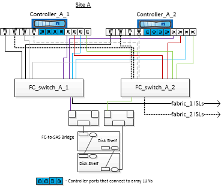
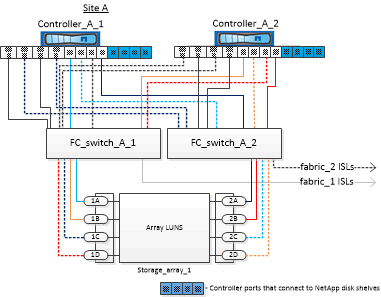

= Example of a four-node MetroCluster configuration with disks and array LUNs
:icons: font
:imagesdir: ../media/

[.lead]
For setting up a four-node MetroCluster configuration with native disks and array LUNs, you must use FC-to-SAS bridges to connect the ONTAP systems with the disk shelves through the FC switches. You can connect array LUNs through the FC switches to the ONTAP systems.

A minimum of eight initiator ports is required for an ONTAP system to connect to both native disks and array LUNs.

The following illustrations represent examples of a MetroCluster configuration with disks and array LUNs. They both represent the same MetroCluster configuration; the representations for disks and array LUNs are separated only for simplification.

In the following illustration that shows the connectivity between ONTAP systems and disks, the HBA ports 1a through 1d are used for connectivity with disks through the FC-to-SAS bridges:

In the following illustration that shows the connectivity between ONTAP systems and array LUNs, the HBA ports 0a through 0d are used for connectivity with array LUNs because ports 1a through 1d are used for connectivity with disks:

