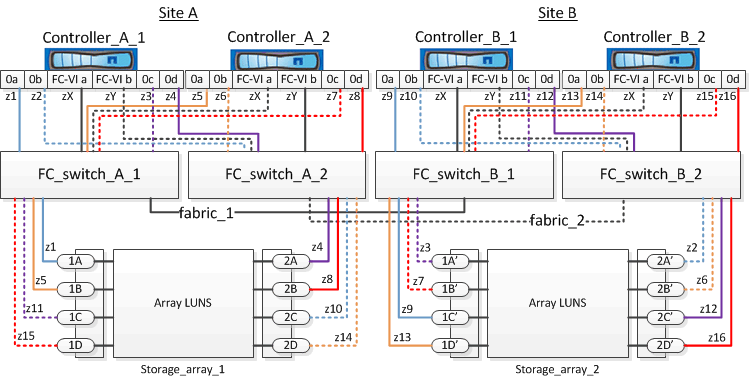

= Example of switch zoning in a four-node MetroCluster configuration with array LUNs
:icons: font
:imagesdir: ../media/

[.lead]
Switch zoning defines paths between connected nodes. Configuring the zoning enables you to define which array LUNs can be viewed by a specific ONTAP systems.

You can use the following example as a reference when determining zoning for a four-node MetroCluster configuration with array LUNs. The example shows single-initiator to single-target zoning for a MetroCluster configuration. The lines in the following example represent zones rather than connections; each line is labeled with its zone number:

In the illustration, array LUNs are allocated on each storage array for the MetroCluster configuration. LUNs of equal size are provisioned on the storage arrays at both sites, which is a SyncMirror requirement. Each ONTAP system has two paths to array LUNs. The ports on the storage array are redundant.

In the illustration, the redundant array port pairs for both the sites are as follows:

* Storage array at Site A:
 ** Ports 1A and 2A
 ** Ports 1B and 2B
 ** Ports 1C and 2C
 ** Ports 1D and 2D
* Storage array at Site B:
 ** Ports 1A' and 2A'
 ** Ports 1B' and 2B'
 ** Ports 1C' and 2C'
 ** Ports 1D' and 2D'

The redundant port pairs on each storage array form alternate paths. Therefore, both the ports of the port pairs can access the LUNs on the respective storage arrays.

The following table shows the zones for this example:

[options="header"]
|===
| Zone| ONTAP controller and initiator port| Storage array port
a|
*FC_switch_A_1*
a|
z1
a|
Controller_A_1: Port 0a
a|
Port 1A
a|
z3
a|
Controller_A_1: Port 0c
a|
Port 1A'
a|
z5
a|
Controller_A_2: Port 0a
a|
Port 1B
a|
z7
a|
Controller_A_2: Port 0c
a|
Port 1B'
a|
*FC_switch_A_2*
a|
z2
a|
Controller_A_1: Port 0b
a|
Port 2A'
a|
z4
a|
Controller_A_1: Port 0d
a|
Port 2A
a|
z6
a|
Controller_A_2: Port 0b
a|
Port 2B'
a|
z8
a|
Controller_A_2: Port 0d
a|
Port 2B
a|
*FC_switch_B_1*
a|

a|
z9
a|
Controller_B_1: Port 0a
a|
Port 1C'
a|
z11
a|
Controller_B_1: Port 0c
a|
Port 1C
a|
z13
a|
Controller_B_2: Port 0a
a|
Port 1D'
a|
z15
a|
Controller_B_2: Port 0c
a|
Port 1D
3+a|
*FC_switch_B_2*
a|

a|
z10
a|
Controller_B_1: Port 0b
a|
Port 2C
a|
z12
a|
Controller_B_1: Port 0d
a|
Port 2C'
a|
z14
a|
Controller_B_2: Port 0b
a|
Port 2D
a|
z16
a|
Controller_B_2: Port 0d
a|
Port 2D'
|===
The following table shows the zones for the FC-VI connections at Site A and Site B:

[options="header"]
|===
| Zone| ONTAP controller and FC initiator port| Switch
a|
*Site A*
a|

a|
zX
a|
Controller_A_1: Port FC-VI a
a|
FC_switch_A_1
a|
zY
a|
Controller_A_1: Port FC-VI b
a|
FC_switch_A_2
a|
zX
a|
Controller_A_2: Port FC-VI a
a|
FC_switch_A_1
a|
zY
a|
Controller_A_2: Port FC-VI b
a|
FC_switch_A_2
a|
*Site B*
a|

a|
zX
a|
Controller_B_1: Port FC-VI a
a|
FC_switch_B_1
a|
zY
a|
Controller_B_1: Port FC-VI b
a|
FC_switch_B_2
a|
zX
a|
Controller_B_2: Port FC-VI a
a|
FC_switch_B_1
a|
zY
a|
Controller_B_2: Port FC-VI b
a|
FC_switch_B_2
|===
*Related information*

xref:reference_requirements_for_switch_zoning_in_a_mcc_configuration_with_array_luns.adoc[Requirements for switch zoning in a MetroCluster configuration with array LUNs]

xref:concept_example_of_switch_zoning_in_a_two_node_mcc_configuration_with_array_luns.adoc[Example of switch zoning in a two-node MetroCluster configuration with array LUNs]

xref:concept_example_of_switch_zoning_in_an_eight_node_mcc_configuration_with_array_luns.adoc[Example of switch zoning in an eight-node MetroCluster configuration with array LUNs]
