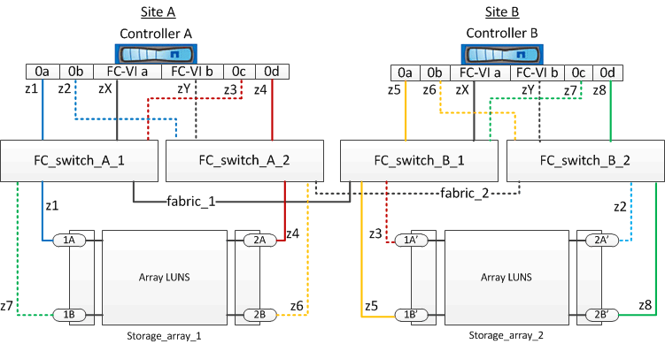

= Example of switch zoning in a two-node MetroCluster configuration with array LUNs
:icons: font
:imagesdir: ../media/

[.lead]
Switch zoning defines paths between connected nodes. Configuring the zoning enables you to define which array LUNs can be viewed by specific ONTAP systems.

You can use the following example as a reference when determining zoning for a two-node fabric-attached MetroCluster configuration with array LUNs:

The example shows single-initiator to single-target zoning for the MetroCluster configurations. The lines in the example represent zones rather than connections; each line is labeled with its zone number.

In the example, array LUNs are allocated on each storage array. LUNs of equal size are provisioned on the storage arrays at both sites, which is a SyncMirror requirement. Each ONTAP system has two paths to array LUNs. The ports on the storage array are redundant.

The redundant array port pairs for both the sites are as follows:

* Storage array at Site A:
 ** Ports 1A and 2A
 ** Ports 1B and 2B
* Storage array at Site B:
 ** Ports 1A' and 2A'
 ** Ports 1B' and 2B'

The redundant port pairs on each storage array form alternate paths. Therefore, both the ports of the port pairs can access the LUNs on the respective storage arrays.

The following table shows the zones for the illustrations:

[options="header"]
|===
| Zone | ONTAP controller and initiator port | Storage array port
3+h|
*FC_switch_A_1*
a|
z1
a|
Controller A: Port 0a
a|
Port 1A
a|
z3
a|
Controller A: Port 0c
a|
Port 1A'
3+h|
*FC_switch_A_2*
a|
z2
a|
Controller A: Port 0b
a|
Port 2A'
a|
z4
a|
Controller A: Port 0d
a|
Port 2A
3+h|
*FC_switch_B_1*

a|
z5
a|
Controller B: Port 0a
a|
Port 1B'
a|
z7
a|
Controller B: Port 0c
a|
Port 1B
3+a|
*FC_switch_B_2*

a|
z6
a|
Controller B: Port 0b
a|
Port 2B
a|
z8
a|
Controller B: Port 0d
a|
Port 2B'
|===
The following table shows the zones for the FC-VI connections:

[options="header"]
|===
| Zone | ONTAP controller and initiator port | Switch
3+h|
*Site A*

a|
zX
a|
Controller A: Port FC-VI a
a|
FC_switch_A_1
a|
zY
a|
Controller A: Port FC-VI b
a|
FC_switch_A_2
3+h|
*Site B*

a|
zX
a|
Controller B: Port FC-VI a
a|
FC_switch_B_1
a|
zY
a|
Controller B: Port FC-VI b
a|
FC_switch_B_2
|===

.Related information

* Switch zoning defines paths between connected nodes.  Configuring the zoning enables you to define which array LUNs can be viewed by a specific ONTAP system.
+
link:reference_requirements_for_switch_zoning_in_a_mcc_configuration_with_array_luns.html[Requirements for switch zoning in a MetroCluster configuration with array LUNs]
+
link:concept_example_of_switch_zoning_in_a_four_node_mcc_configuration_with_array_luns.html[Example of switch zoning in a four-node MetroCluster configuration with array LUNs]

* When using switch zoning in a MetroCluster configuration with array LUNs, youmust ensure that certain basic requirements are followed.
+
link:concept_example_of_switch_zoning_in_an_eight_node_mcc_configuration_with_array_luns.html[Example of switch zoning in an eight-node MetroCluster configuration with array LUNs]
