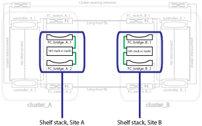

= Illustration of redundant FC-to-SAS bridges
:icons: font
:imagesdir: ../media/

[.lead]
FC-to-SAS bridges provide protocol bridging between SAS attached disks and the FC switch fabric.

.Related information

link:concept_illustration_of_the_local_ha_pairs_in_a_mcc_configuration.html[Illustration of the local HA pairs in a MetroCluster configuration]

link:concept_redundant_fc_switch_fabrics.html[Redundant FC switch fabrics]

link:concept_cluster_peering_network_mcc.html[Illustration of the cluster peering network]

// BURT 1448684, 19 JAN 2022
