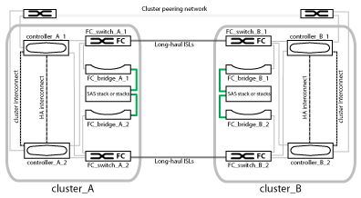
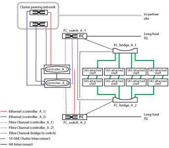
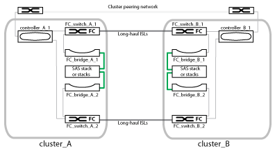
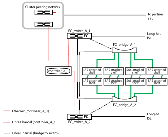

= Parts of a fabric MetroCluster configuration
:icons: font
:imagesdir: ../media/

[.lead]
As you plan your MetroCluster configuration, you should understand the hardware components and how they interconnect.

== Disaster Recovery (DR) groups

A fabric MetroCluster configuration consists of one or two DR groups, depending on the number of nodes in the MetroCluster configuration. Each DR group consists of four nodes.

* An eight-node MetroCluster configuration consists of two DR groups.
* A four-node MetroCluster configuration consists of one DR group.

The following illustration shows the organization of nodes in an eight-node MetroCluster configuration:

image::../media/mcc_dr_groups_8_node.gif[]

The following illustration shows the organization of nodes in a four-node MetroCluster configuration:

image::../media/mcc_dr_groups_4_node.gif[]

== Key hardware elements

A MetroCluster configuration includes the following key hardware elements:

* Storage controllers
+
The storage controllers are not connected directly to the storage but connect to two redundant FC switch fabrics.

* FC-to-SAS bridges
+
The FC-to-SAS bridges connect the SAS storage stacks to the FC switches, providing bridging between the two protocols.

* FC switches
+
The FC switches provide the long-haul backbone ISL between the two sites. The FC switches provide the two storage fabrics that allow data mirroring to the remote storage pools.

* Cluster peering network
+
The cluster peering network provides connectivity for mirroring of the cluster configuration, which includes storage virtual machine (SVM) configuration. The configuration of all of the SVMs on one cluster is mirrored to the partner cluster.

== Eight-node fabric MetroCluster configuration

An eight-node configuration consists of two clusters, one at each geographically separated site. cluster_A is located at the first MetroCluster site. cluster_B is located at the second MetroCluster site. Each site has one SAS storage stack. Additional storage stacks are supported, but only one is shown at each site. The HA pairs are configured as switchless clusters, without cluster interconnect switches. A switched configuration is supported, but is not shown.

An eight-node configuration includes the following connections:

* FC connections from each controller's HBAs and FC-VI adapters to each of the FC switches
* An FC connection from each FC-to-SAS bridge to an FC switch
* SAS connections between each SAS shelf and from the top and bottom of each stack to an FC-to-SAS bridge
* An HA interconnect between each controller in the local HA pair
+
If the controllers support a single-chassis HA pair, the HA interconnect is internal, occurring through the backplane, meaning that an external interconnect is not required.

* Ethernet connections from the controllers to the customer-provided network that is used for cluster peering
+
SVM configuration is replicated over the cluster peering network.

* A cluster interconnect between each controller in the local cluster

== Four-node fabric MetroCluster configuration

The following illustration shows a simplified view of a four-node fabric MetroCluster configuration. For some connections, a single line represents multiple, redundant connections between the components. Data and management network connections are not shown.

The following illustration shows a more detailed view of the connectivity in a single MetroCluster cluster (both clusters have the same configuration):

== Two-node fabric MetroCluster configuration

The following illustration shows a simplified view of a two-node fabric MetroCluster configuration. For some connections, a single line represents multiple, redundant connections between the components. Data and management network connections are not shown.

A two-node configuration consists of two clusters, one at each geographically separated site. cluster_A is located at the first MetroCluster site. cluster_B is located at the second MetroCluster site. Each site has one SAS storage stack. Additional storage stacks are supported, but only one is shown at each site.

NOTE: In a two-node configuration, the nodes are not configured as an HA pair.

The following illustration shows a more detailed view of the connectivity in a single MetroCluster cluster (both clusters have the same configuration):

A two-node configuration includes the following connections:

* FC connections between the FC-VI adapter on each controller module
* FC connections from each controller module's HBAs to the FC-to-SAS bridge for each SAS shelf stack
* SAS connections between each SAS shelf and from the top and bottom of each stack to an FC-to-SAS bridge
* Ethernet connections from the controllers to the customer-provided network that is used for cluster peering
+
SVM configuration is replicated over the cluster peering network.
