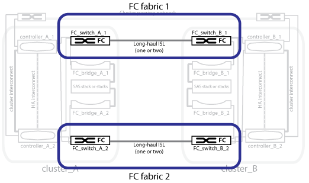

= Redundant FC switch fabrics
:icons: font
:imagesdir: ../media/

[.lead]
Each switch fabric includes inter-switch links (ISLs) that connect the sites. Data is replicated from site-to-site over the ISL. Each switch fabric must be on different physical paths for redundancy.

*Related information*

xref:concept_illustration_of_the_local_ha_pairs_in_a_mcc_configuration.adoc[Illustration of the local HA pairs in a MetroCluster configuration]

xref:concept_illustration_of_redundant_fc_to_sas_bridges.adoc[Illustration of redundant FC-to-SAS bridges]

xref:concept_cluster_peering_network_mcc.adoc[Illustration of the cluster peering network]
