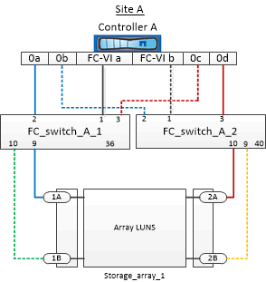

= Example of cabling storage array ports to FC switches in a two-node MetroCluster configuration
:icons: font
:imagesdir: ../media/

[.lead]
In a MetroCluster configuration with array LUNs, you must connect the storage array ports that form a redundant port pair to alternate FC switches.

The following illustration shows the connections between storage arrays and FC switches in a two-node fabric-attached MetroCluster configuration with array LUNs:

The connections between storage array ports and FC switch ports are similar for both stretch and fabric-attached variants of two-node MetroCluster configurations with array LUNs.

NOTE: If you plan to use disks in addition to array LUNs in your MetroCluster configuration, you must use the switch ports specified for the configuration with disks.

xref:concept_port_assignments_for_fc_switches_when_using_ontap_9_1_and_later.adoc[Port assignments for FC switches when using ONTAP 9.1 and later]

In the illustration, the redundant array port pairs for both the sites are as follows:

* Storage array at Site A:
 ** Ports 1A and 2A
 ** Ports 1B and 2B
* Storage array at Site B:
 ** Ports 1A' and 2A'
 ** Ports 1B' and 2B'

FC_switch_A_1 at Site A and FC_switch_B_1 at Site B are connected to form fabric_1. Similarly, FC_switch_A_2 at Site A and FC_switch_B_2 are connected to form fabric_2.

The following table lists the connections between the storage array ports and the FC switches for the example MetroCluster illustration:

|===
| Array LUN ports| FC switch ports| Switch fabrics
a|
*Site A*
a|
1A
a|
FC_switch_A_1, Port 9
a|
fabric_1
a|
2A
a|
FC_switch_A_2, Port 10
a|
fabric_2
a|
1B
a|
FC_switch_A_1, Port 10
a|
fabric_1
a|
2B
a|
FC_switch_A_2, Port 9
a|
fabric_2
a|
*Site B*
a|
1A'
a|
FC_switch_B_1, Port 9
a|
fabric_1
a|
2A'
a|
FC_switch_B_2, Port 10
a|
fabric_2
a|
1B'
a|
FC_switch_B_1, Port 10
a|
fabric_1
a|
2B'
a|
FC_switch_B_2, Port 9
a|
fabric_2
|===
