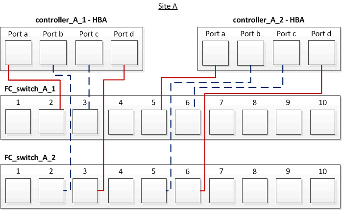

= Cabling the FC-VI and HBA ports in a four-node fabric-attached MetroCluster configuration with array LUNs
:icons: font
:imagesdir: ../media/

[.lead]
If you are setting up a four-node fabric-attached MetroCluster configuration with array LUNs, you must cable the FC-VI ports and the HBA ports to the switch ports.

* You must repeat this task for each controller at both of the MetroCluster sites.
* If you plan to use disks in addition to array LUNs in your MetroCluster configuration, you must use the HBA ports and switch ports specified for configuration with disks.
 ** xref:concept_port_assignments_for_fc_switches_when_using_ontap_9_1_and_later.adoc[Port assignments for FC switches when using ONTAP 9.1 and later]
 ** xref:concept_port_assignments_for_fc_switches_when_using_ontap_9_0.adoc[Port assignments for FC switches when using ONTAP 9.0]

. Cable the FC-VI ports from each controller to the ports on alternate FC switches.
+
The following example shows the connections between the FC-VI ports and switch ports at Site A:
+
image::../media/four_node_mcc_fc_vi_switch_connections.gif[]

. Perform the controller-to-switch cabling at both of the MetroCluster sites.
+
You must ensure redundancy in connections from the controller to the switches. Therefore, for each controller at a site, you must ensure that both of the HBA ports in the same port pair are connected to alternate FC switches.
+
The following example shows the connections between the HBA ports and switch ports at Site A:
+

+
The following table lists the connections between the HBA ports on controller_A_1 and the FC switch ports in the illustration:
+
|===
| HBA ports| Switch ports
a|
*Port pair*
a|
Port a
a|
FC_switch_A_1, Port 2
a|
Port d
a|
FC_switch_A_2, Port 3
a|
*Port pair*
a|
Port b
a|
FC_switch_A_2, Port 2
a|
Port c
a|
FC_switch_A_1, Port 3
|===
The following table lists the connections between the HBA ports on controller_A_2 and the FC switch ports in the illustration:
+
|===
| HBA ports| Switch ports
a|
*Port pair*
a|
Port a
a|
FC_switch_A_1, Port 5
a|
Port d
a|
FC_switch_A_2, Port 6
a|
*Port pair*
a|
Port b
a|
FC_switch_A_2, Port 5
a|
Port c
a|
FC_switch_A_1, Port 6
|===

You should cable the ISLs between the FC switches across the MetroCluster sites.

*Related information*

xref:concept_switch_ports_required_for_a_eight_node_mcc_configuration_with_array_luns.adoc[Switch ports required for a MetroCluster configuration with array LUNs]
