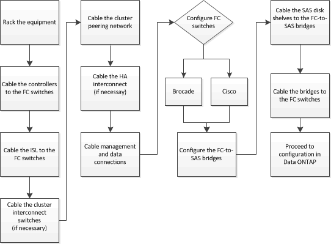

= Cabling a fabric-attached MetroCluster configuration
:icons: font
:imagesdir: ../media/

[.lead]
The MetroCluster components must be physically installed, cabled, and configured at both geographic sites. 

