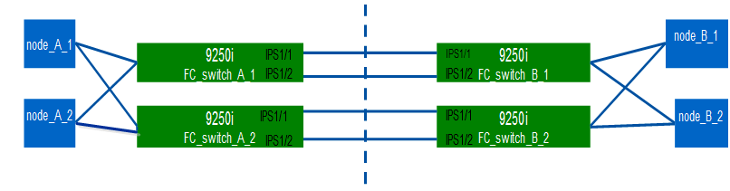

= Configuring the Cisco FC switches
:icons: font
:imagesdir: ../media/

[.lead]
Each Cisco switch in the MetroCluster configuration must be configured appropriately for the ISL and storage connections.

The following requirements apply to the Cisco FC switches:

* You must be using four supported Cisco switches of the same model with the same NX-OS version and licensing.
* The MetroCluster configuration requires four switches.
+
The four switches must be connected into two fabrics of two switches each, with each fabric spanning both sites.

* The switch must support connectivity to the ATTO FibreBridge model.
* You cannot be using encryption or compression in the Cisco FC storage fabric.
+
It is not supported in the MetroCluster configuration.

https://mysupport.netapp.com/matrix[NetApp Interoperability Matrix Tool]

In the IMT, you can use the Storage Solution field to select your MetroCluster solution. You use the *Component Explorer* to select the components and ONTAP version to refine your search. You can click *Show Results* to display the list of supported configurations that match the criteria.

The following requirement applies to the Inter-Switch Link (ISL) connections:

* All ISLs must have the same length and same speed in one fabric.
+
Different lengths of ISLs can be used in the different fabrics. The same speed must be used in all fabrics.

The following requirement applies to the storage connections:

* Each storage controller must have four initiator ports available to connect to the switch fabrics.
+
Two initiator ports must be connected from each storage controller to each fabric.
+
NOTE: You can configure FAS8020, AFF8020, FAS8200, and AFF A300 systems with two initiators ports per controller (a single initiator port to each fabric) if all of the following criteria are met:

 ** There are fewer than four FC initiator ports available to connect the disk storage and no additional ports can be configured as FC initiators.
 ** All slots are in use and no FC initiator card can be added.

*Related information*

https://mysupport.netapp.com/matrix[NetApp Interoperability Matrix Tool]

== Cisco switch license requirements

[.lead]
Certain feature-based licenses might be required for the Cisco switches in a fabric-attached MetroCluster configuration. These licenses enable you to use features such as QoS or long-distance mode credits on the switches. You must install the required feature-based licenses on all four switches in a MetroCluster configuration.

The following feature-based licenses might be required in a MetroCluster configuration:

* ENTERPRISE_PKG
+
This license enables you to use the QoS feature on Cisco switches.

* PORT_ACTIVATION_PKG
+
You can use this license for Cisco 9148 switches. This license enables you to activate or deactivate ports on the switches as long as only 16 ports are active at any given time. By default, 16 ports are enabled in Cisco MDS 9148 switches.

* FM_SERVER_PKG
+
This license enables you to manage fabrics simultaneously and to manage switches through a web browser.
+
The FM_SERVER_PKG license also enables performance management features such as performance thresholds and threshold monitoring. For more information about this license, see the Cisco Fabric Manager Server Package.

You can verify that the licenses are installed by using the show license usage command. If you do not have these licenses, contact your sales representative before proceeding with the installation.

NOTE: The Cisco MDS 9250i switches have two fixed 1/10 GbE IP storage services ports. No additional licenses are required for these ports. The Cisco SAN Extension over IP application package is a standard license on these switches that enables features such as FCIP and compression.

== Setting the Cisco FC switch to factory defaults

[.lead]
To ensure a successful configuration, you must set the switch to its factory defaults. This ensures that the switch is starting from a clean configuration.

This task must be performed on all switches in the MetroCluster configuration.

. Make a console connection and log in to both switches in the same fabric.
. Issue the following command to set the switch back to its default settings: `write erase`
+
You can respond `y` when prompted to confirm the command. This erases all licenses and configuration information on the switch.

. Issue the following command to reboot the switch: `reload`
+
You can respond `y` when prompted to confirm the command.

. Repeat the write erase and reload commands on the other switch.
+
After issuing the reload command, the switch reboots and then prompts with setup questions. At that point, proceed to the next section.

The following example shows the process on a fabric consisting of FC_switch_A_1 and FC_switch_B_1.

----
FC_Switch_A_1# write erase
    Warning: This command will erase the startup-configuration.
    Do you wish to proceed anyway? (y/n)  [n] y
    FC_Switch_A_1# reload
    This command will reboot the system. (y/n)?  [n] y

FC_Switch_B_1# write erase
    Warning: This command will erase the startup-configuration.
    Do you wish to proceed anyway? (y/n)  [n] y
    FC_Switch_B_1# reload
    This command will reboot the system. (y/n)?  [n] y
----

== Configure the Cisco FC switch basic settings and community string

[.lead]
You must specify the basic settings with the setup command or after issuing the reload command.

. If the switch does not display the setup questions, configure the basic switch settings: `setup`
. Accept the default responses to the setup questions until you are prompted for the SNMP community string.
. Set the community string to public (all lowercase) to allow access from the ONTAP Health Monitors.
+
You can set the community string to a value other than public, but you must configure the ONTAP Health Monitors using the community string you specify.
+
The following example shows the commands on FC_switch_A_1:
+
----
FC_switch_A_1# setup
    Configure read-only SNMP community string (yes/no) [n]: y
    SNMP community string : public
    Note:  Please set the SNMP community string to "Public" or another value of your choosing.
    Configure default switchport interface state (shut/noshut) [shut]: noshut
    Configure default switchport port mode F (yes/no) [n]: n
    Configure default zone policy (permit/deny) [deny]: deny
    Enable full zoneset distribution? (yes/no) [n]: yes
----
+
The following example shows the commands on FC_switch_B_1:
+
----
FC_switch_B_1# setup
    Configure read-only SNMP community string (yes/no) [n]: y
    SNMP community string : public
    Note:  Please set the SNMP community string to "Public" or another value of your choosing.
    Configure default switchport interface state (shut/noshut) [shut]: noshut
    Configure default switchport port mode F (yes/no) [n]: n
    Configure default zone policy (permit/deny) [deny]: deny
    Enable full zoneset distribution? (yes/no) [n]: yes
----

== Acquiring licenses for ports

[.lead]
You do not have to use Cisco switch licenses on a continuous range of ports; instead, you can  acquire licenses for specific ports that are used and remove licenses from unused ports. You should verify the number of licensed ports in the switch configuration and, if necessary, move licenses from one port to another as needed.

. Issue the following command to show license usage for a switch fabric: `show port-resources module 1`
+
Determine which ports require licenses. If some of those ports are unlicensed, determine if you have extra licensed ports and consider removing the licenses from them.

. Issue the following command to enter configuration mode: `config t`
. Remove the license from the selected port:
 .. Issue the following command to select the port to be unlicensed: `interface interface-name`
 .. Remove the license from the port using the following command: `no port-license acquire`
 .. Exit the port configuration interface: `exit`
. Acquire the license for the selected port:
 .. Issue the following command to select the port to be unlicensed: `interface interface-name`
 .. Make the port eligible to acquire a license using the "port license" command: `port-license`
 .. Acquire the license on the port using the following command: `port-license acquire`
 .. Exit the port configuration interface: `exit`
. Repeat for any additional ports.
. Issue the following command to exit configuration mode: `exit`

=== Removing and acquiring a license on a port

This example shows a license being removed from port fc1/2, port fc1/1 being made eligible to acquire a license, and the license being acquired on port fc1/1:

----
Switch_A_1# conf t
    Switch_A_1(config)# interface fc1/2
    Switch_A_1(config)# shut
    Switch_A_1(config-if)# no port-license acquire
    Switch_A_1(config-if)# exit
    Switch_A_1(config)# interface fc1/1
    Switch_A_1(config-if)# port-license
    Switch_A_1(config-if)# port-license acquire
    Switch_A_1(config-if)# no shut
    Switch_A_1(config-if)# end
    Switch_A_1# copy running-config startup-config

    Switch_B_1# conf t
    Switch_B_1(config)# interface fc1/2
    Switch_B_1(config)# shut
    Switch_B_1(config-if)# no port-license acquire
    Switch_B_1(config-if)# exit
    Switch_B_1(config)# interface fc1/1
    Switch_B_1(config-if)# port-license
    Switch_B_1(config-if)# port-license acquire
    Switch_B_1(config-if)# no shut
    Switch_B_1(config-if)# end
    Switch_B_1# copy running-config startup-config
----

The following example shows port license usage being verified:

----
Switch_A_1# show port-resources module 1
    Switch_B_1# show port-resources module 1
----

== Enabling ports in a Cisco MDS 9148 or 9148S switch

[.lead]
In Cisco MDS 9148 or 9148S switches, you must manually enable the ports required in a MetroCluster configuration.

* You can manually enable 16 ports in a Cisco MDS 9148 or 9148S switch.
* The Cisco switches enable you to apply the POD license on random ports, as opposed to applying them in sequence.
* Cisco switches require that you use one port from each port group, unless you need more than 12 ports.

. View the port groups available in a Cisco switch: `show port-resources module blade_number`
. License and acquire the required port in a port group by entering the following commands in sequence: `config t``interface port_number``shut``port-license acquire``no shut`
+
For example, the following command licenses and acquires Port fc 1/45:
+
----
switch# config t
switch(config)#
switch(config)# interface fc 1/45
switch(config-if)#
switch(config-if)# shut
switch(config-if)# port-license acquire
switch(config-if)# no shut
switch(config-if)# end
----

. Save the configuration: `copy running-config startup-config`

== Configuring the F-ports on a Cisco FC switch

[.lead]
You must configure the F-ports on the FC switch. In a MetroCluster configuration, the F-ports are the ports that connect the switch to the HBA initiators, FC-VI interconnects and FC-to-SAS bridges. Each port must be configured individually.

Refer to the following sections to identify the F-ports (switch-to-node) for your configuration:

* xref:concept_port_assignments_for_fc_switches_when_using_ontap_9_1_and_later.adoc[Port assignments for FC switches when using ONTAP 9.1 and later]
* xref:concept_port_assignments_for_fc_switches_when_using_ontap_9_0.adoc[Port assignments for FC switches when using ONTAP 9.0]

This task must be performed on each switch in the MetroCluster configuration.

. Issue the following command to enter configuration mode: `config t`
. Enter interface configuration mode for the port: `interface port-ID`
. Shut down the port: `shutdown`
. Set the ports to F mode by issuing the following command: `switchport mode F`
. Set the ports to fixed speed by issuing the following command: `switchport speed speed`
+
speed is either `8000` or `16000`

. Set the rate mode of the switch port to dedicated by issuing the following command: `switchport rate-mode dedicated`
. Restart the port: `no shutdown`
. Issue the following command to exit configuration mode: `end`

The following example shows the commands on the two switches:

----
Switch_A_1# config  t
FC_switch_A_1(config)# interface fc 1/1
FC_switch_A_1(config-if)# shutdown
FC_switch_A_1(config-if)# switchport mode F
FC_switch_A_1(config-if)# switchport speed 8000
FC_switch_A_1(config-if)# switchport rate-mode dedicated
FC_switch_A_1(config-if)# no shutdown
FC_switch_A_1(config-if)# end
FC_switch_A_1# copy running-config startup-config

FC_switch_B_1# config  t
FC_switch_B_1(config)# interface fc 1/1
FC_switch_B_1(config-if)# switchport mode F
FC_switch_B_1(config-if)# switchport speed 8000
FC_switch_B_1(config-if)# switchport rate-mode dedicated
FC_switch_B_1(config-if)# no shutdown
FC_switch_B_1(config-if)# end
FC_switch_B_1# copy running-config startup-config
----

== Assigning buffer-to-buffer credits to F-Ports in the same port group as the ISL

[.lead]
You must assign the buffer-to-buffer credits to the F-ports if they are in the same port group as the ISL. If the ports do not have the required buffer-to-buffer credits, the ISL could be inoperative. This task is not required if the F-ports are not in the same port group as the ISL port.

If the F-Ports are in a port group that contains the ISL, this task must be performed on each FC switch in the MetroCluster configuration.

. Issue the following command to enter configuration mode: `config t`
. Enter the following command to set the interface configuration mode for the port: `interface port-ID`
. Disable the port:``shut``
. If the port is not already in F mode, set the port to F mode by entering the following command: `switchport mode F`
. Set the buffer-to-buffer credit of the non-E ports to 1 by using the following command: `switchport fcrxbbcredit 1`
. Re-enable the port:``no shut``
. Exit configuration mode:``exit``
. Copy the updated configuration to the startup configuration:``copy running-config startup-config``
. Verify the buffer-to-buffer credit assigned to a port by entering the following commands: `show port-resources module 1`
. Issue the following command to exit configuration mode: `exit`
. Repeat these steps on the other switch in the fabric.
. Verify the settings:``show port-resource module 1``

In this example, port fc1/40 is the ISL. Ports fc1/37, fc1/38 and fc1/39 are in the same port group and must be configured.

The following commands show the port range being configured for fc1/37 through fc1/39:

----
FC_switch_A_1# conf t
FC_switch_A_1(config)# interface fc1/37-39
FC_switch_A_1(config-if)# shut
FC_switch_A_1(config-if)# switchport mode F
FC_switch_A_1(config-if)# switchport fcrxbbcredit 1
FC_switch_A_1(config-if)# no shut
FC_switch_A_1(config-if)# exit
FC_switch_A_1# copy running-config startup-config

FC_switch_B_1# conf t
FC_switch_B_1(config)# interface fc1/37-39
FC_switch_B_1(config-if)# shut
FC_switch_B_1(config-if)# switchport mode F
FC_switch_B_1(config-if)# switchport fcrxbbcredit 1
FC_switch_A_1(config-if)# no shut
FC_switch_A_1(config-if)# exit
FC_switch_B_1# copy running-config startup-config
----

The following commands and system output show that the settings are properly applied:

----
FC_switch_A_1# show port-resource module 1
...
Port-Group 11
 Available dedicated buffers are 93

--------------------------------------------------------------------
Interfaces in the Port-Group       B2B Credit  Bandwidth  Rate Mode
                                      Buffers     (Gbps)

--------------------------------------------------------------------
fc1/37                                     32        8.0  dedicated
fc1/38                                      1        8.0  dedicated
fc1/39                                      1        8.0  dedicated
...

FC_switch_B_1# port-resource module
...
Port-Group 11
 Available dedicated buffers are 93

--------------------------------------------------------------------
Interfaces in the Port-Group       B2B Credit  Bandwidth  Rate Mode
                                     Buffers     (Gbps)

--------------------------------------------------------------------
fc1/37                                     32        8.0  dedicated
fc1/38                                      1        8.0  dedicated
fc1/39                                      1        8.0 dedicated
...
----

== Creating and configuring VSANs on Cisco FC switches

[.lead]
You must create a VSAN for the FC-VI ports and a VSAN for the storage ports on each FC switch in the MetroCluster configuration. The VSANs should have a unique number and name. You must do additional configuration if you are using two ISLs with in-order delivery of frames.

The examples here use the following naming conventions:

|===
| Switch fabric| VSAN name| ID number
a|
1
a|
FCVI_1_10
a|
10
a|
STOR_1_20
a|
20
a|
2
a|
FCVI_2_30
a|
30
a|
STOR_2_20
a|
40
|===
This task must be performed on each FC switch fabric.

. Configure the FC-VI VSAN:
 .. Enter configuration mode if you have not done so already: `config t`
 .. Edit the VSAN database: `vsan database`
 .. Set the VSAN ID: `vsan vsan-ID`
 .. Set the VSAN name: `vsan vsan-ID name vsan_name`
. Add ports to the FC-VI VSAN:
 .. Add the interfaces for each port in the VSAN: `vsan vsan-ID interface interface_name`
+
For the FC-VI VSAN, the ports connecting the local FC-VI ports will be added.

 .. Exit configuration mode: `end`
 .. Copy the running-config to the startup-config: `copy running-config startup-config`

+
In the following example, the ports are fc1/1 and fc1/13:
+
----
FC_switch_A_1# conf t
FC_switch_A_1(config)# vsan database
FC_switch_A_1(config)# vsan 10 interface fc1/1
FC_switch_A_1(config)# vsan 10 interface fc1/13
FC_switch_A_1(config)# end
FC_switch_A_1# copy running-config startup-config
FC_switch_B_1# conf t
FC_switch_B_1(config)# vsan database
FC_switch_B_1(config)# vsan 10 interface fc1/1
FC_switch_B_1(config)# vsan 10 interface fc1/13
FC_switch_B_1(config)# end
FC_switch_B_1# copy running-config startup-config
----
. Verify port membership of the VSAN: `show vsan member`
+
----
FC_switch_A_1# show vsan member
FC_switch_B_1# show vsan member
----

. Configure the VSAN to guarantee in-order delivery of frames or out-of-order delivery of frames:
+
NOTE: The standard IOD settings are recommended. You should configure OOD only if necessary.
+
xref:concept_prepare_for_the_mcc_installation.adoc[Considerations for using TDM/WDM equipment with fabric-attached MetroCluster configurations]

 ** The following steps must be performed to configure in-order delivery of frames:
  ... Enter configuration mode: `conf t`
  ... Enable the in-order guarantee of exchanges for the VSAN: `in-order-guarantee vsan vsan-ID`
+
IMPORTANT: For FC-VI VSANs (FCVI_1_10 and FCVI_2_30), you must enable in-order guarantee of frames and exchanges only on VSAN 10.

  ... Enable load balancing for the VSAN: `vsan vsan-ID loadbalancing src-dst-id`
  ... Exit configuration mode: `end`
  ... Copy the running-config to the startup-config: `copy running-config startup-config`
+
The commands to configure in-order delivery of frames on FC_switch_A_1:
+
----
FC_switch_A_1# config t
FC_switch_A_1(config)# in-order-guarantee vsan 10
FC_switch_A_1(config)# vsan database
FC_switch_A_1(config-vsan-db)# vsan 10 loadbalancing src-dst-id
FC_switch_A_1(config-vsan-db)# end
FC_switch_A_1# copy running-config startup-config
----
+
The commands to configure in-order delivery of frames on FC_switch_B_1:
+
----
FC_switch_B_1# config t
FC_switch_B_1(config)# in-order-guarantee vsan 10
FC_switch_B_1(config)# vsan database
FC_switch_B_1(config-vsan-db)# vsan 10 loadbalancing src-dst-id
FC_switch_B_1(config-vsan-db)# end
FC_switch_B_1# copy running-config startup-config
----
 ** The following steps must be performed to configure out-of-order delivery of frames:
  ... Enter configuration mode: `conf t`
  ... Disable the in-order guarantee of exchanges for the VSAN: `no in-order-guarantee vsan vsan-ID`
  ... Enable load balancing for the VSAN: `vsan vsan-ID loadbalancing src-dst-id`
  ... Exit configuration mode: `end`
  ... Copy the running-config to the startup-config: `copy running-config startup-config`
+
The commands to configure out-of-order delivery of frames on FC_switch_A_1:
+
----
FC_switch_A_1# config t
FC_switch_A_1(config)# no in-order-guarantee vsan 10
FC_switch_A_1(config)# vsan database
FC_switch_A_1(config-vsan-db)# vsan 10 loadbalancing src-dst-id
FC_switch_A_1(config-vsan-db)# end
FC_switch_A_1# copy running-config startup-config
----
+
The commands to configure out-of-order delivery of frames on FC_switch_B_1:
+
----
FC_switch_B_1# config t
FC_switch_B_1(config)# no in-order-guarantee vsan 10
FC_switch_B_1(config)# vsan database
FC_switch_B_1(config-vsan-db)# vsan 10 loadbalancing src-dst-id
FC_switch_B_1(config-vsan-db)# end
FC_switch_B_1# copy running-config startup-config
----

+
NOTE: When configuring ONTAP on the controller modules, OOD must be explicitly configured on each controller module in the MetroCluster configuration.
+
xref:concept_configure_the_mcc_software_in_ontap.adoc[Configuring in-order delivery or out-of-order delivery of frames on ONTAP software]

. Set QoS policies for the FC-VI VSAN:
 .. Enter configuration mode: `conf t`
 .. Enable the QoS and create a class map by entering the following commands in sequence: `qos enable``qos class-map class_name match-any`
 .. Add the class map created in a previous step to the policy map: `class class_name`
 .. Set the priority: `priority high`
 .. Add the VSAN to the policy map created previously in this procedure: `qos service policy policy_name vsan vsanid`
 .. Copy the updated configuration to the startup configuration: `copy running-config startup-config`

+
The commands to set the QoS policies on FC_switch_A_1:
+
----
FC_switch_A_1# conf t
FC_switch_A_1(config)# qos enable
FC_switch_A_1(config)# qos class-map FCVI_1_10_Class match-any
FC_switch_A_1(config)# qos policy-map FCVI_1_10_Policy
FC_switch_A_1(config-pmap)# class FCVI_1_10_Class
FC_switch_A_1(config-pmap-c)# priority high
FC_switch_A_1(config-pmap-c)# exit
FC_switch_A_1(config)# exit
FC_switch_A_1(config)# qos service policy FCVI_1_10_Policy vsan 10
FC_switch_A_1(config)# end
FC_switch_A_1# copy running-config startup-config
----
+
The commands to set the QoS policies on FC_switch_B_1:
+
----
FC_switch_B_1# conf t
FC_switch_B_1(config)# qos enable
FC_switch_B_1(config)# qos class-map FCVI_1_10_Class match-any
FC_switch_B_1(config)# qos policy-map FCVI_1_10_Policy
FC_switch_B_1(config-pmap)# class FCVI_1_10_Class
FC_switch_B_1(config-pmap-c)# priority high
FC_switch_B_1(config-pmap-c)# exit
FC_switch_B_1(config)# exit
FC_switch_B_1(config)# qos service policy FCVI_1_10_Policy vsan 10
FC_switch_B_1(config)# end
FC_switch_B_1# copy running-config startup-config
----
. Configure the storage VSAN:
 .. Set the VSAN ID: `vsan vsan-ID`
 .. Set the VSAN name: `vsan vsan-ID name vsan_name`

+
The commands to configure the storage VSAN on FC_switch_A_1:
+
----
FC_switch_A_1# conf t
FC_switch_A_1(config)# vsan database
FC_switch_A_1(config-vsan-db)# vsan 20
FC_switch_A_1(config-vsan-db)# vsan 20 name STOR_1_20
FC_switch_A_1(config-vsan-db)# end
FC_switch_A_1# copy running-config startup-config
----
+
The commands to configure the storage VSAN on FC_switch_B_1:
+
----
FC_switch_B_1# conf t
FC_switch_B_1(config)# vsan database
FC_switch_B_1(config-vsan-db)# vsan 20
FC_switch_B_1(config-vsan-db)# vsan 20 name STOR_1_20
FC_switch_B_1(config-vsan-db)# end
FC_switch_B_1# copy running-config startup-config
----
. Add ports to the storage VSAN.
+
For the storage VSAN, all ports connecting HBA or FC-to-SAS bridges must be added. In this example fc1/5, fc1/9, fc1/17, fc1/21. fc1/25, fc1/29, fc1/33, and fc1/37 are being added.
+
The commands to add ports to the storage VSAN on FC_switch_A_1:
+
----
FC_switch_A_1# conf t
FC_switch_A_1(config)# vsan database
FC_switch_A_1(config)# vsan 20 interface fc1/5
FC_switch_A_1(config)# vsan 20 interface fc1/9
FC_switch_A_1(config)# vsan 20 interface fc1/17
FC_switch_A_1(config)# vsan 20 interface fc1/21
FC_switch_A_1(config)# vsan 20 interface fc1/25
FC_switch_A_1(config)# vsan 20 interface fc1/29
FC_switch_A_1(config)# vsan 20 interface fc1/33
FC_switch_A_1(config)# vsan 20 interface fc1/37
FC_switch_A_1(config)# end
FC_switch_A_1# copy running-config startup-config
----
+
The commands to add ports to the storage VSAN on FC_switch_B_1:
+
----
FC_switch_B_1# conf t
FC_switch_B_1(config)# vsan database
FC_switch_B_1(config)# vsan 20 interface fc1/5
FC_switch_B_1(config)# vsan 20 interface fc1/9
FC_switch_B_1(config)# vsan 20 interface fc1/17
FC_switch_B_1(config)# vsan 20 interface fc1/21
FC_switch_B_1(config)# vsan 20 interface fc1/25
FC_switch_B_1(config)# vsan 20 interface fc1/29
FC_switch_B_1(config)# vsan 20 interface fc1/33
FC_switch_B_1(config)# vsan 20 interface fc1/37
FC_switch_B_1(config)# end
FC_switch_B_1# copy running-config startup-config
----

== Configuring E-ports

[.lead]
You must configure the switch ports that connect the ISL (these are the E-Ports). The procedure you use depends on which switch you are using.

=== Configuring the E-ports on the Cisco FC switch

[.lead]
You must configure the FC switch ports that connect the inter-switch link (ISL). These are the E-ports, and configuration must be done for each port. To do so, you must calculate the correct number of buffer-to-buffer credits (BBCs).

All ISLs in the fabric must be configured with the same speed and distance settings.

This task must be performed on each ISL port.

. Use the following table to determine the adjusted required BBCs per kilometer for possible port speeds.
+
To determine the correct number of BBCs, you multiply the Adjusted BBCs required (determined from the following table) by the distance in kilometers between the switches. An adjustment factor of 1.5 is required to account for FC-VI framing behavior.
+
|===
| Speed in Gbps| BBCs required per kilometer| Adjusted BBCs required (BBCs per km x 1.5)
a|
1
a|
0.5
a|
0.75
a|
2
a|
1
a|
1.5
a|
4
a|
2
a|
3
a|
8
a|
4
a|
6
a|
16
a|
8
a|
12
|===
For example, to compute the required number of credits for a distance of 30 km on a 4-Gbps link, make the following calculation:

 ** Speed in Gbps is 4
 ** Adjusted BBCs required is 3
 ** Distance in kilometers between switches is 30 km
 ** 3 x 30 = 90

. Issue the following command to enter configuration mode: `config t`
. Specify the port you are configuring: `interface port-name`
. Shut down the port: `shutdown`
. Set the rate mode of the port to `dedicated`:``switchport rate-mode dedicated``
. Set the speed for the port: `switchport speed speed`
. Set the buffer-to-buffer credits for the port: `switchport fcrxbbcredit number of buffers`
. Set the port to E mode: `switchport mode E`
. Enable the trunk mode for the port: `switchport trunk mode on`
. Add the ISL virtual storage area networks (VSANs) to the trunk:``switchport trunk allowed vsan 10```switchport trunk allowed vsan add 20`
. Add the port to port channel 1:``channel-group 1``
. Repeat the previous steps for the matching ISL port on the partner switch in the fabric.
+
The following example shows port fc1/41 configured for a distance of 30 km and 8 Gbps:
+
----
FC_switch_A_1# conf t
FC_switch_A_1# shutdown
FC_switch_A_1# switchport rate-mode dedicated
FC_switch_A_1# switchport speed 8000
FC_switch_A_1# switchport fcrxbbcredit 60
FC_switch_A_1# switchport mode E
FC_switch_A_1# switchport trunk mode on
FC_switch_A_1# switchport trunk allowed vsan 10
FC_switch_A_1# switchport trunk allowed vsan add 20
FC_switch_A_1# channel-group 1
fc1/36 added to port-channel 1 and disabled

FC_switch_B_1# conf t
FC_switch_B_1# shutdown
FC_switch_B_1# switchport rate-mode dedicated
FC_switch_B_1# switchport speed 8000
FC_switch_B_1# switchport fcrxbbcredit 60
FC_switch_B_1# switchport mode E
FC_switch_B_1# switchport trunk mode on
FC_switch_B_1# switchport trunk allowed vsan 10
FC_switch_B_1# switchport trunk allowed vsan add 20
FC_switch_B_1# channel-group 1
fc1/36 added to port-channel 1 and disabled
----

. Issue the following command on both switches to restart the ports: `no shutdown`
. Repeat the previous steps for the other ISL ports in the fabric.
. Add the native VSAN to the port-channel interface on both switches in the same fabric: `interface port-channel number``switchport trunk allowed vsan add native_san_id`
. Verify configuration of the port-channel:``show interface port-channel number``
+
The port channel should have the following attributes:

 ** The port-channel is trunking.
 ** Admin port mode is E, trunk mode is on.
 ** Speed shows the cumulative value of all the ISL link speeds.
+
For example, two ISL ports operating at 4 Gbps should show a speed of 8 Gbps.

 ** Trunk vsans (admin allowed and active) shows all the allowed VSANs.
 ** Trunk vsans (up) shows all the allowed VSANs.
 ** The member list shows all the ISL ports that were added to the port-channel.
 ** The port VSAN number should be the same as the VSAN that contains the ISLs (usually native vsan 1).

+
----
FC_switch_A_1(config-if)# show int port-channel 1
port-channel 1 is trunking
    Hardware is Fibre Channel
    Port WWN is 24:01:54:7f:ee:e2:8d:a0
    Admin port mode is E, trunk mode is on
    snmp link state traps are enabled
    Port mode is TE
    Port vsan is 1
    Speed is 8 Gbps
    Trunk vsans (admin allowed and active) (1,10,20)
    Trunk vsans (up)                       (1,10,20)
    Trunk vsans (isolated)                 ()
    Trunk vsans (initializing)             ()
    5 minutes input rate 1154832 bits/sec,144354 bytes/sec, 170 frames/sec
    5 minutes output rate 1299152 bits/sec,162394 bytes/sec, 183 frames/sec
      535724861 frames input,1069616011292 bytes
        0 discards,0 errors
        0 invalid CRC/FCS,0 unknown class
        0 too long,0 too short
      572290295 frames output,1144869385204 bytes
        0 discards,0 errors
      5 input OLS,11  LRR,2 NOS,0 loop inits
      14 output OLS,5 LRR, 0 NOS, 0 loop inits
    Member[1] : fc1/36
    Member[2] : fc1/40
    Interface last changed at Thu Oct 16 11:48:00 2014
----

. Exit interface configuration on both switches: `end`
. Copy the updated configuration to the startup configuration on both fabrics: `copy running-config startup-config`
+
----
FC_switch_A_1(config-if)# end
FC_switch_A_1# copy running-config startup-config

FC_switch_B_1(config-if)# end
FC_switch_B_1# copy running-config startup-config
----

. Repeat the previous steps on the second switch fabric.

*Related information*

xref:concept_port_assignments_for_fc_switches_when_using_ontap_9_1_and_later.adoc[Port assignments for FC switches when using ONTAP 9.1 and later]

=== Configuring FCIP ports for a single ISL on Cisco 9250i FC switches

[.lead]
You must configure the FCIP switch ports that connect the ISL (E-ports) by creating FCIP profiles and interfaces, and then assigning them to the IPStorage1/1 GbE interface.

This task is only for configurations using a single ISL per switch fabric, using the IPStorage1/1 interface on each switch.

This task must be performed on each FC switch.

Two FCIP profiles are created on each switch:

* Fabric 1
 ** FC_switch_A_1 is configured with FCIP profiles 11 and 111.
 ** FC_switch_B_1 is configured with FCIP profiles 12 and 121.
* Fabric 2
 ** FC_switch_A_2 is configured with FCIP profiles 13 and 131.
 ** FC_switch_B_2 is configured with FCIP profiles 14 and 141.

. Enter configuration mode: `config t`
. Enable FCIP: `feature fcip`
. Configure the IPStorage1/1 GbE interface:
 .. Enter configuration mode: `conf t`
 .. Specify the IPStorage1/1 interface: `interface IPStorage1/1`
 .. Specify the IP address and subnet mask: `interface ip-addresssubnet-mask`
 .. Specify the MTU size of 2500: `switchport mtu 2500`
 .. Enable the port: `no shutdown`
 .. Exit configuration mode: `exit`

+
The following example shows the configuration of an IPStorage1/1 port:
+
----
conf t
interface IPStorage1/1
  ip address 192.168.1.201 255.255.255.0
  switchport mtu 2500
  no shutdown
exit
----
. Configure the FCIP profile for FC-VI traffic:
 .. Configure an FCIP profile and enter FCIP profile configuration mode: `fcip profile FCIP-profile-name`
+
The profile name depends on which switch is being configured.

 .. Assign the IP address of the IPStorage1/1 interface to the FCIP profile: `ip address ip-address`
 .. Assign the FCIP profile to TCP port 3227: `port 3227`
 .. Set the TCP settings: `tcp keepalive-timeout 1``tcp max-retransmissions 3``max-bandwidth-mbps 5000 min-available-bandwidth-mbps 4500 round-trip-time-ms 3``tcp min-retransmit-time 200``tcp keepalive-timeout 1``tcp pmtu-enable reset-timeout 3600``tcp sack-enable``no tcp cwm`

+
The following example shows the configuration of the FCIP profile:
+
----
conf t
fcip profile 11
  ip address 192.168.1.333
  port 3227
  tcp keepalive-timeout 1
tcp max-retransmissions 3
max-bandwidth-mbps 5000 min-available-bandwidth-mbps 4500 round-trip-time-ms 3
  tcp min-retransmit-time 200
  tcp keepalive-timeout 1
  tcp pmtu-enable reset-timeout 3600
  tcp sack-enable
  no tcp cwm
----
. Configure the FCIP profile for storage traffic:
 .. Configure an FCIP profile with the name 111 and enter FCIP profile configuration mode: `fcip profile 111`
 .. Assign the IP address of the IPStorage1/1 interface to the FCIP profile: `ip address ip-address`
 .. Assign the FCIP profile to TCP port 3229: `port 3229`
 .. Set the TCP settings: `tcp keepalive-timeout 1``tcp max-retransmissions 3``max-bandwidth-mbps 5000 min-available-bandwidth-mbps 4500 round-trip-time-ms 3``tcp min-retransmit-time 200``tcp keepalive-timeout 1``tcp pmtu-enable reset-timeout 3600``tcp sack-enable``no tcp cwm`

+
The following example shows the configuration of the FCIP profile:
+
----
conf t
fcip profile 111
  ip address 192.168.1.334
  port 3229
  tcp keepalive-timeout 1
tcp max-retransmissions 3
max-bandwidth-mbps 5000 min-available-bandwidth-mbps 4500 round-trip-time-ms 3
  tcp min-retransmit-time 200
  tcp keepalive-timeout 1
  tcp pmtu-enable reset-timeout 3600
  tcp sack-enable
  no tcp cwm
----
. Create the first of two FCIP interfaces: `interface fcip 1`
+
This interface is used for FC-IV traffic.

 .. Select the profile 11 created previously: `use-profile 11`
 .. Set the IP address and port of the IPStorage1/1 port on the partner switch: `peer-info ipaddr partner-switch-port-ip port 3227`
 .. Select TCP connection 2: `tcp-connection 2`
 .. Disable compression: `no ip-compression`
 .. Enable the interface: `no shutdown`
 .. Configure the control TCP connection to 48 and the data connection to 26to mark all packets on that differentiated services code point (DSCP) value: `qos control 48 data 26`
 .. Exit the interface configuration mode: `exit`

+
The following example shows the configuration of the FCIP interface:
+
----
interface fcip  1
  use-profile 11
# the port # listed in this command is the port that the remote switch is listening on
 peer-info ipaddr 192.168.32.334   port 3227
  tcp-connection 2
  no ip-compression
  no shutdown
  qos control 48 data 26
exit
----

. Create the second of two FCIP interfaces: `interface fcip 2`
+
This interface is used for storage traffic.

 .. Select the profile 111 created previously: `use-profile 111`
 .. Set the IP address and port of the IPStorage1/1 port on the partner switch: `peer-info ipaddr partner-switch-port-ip port 3229`
 .. Select TCP connection 2: `tcp-connection 5`
 .. Disable compression: `no ip-compression`
 .. Enable the interface: `no shutdown`
 .. Configure the control TCP connection to 48 and data connection to 26to mark all packets on that differentiated services code point (DSCP) value: `qos control 48 data 26`
 .. Exit the interface configuration mode: `exit`

+
The following example shows the configuration of the FCIP interface:
+
----
interface fcip  2
  use-profile 11
# the port # listed in this command is the port that the remote switch is listening on
 peer-info ipaddr 192.168.32.33e  port 3229
  tcp-connection 5
  no ip-compression
  no shutdown
  qos control 48 data 26
exit
----

. Configure the switchport settings on the fcip 1 interface:
 .. Enter configuration mode: `config t`
 .. Specify the port you are configuring: `interface fcip 1`
 .. Shut down the port: `shutdown`
 .. Set the port to E mode: `switchport mode E`
 .. Enable the trunk mode for the port: `switchport trunk mode on`
 .. Set the trunk allowed vsan to 10: `switchport trunk allowed vsan 10`
 .. Set the speed for the port: `switchport speed speed`
. Configure the switchport settings on the fcip 2 interface:
 .. Enter configuration mode: `config t`
 .. Specify the port you are configuring: `interface fcip 2`
 .. Shut down the port: `shutdown`
 .. Set the port to E mode: `switchport mode E`
 .. Enable the trunk mode for the port: `switchport trunk mode on`
 .. Set the trunk allowed vsan to 20: `switchport trunk allowed vsan 20`
 .. Set the speed for the port: `switchport speed speed`
. Repeat the previous steps on the second switch.
+
The only differences are the appropriate IP addresses and unique FCIP profile names.

 ** When configuring the first switch fabric, FC_switch_B_1 is configured with FCIP profiles 12 and 121.
 ** When configuring the first switch fabric, FC_switch_A_2 is configured with FCIP profiles 13 and 131 and FC_switch_B_2 is configured with FCIP profiles 14 and 141.

. Restart the ports on both switches: `no shutdown`
. Exit the interface configuration on both switches: `end`
. Copy the updated configuration to the startup configuration on both switches: `copy running-config startup-config`
+
----
FC_switch_A_1(config-if)# end
FC_switch_A_1# copy running-config startup-config

FC_switch_B_1(config-if)# end
FC_switch_B_1# copy running-config startup-config
----

. Repeat the previous steps on the second switch fabric.

=== Configuring FCIP ports for a dual ISL on Cisco 9250i FC switches

[.lead]
You must configure the FCIP switch ports that connect the ISL (E-ports) by creating FCIP profiles and interfaces, and then assigning them to the IPStorage1/1 and IPStorage1/2 GbE interfaces.

This task is only for configurations that use a dual ISL per switch fabric, using the IPStorage1/1 and IPStorage1/2 GbE interfaces on each switch.

This task must be performed on each FC switch.



The task and examples use the following profile configuration table:

|===
| Switch fabric | IPStorage interface | IP Address | Port type | FCIP interface | FCIP profile | Port | Peer IP/port | VSAN ID

a| Fabric 1
a| FC_switch_A_1
a| IPStorage1/1
a| a.a.a.a
a| FC-VI
a| fcip 1
a| 15
a| 3220
a| c.c.c.c/3230
a| 10

a| Fabric 1
a| FC_switch_A_1
a| IPStorage1/1
a| a.a.a.a
a| Storage
a| fcip 2
a| 20
a| 3221
a| .c.c.c/3231
a| 20

a| Fabric 1
a| FC_switch_A_1
a| IPStorage1/2
a| b.b.b.b
a| FC-VI
a| fcip 3
a| 25
a| 3222
a| d.d.d.d/3232
a| 10

a| Fabric 1
a| FC_switch_A_1
a| IPStorage1/2
a| b.b.b.b
a| Storage
a| fcip 4
a| 30
a| 3223
a| d.d.d.d/3233
a| 20

a| FC_switch_B_1
a| IPStorage1/1
a| c.c.c.c
a| FC-VI
a| fcip 1
a| 15
a| 3230
a| a.a.a.a/3220
a| 10

a| FC_switch_B_1
a| IPStorage1/1
a| c.c.c.c
a| Storage
a| fcip 2
a| 20
a| 3231
a| a.a.a.a/3221
a| 20

a| FC_switch_B_1
a| IPStorage1/2
a| d.d.d.d
a| FC-VI
a| fcip 3
a| 25
a| 3232
a| b.b.b.b/3222
a| 10

a| FC_switch_B_1
a| IPStorage1/2
a| d.d.d.d
a| Storage
a| fcip 4
a| 30
a| 3233
a| b.b.b.b/3223
a| 20

a| Fabric 2
a| FC_switch_A_2
a| IPStorage1/1
a| e.e.e.e
a| FC-VI
a| fcip 1
a| 15
a| 3220
a| g.g.g.g/3230
a| 10

a| Fabric 2
a| FC_switch_A_2
a| IPStorage1/1
a| e.e.e.e
a| Storage
a| fcip 2
a| 20
a| 3221
a| g.g.g.g/3231
a| 20

a| Fabric 2
a| FC_switch_A_2
a| IPStorage1/2
a| f.f.f.f
a| FC-VI
a| fcip 3
a| 25
a| 3222
a| h.h.h.h/3232
a| 10

a| Fabric 2
a| FC_switch_A_2
a| IPStorage1/2
a| f.f.f.f
a| Storage
a| fcip 4
a| 30
a| 3223
a| h.h.h.h/3233
a| 20

a| FC_switch_B_2
a| IPStorage1/1
a| g.g.g.g
a| FC-VI
a| fcip 1
a| 15
a| 3230
a| e.e.e.e/3220
a| 10

a| FC_switch_B_2
a| IPStorage1/1
a| g.g.g.g
a| Storage
a| fcip 2
a| 20
a| 3231
a| e.e.e.e/3221
a| 20

a| FC_switch_B_2
a| IPStorage1/2
a| h.h.h.h
a| FC-VI
a| fcip 3
a| 25
a| 3232
a| f.f.f.f/3222
a| 10

a| FC_switch_B_2
a| IPStorage1/2
a| h.h.h.h
a| Storage
a| fcip 4
a| 30
a| 3233
a| f.f.f.f/3223
a| 20
|===

. Enter configuration mode: `config t`
. Enable FCIP: `feature fcip`
. On each switch, configure the two IPStorage interfaces (IPStorage1/1 and IPStorage1/2):
 .. Enter configuration mode: `conf t`
 .. Specify the IPStorage interface to create: `interface ipstorage`
+
The ipstorage parameter value is IPStorage1/1 or IPStorage1/2.

 .. Specify the IP address and subnet mask of the IPStorage interface previously specified: `interface ip-addresssubnet-mask`
+
NOTE: On each switch, the IPStorage interfaces IPStorage1/1 and IPStorage1/2 must have different IP addresses.

 .. Specify the MTU size as 2500: `switchport mtu 2500`
 .. Enable the port: `no shutdown`
 .. Exit configuration mode: `exit`
 .. Repeat steps xref:task_fcsw_cisco_configure_a_cisco_switch_supertask.adocSUBSTEP_4717B5874EFB4B0897BFFFE2583F94D2[a] through xref:task_fcsw_cisco_configure_a_cisco_switch_supertask.adocSUBSTEP_9D4A074A3183488C9D965EB8CDCD6F1A[f] to configure the IPStorage1/2 GbE interface with a different IP address.
. Configure the FCIP profiles for FC-VI and storage traffic with the profile names given in the profile configuration table:
 .. Enter configuration mode: `conf t`
 .. Configure the FCIP profiles with the following profile names: `fcip profile FCIP-profile-name`
+
The following list provides the values for the FCIP-profile-name parameter:

  *** 15 for FC-VI on IPStorage1/1
  *** 20 for storage on IPStorage1/1
  *** 25 for FC-VI on IPStorage1/2
  *** 30 for storage on IPStorage1/2

 .. Assign the FCIP profile ports according to the profile configuration table: `port port number`
 .. Set the TCP settings: `tcp keepalive-timeout 1``tcp max-retransmissions 3``max-bandwidth-mbps 5000 min-available-bandwidth-mbps 4500 round-trip-time-ms 3``tcp min-retransmit-time 200``tcp keepalive-timeout 1``tcp pmtu-enable reset-timeout 3600``tcp sack-enable``no tcp cwm`
. Create FCIP interfaces: `interface fcip FCIP interface`
+
The FCIP interface parameter value is 1, 2, 3, or 4 as given in the profile configuration table.

 .. Map interfaces to the previously created profiles: `use-profile profile`
 .. Set the peer IP address and peer profile port number: `peer-info peer IPstorage ipaddrpeer profile port number`
 .. Select the TCP connections: `tcp-connection connection \#`
+
The connection # parameter value is 2 for FC-VI profiles and 5 for storage profiles.

 .. Disable compression: `no ip-compression`
 .. Enable the interface: `no shutdown`
 .. Configure the control TCP connection to 48 and the data connection to 26to mark all packets that have differentiated services code point (DSCP) value: `qos control 48 data 26`
 .. Exit configuration mode: `exit`

. Configure the switchport settings on each FCIP interface:
 .. Enter configuration mode: `config t`
 .. Specify the port that you are configuring: `interface fcip 1`
 .. Shut down the port: `shutdown`
 .. Set the port to E mode: `switchport mode E`
 .. Enable the trunk mode for the port: `switchport trunk mode on`
 .. Specify the trunk that is allowed on a specific VSAN: `switchport trunk allowed vsan vsan`
+
The vsan parameter value is VSAN 10 for FC-VI profiles and VSAN 20 for storage profiles.

 .. Set the speed for the port: `switchport speed speed`
 .. Exit configuration mode: `exit`
. Copy the updated configuration to the startup configuration on both switches: `copy running-config startup-config`

The following examples show the configuration of FCIP ports for a dual ISL in fabric 1 switches FC_switch_A_1 and FC_switch_B_1.

For FC_switch_A_1:

----
FC_switch_A_1# config t
FC_switch_A_1(config)# no in-order-guarantee vsan 10
FC_switch_A_1(config-vsan-db)# end
FC_switch_A_1# copy running-config startup-config

# fcip settings

feature  fcip

conf t
interface IPStorage1/1
#  IP address:  a.a.a.a
#  Mask:  y.y.y.y
  ip address <a.a.a.a   y.y.y.y>
  switchport mtu 2500
  no shutdown
exit
conf t
fcip profile 15
  ip address <a.a.a.a>
  port 3220
  tcp keepalive-timeout 1
tcp max-retransmissions 3
max-bandwidth-mbps 5000 min-available-bandwidth-mbps 4500 round-trip-time-ms 3
  tcp min-retransmit-time 200
  tcp keepalive-timeout 1
  tcp pmtu-enable reset-timeout 3600
  tcp sack-enable
  no tcp cwm

conf t
fcip profile 20
  ip address <a.a.a.a>
  port 3221
  tcp keepalive-timeout 1
tcp max-retransmissions 3
max-bandwidth-mbps 5000 min-available-bandwidth-mbps 4500 round-trip-time-ms 3
  tcp min-retransmit-time 200
  tcp keepalive-timeout 1
  tcp pmtu-enable reset-timeout 3600
  tcp sack-enable
  no tcp cwm

conf t
interface IPStorage1/2
#  IP address:  b.b.b.b
#  Mask:  y.y.y.y
  ip address <b.b.b.b   y.y.y.y>
  switchport mtu 2500
  no shutdown
exit

conf t
fcip profile 25
  ip address <b.b.b.b>
  port 3222
tcp keepalive-timeout 1
tcp max-retransmissions 3
max-bandwidth-mbps 5000 min-available-bandwidth-mbps 4500 round-trip-time-ms 3
  tcp min-retransmit-time 200
  tcp keepalive-timeout 1
  tcp pmtu-enable reset-timeout 3600
  tcp sack-enable
  no tcp cwm

conf t
fcip profile 30
  ip address <b.b.b.b>
  port 3223
tcp keepalive-timeout 1
tcp max-retransmissions 3
max-bandwidth-mbps 5000 min-available-bandwidth-mbps 4500 round-trip-time-ms 3
  tcp min-retransmit-time 200
  tcp keepalive-timeout 1
  tcp pmtu-enable reset-timeout 3600
  tcp sack-enable
  no tcp cwm
interface fcip  1
  use-profile 15
# the port # listed in this command is the port that the remote switch is listening on
 peer-info ipaddr <c.c.c.c>  port 3230
  tcp-connection 2
  no ip-compression
  no shutdown
  qos control 48 data 26
exit

interface fcip  2
  use-profile 20
# the port # listed in this command is the port that the remote switch is listening on
 peer-info ipaddr <c.c.c.c>  port 3231
  tcp-connection 5
  no ip-compression
  no shutdown
  qos control 48 data 26
exit

interface fcip  3
  use-profile 25
# the port # listed in this command is the port that the remote switch is listening on
 peer-info ipaddr < d.d.d.d >  port 3232
  tcp-connection 2
  no ip-compression
  no shutdown
  qos control 48 data 26
exit

interface fcip  4
  use-profile 30
# the port # listed in this command is the port that the remote switch is listening on
 peer-info ipaddr < d.d.d.d >  port 3233
  tcp-connection 5
  no ip-compression
  no shutdown
  qos control 48 data 26
exit

conf t
interface fcip  1
shutdown
switchport mode E
switchport trunk mode on
switchport trunk allowed vsan 10
no shutdown
exit

conf t
interface fcip  2
shutdown
switchport mode E
switchport trunk mode on
switchport trunk allowed vsan 20
no shutdown
exit

conf t
interface fcip  3
shutdown
switchport mode E
switchport trunk mode on
switchport trunk allowed vsan 10
no shutdown
exit

conf t
interface fcip  4
shutdown
switchport mode E
switchport trunk mode on
switchport trunk allowed vsan 20
no shutdown
exit
----

For FC_switch_B_1:

----

FC_switch_A_1# config t
FC_switch_A_1(config)# in-order-guarantee vsan 10
FC_switch_A_1(config-vsan-db)# end
FC_switch_A_1# copy running-config startup-config

# fcip settings

feature  fcip

conf t
interface IPStorage1/1
#  IP address:  c.c.c.c
#  Mask:  y.y.y.y
  ip address <c.c.c.c   y.y.y.y>
  switchport mtu 2500
  no shutdown
exit

conf t
fcip profile 15
  ip address <c.c.c.c>
  port 3230
  tcp keepalive-timeout 1
tcp max-retransmissions 3
max-bandwidth-mbps 5000 min-available-bandwidth-mbps 4500 round-trip-time-ms 3
  tcp min-retransmit-time 200
  tcp keepalive-timeout 1
  tcp pmtu-enable reset-timeout 3600
  tcp sack-enable
  no tcp cwm

conf t
fcip profile 20
  ip address <c.c.c.c>
  port 3231
  tcp keepalive-timeout 1
tcp max-retransmissions 3
max-bandwidth-mbps 5000 min-available-bandwidth-mbps 4500 round-trip-time-ms 3
  tcp min-retransmit-time 200
  tcp keepalive-timeout 1
  tcp pmtu-enable reset-timeout 3600
  tcp sack-enable
  no tcp cwm

conf t
interface IPStorage1/2
#  IP address:  d.d.d.d
#  Mask:  y.y.y.y
  ip address <b.b.b.b   y.y.y.y>
  switchport mtu 2500
  no shutdown
exit

conf t
fcip profile 25
  ip address <d.d.d.d>
  port 3232
tcp keepalive-timeout 1
tcp max-retransmissions 3
max-bandwidth-mbps 5000 min-available-bandwidth-mbps 4500 round-trip-time-ms 3
  tcp min-retransmit-time 200
  tcp keepalive-timeout 1
  tcp pmtu-enable reset-timeout 3600
  tcp sack-enable
  no tcp cwm

conf t
fcip profile 30
  ip address <d.d.d.d>
  port 3233
tcp keepalive-timeout 1
tcp max-retransmissions 3
max-bandwidth-mbps 5000 min-available-bandwidth-mbps 4500 round-trip-time-ms 3
  tcp min-retransmit-time 200
  tcp keepalive-timeout 1
  tcp pmtu-enable reset-timeout 3600
  tcp sack-enable
  no tcp cwm

interface fcip  1
  use-profile 15
# the port # listed in this command is the port that the remote switch is listening on
 peer-info ipaddr <a.a.a.a>  port 3220
  tcp-connection 2
  no ip-compression
  no shutdown
  qos control 48 data 26
exit

interface fcip  2
  use-profile 20
# the port # listed in this command is the port that the remote switch is listening on
 peer-info ipaddr <a.a.a.a>  port 3221
  tcp-connection 5
  no ip-compression
  no shutdown
  qos control 48 data 26
exit

interface fcip  3
  use-profile 25
# the port # listed in this command is the port that the remote switch is listening on
 peer-info ipaddr < b.b.b.b >  port 3222
  tcp-connection 2
  no ip-compression
  no shutdown
  qos control 48 data 26
exit

interface fcip  4
  use-profile 30
# the port # listed in this command is the port that the remote switch is listening on
 peer-info ipaddr < b.b.b.b >  port 3223
  tcp-connection 5
  no ip-compression
  no shutdown
  qos control 48 data 26
exit

conf t
interface fcip  1
shutdown
switchport mode E
switchport trunk mode on
switchport trunk allowed vsan 10
no shutdown
exit

conf t
interface fcip  2
shutdown
switchport mode E
switchport trunk mode on
switchport trunk allowed vsan 20
no shutdown
exit

conf t
interface fcip  3
shutdown
switchport mode E
switchport trunk mode on
switchport trunk allowed vsan 10
no shutdown
exit

conf t
interface fcip  4
shutdown
switchport mode E
switchport trunk mode on
switchport trunk allowed vsan 20
no shutdown
exit
----

== Configuring zoning on a Cisco FC switch

[.lead]
You must assign the switch ports to separate zones to isolate storage (HBA) and controller (FC-VI) traffic.

These steps must be performed on both FC switch fabrics.

The following steps use the zoning described in the section Zoning for a FibreBridge 7500N in a four-node MetroCluster configuration.

xref:task_fcsw_brocade_configure_the_brocade_fc_switches_supertask.adoc[Zoning for FC-VI ports]

. Clear the existing zones and zone set, if present.
 .. Determine which zones and zone sets are active: `show zoneset active`
+
----
FC_switch_A_1# show zoneset active

FC_switch_B_1# show zoneset active
----

 .. Disable the active zone sets identified in the previous step: `no zoneset activate name zoneset_name vsan vsan_id`
+
The following example shows two zone sets being disabled:

  *** ZoneSet_A on FC_switch_A_1 in VSAN 10
  *** ZoneSet_B on FC_switch_B_1 in VSAN 20

+
----
FC_switch_A_1# no zoneset activate name ZoneSet_A vsan 10

FC_switch_B_1# no zoneset activate name ZoneSet_B vsan 20
----

 .. After all zone sets are deactivated, clear the zone database: `clear zone database zone-name`
+
----
FC_switch_A_1# clear zone database 10
FC_switch_A_1# copy running-config startup-config

FC_switch_B_1# clear zone database 20
FC_switch_B_1# copy running-config startup-config
----
. Obtain the switch worldwide name (WWN): `show wwn switch`
. Configure the basic zone settings:
 .. Set the default zoning policy to permit: `no system default zone default-zone permit`
 .. Enable the full zone distribution: `system default zone distribute full`
 .. Set the default zoning policy for each VSAN: `no zone default-zone permit vsanid`
 .. Set the default full zone distribution for each VSAN: `zoneset distribute full vsanid`
+
----
FC_switch_A_1# conf t
FC_switch_A_1(config)# no system default zone default-zone permit
FC_switch_A_1(config)# system default zone distribute full
FC_switch_A_1(config)# no zone default-zone permit 10
FC_switch_A_1(config)# no zone default-zone permit 20
FC_switch_A_1(config)# zoneset distribute full vsan 10
FC_switch_A_1(config)# zoneset distribute full vsan 20
FC_switch_A_1(config)# end
FC_switch_A_1# copy running-config startup-config

FC_switch_B_1# conf t
FC_switch_B_1(config)# no system default zone default-zone permit
FC_switch_B_1(config)# system default zone distribute full
FC_switch_B_1(config)# no zone default-zone permit 10
FC_switch_B_1(config)# no zone default-zone permit 20
FC_switch_B_1(config)# zoneset distribute full vsan 10
FC_switch_B_1(config)# zoneset distribute full vsan 20
FC_switch_B_1(config)# end
FC_switch_B_1# copy running-config startup-config
----
. Create storage zones and add the storage ports to them.
+
These steps only need to be performed on one switch in each fabric.
+
The zoning depends on the model FC-to-SAS bridge you are using. For details, see the section for your model bridge. The examples show Brocade switch ports, so adjust your ports accordingly.

 ** xref:task_fcsw_brocade_configure_the_brocade_fc_switches_supertask.adoc[Zoning for FibreBridge 6500N bridges, or FibreBridge 7500N or 7600N bridges using one FC port]
 ** xref:task_fcsw_brocade_configure_the_brocade_fc_switches_supertask.adoc[Zoning for FibreBridge 7500N bridges using both FC ports]
Each storage zone contains the HBA initiator ports from all controllers and one single port connecting an FC-to-SAS bridge.


 .. Create the storage zones: `zone name STOR_zone-name vsan vsanid`
 .. Add storage ports to the zone: `member portswitch WWN`
 .. Activate the zone set: `zoneset activate name STOR_zonenameesetname vsan vsanid`

+
----
FC_switch_A_1# conf t
FC_switch_A_1(config)# zone name STOR_Zone_1_20_25 vsan 20
FC_switch_A_1(config-zone)# member interface fc1/5 swwn 20:00:00:05:9b:24:cb:78
FC_switch_A_1(config-zone)# member interface fc1/9 swwn 20:00:00:05:9b:24:cb:78
FC_switch_A_1(config-zone)# member interface fc1/17 swwn 20:00:00:05:9b:24:cb:78
FC_switch_A_1(config-zone)# member interface fc1/21 swwn 20:00:00:05:9b:24:cb:78
FC_switch_A_1(config-zone)# member interface fc1/5 swwn 20:00:00:05:9b:24:12:99
FC_switch_A_1(config-zone)# member interface fc1/9 swwn 20:00:00:05:9b:24:12:99
FC_switch_A_1(config-zone)# member interface fc1/17 swwn 20:00:00:05:9b:24:12:99
FC_switch_A_1(config-zone)# member interface fc1/21 swwn 20:00:00:05:9b:24:12:99
FC_switch_A_1(config-zone)# member interface fc1/25 swwn 20:00:00:05:9b:24:cb:78
FC_switch_A_1(config-zone)# end
FC_switch_A_1# copy running-config startup-config
----

. Create a storage zone set and add the storage zones to the new set.
+
NOTE: You only need to perform these steps on one switch in the fabric.

 .. Create the storage zone set: `zoneset name STOR_zonesetname vsan vsanid`
 .. Add storage zones to the zone set: `member STOR_zonename`
 .. Activate the zone set: `zoneset activate name STOR_zonesetname vsan vsanid`
+
----
FC_switch_A_1# conf t
FC_switch_A_1(config)# zoneset name STORI_Zoneset_1_20 vsan 20
FC_switch_A_1(config-zoneset)# member STOR_Zone_1_20_25
...
FC_switch_A_1(config-zoneset)# exit
FC_switch_A_1(config)# zoneset activate name STOR_ZoneSet_1_20 vsan 20
FC_switch_A_1(config)# exit
FC_switch_A_1# copy running-config startup-config
----

. Create FCVI zones and add the FCVI ports to them.
+
Each FCVI zone contains the FCVI ports from all the controllers of one DR Group.
+
These steps only need to be performed on one switch in each fabric.
+
The zoning depends on the model FC-to-SAS bridge you are using. For details, see the section for your model bridge. The examples show Brocade switch ports, so adjust your ports accordingly.

 ** xref:task_fcsw_brocade_configure_the_brocade_fc_switches_supertask.adoc[Zoning for FibreBridge 6500N bridges, or FibreBridge 7500N or 7600N bridges using one FC port]
 ** xref:task_fcsw_brocade_configure_the_brocade_fc_switches_supertask.adoc[Zoning for FibreBridge 7500N bridges using both FC ports]
Each storage zone contains the HBA initiator ports from all controllers and one single port connecting an FC-to-SAS bridge.


 .. Create the FCVI zones: `zone name FCVI_zone-name vsan vsanid`
 .. Add FCVI ports to the zone: `member FCVI zone-name`
 .. Activate the zone set: `zoneset activate name FCVI_zonenameesetname vsan vsanid`

+
----
FC_switch_A_1# conf t
FC_switch_A_1(config)# zone name FCVI_Zone_1_10_25 vsan 10
FC_switch_A_1(config-zone)# member interface fc1/1 swwn20:00:00:05:9b:24:cb:78
FC_switch_A_1(config-zone)# member interface fc1/2 swwn20:00:00:05:9b:24:cb:78
FC_switch_A_1(config-zone)# member interface fc1/1 swwn20:00:00:05:9b:24:12:99
FC_switch_A_1(config-zone)# member interface fc1/2 swwn20:00:00:05:9b:24:12:99
FC_switch_A_1(config-zone)# end
FC_switch_A_1# copy running-config startup-config
----

. Create an FCVI zone set and add the FCVI zones to it:
+
These steps only need to be performed on one switch in the fabric.

 .. Create the FCVI zone set: `zoneset name FCVI_zonesetname vsan vsanid`
 .. Add FCVI zones to the zone set: `member FCVI_zonename`
 .. Activate the zone set: `zoneset activate name FCVI_zonesetname vsan vsanid`

+
----
FC_switch_A_1# conf t
FC_switch_A_1(config)# zoneset name FCVI_Zoneset_1_10 vsan 10
FC_switch_A_1(config-zoneset)# member FCVI_Zone_1_10_25
FC_switch_A_1(config-zoneset)# member FCVI_Zone_1_10_29
    ...
FC_switch_A_1(config-zoneset)# exit
FC_switch_A_1(config)# zoneset activate name FCVI_ZoneSet_1_10 vsan 10
FC_switch_A_1(config)# exit
FC_switch_A_1# copy running-config startup-config
----

. Verify the zoning: `show zone`
. Repeat the previous steps on the second FC switch fabric.

== Ensuring the FC switch configuration is saved

[.lead]
You must make sure the FC switch configuration is saved to the startup config on all switches.

. Issue the following command on both FC switch fabrics:``copy running-config startup-config``
+
----
FC_switch_A_1# copy running-config startup-config

FC_switch_B_1# copy running-config startup-config
----
