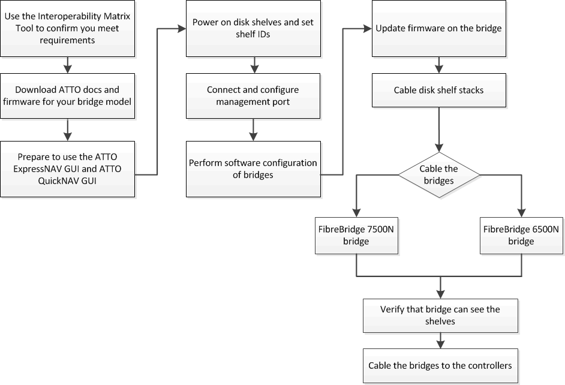
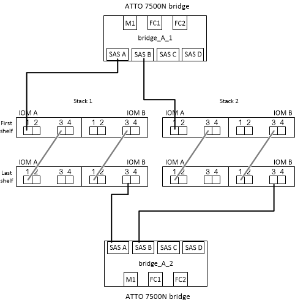
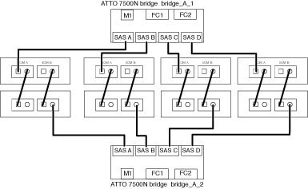

= Install FC-to-SAS bridges and SAS disk shelves
:icons: font
:imagesdir: ../media/

[.lead]
You install and cable ATTO FibreBridge bridges and SAS disk shelves when adding new storage to the configuration.

.About this task

For systems received from the factory, the FC-to-SAS bridges are preconfigured and do not require additional configuration.

This procedure is written with the assumption that you are using the recommended bridge management interfaces: the ATTO ExpressNAV GUI and ATTO QuickNAV utility.

You use the ATTO ExpressNAV GUI to configure and manage a bridge, and to update the bridge firmware. You use the ATTO QuickNAV utility to configure the bridge Ethernet management 1 port.

You can use other management interfaces instead, if needed, such as a serial port or Telnet to configure and manage a bridge and to configure the Ethernet management 1 port, and FTP to update the bridge firmware.

This procedure uses the following workflow:

== In-band management of the FC-to-SAS bridges

Beginning with ONTAP 9.5 with FibreBridge 7500N or 7600N bridges, _in-band management_ of the bridges is supported as an alternative to IP management of the bridges. Beginning with ONTAP 9.8, out-of-band management is deprecated.

NOTE: Beginning with ONTAP 9.8, the `storage bridge` command is replaced with `system bridge`. The following steps show the `storage bridge` command, but if you are running ONTAP 9.8 or later, the `system bridge` command is preferred.

When using in-band management, the bridges can be managed and monitored from the ONTAP CLI via the FC connection to the bridge. Physical access to the bridge via the bridge Ethernet ports is not required, reducing the security vulnerability of the bridge.

The availability of in-band management of the bridges depends on the version of ONTAP:

* Beginning with ONTAP 9.8, bridges are managed via in-band connections by default and out-of-band management of the bridges via SNMP is deprecated.
* ONTAP 9.5 through 9.7: Either in-band management or out-of-band SNMP management is supported.
* Prior to ONTAP 9.5, only out-of-band SNMP management is supported.

Bridge CLI commands can be issued from the ONTAP interface `storage bridge run-cli -name _bridge_name_ -command _bridge_command_name_` command at the ONTAP interface.

NOTE: Using in-band management with IP access disabled is recommended to improve security by limiting physical connectivity to the bridge.

== FibreBridge 7600N and 7500N bridge limits and attachment rules

Review the limits and considerations when attaching FibreBridge 7600N and 7500N bridges.

.FibreBridge 7600N and 7500N bridge limits

* The maximum number of HDD and SSD drives combined is 240. 
* The maximum number of SSD drives is 96.
* The maximum number of SSDs per SAS port is 48.
* The maximum number of shelves per SAS port is 10.

.FibreBridge 7600N and 7500N bridge attachment rules

* Do not mix SSD and HDD drives on the same SAS port.
* Distribute the shelves evenly across the SAS ports.
* You shouldn't have DS460 shelves on the same SAS port as other shelf types (for example, DS212 or DS224 shelves).
 

.Example configuration

The following shows an example configuration for connecting four DS224 shelves with SSD drives and six DS224 shelves with HDD drives:

[cols=2*,options="header"]
|===
| SAS port
| Shelves and drives
| SAS port-A | 2x DS224 shelves with SSD drives
| SAS port-B | 2x DS224 shelves with SSD drives
| SAS port-C | 3x DS224 shelves with HDD drives
| SAS port-D | 3x DS224 shelves with HDD drives
|===

// 2024 Nov 22, ONTAPDOC-2293

== Prepare for the installation

When you are preparing to install the bridges as part of your new MetroCluster system, you must ensure that your system meets certain requirements, including meeting setup and configuration requirements for the bridges. Other requirements include downloading the necessary documents, the ATTO QuickNAV utility, and the bridge firmware.

.Before you begin

* Your system must already be installed in a rack if it was not shipped in a system cabinet.
* Your configuration must be using supported hardware models and software versions.

+
In the https://mysupport.netapp.com/matrix[NetApp Interoperability Matrix Tool (IMT)], you can use the Storage Solution field to select your MetroCluster solution. You use the *Component Explorer* to select the components and ONTAP version to refine your search. You can click *Show Results* to display the list of supported configurations that match the criteria.

* Each FC switch must have one FC port available for one bridge to connect to it.
* You must have familiarized yourself with how to handle SAS cables and the considerations and best practices for installing and cabling disk shelves.
+
The _Installation and Service Guide_ for your disk shelf model describes the considerations and best practices.

* The computer you are using to set up the bridges must be running an ATTO-supported web browser to use the ATTO ExpressNAV GUI.
+
The _ATTO Product Release Notes_ have an up-to-date list of supported web browsers. You can access this document from the ATTO web site as described in the following steps.

.Steps

. Download the _Installation and Service Guide_ for your disk shelf model:
.. Access the ATTO web site using the link provided for your FibreBridge model and download the manual and the QuickNAV utility.
+
[NOTE]
====
The _ATTO FibreBridge Installation and Operation Manual_ for your model bridge has more information about management interfaces.

You can access this and other content on the ATTO web site by using the link provided on the ATTO Fibrebridge Description page.
====

. Gather the hardware and information needed to use the recommended bridge management interfaces, the ATTO ExpressNAV GUI, and the ATTO QuickNAV utility:
 .. Determine a non-default user name and password (for accessing the bridges).
+
You should change the default user name and password.

 .. If configuring for IP management of the bridges, you need the shielded Ethernet cable provided with the bridges (which connects from the bridge Ethernet management 1 port to your network).
 .. If configuring for IP management of the bridges, you need an IP address, subnet mask, and gateway information for the Ethernet management 1 port on each bridge.
 .. Disable VPN clients on the computer you are using for setup.
+
Active VPN clients cause the QuickNAV scan for bridges to fail.

== Installing the FC-to-SAS bridge and SAS shelves

After ensuring that the system meets all of the requirements in "`Preparing for the installation`", you can install your new system.

.About this task

* The disk and shelf configuration at both sites should be identical.
+
If a non-mirrored aggregate is used, the disk and shelf configuration at each site might be different.
+
NOTE: All disks in the disaster recovery group must use the same type of connection and be visible to all of the nodes within the disaster recovery group, regardless of the disks being used for mirrored or non-mirrored aggregate.

* The system connectivity requirements for maximum distances for disk shelves, FC switches, and backup tape devices using 50-micron, multimode fiber-optic cables, also apply to FibreBridge bridges.
+
https://hwu.netapp.com[NetApp Hardware Universe^]

* A mix of IOM12 modules and IOM3 modules is not supported within the same storage stack. A mix of IOM12 modules and IOM6 modules is supported within the same storage stack if your system is running a supported version of ONTAP.

[NOTE]
====
In-band ACP is supported without additional cabling in the following shelves and FibreBridge 7500N or 7600N bridge:

* IOM12 (DS460C) behind a 7500N or 7600N bridge with ONTAP 9.2 and later
* IOM12 (DS212C and DS224C) behind a 7500N or 7600N bridge with ONTAP 9.1 and later
====

NOTE: SAS shelves in MetroCluster configurations do not support ACP cabling.

=== Enable IP port access on the FibreBridge 7600N bridge if necessary

If you are using an ONTAP version prior to 9.5, or otherwise plan to use out-of-band access to the FibreBridge 7600N bridge using telnet or other IP port protocols and services (FTP, ExpressNAV, ICMP, or QuickNAV), you can enable the access services via the console port.

.About this task

Unlike the ATTO FibreBridge 7500N bridges, the FibreBridge 7600N bridge is shipped with all IP port protocols and services disabled.

Beginning with ONTAP 9.5, _in-band management_ of the bridges is supported. This means the bridges can be configured and monitored from the ONTAP CLI via the FC connection to the bridge. Physical access to the bridge via the bridge Ethernet ports is not required and the bridge user interfaces are not required.

Beginning with ONTAP 9.8, _in-band management_ of the bridges is supported by default and out-of-band SNMP management is deprecated.

This task is required if you are *not* using in-band management to manage the bridges. In this case, you need to configure the bridge via the Ethernet management port.

.Steps

. Access the bridge console interface by connecting a serial cable to the serial port on the FibreBridge 7600N bridge.
. Using the console, enable the access services, and then save the configuration:
+
`set closeport none`
+
`saveconfiguration`
+
The `set closeport none` command enables all access services on the bridge.

. Disable a service, if desired, by issuing the `set closeport` command and repeating the command as necessary until all desired services are disabled:
+
--

`set closeport _service_`

The `set closeport` command disables a single service at a time.

The parameter `_service_` can be specified as one of the following:

* expressnav
* ftp
* icmp
* quicknav
* snmp
* telnet

You can check whether a specific protocol is enabled or disabled by using the `get closeport` command.
--

. If you are enabling SNMP, you must also issue following command:
+
`set SNMP enabled`
+
SNMP is the only protocol that requires a separate enable command.

. Save the configuration:
+
`saveconfiguration`

=== Configure the FC-to-SAS bridges

Before cabling your model of the FC-to-SAS bridges, you must configure the settings in the FibreBridge software.

.Before you begin

You should decide whether you will be using in-band management of the bridges.

NOTE: Beginning with ONTAP 9.8, the `storage bridge` command is replaced with `system bridge`. The following steps show the `storage bridge` command, but if you are running ONTAP 9.8 or later, the `system bridge` command is preferred.

.About this task

If you will be using in-band management of the bridge rather than IP management, the steps for configuring the Ethernet port and IP settings can be skipped, as noted in the relevant steps.

.Steps

. Configure the serial console port on the ATTO FibreBridge by setting the port speed to 115000 bauds:
+
----
get serialportbaudrate
SerialPortBaudRate = 115200

Ready.

set serialportbaudrate 115200

Ready. *
saveconfiguration
Restart is necessary....
Do you wish to restart (y/n) ? y
----

. If configuring for in-band management, connect a cable from FibreBridge RS-232 serial port to the serial (COM) port on a personal computer.
+
The serial connection will be used for initial configuration, and then in-band management via ONTAP and the FC ports can be used to monitor and manage the bridge.

. If configuring for IP management, connect the Ethernet management 1 port on each bridge to your network by using an Ethernet cable.
+
In systems running ONTAP 9.5 or later, in-band management can be used to access the bridge via the FC ports rather than the Ethernet port. Beginning with ONTAP 9.8, only in-band management is supported and SNMP management is deprecated.
+
The Ethernet management 1 port enables you to quickly download the bridge firmware (using ATTO ExpressNAV or FTP management interfaces) and to retrieve core files and extract logs.

. If configuring for IP management, configure the Ethernet management 1 port for each bridge by following the procedure in section 2.0 of the _ATTO FibreBridge Installation and Operation Manual_ for your bridge model.
+
In systems running ONTAP 9.5 or later, in-band management can be used to access the bridge via the FC ports rather than the Ethernet port. Beginning with ONTAP 9.8, only in-band management is supported and SNMP management is deprecated.
+
When running QuickNAV to configure an Ethernet management port, only the Ethernet management port that is connected by the Ethernet cable is configured. For example, if you also wanted to configure the Ethernet management 2 port, you would need to connect the Ethernet cable to port 2 and run QuickNAV.

. Configure the bridge.
+
You should make note of the user name and password that you designate.
+
NOTE: Do not configure time synchronization on ATTO FibreBridge 7600N or 7500N. The time synchronization for ATTO FibreBridge 7600N or 7500N is set to the cluster time after the bridge is discovered by ONTAP. It is also synchronized periodically once a day. The time zone used is GMT and is not changeable.

.. If configuring for IP management, configure the IP settings of the bridge.
+
In systems running ONTAP 9.5 or later, in-band management can be used to access the bridge via the FC ports rather than the Ethernet port. Beginning with ONTAP 9.8, only in-band management is supported and SNMP management is deprecated.
+
To set the IP address without the QuickNAV utility, you need to have a serial connection to the FibreBridge.
+
If using the CLI, you must run the following commands:
+
`set ipaddress mp1 ip-address`
+
`set ipsubnetmask mp1 subnet-mask`
+
`set ipgateway mp1 x.x.x.x`
+
`set ipdhcp mp1 disabled`
+
`set ethernetspeed mp1 1000`

 .. Configure the bridge name.
+
--

The bridges should each have a unique name within the MetroCluster configuration.

Example bridge names for one stack group on each site:

* bridge_A_1a
* bridge_A_1b
* bridge_B_1a
* bridge_B_1b

If using the CLI, you must run the following command:

`set bridgename _bridge_name_`
--

.. If running ONTAP 9.4 or earlier, enable SNMP on the bridge:
+
`set SNMP enabled`
+
In systems running ONTAP 9.5 or later, in-band management can be used to access the bridge via the FC ports rather than the Ethernet port. Beginning with ONTAP 9.8, only in-band management is supported and SNMP management is deprecated.

. Configure the bridge FC ports.
.. Configure the data rate/speed of the bridge FC ports.
+
--

The supported FC data rate depends on your model bridge.

* The FibreBridge 7600N bridge supports up to 32, 16, or 8 Gbps.
* The FibreBridge 7500N bridge supports up to 16, 8, or 4 Gbps.

NOTE: The FCDataRate speed you select is limited to the maximum speed supported by both the bridge and the FC port of the controller module to which the bridge port connects. Cabling distances must not exceed the limitations of the SFPs and other hardware.

If using the CLI, you must run the following command:

`set FCDataRate _port-number_ _port-speed_`
--

.. If you are configuring a FibreBridge 7500N bridge, configure the connection mode that the port uses to "ptp".
+
NOTE: The FCConnMode setting is not required when configuring a FibreBridge 7600N bridge.
+

If using the CLI, you must run the following command:
+
`set FCConnMode _port-number_ ptp`

.. If you are configuring a FibreBridge 7600N or 7500N bridge, you must configure or disable the FC2 port.
* If you are using the second port, you must repeat the previous substeps for the FC2 port.
* If you are not using the second port, then you must disable the port:
+
`FCPortDisable _port-number_`
+
The following example shows the disabling of FC port 2:
+
----
FCPortDisable 2

Fibre Channel Port 2 has been disabled.

----
.. If you are configuring a FibreBridge 7600N or 7500N bridge, disable the unused SAS ports:
+
--

`SASPortDisable _sas-port_`

NOTE: SAS ports A through D are enabled by default. You must disable the SAS ports that are not being used.

If only SAS port A is used, then SAS ports B, C, and D must be disabled. The following example shows the disabling of SAS port B. You must similarly disable SAS ports C and D:

----
SASPortDisable b

SAS Port B has been disabled.
----
--

. Secure access to the bridge and save the bridge's configuration. Choose an option from below depending on the version of ONTAP your system is running.
+
[cols="1,3"]
|===

h| ONTAP version h| Steps

a|*ONTAP 9.5 or later*
a|.. View the status of the bridges:
+
`storage bridge show`
+
The output shows which bridge is not secured.

.. Secure the bridge:
+
`securebridge`

a|*ONTAP 9.4 or earlier*
a|.. View the status of the bridges:
+
`storage bridge show`
+
The output shows which bridge is not secured.

.. Check the status of the unsecured bridge's ports:
+
`info`
+
The output shows the status of Ethernet ports MP1 and MP2.

.. If Ethernet port MP1 is enabled, run:
+
`set EthernetPort mp1 disabled`
+
If Ethernet port MP2 is also enabled, repeat the previous substep for port MP2.

.. Save the bridge's configuration.
+
You must run the following commands:
+
`SaveConfiguration`
+
`FirmwareRestart`
+
You are prompted to restart the bridge.

+
|===

. After completing MetroCluster configuration, use the `flashimages` command to check your version of FibreBridge firmware and, if the bridges are not using the latest supported version, update the firmware on all bridges in the configuration.
+
link:../maintain/index.html[Maintain MetroCluster Components]

=== Cable disk shelves to the bridges

You must use the correct FC-to-SAS bridges for cabling your disk shelves.

.Choices

* <<cabling_fb_7600N_7500N_with_iom12,Cabling a FibreBridge 7600N or 7500N bridge with disk shelves using IOM12 modules>>

* <<cabling_fb_7600N_7500N_with_iom6_iom3,Cabling a FibreBridge 7600N or 7500N bridge with disk shelves using IOM6 or IOM3 modules>>

[[cabling_fb_7600N_7500N_with_iom12]]
==== Cabling a FibreBridge 7600N or 7500N bridge with disk shelves using IOM12 modules

After configuring the bridge, you can start cabling your new system.

.About this task

For disk shelves, you insert a SAS cable connector with the pull tab oriented down (on the underside of the connector).

.Steps

. Daisy-chain the disk shelves in each stack:
.. Beginning with the logical first shelf in the stack, connect IOM A port 3 to the IOM A port 1 on the next shelf until each IOM A in the stack is connected.
.. Repeat the previous substep for IOM B.
.. Repeat the previous substeps for each stack.

+
The _Installation and Service Guide_ for your disk shelf model provides detailed information about daisy-chaining disk shelves.

. Power on the disk shelves, and then set the shelf IDs.
** You must power-cycle each disk shelf.
** Shelf IDs must be unique for each SAS disk shelf within each MetroCluster DR group (including both sites).
. Cable disk shelves to the FibreBridge bridges.
.. For the first stack of disk shelves, cable IOM A of the first shelf to SAS port A on FibreBridge A, and cable IOM B of the last shelf to SAS port A on FibreBridge B.
.. For additional shelf stacks, repeat the previous step using the next available SAS port on the FibreBridge bridges, using port B for the second stack, port C for the third stack, and port D for the fourth stack.
.. During cabling, attach the stacks based on IOM12 and IOM3/IOM6 modules to the same bridge as long as they are connected to separate SAS ports.
+
--

NOTE: Each stack can use different models of IOM, but all disk shelves within a stack must use the same model.

The following illustration shows disk shelves connected to a pair of FibreBridge 7600N or 7500N bridges:

--

[[cabling_fb_7600N_7500N_with_iom6_iom3]]
==== Cable a FibreBridge 7600N or 7500N bridge with shelves using IOM6 or IOM3 modules

After configuring the bridge, you can start cabling your new system. The FibreBridge 7600N or 7500N bridge uses mini-SAS connectors and supports shelves that use IOM6 or IOM3 modules.

.About this task

IOM3 modules are not supported with FibreBridge 7600N bridges.

For disk shelves, you insert a SAS cable connector with the pull tab oriented down (on the underside of the connector).

.Steps

. Daisy-chain the shelves in each stack.
+
--

.. For the first stack of shelves, cable IOM A square port of the first shelf to SAS port A on FibreBridge A.
.. For the first stack of shelves, cable IOM B circle port of the last shelf to SAS port A on FibreBridge B.

The _Installation and Service Guide_ for your shelf model provides detailed information about daisy-chaining shelves.

https://library.netapp.com/ecm/ecm_download_file/ECMP1119629[SAS Disk Shelves Installation and Service Guide for DS4243, DS2246, DS4486, and DS4246^]

The following illustration shows a set of bridges cabled to a stack of shelves:

image::../media/mcc_cabling_bridge_and_sas_stack_with_7500n_and_single_stack.gif[]
--

. For additional shelf stacks, repeat the previous steps using the next available SAS port on the FibreBridge bridges, using port B for a second stack, port C for a third stack, and port D for a fourth stack.
+
The following illustration shows four stacks connected to a pair of FibreBridge 7600N or 7500N bridges.
+

=== Verify bridge connectivity and cabling the bridge FC ports

You should verify that each bridge can detect all of the disk drives, and then cable each bridge to the local FC switches.

.Steps

. [[step1_bridge]] Verify that each bridge can detect all of the disk drives and disk shelves it is connected to:
+
[cols="1,3"]
|===

h| If you are using the... h| Then...

a|
ATTO ExpressNAV GUI
a|

 .. In a supported web browser, enter the IP address of a bridge in the browser box.
+
You are brought to the ATTO FibreBridge homepage of the bridge for which you entered the IP address, which has a link.

 .. Click the link, and then enter your user name and the password that you designated when you configured the bridge.
+
The ATTO FibreBridge status page of the bridge appears with a menu to the left.

 .. Click *Advanced*.
 .. View the connected devices by using the sastargets command, and then click *Submit*.

a|
Serial port connection
a|
View the connected devices:

`sastargets`
|===
+
The output shows the devices (disks and disk shelves) that the bridge is connected to. Output lines are sequentially numbered so that you can quickly count the devices. For example, the following output shows that 10 disks are connected:
+
----
Tgt VendorID ProductID        Type        SerialNumber
  0 NETAPP   X410_S15K6288A15 DISK        3QP1CLE300009940UHJV
  1 NETAPP   X410_S15K6288A15 DISK        3QP1ELF600009940V1BV
  2 NETAPP   X410_S15K6288A15 DISK        3QP1G3EW00009940U2M0
  3 NETAPP   X410_S15K6288A15 DISK        3QP1EWMP00009940U1X5
  4 NETAPP   X410_S15K6288A15 DISK        3QP1FZLE00009940G8YU
  5 NETAPP   X410_S15K6288A15 DISK        3QP1FZLF00009940TZKZ
  6 NETAPP   X410_S15K6288A15 DISK        3QP1CEB400009939MGXL
  7 NETAPP   X410_S15K6288A15 DISK        3QP1G7A900009939FNTT
  8 NETAPP   X410_S15K6288A15 DISK        3QP1FY0T00009940G8PA
  9 NETAPP   X410_S15K6288A15 DISK        3QP1FXW600009940VERQ
----
+
NOTE: If the text "`response truncated`" appears at the beginning of the output, you can use Telnet to connect to the bridge and enter the same command to see all of the output.

. Verify that the command output shows that the bridge is connected to all disks and disk shelves in the stack that it is supposed to be connected to.
+
[cols="1,3"]
|===

h| If the output is... h| Then...

a|
Correct
a|
Repeat <<step1_bridge,Step 1>> for each remaining bridge.
a|
Not correct
a|

 .. Check for loose SAS cables or correct the SAS cabling by repeating the cabling.
+
<<Cable disk shelves to the bridges>>

 .. Repeat <<step1_bridge,Step 1>>.

+
|===

. Cable each bridge to the local FC switches, using the cabling in the table for your configuration and switch model and FC-to-SAS bridge model:
+
IMPORTANT: The second FC port connection on the FibreBridge 7500N bridge should not be cabled until zoning has been completed.
+

See the port assignments for your version of ONTAP.

. Repeat the previous step on the bridges at the partner site.

.Related information

You need to verify that you are using the specified port assignments when you cable the FC switches when using ONTAP 9.1 and later. 

link:concept_port_assignments_for_fc_switches_when_using_ontap_9_1_and_later.html[Port assignments for FC switches when using ONTAP 9.1 and later]

== Secure or unsecure the FibreBridge bridge

To easily disable potentially unsecure Ethernet protocols on a bridge, beginning with ONTAP 9.5 you can secure the bridge. This disables the bridge's Ethernet ports. You can also reenable Ethernet access.

.About this task

* Securing the bridge disables telnet and other IP port protocols and services (FTP, ExpressNAV, ICMP, or QuickNAV) on the bridge.
* This procedure uses out-of-band management using the ONTAP prompt, which is available beginning with ONTAP 9.5.
+
You can issue the commands from the bridge CLI if you are not using out-of-band management.

* The `unsecurebridge` command can be used to re-enable the Ethernet ports.

* In ONTAP 9.7 and earlier, running the `securebridge` command on the ATTO FibreBridge might not update the bridge status correctly on the partner cluster. If this occurs, run the `securebridge` command from the partner cluster.

NOTE: Beginning with ONTAP 9.8, the `storage bridge` command is replaced with `system bridge`. The following steps show the `storage bridge` command, but if you are running ONTAP 9.8 or later, the `system bridge` command is preferred.

.Steps

. From the ONTAP prompt of the cluster containing the bridge, secure or unsecure the bridge.
+
* The following command secures bridge_A_1:
+
`cluster_A> storage bridge run-cli -bridge bridge_A_1 -command securebridge`
+
* The following command unsecures bridge_A_1:
+
`cluster_A> storage bridge run-cli -bridge bridge_A_1 -command unsecurebridge`

. From the ONTAP prompt of the cluster containing the bridge, save the bridge configuration:
+
`storage bridge run-cli -bridge _bridge-name_ -command saveconfiguration`
+
The following command secures bridge_A_1:
+
`cluster_A> storage bridge run-cli -bridge bridge_A_1 -command saveconfiguration`

. From the ONTAP prompt of the cluster containing the bridge, restart the bridge's firmware:
+
`storage bridge run-cli -bridge _bridge-name_ -command firmwarerestart`
+
The following command secures bridge_A_1:
+
`cluster_A> storage bridge run-cli -bridge bridge_A_1 -command firmwarerestart`

// 2024 Aug 01, GH issue 369
// 2024 APR 8, ONTAPDOC-1710
// BURT 1448684, 20 JAN 2022
