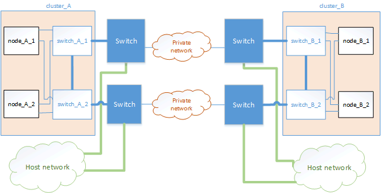

= Examples of MetroCluster network topologies
:icons: font
:imagesdir: ../media/

[lead]
Beginning with ONTAP 9.6, some additional network configurations are supported for MetroCluster IP configurations. This section provides some examples of the supported network configurations. Not all of the supported topologies are listed.

In these topologies, it is assumed that the ISL and intermediate network is configured according to the requirements mentioned previously. 

NOTE: If you are sharing an ISL with non-MetroCluster traffic, you must verify that the MetroCluster has at least the minimum required bandwidth available at all times.

== Shared network configuration with direct links

In this topology, two distinct sites are connected by direct links. These links can be between xWDM and TDM devices or switches. The capacity of the ISLs is not dedicated to the MetroCluster traffic but is shared with other non-MetroCluster traffic.

image::../media/mcc_ip_networking_with_shared_isls.gif[]

== Shared infrastructure with intermediate networks

In this topology, the MetroCluster sites are not directly connected but MetroCluster and the host traffic travel through a network. 
The network can consist of a series of xWDM and TDM and switches, but unlike the shared configuration with direct ISLs, the links are not direct between the sites. Depending on the infrastructure between the sites, any combination of network configurations is possible. 

== Multiple MetroCluster configurations sharing an intermediate network

In this topology, two separate MetroCluster configurations are sharing the same intermediate network. In the example, MetroCluster one switch_A_1 and MetroCluster two switch_A_1, both connect to the same intermediate switch. 

NOTE: Both “MetroCluster one” or “MetroCluster two” can be one eight-node MetroCluster configuration or two four-node MetroCluster configurations.

image::../media/mcc_ip_two_mccs_sharing_the_same_shared_network_sx.gif[]

== Combination of a MetroCluster configuration using NetApp validated switches and a configuration using MetroCluster-compliant switches

Two separate MetroCluster configurations share the same intermediate switch, where one MetroCluster is configured using NetApp validated switches in a shared layer 2 configuration (MetroCluster one), and the other MetroCluster is configured using MetroCluster-compliant switches connecting directly to the intermediate switches (MetroCluster two).

image::../media/mcc_ip_unsupported_two_mccs_direct_to_shared_switches.png[]

