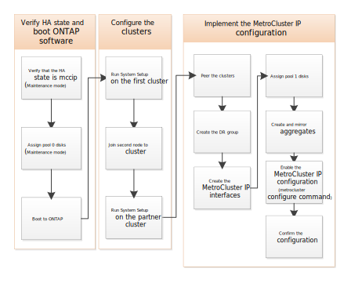

= Configure the MetroCluster software in ONTAP
:icons: font
:imagesdir: ../media/

[.lead]
You must set up each node in the MetroCluster configuration in ONTAP, including the node-level configurations and the configuration of the nodes into two sites. You must also implement the MetroCluster relationship between the two sites.

If a controller module fails during configuration, refer to link:../disaster-recovery/concept_choosing_the_correct_recovery_procedure_parent_concept.html#controller-module-failure-scenarios-during-metrocluster-installation[Controller module failure scenarios during  MetroCluster installation].

== Configure eight-node MetroCluster IP configurations

An eight-node MetroCluster configuration consists of two DR groups. To configure the first DR group, complete the tasks in this section. After you have configured the first DR group, you can follow the steps to link:../upgrade/task_expand_a_four_node_mcc_ip_configuration.html[expand a four-node MetroCluster IP configuration to an eight-node configuration]. 

// 2023-JAN-20, BURT 1496296
