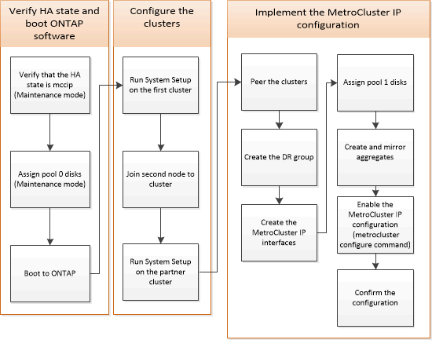
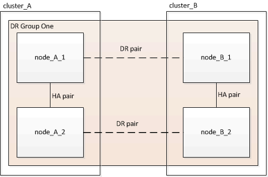

= Configuring the MetroCluster software in ONTAP
:icons: font
:imagesdir: ../media/

[.lead]
You must set up each node in the MetroCluster configuration in ONTAP, including the node-level configurations and the configuration of the nodes into two sites. You must also implement the MetroCluster relationship between the two sites.

== Gathering required information

[.lead]
You need to gather the required IP addresses for the controller modules before you begin the configuration process.

link:metrocluster_ip_setup_worksheet_site-a.csv[MetroCluster IP setup worksheet, site_A]

=== IP network information worksheet for site A

[.lead]
You must obtain IP addresses and other network information for the first MetroCluster site (site A) from your network administrator before you configure the system.

==== Site A switch information

When you cable the system, you need a host name and management IP address for each cluster switch.

|===
| Cluster switch| Host name| IP address| Network mask| Default gateway
a|
Interconnect 1
a|

a|

a|

a|

a|
Interconnect 2
a|

a|

a|

a|

a|
Management 1
a|

a|

a|

a|

a|
Management 2
a|

a|

a|

a|

|===

==== Site A cluster creation information

When you first create the cluster, you need the following information:

|===
| Type of information| Your values
a|
Cluster nameExample used in this guide: site_A

a|

a|
DNS domain
a|

a|
DNS name servers
a|

a|
Location
a|

a|
Administrator password
a|

|===

==== Site A node information

For each node in the cluster, you need a management IP address, a network mask, and a default gateway.

|===
| Node| Port| IP address| Network mask| Default gateway
a|
Node 1 Example used in this guide: controller_A_1

a|

a|

a|

a|

a|
Node 2Example used in this guide: controller_A_2

a|

a|

a|

a|

|===

==== Site A LIFs and ports for MetroCluster IP back-end connectivity

For each node in the cluster, you need the IP addresses of two MetroCluster IP LIFs, including a network mask and a default gateway. The MetroCluster IP LIFs are used for MetroCluster IP back-end connectivity.

xref:concept_prepare_for_the_mcc_installation.adoc[Considerations for MetroCluster IP configuration]

|===
| Node| Port| IP address of MetroCluster IP LIF| Network mask| Default gateway
a|
Node 1 MetroCluster IP LIF 1
a|
e5a
a|

a|

a|

a|
Node 1 MetroCluster IP LIF 2
a|
e5b
a|

a|

a|

a|
Node 2 MetroCluster IP LIF 1
a|
e5a
a|

a|

a|

a|
Node 2 MetroCluster IP LIF 2
a|
e5b
a|

a|

a|

|===

==== Site A LIFs and ports for cluster peering

For each node in the cluster, you need the IP addresses of two intercluster LIFs, including a network mask and a default gateway. The intercluster LIFs are used to peer the clusters.

|===
| Node| Port| IP address of intercluster LIF| Network mask| Default gateway
a|
Node 1 IC LIF 1
a|

a|

a|

a|

a|
Node 1 IC LIF 2
a|

a|

a|

a|

a|
Node 2 IC LIF 1
a|

a|

a|

a|

a|
Node 2 IC LIF 2
a|

a|

a|

a|

|===

==== Site A time server information

You must synchronize the time, which requires one or more NTP time servers.

|===
| Node| Host name| IP address| Network mask| Default gateway
a|
NTP server 1
a|

a|

a|

a|

a|
NTP server 2
a|

a|

a|

a|

|===

==== Site A AutoSupport information

You must configure AutoSupport on each node, which requires the following information:

|===
| Type of information| Your values
a|
From email address
a|

a|

a|
Mail hosts
a|
IP addresses or names
a|

a|
Transport protocol
a|
HTTP, HTTPS, or SMTP
a|

a|
Proxy server
a|

a|
Recipient email addresses or distribution lists
a|
Full-length messages
a|

a|
Concise messages
a|

a|
Partners
a|

|===

==== Site A SP information

You must enable access to the Service Processor (SP) of each node for troubleshooting and maintenance, which requires the following network information for each node:

|===
| Node| IP address| Network mask| Default gateway
a|
Node 1
a|

a|

a|

|===

=== IP network information worksheet for site B

[.lead]
You must obtain IP addresses and other network information for the second MetroCluster site (site B) from your network administrator before you configure the system.

==== Site B switch information

When you cable the system, you need a host name and management IP address for each cluster switch.

|===
| Cluster switch| Host name| IP address| Network mask| Default gateway
a|
Interconnect 1
a|

a|

a|

a|

a|
Interconnect 2
a|

a|

a|

a|

a|
Management 1
a|

a|

a|

a|

a|
Management 2
a|

a|

a|

a|

|===

==== Site B cluster creation information

When you first create the cluster, you need the following information:

|===
| Type of information| Your values
a|
Cluster nameExample used in this guide: site_B

a|

a|
DNS domain
a|

a|
DNS name servers
a|

a|
Location
a|

a|
Administrator password
a|

|===

==== Site B node information

For each node in the cluster, you need a management IP address, a network mask, and a default gateway.

|===
| Node| Port| IP address| Network mask| Default gateway
a|
Node 1 Example used in this guide: controller_B_1

a|

a|

a|

a|

a|
Node 2Example used in this guide: controller_B_2

a|

a|

a|

a|

|===

==== Site B LIFs and ports for MetroCluster IP back-end connectivity

For each node in the cluster, you need the IP addresses of two MetroCluster IP LIFs, including a network mask and a default gateway. The MetroCluster IP LIFs are used for MetroCluster IP back-end connectivity.

xref:concept_prepare_for_the_mcc_installation.adoc[Considerations for MetroCluster IP configuration]

|===
| Node| Port| IP address of MetroCluster IP LIF| Network mask| Default gateway
a|
Node 1 MetroCluster IP LIF 1
a|
e5a
a|

a|

a|

a|
Node 1 MetroCluster IP LIF 2
a|
e5b
a|

a|

a|

a|
Node 2 MetroCluster IP LIF 1
a|
e5a
a|

a|

a|

a|
Node 2 MetroCluster IP LIF 2
a|
e5b
a|

a|

a|

|===

==== Site B LIFs and ports for cluster peering

For each node in the cluster, you need the IP addresses of two intercluster LIFs, including a network mask and a default gateway. The intercluster LIFs are used to peer the clusters.

|===
| Node| Port| IP address of intercluster LIF| Network mask| Default gateway
a|
Node 1 IC LIF 1
a|

a|

a|

a|

a|
Node 1 IC LIF 2
a|

a|

a|

a|

a|
Node 2 IC LIF 1
a|

a|

a|

a|

a|
Node 2 IC LIF 2
a|

a|

a|

a|

|===

==== Site B time server information

You must synchronize the time, which requires one or more NTP time servers.

|===
| Node| Host name| IP address| Network mask| Default gateway
a|
NTP server 1
a|

a|

a|

a|

a|
NTP server 2
a|

a|

a|

a|

|===

==== Site B AutoSupport information

You must configure AutoSupport on each node, which requires the following information:

|===
| Type of information| Your values
a|
From email address
a|

a|

a|
Mail hosts
a|
IP addresses or names
a|

a|
Transport protocol
a|
HTTP, HTTPS, or SMTP
a|

a|
Proxy server
a|

a|
Recipient email addresses or distribution lists
a|
Full-length messages
a|

a|
Concise messages
a|

a|
Partners
a|

|===

==== Site B SP information

You must enable access to the Service Processor (SP) of each node for troubleshooting and maintenance, which requires the following network information for each node:

|===
| Node| IP address| Network mask| Default gateway
a|
Node 1 (controller_B_1)
a|

a|

a|

|===

== Similarities and differences between standard cluster and MetroCluster configurations

[.lead]
The configuration of the nodes in each cluster in a MetroCluster configuration is similar to that of nodes in a standard cluster.

The MetroCluster configuration is built on two standard clusters. Physically, the configuration must be symmetrical, with each node having the same hardware configuration, and all of the MetroCluster components must be cabled and configured. However, the basic software configuration for nodes in a MetroCluster configuration is the same as that for nodes in a standard cluster.

|===
| Configuration step| Standard cluster configuration| MetroCluster configuration
a|
Configure management, cluster, and data LIFs on each node.
a|
Same in both types of clusters
a|
Configure the root aggregate.
a|
Same in both types of clusters
a|
Set up the cluster on one node in the cluster.
a|
Same in both types of clusters
a|
Join the other node to the cluster.
a|
Same in both types of clusters
a|
Create a mirrored root aggregate.
a|
Optional
a|
Required
a|
Peer the clusters.
a|
Optional
a|
Required
a|
Enable the MetroCluster configuration.
a|
Does not apply
a|
Required
|===

== Verifying the ha-config state of components
// BURT 1381553
[.lead]
In a MetroCluster IP configuration that is not preconfigured at the factory, you must verify that the ha-config state of the controller and chassis components is set to mccip so that they boot up properly. For systems received from the factory, this value is preconfigured and you do not need to verify it.

The system must be in Maintenance mode.

. Display the HA state of the controller module and chassis: `ha-config show`
+
The controller module and chassis should show the value mccip.

. If the displayed system state of the controller is not mccip, set the HA state for the controller: `ha-config modify controller mccip`
. If the displayed system state of the chassis is not mccip, set the HA state for the chassis: `ha-config modify chassis mccip`
. Repeat these steps on each node in the MetroCluster configuration.

== Restoring system defaults on a controller module

// include reference
include::_include/restore_defaults_on_controller.adoc[]
// end include reference

== Manually assigning drives to pool 0

[.lead]
If you did not receive the systems pre-configured from the factory, you might have to manually assign the pool 0 drives. Depending on the platform model and whether the system is using ADP, you must manually assign drives to pool 0 for each node in the MetroCluster IP configuration. The procedure you use depends on the version of ONTAP you are using.

=== Manually assigning drives for pool 0 (ONTAP 9.4 and later)

[.lead]
If the system has not been pre-configured at the factory and does not meet the requirements for automatic drive assignment, you must manually assign the pool 0 drives.

This procedure applies to configurations running ONTAP 9.4 or later.

To determine if your system requires manual disk assignment, you should review xref:concept_prepare_for_the_mcc_installation.adoc[Considerations for automatic drive assignment and ADP systems in ONTAP 9.4 and later].

You perform these steps in Maintenance mode. The procedure must be performed on each node in the configuration.

Examples in this section are based on the following assumptions:

* node_A_1 and node_A_2 own drives on:
 ** site_A-shelf_1 (local)
 ** site_B-shelf_2 (remote)
* node_B_1 and node_B_2 own drives on:
 ** site_B-shelf_1 (local)
 ** site_A-shelf_2 (remote)

. Display the boot menu: `boot_ontap menu`
. Select option 9a.
+
The following screen shows the boot menu prompt:
+
----

Please choose one of the following:

    (1) Normal Boot.
    (2) Boot without /etc/rc.
    (3) Change password.
    (4) Clean configuration and initialize all disks.
    (5) Maintenance mode boot.
    (6) Update flash from backup config.
    (7) Install new software first.
    (8) Reboot node.
    (9) Configure Advanced Drive Partitioning.
    Selection (1-9)?  9a
########## WARNING ##########

    This is a disruptive operation and will result in the
    loss of all filesystem data. Before proceeding further,
    make sure that:
    1) This option (9a) has been executed or will be executed
    on the HA partner node (and DR/DR-AUX partner nodes if
    applicable), prior to reinitializing any system in the
    HA-pair (or MCC setup).
    2) The HA partner node (and DR/DR-AUX partner nodes if
    applicable) is currently waiting at the boot menu.

    Do you still want to continue (yes/no)? yes
----

. When the node restarts, press Ctrl-C when prompted to display the boot menu and then select the option for *Maintenance mode boot*.
. In Maintenance mode, manually assign drives for the local aggregates on the node: `disk assign disk-id -p 0 -s local-node-sysid`
+
The drives should be assigned symmetrically, so each node has an equal number of drives. The following steps are for a configuration with two storage shelves at each site.

 .. When configuring node_A_1, manually assign drives from slot 0 to 11 to pool0 of node A1 from site_A-shelf_1.
 .. When configuring node_A_2, manually assign drives from slot 12 to 23 to pool0 of node A2 from site_A-shelf_1.
 .. When configuring node_B_1, manually assign drives from slot 0 to 11 to pool0 of node B1 from site_B-shelf_1.
 .. When configuring node_B_2, manually assign drives from slot 12 to 23 to pool0 of node B2 from site_B-shelf_1.

. Exit Maintenance mode: `halt`
. Display the boot menu: `boot_ontap menu`
. Select option 4 from the boot menu and let the system boot.
. Repeat these steps on the other nodes in the MetroCluster IP configuration.
. Proceed to xref:concept_configure_the_mcc_software_in_ontap.adoc[Setting up ONTAP].

=== Manually assigning drives for pool 0 (ONTAP 9.3)

[.lead]
If you have at least two disk shelves for each node, you use ONTAP's auto-assignment functionality to automatically assign the local (pool 0) disks. While the node is in Maintenance mode, you must first assign a single disk on the appropriate shelves to pool 0. ONTAP then automatically assign the rest of the disks on the shelf to the same pool. This task is not required on systems received from the factory, which have pool 0 to contain the pre-configured root aggregate.

This procedure applies to configurations running ONTAP 9.3.

This procedure is not required if you received your MetroCluster configuration from the factory. Nodes from the factory are configured with pool 0 disks and root aggregates.

This procedure can be used only if you have at least two disk shelves for each node, which allows shelf-level autoassignment of disks. If you cannot use shelf-level autoassignment, you must manually assign your local disks so that each node has a local pool of disks (pool 0).

These steps must be performed in Maintenance mode.

Examples in this section assume the following disk shelves:

* node_A_1 owns disks on:
 ** site_A-shelf_1 (local)
 ** site_B-shelf_2 (remote)
* node_A_2 is connected to:
 ** site_A-shelf_3 (local)
 ** site_B-shelf_4 (remote)
* node_B_1 is connected to:
 ** site_B-shelf_1 (local)
 ** site_A-shelf_2 (remote)
* node_B_2 is connected to:
 ** site_B-shelf_3 (local)
 ** site_A-shelf_4 (remote)

. Manually assign a single disk for root aggregate on each node: `disk assign disk-id -p 0 -s local-node-sysid`
+
The manual assignment of these disks allows the ONTAP autoassignment feature to assign the rest of the disks on each shelf.

 .. On node_A_1, manually assign one disk from local site_A-shelf_1 to pool 0.
 .. On node_A_2, manually assign one disk from local site_A-shelf_3 to pool 0.
 .. On node_B_1, manually assign one disk from local site_B-shelf_1 to pool 0.
 .. On node_B_2, manually assign one disk from local site_B-shelf_3 to pool 0.

. Boot each node at site A, using option 4 on the boot menu:
+
You should complete this step on a node before proceeding to the next node.

 .. Exit Maintenance mode: `halt`
 .. Display the boot menu: `boot_ontap menu`
 .. Select option 4 from the boot menu and proceed.

. Boot each node at site B, using option 4 on the boot menu:
+
You should complete this step on a node before proceeding to the next node.

 .. Exit Maintenance mode: `halt`
 .. Display the boot menu: `boot_ontap menu`
 .. Select option 4 from the boot menu and proceed.

== Setting up ONTAP

[.lead]
After you boot each node, you are prompted to perform basic node and cluster configuration. After configuring the cluster, you return to the ONTAP CLI to create aggregates and create the MetroCluster configuration.

* You must have cabled the MetroCluster configuration.
* You must not have configured the Service Processor.

If you need to netboot the new controllers, see http://docs.netapp.com/ontap-9/topic/com.netapp.doc.dot-mcc-upgrade/GUID-1BC0E8C3-740E-4D5B-BDBF-E58CD79C9706.html[Netbooting the new controller modules] in the _MetroCluster Upgrade, Transition, and Expansion Guide_.

This task must be performed on both clusters in the MetroCluster configuration.

. Power up each node at the local site if you have not already done so and let them all boot completely.
+
If the system is in Maintenance mode, you need to issue the halt command to exit Maintenance mode, and then issue the boot_ontap command to boot the system and get to cluster setup.

. On the first node in each cluster, proceed through the prompts to configure the cluster
 .. Enable the AutoSupport tool by following the directions provided by the system.
+
The output should be similar to the following:
+
----
Welcome to the cluster setup wizard.

    You can enter the following commands at any time:
    "help" or "?" - if you want to have a question clarified,
    "back" - if you want to change previously answered questions, and
    "exit" or "quit" - if you want to quit the cluster setup wizard.
    Any changes you made before quitting will be saved.

    You can return to cluster setup at any time by typing "cluster setup".
    To accept a default or omit a question, do not enter a value.

    This system will send event messages and periodic reports to NetApp Technical
    Support. To disable this feature, enter
    autosupport modify -support disable
    within 24 hours.

    Enabling AutoSupport can significantly speed problem determination and
    resolution should a problem occur on your system.
    For further information on AutoSupport, see:
    http://support.netapp.com/autosupport/

    Type yes to confirm and continue {yes}: yes

.
.
.
----

 .. Configure the node management interface by responding to the prompts.
+
The prompts are similar to the following:
+
----
Enter the node management interface port [e0M]:
Enter the node management interface IP address: 172.17.8.229
Enter the node management interface netmask: 255.255.254.0
Enter the node management interface default gateway: 172.17.8.1
A node management interface on port e0M with IP address 172.17.8.229 has been created.
----

 .. Create the cluster by responding to the prompts.
+
The prompts are similar to the following:
+
----
Do you want to create a new cluster or join an existing cluster? {create, join}:
create

Do you intend for this node to be used as a single node cluster? {yes, no} [no]:
no

Existing cluster interface configuration found:

Port MTU IP Netmask
e0a 1500 169.254.18.124 255.255.0.0
e1a 1500 169.254.184.44 255.255.0.0

Do you want to use this configuration? {yes, no} [yes]: no

System Defaults:
Private cluster network ports [e0a,e1a].
Cluster port MTU values will be set to 9000.
Cluster interface IP addresses will be automatically generated.

Do you want to use these defaults? {yes, no} [yes]: no

Enter the cluster administrator's (username "admin") password:

Retype the password:

Step 1 of 5: Create a Cluster
You can type "back", "exit", or "help" at any question.

List the private cluster network ports [e0a,e1a]:
Enter the cluster ports' MTU size [9000]:
Enter the cluster network netmask [255.255.0.0]: 255.255.254.0
Enter the cluster interface IP address for port e0a: 172.17.10.228
Enter the cluster interface IP address for port e1a: 172.17.10.229
Enter the cluster name: cluster_A

Creating cluster cluster_A

Starting cluster support services ...

Cluster cluster_A has been created.
----

 .. Add licenses, set up a Cluster Administration SVM, and enter DNS information by responding to the prompts.
+
The prompts are similar to the following:
+
----
Step 2 of 5: Add Feature License Keys
You can type "back", "exit", or "help" at any question.

Enter an additional license key []:

Step 3 of 5: Set Up a Vserver for Cluster Administration
You can type "back", "exit", or "help" at any question.

Enter the cluster management interface port [e3a]:
Enter the cluster management interface IP address: 172.17.12.153
Enter the cluster management interface netmask: 255.255.252.0
Enter the cluster management interface default gateway: 172.17.12.1

A cluster management interface on port e3a with IP address 172.17.12.153 has been created. You can use this address to connect to and manage the cluster.

Enter the DNS domain names: lab.netapp.com
Enter the name server IP addresses: 172.19.2.30
DNS lookup for the admin Vserver will use the lab.netapp.com domain.

Step 4 of 5: Configure Storage Failover (SFO)
You can type "back", "exit", or "help" at any question.

SFO will be enabled when the partner joins the cluster.

Step 5 of 5: Set Up the Node
You can type "back", "exit", or "help" at any question.

Where is the controller located []: svl
----

 .. Enable storage failover and set up the node by responding to the prompts.
+
The prompts are similar to the following:
+
----
Step 4 of 5: Configure Storage Failover (SFO)
You can type "back", "exit", or "help" at any question.

SFO will be enabled when the partner joins the cluster.

Step 5 of 5: Set Up the Node
You can type "back", "exit", or "help" at any question.

Where is the controller located []: site_A
----

 .. Complete the configuration of the node, but do not create data aggregates.
+
You can use ONTAP System Manager, pointing your web browser to the cluster management IP address (https://172.17.12.153).
+
https://docs.netapp.com/ontap-9/topic/com.netapp.doc.onc-sm-help/GUID-DF04A607-30B0-4B98-99C8-CB065C64E670.html[Cluster management using System Manager]
. Boot the next controller and join it to the cluster, following the prompts.
. Confirm that nodes are configured in high-availability mode: `storage failover show -fields mode`
+
If not, you must configure HA mode on each node, and then reboot the nodes: `storage failover modify -mode ha -node localhost`
+
This command configures high-availability mode but does not enable storage failover. Storage failover is automatically enabled when you configure the MetroCluster configuration later in the process.

. Confirm that you have four ports configured as cluster interconnects: `network port show`
+
The MetroCluster IP interfaces are not configured at this time and do not appear in the command output.
+
The following example shows two cluster ports on node_A_1:
+
----
cluster_A::*> network port show -role cluster

Node: node_A_1

                                                                       Ignore

                                                  Speed(Mbps) Health   Health

Port      IPspace      Broadcast Domain Link MTU  Admin/Oper  Status   Status

--------- ------------ ---------------- ---- ---- ----------- -------- ------

e4a       Cluster      Cluster          up   9000  auto/40000 healthy  false

e4e       Cluster      Cluster          up   9000  auto/40000 healthy  false

Node: node_A_2

                                                                       Ignore

                                                  Speed(Mbps) Health   Health

Port      IPspace      Broadcast Domain Link MTU  Admin/Oper  Status   Status

--------- ------------ ---------------- ---- ---- ----------- -------- ------

e4a       Cluster      Cluster          up   9000  auto/40000 healthy  false

e4e       Cluster      Cluster          up   9000  auto/40000 healthy  false

4 entries were displayed.
----

. Repeat these steps on the partner cluster.

Return to the ONTAP command-line interface and complete the MetroCluster configuration by performing the tasks that follow.

== Configuring the clusters into a MetroCluster configuration

[.lead]
You must peer the clusters, mirror the root aggregates, create a mirrored data aggregate, and then issue the command to implement the MetroCluster operations.

=== Disabling automatic drive assignment (if doing manual assignment in ONTAP 9.4)

[.lead]
In ONTAP 9.4, if your MetroCluster IP configuration has fewer than four external storage shelves per site, you must disable automatic drive assignment on all nodes and manually assign drives.

This task is not required in ONTAP 9.5 and later.

This task does not apply to an AFF A800 system with an internal shelf and no external shelves.

xref:concept_prepare_for_the_mcc_installation.adoc[Considerations for automatic drive assignment and ADP systems in ONTAP 9.4 and later]

. Disable automatic drive assignment: `storage disk option modify -node node_name -autoassign off`
+
You need to issue this command on all nodes in the MetroCluster IP configuration.

=== Verifying drive assignment of pool 0 drives

[.lead]
You must verify that the remote drives are visible to the nodes and have been assigned correctly.

Automatic assignment depends on the storage system platform model and drive shelf arrangement.

xref:concept_prepare_for_the_mcc_installation.adoc[Considerations for automatic drive assignment and ADP systems in ONTAP 9.4 and later]

. Verify that pool 0 drives are assigned automatically: `disk show`
+
The following example shows the cluster_A output for an AFF A800 system with no external shelves.
+
One quarter (8 drives) were automatically assigned to node_A_1 and one quarter were automatically assigned to node_A_2. The remaining drives will be remote (pool 1) drives for node_B_1 and node_B_2.
+
----
cluster_A::*> disk show
                 Usable     Disk      Container           Container
Disk             Size       Shelf Bay Type    Type        Name      Owner
---------------- ---------- ----- --- ------- ----------- --------- --------
node_A_1:0n.12   1.75TB     0     12  SSD-NVM shared      aggr0     node_A_1
node_A_1:0n.13   1.75TB     0     13  SSD-NVM shared      aggr0     node_A_1
node_A_1:0n.14   1.75TB     0     14  SSD-NVM shared      aggr0     node_A_1
node_A_1:0n.15   1.75TB     0     15  SSD-NVM shared      aggr0     node_A_1
node_A_1:0n.16   1.75TB     0     16  SSD-NVM shared      aggr0     node_A_1
node_A_1:0n.17   1.75TB     0     17  SSD-NVM shared      aggr0     node_A_1
node_A_1:0n.18   1.75TB     0     18  SSD-NVM shared      aggr0     node_A_1
node_A_1:0n.19   1.75TB     0     19  SSD-NVM shared      -         node_A_1
node_A_2:0n.0    1.75TB     0     0   SSD-NVM shared      aggr0_node_A_2_0 node_A_2
node_A_2:0n.1    1.75TB     0     1   SSD-NVM shared      aggr0_node_A_2_0 node_A_2
node_A_2:0n.2    1.75TB     0     2   SSD-NVM shared      aggr0_node_A_2_0 node_A_2
node_A_2:0n.3    1.75TB     0     3   SSD-NVM shared      aggr0_node_A_2_0 node_A_2
node_A_2:0n.4    1.75TB     0     4   SSD-NVM shared      aggr0_node_A_2_0 node_A_2
node_A_2:0n.5    1.75TB     0     5   SSD-NVM shared      aggr0_node_A_2_0 node_A_2
node_A_2:0n.6    1.75TB     0     6   SSD-NVM shared      aggr0_node_A_2_0 node_A_2
node_A_2:0n.7    1.75TB     0     7   SSD-NVM shared      -         node_A_2
node_A_2:0n.24   -          0     24  SSD-NVM unassigned  -         -
node_A_2:0n.25   -          0     25  SSD-NVM unassigned  -         -
node_A_2:0n.26   -          0     26  SSD-NVM unassigned  -         -
node_A_2:0n.27   -          0     27  SSD-NVM unassigned  -         -
node_A_2:0n.28   -          0     28  SSD-NVM unassigned  -         -
node_A_2:0n.29   -          0     29  SSD-NVM unassigned  -         -
node_A_2:0n.30   -          0     30  SSD-NVM unassigned  -         -
node_A_2:0n.31   -          0     31  SSD-NVM unassigned  -         -
node_A_2:0n.36   -          0     36  SSD-NVM unassigned  -         -
node_A_2:0n.37   -          0     37  SSD-NVM unassigned  -         -
node_A_2:0n.38   -          0     38  SSD-NVM unassigned  -         -
node_A_2:0n.39   -          0     39  SSD-NVM unassigned  -         -
node_A_2:0n.40   -          0     40  SSD-NVM unassigned  -         -
node_A_2:0n.41   -          0     41  SSD-NVM unassigned  -         -
node_A_2:0n.42   -          0     42  SSD-NVM unassigned  -         -
node_A_2:0n.43   -          0     43  SSD-NVM unassigned  -         -
32 entries were displayed.
----
+
The following example shows the cluster_B output:
+
----
cluster_B::> disk show
                 Usable     Disk              Container   Container
Disk             Size       Shelf Bay Type    Type        Name      Owner
---------------- ---------- ----- --- ------- ----------- --------- --------

Info: This cluster has partitioned disks. To get a complete list of spare disk
capacity use "storage aggregate show-spare-disks".
node_B_1:0n.12   1.75TB     0     12  SSD-NVM shared      aggr0     node_B_1
node_B_1:0n.13   1.75TB     0     13  SSD-NVM shared      aggr0     node_B_1
node_B_1:0n.14   1.75TB     0     14  SSD-NVM shared      aggr0     node_B_1
node_B_1:0n.15   1.75TB     0     15  SSD-NVM shared      aggr0     node_B_1
node_B_1:0n.16   1.75TB     0     16  SSD-NVM shared      aggr0     node_B_1
node_B_1:0n.17   1.75TB     0     17  SSD-NVM shared      aggr0     node_B_1
node_B_1:0n.18   1.75TB     0     18  SSD-NVM shared      aggr0     node_B_1
node_B_1:0n.19   1.75TB     0     19  SSD-NVM shared      -         node_B_1
node_B_2:0n.0    1.75TB     0     0   SSD-NVM shared      aggr0_node_B_1_0 node_B_2
node_B_2:0n.1    1.75TB     0     1   SSD-NVM shared      aggr0_node_B_1_0 node_B_2
node_B_2:0n.2    1.75TB     0     2   SSD-NVM shared      aggr0_node_B_1_0 node_B_2
node_B_2:0n.3    1.75TB     0     3   SSD-NVM shared      aggr0_node_B_1_0 node_B_2
node_B_2:0n.4    1.75TB     0     4   SSD-NVM shared      aggr0_node_B_1_0 node_B_2
node_B_2:0n.5    1.75TB     0     5   SSD-NVM shared      aggr0_node_B_1_0 node_B_2
node_B_2:0n.6    1.75TB     0     6   SSD-NVM shared      aggr0_node_B_1_0 node_B_2
node_B_2:0n.7    1.75TB     0     7   SSD-NVM shared      -         node_B_2
node_B_2:0n.24   -          0     24  SSD-NVM unassigned  -         -
node_B_2:0n.25   -          0     25  SSD-NVM unassigned  -         -
node_B_2:0n.26   -          0     26  SSD-NVM unassigned  -         -
node_B_2:0n.27   -          0     27  SSD-NVM unassigned  -         -
node_B_2:0n.28   -          0     28  SSD-NVM unassigned  -         -
node_B_2:0n.29   -          0     29  SSD-NVM unassigned  -         -
node_B_2:0n.30   -          0     30  SSD-NVM unassigned  -         -
node_B_2:0n.31   -          0     31  SSD-NVM unassigned  -         -
node_B_2:0n.36   -          0     36  SSD-NVM unassigned  -         -
node_B_2:0n.37   -          0     37  SSD-NVM unassigned  -         -
node_B_2:0n.38   -          0     38  SSD-NVM unassigned  -         -
node_B_2:0n.39   -          0     39  SSD-NVM unassigned  -         -
node_B_2:0n.40   -          0     40  SSD-NVM unassigned  -         -
node_B_2:0n.41   -          0     41  SSD-NVM unassigned  -         -
node_B_2:0n.42   -          0     42  SSD-NVM unassigned  -         -
node_B_2:0n.43   -          0     43  SSD-NVM unassigned  -         -
32 entries were displayed.

cluster_B::>
----

=== Peering the clusters

[.lead]
The clusters in the MetroCluster configuration must be in a peer relationship so that they can communicate with each other and perform the data mirroring essential to MetroCluster disaster recovery.

*Related information*

http://docs.netapp.com/ontap-9/topic/com.netapp.doc.exp-clus-peer/home.html[Cluster and SVM peering express configuration]

xref:concept_prepare_for_the_mcc_installation.adoc[Considerations when using dedicated ports]

xref:concept_prepare_for_the_mcc_installation.adoc[Considerations when sharing data ports]

==== Configuring intercluster LIFs

[.lead]
You must create intercluster LIFs on ports used for communication between the MetroCluster partner clusters. You can use dedicated ports or ports that also have data traffic.

===== Configuring intercluster LIFs on dedicated ports

[.lead]
You can configure intercluster LIFs on dedicated ports. Doing so typically increases the available bandwidth for replication traffic.

. List the ports in the cluster:``network port show``
+
For complete command syntax, see the man page.
+
The following example shows the network ports in cluster01:
+
----

cluster01::> network port show
                                                             Speed (Mbps)
Node   Port      IPspace      Broadcast Domain Link   MTU    Admin/Oper
------ --------- ------------ ---------------- ----- ------- ------------
cluster01-01
       e0a       Cluster      Cluster          up     1500   auto/1000
       e0b       Cluster      Cluster          up     1500   auto/1000
       e0c       Default      Default          up     1500   auto/1000
       e0d       Default      Default          up     1500   auto/1000
       e0e       Default      Default          up     1500   auto/1000
       e0f       Default      Default          up     1500   auto/1000
cluster01-02
       e0a       Cluster      Cluster          up     1500   auto/1000
       e0b       Cluster      Cluster          up     1500   auto/1000
       e0c       Default      Default          up     1500   auto/1000
       e0d       Default      Default          up     1500   auto/1000
       e0e       Default      Default          up     1500   auto/1000
       e0f       Default      Default          up     1500   auto/1000
----

. Determine which ports are available to dedicate to intercluster communication:``network interface show -fields home-port,curr-port``
+
For complete command syntax, see the man page.
+
The following example shows that ports e0e and e0f have not been assigned LIFs:
+
----

cluster01::> network interface show -fields home-port,curr-port
vserver lif                  home-port curr-port
------- -------------------- --------- ---------
Cluster cluster01-01_clus1   e0a       e0a
Cluster cluster01-01_clus2   e0b       e0b
Cluster cluster01-02_clus1   e0a       e0a
Cluster cluster01-02_clus2   e0b       e0b
cluster01
        cluster_mgmt         e0c       e0c
cluster01
        cluster01-01_mgmt1   e0c       e0c
cluster01
        cluster01-02_mgmt1   e0c       e0c
----

. Create a failover group for the dedicated ports:``network interface failover-groups create -vserver system_SVM -failover-group failover_group -targets physical_or_logical_ports``
+
The following example assigns ports e0e and e0f to the failover group intercluster01 on the system SVMcluster01:
+
----
cluster01::> network interface failover-groups create -vserver cluster01 -failover-group
intercluster01 -targets
cluster01-01:e0e,cluster01-01:e0f,cluster01-02:e0e,cluster01-02:e0f
----

. Verify that the failover group was created:``network interface failover-groups show``
+
For complete command syntax, see the man page.
+
----
cluster01::> network interface failover-groups show
                                  Failover
Vserver          Group            Targets
---------------- ---------------- --------------------------------------------
Cluster
                 Cluster
                                  cluster01-01:e0a, cluster01-01:e0b,
                                  cluster01-02:e0a, cluster01-02:e0b
cluster01
                 Default
                                  cluster01-01:e0c, cluster01-01:e0d,
                                  cluster01-02:e0c, cluster01-02:e0d,
                                  cluster01-01:e0e, cluster01-01:e0f
                                  cluster01-02:e0e, cluster01-02:e0f
                 intercluster01
                                  cluster01-01:e0e, cluster01-01:e0f
                                  cluster01-02:e0e, cluster01-02:e0f
----

. Create intercluster LIFs on the system SVM and assign them to the failover group.
+
|===
    a|
*In ONTAP 9.6 and later:*
a|
`network interface create -vserver system_SVM -lif LIF_name -service-policy default-intercluster -home-node node -home-port port -address port_IP -netmask netmask -failover-group failover_group`
a|
*In ONTAP 9.5 and earlier:*
a|
`network interface create -vserver system_SVM -lif LIF_name -role intercluster -home-node node -home-port port -address port_IP -netmask netmask -failover-group failover_group`
|===
For complete command syntax, see the man page.
+
The following example creates intercluster LIFs cluster01_icl01 and cluster01_icl02 in the failover group intercluster01:
+
----
cluster01::> network interface create -vserver cluster01 -lif cluster01_icl01 -service-
policy default-intercluster -home-node cluster01-01 -home-port e0e -address 192.168.1.201
-netmask 255.255.255.0 -failover-group intercluster01

cluster01::> network interface create -vserver cluster01 -lif cluster01_icl02 -service-
policy default-intercluster -home-node cluster01-02 -home-port e0e -address 192.168.1.202
-netmask 255.255.255.0 -failover-group intercluster01
----

. Verify that the intercluster LIFs were created:
+
|===
    a|
*In ONTAP 9.6 and later:*
a|
`network interface show -service-policy default-intercluster`
a|
*In ONTAP 9.5 and earlier:*
a|
`network interface show -role intercluster`
|===
For complete command syntax, see the man page.
+
----
cluster01::> network interface show -service-policy default-intercluster
            Logical    Status     Network            Current       Current Is
Vserver     Interface  Admin/Oper Address/Mask       Node          Port    Home
----------- ---------- ---------- ------------------ ------------- ------- ----
cluster01
            cluster01_icl01
                       up/up      192.168.1.201/24   cluster01-01  e0e     true
            cluster01_icl02
                       up/up      192.168.1.202/24   cluster01-02  e0f     true
----

. Verify that the intercluster LIFs are redundant:
+
|===
    a|
*In ONTAP 9.6 and later:*
a|
`network interface show -service-policy default-intercluster -failover`
a|
*In ONTAP 9.5 and earlier:*
a|
`network interface show -role intercluster -failover`
|===
For complete command syntax, see the man page.
+
The following example shows that the intercluster LIFs cluster01_icl01 and cluster01_icl02 on the SVMe0e port will fail over to the e0f port.
+
----
cluster01::> network interface show -service-policy default-intercluster –failover
         Logical         Home                  Failover        Failover
Vserver  Interface       Node:Port             Policy          Group
-------- --------------- --------------------- --------------- --------
cluster01
         cluster01_icl01 cluster01-01:e0e   local-only      intercluster01
                            Failover Targets:  cluster01-01:e0e,
                                               cluster01-01:e0f
         cluster01_icl02 cluster01-02:e0e   local-only      intercluster01
                            Failover Targets:  cluster01-02:e0e,
                                               cluster01-02:e0f
----

*Related information*

xref:concept_prepare_for_the_mcc_installation.adoc[Considerations when using dedicated ports]

===== Configuring intercluster LIFs on shared data ports

[.lead]
You can configure intercluster LIFs on ports shared with the data network. Doing so reduces the number of ports you need for intercluster networking.

. List the ports in the cluster:``network port show``
+
For complete command syntax, see the man page.
+
The following example shows the network ports in cluster01:
+
----

cluster01::> network port show
                                                             Speed (Mbps)
Node   Port      IPspace      Broadcast Domain Link   MTU    Admin/Oper
------ --------- ------------ ---------------- ----- ------- ------------
cluster01-01
       e0a       Cluster      Cluster          up     1500   auto/1000
       e0b       Cluster      Cluster          up     1500   auto/1000
       e0c       Default      Default          up     1500   auto/1000
       e0d       Default      Default          up     1500   auto/1000
cluster01-02
       e0a       Cluster      Cluster          up     1500   auto/1000
       e0b       Cluster      Cluster          up     1500   auto/1000
       e0c       Default      Default          up     1500   auto/1000
       e0d       Default      Default          up     1500   auto/1000
----

. Create intercluster LIFs on the system SVM:
+
|===
    a|
*In ONTAP 9.6 and later:*
a|
`network interface create -vserver system_SVM -lif LIF_name -service-policy default-intercluster -home-node node -home-port port -address port_IP -netmask netmask`
a|
*In ONTAP 9.5 and earlier:*
a|
`network interface create -vserver system_SVM -lif LIF_name -role intercluster -home-node node -home-port port -address port_IP -netmask netmask`
|===
For complete command syntax, see the man page.
+
The following example creates intercluster LIFs cluster01_icl01 and cluster01_icl02:
+
----

cluster01::> network interface create -vserver cluster01 -lif cluster01_icl01 -service-
policy default-intercluster -home-node cluster01-01 -home-port e0c -address 192.168.1.201
-netmask 255.255.255.0

cluster01::> network interface create -vserver cluster01 -lif cluster01_icl02 -service-
policy default-intercluster -home-node cluster01-02 -home-port e0c -address 192.168.1.202
-netmask 255.255.255.0
----

. Verify that the intercluster LIFs were created:
+
|===
    a|
*In ONTAP 9.6 and later:*
a|
`network interface show -service-policy default-intercluster`
a|
*In ONTAP 9.5 and earlier:*
a|
`network interface show -role intercluster`
|===
For complete command syntax, see the man page.
+
----
cluster01::> network interface show -service-policy default-intercluster
            Logical    Status     Network            Current       Current Is
Vserver     Interface  Admin/Oper Address/Mask       Node          Port    Home
----------- ---------- ---------- ------------------ ------------- ------- ----
cluster01
            cluster01_icl01
                       up/up      192.168.1.201/24   cluster01-01  e0c     true
            cluster01_icl02
                       up/up      192.168.1.202/24   cluster01-02  e0c     true
----

. Verify that the intercluster LIFs are redundant:
+
|===
    a|
*In ONTAP 9.6 and later:*
a|
`network interface show –service-policy default-intercluster -failover`
a|
*In ONTAP 9.5 and earlier:*
a|
`network interface show -role intercluster -failover`
|===
For complete command syntax, see the man page.
+
The following example shows that the intercluster LIFs cluster01_icl01 and cluster01_icl02 on the e0c port will fail over to the e0d port.
+
----
cluster01::> network interface show -service-policy default-intercluster –failover
         Logical         Home                  Failover        Failover
Vserver  Interface       Node:Port             Policy          Group
-------- --------------- --------------------- --------------- --------
cluster01
         cluster01_icl01 cluster01-01:e0c   local-only      192.168.1.201/24
                            Failover Targets: cluster01-01:e0c,
                                              cluster01-01:e0d
         cluster01_icl02 cluster01-02:e0c   local-only      192.168.1.201/24
                            Failover Targets: cluster01-02:e0c,
                                              cluster01-02:e0d
----

*Related information*

xref:concept_prepare_for_the_mcc_installation.adoc[Considerations when sharing data ports]

==== Creating a cluster peer relationship

[.lead]
You can use the cluster peer create command to create a peer relationship between a local and remote cluster. After the peer relationship has been created, you can run cluster peer create on the remote cluster to authenticate it to the local cluster.

* You must have created intercluster LIFs on every node in the clusters that are being peered.
* The clusters must be running ONTAP 9.3 or later.

. On the destination cluster, create a peer relationship with the source cluster: `+cluster peer create -generate-passphrase -offer-expiration MM/DD/YYYY HH:MM:SS|1...7days|1...168hours -peer-addrs peer_LIF_IPs -ipspace ipspace+`
+
If you specify both -generate-passphrase and -peer-addrs, only the cluster whose intercluster LIFs are specified in -peer-addrs can use the generated password.
+
You can ignore the -ipspace option if you are not using a custom IPspace. For complete command syntax, see the man page.
+
The following example creates a cluster peer relationship on an unspecified remote cluster:
+
----
cluster02::> cluster peer create -generate-passphrase -offer-expiration 2days

                     Passphrase: UCa+6lRVICXeL/gq1WrK7ShR
                Expiration Time: 6/7/2017 08:16:10 EST
  Initial Allowed Vserver Peers: -
            Intercluster LIF IP: 192.140.112.101
              Peer Cluster Name: Clus_7ShR (temporary generated)

Warning: make a note of the passphrase - it cannot be displayed again.
----

. On source cluster, authenticate the source cluster to the destination cluster: `cluster peer create -peer-addrs peer_LIF_IPs -ipspace ipspace`
+
For complete command syntax, see the man page.
+
The following example authenticates the local cluster to the remote cluster at intercluster LIF IP addresses 192.140.112.101 and 192.140.112.102:
+
----
cluster01::> cluster peer create -peer-addrs 192.140.112.101,192.140.112.102

Notice: Use a generated passphrase or choose a passphrase of 8 or more characters.
        To ensure the authenticity of the peering relationship, use a phrase or sequence of characters that would be hard to guess.

Enter the passphrase:
Confirm the passphrase:

Clusters cluster02 and cluster01 are peered.
----
+
Enter the passphrase for the peer relationship when prompted.

. Verify that the cluster peer relationship was created: `cluster peer show -instance`
+
----
cluster01::> cluster peer show -instance

                               Peer Cluster Name: cluster02
                   Remote Intercluster Addresses: 192.140.112.101, 192.140.112.102
              Availability of the Remote Cluster: Available
                             Remote Cluster Name: cluster2
                             Active IP Addresses: 192.140.112.101, 192.140.112.102
                           Cluster Serial Number: 1-80-123456
                  Address Family of Relationship: ipv4
            Authentication Status Administrative: no-authentication
               Authentication Status Operational: absent
                                Last Update Time: 02/05 21:05:41
                    IPspace for the Relationship: Default
----

. Check the connectivity and status of the nodes in the peer relationship: `cluster peer health show`
+
----
cluster01::> cluster peer health show
Node       cluster-Name                Node-Name
             Ping-Status               RDB-Health Cluster-Health  Avail…
---------- --------------------------- ---------  --------------- --------
cluster01-01
           cluster02                   cluster02-01
             Data: interface_reachable
             ICMP: interface_reachable true       true            true
                                       cluster02-02
             Data: interface_reachable
             ICMP: interface_reachable true       true            true
cluster01-02
           cluster02                   cluster02-01
             Data: interface_reachable
             ICMP: interface_reachable true       true            true
                                       cluster02-02
             Data: interface_reachable
             ICMP: interface_reachable true       true            true
----

=== Creating the DR group

[.lead]
You must create the disaster recovery (DR) group relationships between the clusters.

You perform this procedure on one of the clusters in the MetroCluster configuration to create the DR relationships between the nodes in both clusters.

NOTE: The DR relationships cannot be changed after the DR groups are created.

. Verify that the nodes are ready for creation of the DR group by entering the following command on each: `metrocluster configuration-settings show-status`
+
The command output should show that the nodes are ready:
+
----
cluster_A::> metrocluster configuration-settings show-status
Cluster                    Node          Configuration Settings Status
-------------------------- ------------- --------------------------------
cluster_A                  node_A_1      ready for DR group create
                           node_A_2      ready for DR group create
2 entries were displayed.
----
+
----
cluster_B::> metrocluster configuration-settings show-status
Cluster                    Node          Configuration Settings Status
-------------------------- ------------- --------------------------------
cluster_B                  node_B_1      ready for DR group create
                           node_B_2      ready for DR group create
2 entries were displayed.
----

. Create the DR group: `metrocluster configuration-settings dr-group create -partner-cluster partner-cluster-name -local-node local-node-name -remote-node remote-node-name`
+
This command is issued only once. It does not need to be repeated on the partner cluster. In the command, you specify the name of the remote cluster and the name of one local node and one node on the partner cluster.
+
The two nodes you specify are configured as DR partners and the other two nodes (which are not specified in the command) are configured as the second DR pair in the DR group. These relationships cannot be changed after you enter this command.
+
The following command creates these DR pairs:

 ** node_A_1 and node_B_1
 ** node_A_2 and node_B_2

+
----
Cluster_A::> metrocluster configuration-settings dr-group create -partner-cluster cluster_B -local-node node_A_1 -remote-node node_B_1
[Job 27] Job succeeded: DR Group Create is successful.
----

=== Configuring and connecting the MetroCluster IP interfaces

[.lead]
You must configure the MetroCluster IP (MCCIP) interfaces that are used for replication of each node's storage and nonvolatile cache. You then establish the connections using the MCCIP interfaces. This creates iSCSI connections for storage replication.

You must create two interfaces for each node. The interfaces must be associated with the VLANs defined in the MetroCluster RCF file.

You must create all MetroCluster IP interface 'A' ports in the same VLAN and all MetroCluster IP interface 'B' ports in the other VLAN.

NOTE: You must choose the MetroCluster IP addresses carefully because you cannot change them after initial configuration.

xref:concept_prepare_for_the_mcc_installation.adoc[Considerations for MetroCluster IP configuration]

// include reference
include::_include/models_supporting_vlan-id.adoc[]
// end include reference

The following IP addresses and subnets are used in the examples:

|===
| Node| Interface| IP address| Subnet
a|
node_A_1
a|
MetroCluster IP interface 1
a|
10.1.1.1
a|
10.1.1/24
a|
MetroCluster IP interface 2
a|
10.1.2.1
a|
10.1.2/24
a|
node_A_2
a|
MetroCluster IP interface 1
a|
10.1.1.2
a|
10.1.1/24
a|
MetroCluster IP interface 2
a|
10.1.2.2
a|
10.1.2/24
a|
node_B_1
a|
MetroCluster IP interface 1
a|
10.1.1.3
a|
10.1.1/24
a|
MetroCluster IP interface 2
a|
10.1.2.3
a|
10.1.2/24
a|
node_B_2
a|
MetroCluster IP interface 1
a|
10.1.1.4
a|
10.1.1/24
a|
MetroCluster IP interface 2
a|
10.1.2.4
a|
10.1.2/24
|===
The physical ports used by the MetroCluster IP interfaces depends on the platform model, as shown in the following table.

|===
| Platform model| MetroCluster IP port| VLAN ID|
a|
AFF A800
a|
e0b
a|
Not used
a|

a|
e1b
a|

a|
AFF A700 and FAS9000
a|
e5a
a|

a|
e5b
a|

a|
AFF A400
a|
e3a
a|

a|
e3b
a|

a|
AFF A320
a|
e0g
a|

a|
e0h
a|

a|
AFF A300 and FAS8200
a|
e1a
a|

a|
e1b
a|

a|
AFF A220 and FAS2750
a|
e0a
a|
10
a|
On these systems, these physical ports are also used as cluster interfaces.
a|
e0b
a|
20
a|
AFF A250 and FAS500f
a|
e0c
a|
10
a|

a|
e0d
a|
20
a|

a|
FAS8300 and FAS8700
a|
e0c
a|

a|
e0d
a|

|===
The port usage in the following examples is for an AFF A700 or a FAS9000 system.

. Confirm that each node has disk automatic assignment enabled: `storage disk option show`
+
Disk automatic assignment will assign pool 0 and pool 1 disks on a shelf-by-shelf basis.
+
The Auto Assign column indicates whether disk automatic assignment is enabled.
+
----

Node        BKg. FW. Upd.  Auto Copy   Auto Assign  Auto Assign Policy
----------  -------------  ----------  -----------  ------------------
node_A_1             on           on           on           default
node_A_2             on           on           on           default
2 entries were displayed.
----

. Verify you can create MetroCluster IP interfaces on the nodes: `metrocluster configuration-settings show-status`
+
All nodes should be ready:
+
----

Cluster       Node         Configuration Settings Status
----------    -----------  ---------------------------------
cluster_A
              node_A_1     ready for interface create
              node_A_2     ready for interface create
cluster_B
              node_B_1     ready for interface create
              node_B_2     ready for interface create
4 entries were displayed.
----

. Create the interfaces on node_A_1.
+
NOTE: The port usage in the following examples is for an AFF A700 or a FAS9000 system (e5a and e5b). You must configure the interfaces on the correct ports for your platform model, as given above.

 .. Configure the interface on port e5a on node_A_1: `metrocluster configuration-settings interface create -cluster-name cluster-name -home-node node-name -home-port e5a -address ip-address -netmask netmask`
+
The following example shows the creation of the interface on port e5a on node_A_1 with IP address 10.1.1.1:
+
----
cluster_A::> metrocluster configuration-settings interface create -cluster-name cluster_A -home-node node_A_1 -home-port e5a -address 10.1.1.1 -netmask 255.255.255.0
[Job 28] Job succeeded: Interface Create is successful.
cluster_A::>
----

 .. Configure the interface on port e5b on node_A_1: `metrocluster configuration-settings interface create -cluster-name cluster-name -home-node node-name -home-port e5b -address ip-address -netmask netmask`
+
The following example shows the creation of the interface on port e5b on node_A_1 with IP address 10.1.2.1:
+
----
cluster_A::> metrocluster configuration-settings interface create -cluster-name cluster_A -home-node node_A_1 -home-port e5b -address 10.1.2.1 -netmask 255.255.255.0
[Job 28] Job succeeded: Interface Create is successful.
cluster_A::>
----

+
NOTE: You can verify that these interfaces are present using the `metrocluster configuration-settings interface show` command.

. Create the interfaces on node_A_2.
+
NOTE: The port usage in the following examples is for an AFF A700 or a FAS9000 system (e5a and e5b). You must configure the interfaces on the correct ports for your platform model, as given above.

 .. Configure the interface on port e5a on node_A_2: `metrocluster configuration-settings interface create -cluster-name cluster-name -home-node node-name -home-port e5a -address ip-address -netmask netmask`
+
The following example shows the creation of the interface on port e5a on node_A_2 with IP address 10.1.1.2:
+
----
cluster_A::> metrocluster configuration-settings interface create -cluster-name cluster_A -home-node node_A_2 -home-port e5a -address 10.1.1.2 -netmask 255.255.255.0
[Job 28] Job succeeded: Interface Create is successful.
cluster_A::>
----
+
On platform models that support VLANs for the MetroCluster IP interface, you can include the -vlan-id paramter if you don't want to use the default VLAN IDs. The following example shows the command for an AFF A220 system with a VLAN ID of 120:
+
----
cluster_A::> metrocluster configuration-settings interface create -cluster-name cluster_A -home-node node_A_2 -home-port e0a -address 10.1.1.2 -netmask 255.255.255.0 -vlan-id 120
[Job 28] Job succeeded: Interface Create is successful.
cluster_A::>
----
+
 .. Configure the interface on port e5b on node_A_2: `metrocluster configuration-settings interface create -cluster-name cluster-name -home-node node-name -home-port e5b -address ip-address -netmask netmask`
+
The following example shows the creation of the interface on port e5b on node_A_2 with IP address 10.1.2.2:
+
----
cluster_A::> metrocluster configuration-settings interface create -cluster-name cluster_A -home-node node_A_2 -home-port e5b -address 10.1.2.2 -netmask 255.255.255.0
[Job 28] Job succeeded: Interface Create is successful.
cluster_A::>
----

On platform models that support VLANs for the MetroCluster IP interface, you can include the -vlan-id paramter if you don't want to use the default VLAN IDs. The following example shows the command for an AFF A220 system with a VLAN ID of 220::
+
----
cluster_A::> metrocluster configuration-settings interface create -cluster-name cluster_A -home-node node_A_2 -home-port e0b -address 10.1.2.2 -netmask 255.255.255.0 -vlan-id 220
[Job 28] Job succeeded: Interface Create is successful.
cluster_A::>
----

. Create the interfaces on node_B_1.
+
NOTE: The port usage in the following examples is for an AFF A700s or a FAS9000system (e5a and e5b). You must configure the interfaces on the correct ports for your platform model, as given in above.

 .. Configure the interface on port e5a on node_B_1:``metrocluster configuration-settings interface create -cluster-namecluster-name-home-nodenode-name-home-port e5a -addressip-address-netmask netmask``
+
The following example shows the creation of the interface on port e5a on node_B_1 with IP address 10.1.1.3:
+
----
cluster_A::> metrocluster configuration-settings interface create -cluster-name cluster_A -home-node node_B_1 -home-port e5a -address 10.1.1.3 -netmask 255.255.255.0
[Job 28] Job succeeded: Interface Create is successful.cluster_A::>
----

 .. Configure the interface on port e5b on node_B_1: `metrocluster configuration-settings interface create -cluster-name cluster-name -home-node node-name -home-port e5a -addressip-address -netmask netmask`
+
The following example shows the creation of the interface on port e5b on node_B_1 with IP address 10.1.2.3:
+
----
cluster_A::> metrocluster configuration-settings interface create -cluster-name cluster_A -home-node node_B_1 -home-port e5b -address 10.1.2.3 -netmask 255.255.255.0
[Job 28] Job succeeded: Interface Create is successful.cluster_A::>
----

. Create the interfaces on node_B_2.
+
NOTE: The port usage in the following examples is for an AFF A700s or a FDvM200 system (e5a and e5b). You must configure the interfaces on the correct ports for your platform model, as given above.

 .. Configure the interface on port e5a on node_B_2:``metrocluster configuration-settings interface create -cluster-name cluster-name -home-nodenode-name -home-port e5a -addressip-addresip-addresss ip-address -netmask netmask``
+
The following example shows the creation of the interface on port e5a on node_B_2 with IP address 10.1.1.4:
+
----
cluster_B::>metrocluster configuration-settings interface create -cluster-name cluster_B -home-node node_B_2 -home-port e5a -address 10.1.1.4 -netmask 255.255.255.0
[Job 28] Job succeeded: Interface Create is successful.cluster_A::>
----

 .. Configure the interface on port e5b on node_B_2:``metrocluster configuration-settings interface create -cluster-name cluster-name -home-node node-name -home-port e5b -address ip-address -netmask netmask``
+
The following example shows the creation of the interface on port e5b on node_B_2 with IP address 10.1.2.4:
+
----
cluster_B::> metrocluster configuration-settings interface create -cluster-name cluster_B -home-node node_B_2 -home-port e5b -address 10.1.2.4 -netmask 255.255.255.0
[Job 28] Job succeeded: Interface Create is successful.
cluster_A::>
----

. Verify that the interfaces have been configured: `metrocluster configuration-settings interface show`
+
The following example shows that the configuration state for each interface is completed.
+
----
cluster_A::> metrocluster configuration-settings interface show
DR                                                              Config
Group Cluster Node    Network Address Netmask         Gateway   State
----- ------- ------- --------------- --------------- --------- ----------
1     cluster_A  node_A_1
                 Home Port: e5a
                      10.1.1.1     255.255.255.0   -         completed
                 Home Port: e5b
                      10.1.2.1     255.255.255.0   -         completed
                 node_A_2
                 Home Port: e5a
                      10.1.1.2     255.255.255.0   -         completed
                 Home Port: e5b
                      10.1.2.2     255.255.255.0   -         completed
      cluster_B  node_B_1
                 Home Port: e5a
                      10.1.1.3     255.255.255.0   -         completed
                 Home Port: e5b
                      10.1.2.3     255.255.255.0   -         completed
                 node_B_2
                 Home Port: e5a
                      10.1.1.4     255.255.255.0   -         completed
                 Home Port: e5b
                      10.1.2.4     255.255.255.0   -         completed
8 entries were displayed.
cluster_A::>
----

. Verify that the nodes are ready to connect the MetroCluster interfaces: `metrocluster configuration-settings show-status`
+
The following example shows all nodes in the ready for connection state:
+
----

Cluster       Node         Configuration Settings Status
----------    -----------  ---------------------------------
cluster_A
              node_A_1     ready for connection connect
              node_A_2     ready for connection connect
cluster_B
              node_B_1     ready for connection connect
              node_B_2     ready for connection connect
4 entries were displayed.
----

. Establish the connections: `metrocluster configuration-settings connection connect`
+
The IP addresses cannot be changed after you issue this command.
+
The following example shows cluster_A is successfully connected:
+
----
cluster_A::> metrocluster configuration-settings connection connect
[Job 53] Job succeeded: Connect is successful.
cluster_A::>
----

. Verify that the connections have been established: `metrocluster configuration-settings show-status`
+
The configuration settings status for all nodes should be completed:
+
----

Cluster       Node         Configuration Settings Status
----------    -----------  ---------------------------------
cluster_A
              node_A_1     completed
              node_A_2     completed
cluster_B
              node_B_1     completed
              node_B_2     completed
4 entries were displayed.
----

. Verify that the iSCSI connections have been established:
 .. Change to the advanced privilege level: `set -privilege advanced`
+
You need to respond with `y` when you are prompted to continue into advanced mode and you see the advanced mode prompt (`*>`).

 .. Display the connections: `storage iscsi-initiator show`
+
On systems running ONTAP 9.5, there are eight MCCIP initiators on each cluster that should appear in the output.
+
On systems running ONTAP 9.4 and earlier, there are four MCCIP initiators on each cluster that should appear in the output.
+
The following example shows the eight MCCIP initiators on a cluster running ONTAP 9.5:
+
----
cluster_A::*> storage iscsi-initiator show
Node Type Label    Target Portal           Target Name                      Admin/Op
---- ---- -------- ------------------      -------------------------------- --------

cluster_A-01
     dr_auxiliary
              mccip-aux-a-initiator
                   10.227.16.113:65200     prod506.com.company:abab44       up/up
              mccip-aux-a-initiator2
                   10.227.16.113:65200     prod507.com.company:abab44       up/up
              mccip-aux-b-initiator
                   10.227.95.166:65200     prod506.com.company:abab44       up/up
              mccip-aux-b-initiator2
                   10.227.95.166:65200     prod507.com.company:abab44       up/up
     dr_partner
              mccip-pri-a-initiator
                   10.227.16.112:65200     prod506.com.company:cdcd88       up/up
              mccip-pri-a-initiator2
                   10.227.16.112:65200     prod507.com.company:cdcd88       up/up
              mccip-pri-b-initiator
                   10.227.95.165:65200     prod506.com.company:cdcd88       up/up
              mccip-pri-b-initiator2
                   10.227.95.165:65200     prod507.com.company:cdcd88       up/up
cluster_A-02
     dr_auxiliary
              mccip-aux-a-initiator
                   10.227.16.112:65200     prod506.com.company:cdcd88       up/up
              mccip-aux-a-initiator2
                   10.227.16.112:65200     prod507.com.company:cdcd88       up/up
              mccip-aux-b-initiator
                   10.227.95.165:65200     prod506.com.company:cdcd88       up/up
              mccip-aux-b-initiator2
                   10.227.95.165:65200     prod507.com.company:cdcd88       up/up
     dr_partner
              mccip-pri-a-initiator
                   10.227.16.113:65200     prod506.com.company:abab44       up/up
              mccip-pri-a-initiator2
                   10.227.16.113:65200     prod507.com.company:abab44       up/up
              mccip-pri-b-initiator
                   10.227.95.166:65200     prod506.com.company:abab44       up/up
              mccip-pri-b-initiator2
                   10.227.95.166:65200     prod507.com.company:abab44       up/up
16 entries were displayed.
----

 .. Return to the admin privilege level: `set -privilege admin`
. Verify that the nodes are ready for final implementation of the MetroCluster configuration: `metrocluster node show`
+
----
cluster_A::> metrocluster node show
DR                               Configuration  DR
Group Cluster Node               State          Mirroring Mode
----- ------- ------------------ -------------- --------- ----
-     cluster_A
              node_A_1           ready to configure -     -
              node_A_2           ready to configure -     -
2 entries were displayed.
cluster_A::>
----
+
----
cluster_B::> metrocluster node show
DR                               Configuration  DR
Group Cluster Node               State          Mirroring Mode
----- ------- ------------------ -------------- --------- ----
-     cluster_B
              node_B_1           ready to configure -     -
              node_B_2           ready to configure -     -
2 entries were displayed.
cluster_B::>
----

=== Verifying or manually performing pool 1 drives assignment

[.lead]
Depending on the storage configuration, you must either verify pool 1 drive assignment or manually assign drives to pool 1 for each node in the MetroCluster IP configuration. The procedure you use depends on the version of ONTAP you are using.

|===
| Configuration type| Procedure
a|
The systems meet the requirements for automatic drive assignment or, if running ONTAP 9.3, were received from the factory.
a|
xref:concept_configure_the_mcc_software_in_ontap.adoc[Verifying disk assignment for pool 1 disks]
a|
The configuration includes either three shelves, or, if it contains more than four shelves, has an uneven multiple of four shelves (for example, seven shelves), and is running ONTAP 9.5.
a|
xref:concept_configure_the_mcc_software_in_ontap.adoc[Manually assigning drives for pool 1 (ONTAP 9.4 or later)]
a|
The configuration does not include four storage shelves per site and is running ONTAP 9.4
a|
xref:concept_configure_the_mcc_software_in_ontap.adoc[Manually assigning drives for pool 1 (ONTAP 9.4 or later)]
a|
The systems were not received from the factory and are running ONTAP 9.3Systems received from the factory are pre-configured with assigned drives.

a|
xref:concept_configure_the_mcc_software_in_ontap.adoc[Manually assigning disks for pool 1 (ONTAP 9.3)]
|===

==== Verifying disk assignment for pool 1 disks

[.lead]
You must verify that the remote disks are visible to the nodes and have been assigned correctly.

You must wait at least ten minutes for disk auto-assignment to complete after the MetroCluster IP interfaces and connections were created with the metrocluster configuration-settings connection connect command.

Command output will show disk names in the form: node-name:0m.i1.0L1

xref:concept_prepare_for_the_mcc_installation.adoc[Considerations for automatic drive assignment and ADP systems in ONTAP 9.4 and later]

. Verify pool 1 disks are auto-assigned: `disk show`
+
The following output shows the output for an AFF A800 system with no external shelves.
+
Drive autoassignment has assigned one quarter (8 drives) to node_A_1 and one quarter to node_A_2. The remaining drives will be remote (pool1) disks for node_B_1 and node_B_2.
+
----
cluster_B::> disk show -host-adapter 0m -owner node_B_2
                    Usable     Disk              Container   Container
Disk                Size       Shelf Bay Type    Type        Name      Owner
----------------    ---------- ----- --- ------- ----------- --------- --------
node_B_2:0m.i0.2L4  894.0GB    0     29  SSD-NVM shared      -         node_B_2
node_B_2:0m.i0.2L10 894.0GB    0     25  SSD-NVM shared      -         node_B_2
node_B_2:0m.i0.3L3  894.0GB    0     28  SSD-NVM shared      -         node_B_2
node_B_2:0m.i0.3L9  894.0GB    0     24  SSD-NVM shared      -         node_B_2
node_B_2:0m.i0.3L11 894.0GB    0     26  SSD-NVM shared      -         node_B_2
node_B_2:0m.i0.3L12 894.0GB    0     27  SSD-NVM shared      -         node_B_2
node_B_2:0m.i0.3L15 894.0GB    0     30  SSD-NVM shared      -         node_B_2
node_B_2:0m.i0.3L16 894.0GB    0     31  SSD-NVM shared      -         node_B_2
8 entries were displayed.

cluster_B::> disk show -host-adapter 0m -owner node_B_1
                    Usable     Disk              Container   Container
Disk                Size       Shelf Bay Type    Type        Name      Owner
----------------    ---------- ----- --- ------- ----------- --------- --------
node_B_1:0m.i2.3L19 1.75TB     0     42  SSD-NVM shared      -         node_B_1
node_B_1:0m.i2.3L20 1.75TB     0     43  SSD-NVM spare       Pool1     node_B_1
node_B_1:0m.i2.3L23 1.75TB     0     40  SSD-NVM shared       -        node_B_1
node_B_1:0m.i2.3L24 1.75TB     0     41  SSD-NVM spare       Pool1     node_B_1
node_B_1:0m.i2.3L29 1.75TB     0     36  SSD-NVM shared       -        node_B_1
node_B_1:0m.i2.3L30 1.75TB     0     37  SSD-NVM shared       -        node_B_1
node_B_1:0m.i2.3L31 1.75TB     0     38  SSD-NVM shared       -        node_B_1
node_B_1:0m.i2.3L32 1.75TB     0     39  SSD-NVM shared       -        node_B_1
8 entries were displayed.

cluster_B::> disk show
                    Usable     Disk              Container   Container
Disk                Size       Shelf Bay Type    Type        Name      Owner
----------------    ---------- ----- --- ------- ----------- --------- --------
node_B_1:0m.i1.0L6  1.75TB     0     1   SSD-NVM shared      -         node_A_2
node_B_1:0m.i1.0L8  1.75TB     0     3   SSD-NVM shared      -         node_A_2
node_B_1:0m.i1.0L17 1.75TB     0     18  SSD-NVM shared      -         node_A_1
node_B_1:0m.i1.0L22 1.75TB     0     17 SSD-NVM shared - node_A_1
node_B_1:0m.i1.0L25 1.75TB     0     12 SSD-NVM shared - node_A_1
node_B_1:0m.i1.2L2  1.75TB     0     5 SSD-NVM shared - node_A_2
node_B_1:0m.i1.2L7  1.75TB     0     2 SSD-NVM shared - node_A_2
node_B_1:0m.i1.2L14 1.75TB     0     7 SSD-NVM shared - node_A_2
node_B_1:0m.i1.2L21 1.75TB     0     16 SSD-NVM shared - node_A_1
node_B_1:0m.i1.2L27 1.75TB     0     14 SSD-NVM shared - node_A_1
node_B_1:0m.i1.2L28 1.75TB     0     15 SSD-NVM shared - node_A_1
node_B_1:0m.i2.1L1  1.75TB     0     4 SSD-NVM shared - node_A_2
node_B_1:0m.i2.1L5  1.75TB     0     0 SSD-NVM shared - node_A_2
node_B_1:0m.i2.1L13 1.75TB     0     6 SSD-NVM shared - node_A_2
node_B_1:0m.i2.1L18 1.75TB     0     19 SSD-NVM shared - node_A_1
node_B_1:0m.i2.1L26 1.75TB     0     13 SSD-NVM shared - node_A_1
node_B_1:0m.i2.3L19 1.75TB     0 42 SSD-NVM shared - node_B_1
node_B_1:0m.i2.3L20 1.75TB     0 43 SSD-NVM shared - node_B_1
node_B_1:0m.i2.3L23 1.75TB     0 40 SSD-NVM shared - node_B_1
node_B_1:0m.i2.3L24 1.75TB     0 41 SSD-NVM shared - node_B_1
node_B_1:0m.i2.3L29 1.75TB     0 36 SSD-NVM shared - node_B_1
node_B_1:0m.i2.3L30 1.75TB     0 37 SSD-NVM shared - node_B_1
node_B_1:0m.i2.3L31 1.75TB     0 38 SSD-NVM shared - node_B_1
node_B_1:0m.i2.3L32 1.75TB     0 39 SSD-NVM shared - node_B_1
node_B_1:0n.12      1.75TB     0 12 SSD-NVM shared aggr0 node_B_1
node_B_1:0n.13      1.75TB     0 13 SSD-NVM shared aggr0 node_B_1
node_B_1:0n.14      1.75TB     0 14 SSD-NVM shared aggr0 node_B_1
node_B_1:0n.15      1.75TB 0 15 SSD-NVM shared aggr0 node_B_1
node_B_1:0n.16      1.75TB 0 16 SSD-NVM shared aggr0 node_B_1
node_B_1:0n.17      1.75TB 0 17 SSD-NVM shared aggr0 node_B_1
node_B_1:0n.18      1.75TB 0 18 SSD-NVM shared aggr0 node_B_1
node_B_1:0n.19      1.75TB 0 19 SSD-NVM shared - node_B_1
node_B_1:0n.24      894.0GB 0 24 SSD-NVM shared - node_A_2
node_B_1:0n.25      894.0GB 0 25 SSD-NVM shared - node_A_2
node_B_1:0n.26      894.0GB 0 26 SSD-NVM shared - node_A_2
node_B_1:0n.27      894.0GB 0 27 SSD-NVM shared - node_A_2
node_B_1:0n.28      894.0GB 0 28 SSD-NVM shared - node_A_2
node_B_1:0n.29      894.0GB 0 29 SSD-NVM shared - node_A_2
node_B_1:0n.30      894.0GB 0 30 SSD-NVM shared - node_A_2
node_B_1:0n.31      894.0GB 0 31 SSD-NVM shared - node_A_2
node_B_1:0n.36      1.75TB 0 36 SSD-NVM shared - node_A_1
node_B_1:0n.37      1.75TB 0 37 SSD-NVM shared - node_A_1
node_B_1:0n.38      1.75TB 0 38 SSD-NVM shared - node_A_1
node_B_1:0n.39      1.75TB 0 39 SSD-NVM shared - node_A_1
node_B_1:0n.40      1.75TB 0 40 SSD-NVM shared - node_A_1
node_B_1:0n.41      1.75TB 0 41 SSD-NVM shared - node_A_1
node_B_1:0n.42      1.75TB 0 42 SSD-NVM shared - node_A_1
node_B_1:0n.43      1.75TB 0 43 SSD-NVM shared - node_A_1
node_B_2:0m.i0.2L4  894.0GB 0 29 SSD-NVM shared - node_B_2
node_B_2:0m.i0.2L10 894.0GB 0 25 SSD-NVM shared - node_B_2
node_B_2:0m.i0.3L3  894.0GB 0 28 SSD-NVM shared - node_B_2
node_B_2:0m.i0.3L9  894.0GB 0 24 SSD-NVM shared - node_B_2
node_B_2:0m.i0.3L11 894.0GB 0 26 SSD-NVM shared - node_B_2
node_B_2:0m.i0.3L12 894.0GB 0 27 SSD-NVM shared - node_B_2
node_B_2:0m.i0.3L15 894.0GB 0 30 SSD-NVM shared - node_B_2
node_B_2:0m.i0.3L16 894.0GB 0 31 SSD-NVM shared - node_B_2
node_B_2:0n.0       1.75TB 0 0 SSD-NVM shared aggr0_rha12_b1_cm_02_0 node_B_2
node_B_2:0n.1 1.75TB 0 1 SSD-NVM shared aggr0_rha12_b1_cm_02_0 node_B_2
node_B_2:0n.2 1.75TB 0 2 SSD-NVM shared aggr0_rha12_b1_cm_02_0 node_B_2
node_B_2:0n.3 1.75TB 0 3 SSD-NVM shared aggr0_rha12_b1_cm_02_0 node_B_2
node_B_2:0n.4 1.75TB 0 4 SSD-NVM shared aggr0_rha12_b1_cm_02_0 node_B_2
node_B_2:0n.5 1.75TB 0 5 SSD-NVM shared aggr0_rha12_b1_cm_02_0 node_B_2
node_B_2:0n.6 1.75TB 0 6 SSD-NVM shared aggr0_rha12_b1_cm_02_0 node_B_2
node_B_2:0n.7 1.75TB 0 7 SSD-NVM shared - node_B_2
64 entries were displayed.

cluster_B::>

cluster_A::> disk show
Usable Disk Container Container
Disk Size Shelf Bay Type Type Name Owner
---------------- ---------- ----- --- ------- ----------- --------- --------
node_A_1:0m.i1.0L2 1.75TB 0 5 SSD-NVM shared - node_B_2
node_A_1:0m.i1.0L8 1.75TB 0 3 SSD-NVM shared - node_B_2
node_A_1:0m.i1.0L18 1.75TB 0 19 SSD-NVM shared - node_B_1
node_A_1:0m.i1.0L25 1.75TB 0 12 SSD-NVM shared - node_B_1
node_A_1:0m.i1.0L27 1.75TB 0 14 SSD-NVM shared - node_B_1
node_A_1:0m.i1.2L1 1.75TB 0 4 SSD-NVM shared - node_B_2
node_A_1:0m.i1.2L6 1.75TB 0 1 SSD-NVM shared - node_B_2
node_A_1:0m.i1.2L7 1.75TB 0 2 SSD-NVM shared - node_B_2
node_A_1:0m.i1.2L14 1.75TB 0 7 SSD-NVM shared - node_B_2
node_A_1:0m.i1.2L17 1.75TB 0 18 SSD-NVM shared - node_B_1
node_A_1:0m.i1.2L22 1.75TB 0 17 SSD-NVM shared - node_B_1
node_A_1:0m.i2.1L5 1.75TB 0 0 SSD-NVM shared - node_B_2
node_A_1:0m.i2.1L13 1.75TB 0 6 SSD-NVM shared - node_B_2
node_A_1:0m.i2.1L21 1.75TB 0 16 SSD-NVM shared - node_B_1
node_A_1:0m.i2.1L26 1.75TB 0 13 SSD-NVM shared - node_B_1
node_A_1:0m.i2.1L28 1.75TB 0 15 SSD-NVM shared - node_B_1
node_A_1:0m.i2.3L19 1.75TB 0 42 SSD-NVM shared - node_A_1
node_A_1:0m.i2.3L20 1.75TB 0 43 SSD-NVM shared - node_A_1
node_A_1:0m.i2.3L23 1.75TB 0 40 SSD-NVM shared - node_A_1
node_A_1:0m.i2.3L24 1.75TB 0 41 SSD-NVM shared - node_A_1
node_A_1:0m.i2.3L29 1.75TB 0 36 SSD-NVM shared - node_A_1
node_A_1:0m.i2.3L30 1.75TB 0 37 SSD-NVM shared - node_A_1
node_A_1:0m.i2.3L31 1.75TB 0 38 SSD-NVM shared - node_A_1
node_A_1:0m.i2.3L32 1.75TB 0 39 SSD-NVM shared - node_A_1
node_A_1:0n.12 1.75TB 0 12 SSD-NVM shared aggr0 node_A_1
node_A_1:0n.13 1.75TB 0 13 SSD-NVM shared aggr0 node_A_1
node_A_1:0n.14 1.75TB 0 14 SSD-NVM shared aggr0 node_A_1
node_A_1:0n.15 1.75TB 0 15 SSD-NVM shared aggr0 node_A_1
node_A_1:0n.16 1.75TB 0 16 SSD-NVM shared aggr0 node_A_1
node_A_1:0n.17 1.75TB 0 17 SSD-NVM shared aggr0 node_A_1
node_A_1:0n.18 1.75TB 0 18 SSD-NVM shared aggr0 node_A_1
node_A_1:0n.19 1.75TB 0 19 SSD-NVM shared - node_A_1
node_A_1:0n.24 894.0GB 0 24 SSD-NVM shared - node_B_2
node_A_1:0n.25 894.0GB 0 25 SSD-NVM shared - node_B_2
node_A_1:0n.26 894.0GB 0 26 SSD-NVM shared - node_B_2
node_A_1:0n.27 894.0GB 0 27 SSD-NVM shared - node_B_2
node_A_1:0n.28 894.0GB 0 28 SSD-NVM shared - node_B_2
node_A_1:0n.29 894.0GB 0 29 SSD-NVM shared - node_B_2
node_A_1:0n.30 894.0GB 0 30 SSD-NVM shared - node_B_2
node_A_1:0n.31 894.0GB 0 31 SSD-NVM shared - node_B_2
node_A_1:0n.36 1.75TB 0 36 SSD-NVM shared - node_B_1
node_A_1:0n.37 1.75TB 0 37 SSD-NVM shared - node_B_1
node_A_1:0n.38 1.75TB 0 38 SSD-NVM shared - node_B_1
node_A_1:0n.39 1.75TB 0 39 SSD-NVM shared - node_B_1
node_A_1:0n.40 1.75TB 0 40 SSD-NVM shared - node_B_1
node_A_1:0n.41 1.75TB 0 41 SSD-NVM shared - node_B_1
node_A_1:0n.42 1.75TB 0 42 SSD-NVM shared - node_B_1
node_A_1:0n.43 1.75TB 0 43 SSD-NVM shared - node_B_1
node_A_2:0m.i2.3L3 894.0GB 0 28 SSD-NVM shared - node_A_2
node_A_2:0m.i2.3L4 894.0GB 0 29 SSD-NVM shared - node_A_2
node_A_2:0m.i2.3L9 894.0GB 0 24 SSD-NVM shared - node_A_2
node_A_2:0m.i2.3L10 894.0GB 0 25 SSD-NVM shared - node_A_2
node_A_2:0m.i2.3L11 894.0GB 0 26 SSD-NVM shared - node_A_2
node_A_2:0m.i2.3L12 894.0GB 0 27 SSD-NVM shared - node_A_2
node_A_2:0m.i2.3L15 894.0GB 0 30 SSD-NVM shared - node_A_2
node_A_2:0m.i2.3L16 894.0GB 0 31 SSD-NVM shared - node_A_2
node_A_2:0n.0 1.75TB 0 0 SSD-NVM shared aggr0_node_A_2_0 node_A_2
node_A_2:0n.1 1.75TB 0 1 SSD-NVM shared aggr0_node_A_2_0 node_A_2
node_A_2:0n.2 1.75TB 0 2 SSD-NVM shared aggr0_node_A_2_0 node_A_2
node_A_2:0n.3 1.75TB 0 3 SSD-NVM shared aggr0_node_A_2_0 node_A_2
node_A_2:0n.4 1.75TB 0 4 SSD-NVM shared aggr0_node_A_2_0 node_A_2
node_A_2:0n.5 1.75TB 0 5 SSD-NVM shared aggr0_node_A_2_0 node_A_2
node_A_2:0n.6 1.75TB 0 6 SSD-NVM shared aggr0_node_A_2_0 node_A_2
node_A_2:0n.7 1.75TB 0 7 SSD-NVM shared - node_A_2
64 entries were displayed.

cluster_A::>
----

==== Manually assigning drives for pool 1 (ONTAP 9.4 or later)

[.lead]
If the system was not preconfigured at the factory and does not meet the requirements for automatic drive assignment, you must manually assign the remote pool 1 drives.

This procedure applies to configurations running ONTAP 9.4 or later.

Details for determining whether your system requires manual disk assignment are included in xref:concept_prepare_for_the_mcc_installation.adoc[Considerations for automatic drive assignment and ADP systems in ONTAP 9.4 and later].

If the configuration has fewer than four external shelves per site, you must check that automatic drive assignment on all nodes is disabled and manually assign the drives.

When the configuration includes only two external shelves per site, pool 1 drives for each site should be shared from the same shelf as shown in the following examples:

* node_A_1 is assigned drives in bays 0-11 on site_B-shelf_2 (remote)
* node_A_2 is assigned drives in bays 12-23 on site_B-shelf_2 (remote)

. From each node in the MetroCluster IP configuration, assign remote drives to pool 1.
 .. Display the list of unassigned drives: `disk show -host-adapter 0m -container-type unassigned`
+
----
cluster_A::> disk show -host-adapter 0m -container-type unassigned
                     Usable           Disk    Container   Container
Disk                   Size Shelf Bay Type    Type        Name      Owner
---------------- ---------- ----- --- ------- ----------- --------- --------
6.23.0                    -    23   0 SSD     unassigned  -         -
6.23.1                    -    23   1 SSD     unassigned  -         -
.
.
.
node_A_2:0m.i1.2L51       -    21  14 SSD     unassigned  -         -
node_A_2:0m.i1.2L64       -    21  10 SSD     unassigned  -         -
.
.
.
48 entries were displayed.

cluster_A::>
----

 .. Assign ownership of remote drives (0m) to pool 1 of the first node (for example, node_A_1): `disk assign -disk disk-id -pool 1 -owner owner-node-name`
+
disk-id must identify a drive on a remote shelf of owner-node-name.

 .. Confirm that the drives were assigned to pool 1: `disk show -host-adapter 0m -container-type unassigned`
+
NOTE: The iSCSI connection used to access the remote drives appears as device 0m.
+
The following output shows that the drives on shelf 23 were assigned because they no longer appear in the list of unassigned drives:
+
----
cluster_A::> disk show -host-adapter 0m -container-type unassigned
                     Usable           Disk    Container   Container
Disk                   Size Shelf Bay Type    Type        Name      Owner
---------------- ---------- ----- --- ------- ----------- --------- --------
node_A_2:0m.i1.2L51       -    21  14 SSD     unassigned  -         -
node_A_2:0m.i1.2L64       -    21  10 SSD     unassigned  -         -
.
.
.
node_A_2:0m.i2.1L90       -    21  19 SSD     unassigned  -         -
24 entries were displayed.

cluster_A::>
----

 .. Repeat these steps to assign pool 1 drives to the second node on site A (for example, node_A_2).
 .. Repeat these steps on site B.

==== Manually assigning disks for pool 1 (ONTAP 9.3)

[.lead]
If you have at least two disk shelves for each node, you use ONTAP's auto-assignment functionality to automatically assign the remote (pool1) disks. You must first assign a disk on the shelf to pool1. ONTAP then automatically assigns the rest of the disks on the shelf to the same pool.

This procedure applies to configurations running ONTAP 9.3.

This procedure can be used only if you have at least two disk shelves for each node, which allows shelf-level autoassignment of disks.

If you cannot use shelf-level autoassignment, you must manually assign your remote disks so that each node has a remote pool of disks (pool 1).

The ONTAP automatic disk assignment feature assigns the disks on a shelf-by-shelf basis. For example:

* All the disks on site_B-shelf_2 are autoassigned to pool1 of node_A_1
* All the disks on site_B-shelf_4 are autoassigned to pool1 of node_A_2
* All the disks on site_A-shelf_2 are autoassigned to pool1 of node_B_1
* All the disks on site_A-shelf_4 are autoassigned to pool1 of node_B_2

You must "seed" the autoassignment by specifying a single disk on each shelf.

. From each node in the MetroCluster IP configuration, assign a remote disk to pool 1.
 .. Display the list of unassigned disks: `disk show -host-adapter 0m -container-type unassigned`
+
----
cluster_A::> disk show -host-adapter 0m -container-type unassigned
                     Usable           Disk    Container   Container
Disk                   Size Shelf Bay Type    Type        Name      Owner
---------------- ---------- ----- --- ------- ----------- --------- --------
6.23.0                    -    23   0 SSD     unassigned  -         -
6.23.1                    -    23   1 SSD     unassigned  -         -
.
.
.
node_A_2:0m.i1.2L51       -    21  14 SSD     unassigned  -         -
node_A_2:0m.i1.2L64       -    21  10 SSD     unassigned  -         -
.
.
.
48 entries were displayed.

cluster_A::>
----

 .. Select a remote disk (0m) and assign ownership of the disk to pool1 of the first node (for example, node_A_1): `disk assign -disk disk-id -pool 1 -owner owner-node-name`
+
The disk-id must identify a disk on a remote shelf of owner-node-name.
+
The ONTAP disk autoassignment feature assigns all disks on the remote shelf that contains the specified disk.

 .. After waiting at least 60 seconds for disk autoassignment to take place, verify that the remote disks on the shelf were auto-assigned to pool 1: `disk show -host-adapter 0m -container-type unassigned`
+
NOTE: The iSCSI connection used to access the remote disks appears as device 0m.
+
The following output shows that the disks on shelf 23 have now been assigned and no longer appear:
+
----
cluster_A::> disk show -host-adapter 0m -container-type unassigned
                     Usable           Disk    Container   Container
Disk                   Size Shelf Bay Type    Type        Name      Owner
---------------- ---------- ----- --- ------- ----------- --------- --------
node_A_2:0m.i1.2L51       -    21  14 SSD     unassigned  -         -
node_A_2:0m.i1.2L64       -    21  10 SSD     unassigned  -         -
node_A_2:0m.i1.2L72       -    21  23 SSD     unassigned  -         -
node_A_2:0m.i1.2L74       -    21   1 SSD     unassigned  -         -
node_A_2:0m.i1.2L83       -    21  22 SSD     unassigned  -         -
node_A_2:0m.i1.2L90       -    21   7 SSD     unassigned  -         -
node_A_2:0m.i1.3L52       -    21   6 SSD     unassigned  -         -
node_A_2:0m.i1.3L59       -    21  13 SSD     unassigned  -         -
node_A_2:0m.i1.3L66       -    21  17 SSD     unassigned  -         -
node_A_2:0m.i1.3L73       -    21  12 SSD     unassigned  -         -
node_A_2:0m.i1.3L80       -    21   5 SSD     unassigned  -         -
node_A_2:0m.i1.3L81       -    21   2 SSD     unassigned  -         -
node_A_2:0m.i1.3L82       -    21  16 SSD     unassigned  -         -
node_A_2:0m.i1.3L91       -    21   3 SSD     unassigned  -         -
node_A_2:0m.i2.0L49       -    21  15 SSD     unassigned  -         -
node_A_2:0m.i2.0L50       -    21   4 SSD     unassigned  -         -
node_A_2:0m.i2.1L57       -    21  18 SSD     unassigned  -         -
node_A_2:0m.i2.1L58       -    21  11 SSD     unassigned  -         -
node_A_2:0m.i2.1L59       -    21  21 SSD     unassigned  -         -
node_A_2:0m.i2.1L65       -    21  20 SSD     unassigned  -         -
node_A_2:0m.i2.1L72       -    21   9 SSD     unassigned  -         -
node_A_2:0m.i2.1L80       -    21   0 SSD     unassigned  -         -
node_A_2:0m.i2.1L88       -    21   8 SSD     unassigned  -         -
node_A_2:0m.i2.1L90       -    21  19 SSD     unassigned  -         -
24 entries were displayed.

cluster_A::>
----

 .. Repeat these steps to assign pool 1 disks to the second node on site A (for example, node_A_2).
 .. Repeat these steps on site B.

=== Enabling automatic drive assignment in ONTAP 9.4

[.lead]
In ONTAP 9.4, if you disabled automatic drive assignment as directed previously in this procedure, you must reenable it on all nodes.

xref:concept_prepare_for_the_mcc_installation.adoc[Considerations for automatic drive assignment and ADP systems in ONTAP 9.4 and later]

. Enable automatic drive assignment: `storage disk option modify -node node_name -autoassign on`
+
You must issue this command on all nodes in the MetroCluster IP configuration.

=== Mirroring the root aggregates

[.lead]
You must mirror the root aggregates to provide data protection.

By default, the root aggregate is created as RAID-DP type aggregate. You can change the root aggregate from RAID-DP to RAID4 type aggregate. The following command modifies the root aggregate for RAID4 type aggregate:

----
storage aggregate modify –aggregate aggr_name -raidtype raid4
----

NOTE: On non-ADP systems, the RAID type of the aggregate can be modified from the default RAID-DP to RAID4 before or after the aggregate is mirrored.

. Mirror the root aggregate: `storage aggregate mirror aggr_name`
+
The following command mirrors the root aggregate for controller_A_1:
+
----
controller_A_1::> storage aggregate mirror aggr0_controller_A_1
----
+
This mirrors the aggregate, so it consists of a local plex and a remote plex located at the remote MetroCluster site.

. Repeat the previous step for each node in the MetroCluster configuration.

*Related information*

https://docs.netapp.com/ontap-9/topic/com.netapp.doc.dot-cm-vsmg/home.html[Logical storage management]

=== Creating a mirrored data aggregate on each node

[.lead]
You must create a mirrored data aggregate on each node in the DR group.

* You should know what drives will be used in the new aggregate.
* If you have multiple drive types in your system (heterogeneous storage), you should understand how you can ensure that the correct drive type is selected.
* Drives are owned by a specific node; when you create an aggregate, all drives in that aggregate must be owned by the same node, which becomes the home node for that aggregate.
+
In systems using ADP, aggregates are created using partitions in which each drive is partitioned in to P1, P2 and P3 partitions.

* Aggregate names should conform to the naming scheme you determined when you planned your MetroCluster configuration.
+
https://docs.netapp.com/ontap-9/topic/com.netapp.doc.dot-cm-psmg/home.html[Disk and aggregate management]

. Display a list of available spares: `storage disk show -spare -owner node_name`
. Create the aggregate by using the storage aggregate create -mirror true command.
+
If you are logged in to the cluster on the cluster management interface, you can create an aggregate on any node in the cluster. To ensure that the aggregate is created on a specific node, use the -node parameter or specify drives that are owned by that node.
+
You can specify the following options:

 ** Aggregate's home node (that is, the node that owns the aggregate in normal operation)
 ** List of specific drives that are to be added to the aggregate
 ** Number of drives to include
+
NOTE: In the minimum supported configuration, in which a limited number of drives are available, you must use the force-small-aggregate option to allow the creation of a three disk RAID-DP aggregate.

 ** Checksum style to use for the aggregate
 ** Type of drives to use
 ** Size of drives to use
 ** Drive speed to use
 ** RAID type for RAID groups on the aggregate
 ** Maximum number of drives that can be included in a RAID group
 ** Whether drives with different RPM are allowed
For more information about these options, see the storage aggregate create man page.

+
The following command creates a mirrored aggregate with 10 disks:
+
----
cluster_A::> storage aggregate create aggr1_node_A_1 -diskcount 10 -node node_A_1 -mirror true
[Job 15] Job is queued: Create aggr1_node_A_1.
[Job 15] The job is starting.
[Job 15] Job succeeded: DONE
----

. Verify the RAID group and drives of your new aggregate: `storage aggregate show-status -aggregate aggregate-name`

=== Implementing the MetroCluster configuration

[.lead]
You must run the metrocluster configure command to start data protection in a MetroCluster configuration.

* There should be at least two non-root mirrored data aggregates on each cluster.
+
You can verify this with the storage aggregate show command.
+
NOTE: If you want to use a single mirrored data aggregate, then see xref:concept_configure_the_mcc_software_in_ontap.adocSTEP_429E7F7532ED4B468B67B9B22968D686[step 1] for instructions.

* The ha-config state of the controllers and chassis must be mccip.

You issue the metrocluster configure command once, on any of the nodes, to enable the MetroCluster configuration. You do not need to issue the command on each of the sites or nodes, and it does not matter which node or site you choose to issue the command on.

The metrocluster configure command automatically pairs the two nodes with the lowest system IDs in each of the two clusters as disaster recovery (DR) partners. In a four-node MetroCluster configuration, there are two DR partner pairs. The second DR pair is created from the two nodes with higher system IDs.

. Configure the MetroCluster in the following format:
+
|===
| If your MetroCluster configuration has...| Then do this...
a|
Multiple data aggregates
a|
From any node's prompt, configure MetroCluster: `metrocluster configure node-name`
a|
A single mirrored data aggregate
a|

 .. From any node's prompt, change to the advanced privilege level: `set -privilege advanced`
+
You need to respond with `y` when you are prompted to continue into advanced mode and you see the advanced mode prompt (*>).

 .. Configure the MetroCluster with the -allow-with-one-aggregate true parameter: `metrocluster configure -allow-with-one-aggregate true node-name`
 .. Return to the admin privilege level: `set -privilege admin`

+
|===
*Note:* The best practice is to have multiple data aggregates. If the first DR group has only one aggregate and you want to add a DR group with one aggregate, you must move the metadata volume off the single data aggregate. For more information on this procedure, see http://docs.netapp.com/ontap-9/topic/com.netapp.doc.hw-metrocluster-service/GUID-114DAE6E-F105-4908-ABB1-CE1D7B5C7048.html[Moving a metadata volume in MetroCluster configurations].
+
The following command enables the MetroCluster configuration on all of the nodes in the DR group that contains controller_A_1:
+
----
cluster_A::*> metrocluster configure -node-name controller_A_1

[Job 121] Job succeeded: Configure is successful.
----

. Verify the networking status on site A: `network port show`
+
The following example shows the network port usage on a four-node MetroCluster configuration:
+
----
cluster_A::> network port show
                                                          Speed (Mbps)
Node   Port      IPspace   Broadcast Domain Link   MTU    Admin/Oper
------ --------- --------- ---------------- ----- ------- ------------
controller_A_1
       e0a       Cluster   Cluster          up     9000  auto/1000
       e0b       Cluster   Cluster          up     9000  auto/1000
       e0c       Default   Default          up     1500  auto/1000
       e0d       Default   Default          up     1500  auto/1000
       e0e       Default   Default          up     1500  auto/1000
       e0f       Default   Default          up     1500  auto/1000
       e0g       Default   Default          up     1500  auto/1000
controller_A_2
       e0a       Cluster   Cluster          up     9000  auto/1000
       e0b       Cluster   Cluster          up     9000  auto/1000
       e0c       Default   Default          up     1500  auto/1000
       e0d       Default   Default          up     1500  auto/1000
       e0e       Default   Default          up     1500  auto/1000
       e0f       Default   Default          up     1500  auto/1000
       e0g       Default   Default          up     1500  auto/1000
14 entries were displayed.
----

. Verify the MetroCluster configuration from both sites in the MetroCluster configuration.
 .. Verify the configuration from site A: `metrocluster show`
+
----
cluster_A::> metrocluster show

Configuration: IP fabric

Cluster                   Entry Name          State
------------------------- ------------------- -----------
 Local: cluster_A         Configuration state configured
                          Mode                normal
Remote: cluster_B         Configuration state configured
                          Mode                normal
----

 .. Verify the configuration from site B: `metrocluster show`
+
----
cluster_B::> metrocluster show

Configuration: IP fabric

Cluster                   Entry Name          State
------------------------- ------------------- -----------
 Local: cluster_B         Configuration state configured
                          Mode                normal
Remote: cluster_A         Configuration state configured
                          Mode                normal
----

=== Creating unmirrored data aggregates

[.lead]
You can optionally create unmirrored data aggregates for data that does not require the redundant mirroring provided by MetroCluster configurations.

* You should know what drives or array LUNs will be used in the new aggregate.
* If you have multiple drive types in your system (heterogeneous storage), you should understand how you can verify that the correct drive type is selected.

IMPORTANT:

In MetroCluster IP configurations, remote unmirrored aggregates are not accessible after a switchover

NOTE: The unmirrored aggregates must be local to the node owning them.

* Drives and array LUNs are owned by a specific node; when you create an aggregate, all drives in that aggregate must be owned by the same node, which becomes the home node for that aggregate.
* Aggregate names should conform to the naming scheme you determined when you planned your MetroCluster configuration.
* The _Disks and Aggregates Power Guide_ contains more information about mirroring aggregates.

. Enable unmirrored aggregate deployment: `metrocluster modify -enable-unmirrored-aggr-deployment true`
. Verify that disk autoassignment is disabled: `disk option show`
. Install and cable the disk shelves that will contain the unmirrored aggregates.
+
You can use the procedures in the Installation and Setup documentation for your platform and disk shelves.
+
https://docs.netapp.com/platstor/index.jsp[AFF and FAS Documentation Center]

. Manually assign all disks on the new shelf to the appropriate node: `disk assign -disk disk-id -owner owner-node-name`
. Create the aggregate: `storage aggregate create`
+
If you are logged in to the cluster on the cluster management interface, you can create an aggregate on any node in the cluster. To verify that the aggregate is created on a specific node, you should use the -node parameter or specify drives that are owned by that node.
+
You must also ensure that you are only including drives on the unmirrored shelf to the aggregate.
+
You can specify the following options:

 ** Aggregate's home node (that is, the node that owns the aggregate in normal operation)
 ** List of specific drives or array LUNs that are to be added to the aggregate
 ** Number of drives to include
 ** Checksum style to use for the aggregate
 ** Type of drives to use
 ** Size of drives to use
 ** Drive speed to use
 ** RAID type for RAID groups on the aggregate
 ** Maximum number of drives or array LUNs that can be included in a RAID group
 ** Whether drives with different RPM are allowed
For more information about these options, see the storage aggregate create man page.

+
The following command creates a unmirrored aggregate with 10 disks:
+
----
controller_A_1::> storage aggregate create aggr1_controller_A_1 -diskcount 10 -node controller_A_1
[Job 15] Job is queued: Create aggr1_controller_A_1.
[Job 15] The job is starting.
[Job 15] Job succeeded: DONE
----

. Verify the RAID group and drives of your new aggregate: `storage aggregate show-status -aggregate aggregate-name`
. Disable unmirrored aggregate deployment: `metrocluster modify -enable-unmirrored-aggr-deployment false`
. Verify that disk autoassignment is enabled: `disk option show`

*Related information*

https://docs.netapp.com/ontap-9/topic/com.netapp.doc.dot-cm-psmg/home.html[Disk and aggregate management]

=== Checking the MetroCluster configuration

[.lead]
You can check that the components and relationships in the MetroCluster configuration are working correctly. You should do a check after initial configuration and after making any changes to the MetroCluster configuration. You should also do a check before a negotiated (planned) switchover or a switchback operation.

If the metrocluster check run command is issued twice within a short time on either or both clusters, a conflict can occur and the command might not collect all data. Subsequent metrocluster check show commands do not show the expected output.

. Check the configuration: `metrocluster check run`
+
The command runs as a background job and might not be completed immediately.
+
----
cluster_A::> metrocluster check run
The operation has been started and is running in the background. Wait for
it to complete and run "metrocluster check show" to view the results. To
check the status of the running metrocluster check operation, use the command,
"metrocluster operation history show -job-id 2245"
----
+
----
cluster_A::> metrocluster check show
Last Checked On: 9/13/2018 20:41:37

Component           Result
------------------- ---------
nodes               ok
lifs                ok
config-replication  ok
aggregates          ok
clusters            ok
connections         ok
6 entries were displayed.
----

. Display more detailed results from the most recent metrocluster check run command: `metrocluster check aggregate show``metrocluster check cluster show``metrocluster check config-replication show``metrocluster check lif show``metrocluster check node show`
+
The metrocluster check show commands show the results of the most recent metrocluster check run command. You should always run the metrocluster check run command prior to using the metrocluster check show commands so that the information displayed is current.
+
The following example shows the metrocluster check aggregate show command output for a healthy four-node MetroCluster configuration:
+
----
cluster_A::> metrocluster check aggregate show

Last Checked On: 8/5/2014 00:42:58

Node                  Aggregate                  Check                      Result
---------------       --------------------       ---------------------      ---------
controller_A_1        controller_A_1_aggr0
                                                 mirroring-status           ok
                                                 disk-pool-allocation       ok
                                                 ownership-state            ok
                      controller_A_1_aggr1
                                                 mirroring-status           ok
                                                 disk-pool-allocation       ok
                                                 ownership-state            ok
                      controller_A_1_aggr2
                                                 mirroring-status           ok
                                                 disk-pool-allocation       ok
                                                 ownership-state            ok

controller_A_2        controller_A_2_aggr0
                                                 mirroring-status           ok
                                                 disk-pool-allocation       ok
                                                 ownership-state            ok
                      controller_A_2_aggr1
                                                 mirroring-status           ok
                                                 disk-pool-allocation       ok
                                                 ownership-state            ok
                      controller_A_2_aggr2
                                                 mirroring-status           ok
                                                 disk-pool-allocation       ok
                                                 ownership-state            ok

18 entries were displayed.
----
+
The following example shows the metrocluster check cluster show command output for a healthy four-node MetroCluster configuration. It indicates that the clusters are ready to perform a negotiated switchover if necessary.
+
----
Last Checked On: 9/13/2017 20:47:04

Cluster               Check                           Result
--------------------- ------------------------------- ---------
mccint-fas9000-0102
                      negotiated-switchover-ready     not-applicable
                      switchback-ready                not-applicable
                      job-schedules                   ok
                      licenses                        ok
                      periodic-check-enabled          ok
mccint-fas9000-0304
                      negotiated-switchover-ready     not-applicable
                      switchback-ready                not-applicable
                      job-schedules                   ok
                      licenses                        ok
                      periodic-check-enabled          ok
10 entries were displayed.
----

*Related information*

https://docs.netapp.com/ontap-9/topic/com.netapp.doc.dot-cm-psmg/home.html[Disk and aggregate management]

https://docs.netapp.com/ontap-9/topic/com.netapp.doc.dot-cm-nmg/home.html[Network and LIF management]

=== Completing ONTAP configuration

[.lead]
After configuring, enabling, and checking the MetroCluster configuration, you can proceed to complete the cluster configuration by adding additional SVMs, network interfaces and other ONTAP functionality as needed.

== Verifying switchover, healing, and switchback

[.lead]
You should verify the switchover, healing, and switchback operations of the MetroCluster configuration.

. Use the procedures for negotiated switchover, healing, and switchback that are mentioned in the _MetroCluster Management and Disaster Recovery Guide_.
+
https://docs.netapp.com/ontap-9/topic/com.netapp.doc.dot-mcc-mgmt-dr/home.html[MetroCluster management and disaster recovery]

== Configuring the MetroCluster Tiebreaker or ONTAP Mediator software

[.lead]
You can download and install on a third site either the MetroCluster Tiebreaker software, or, starting with ONTAP 9.7, the ONTAP Mediator.

You must have a Linux host available that has network connectivity to both clusters in the MetroCluster configuration. The specific requirements are in the MetroCluster Tiebreaker or ONTAP Mediator documentation.

If you are connecting to an existing Tiebreaker or ONTAP Mediator instance, you need the username, password, and IP address of the Tiebreaker or Mediator service.

If you must install a new instance of the ONTAP Mediator, follow the directions to install and configure the software.

xref:concept_configure_the_ontap_mediator_for_unplanned_automatic_switchover.adoc[Configuring the ONTAP Mediator service for unplanned automatic switchover]

If you must install a new instance of the Tiebreaker software, follow the directions to install and configure the software.

https://docs.netapp.com/ontap-9/topic/com.netapp.doc.hw-metrocluster-tiebreaker/home.html[MetroCluster Tiebreaker Software Installation and Configuration Guide]

You cannot use both the MetroCluster Tiebreaker software and the ONTAP Mediator with the same MetroCluster configuration.

xref:concept_prepare_for_the_mcc_installation.adoc[Considerations for using ONTAP Mediator or MetroCluster Tiebreaker]

. Configure the ONTAP Mediator service or the Tiebreaker software:
 ** If you are using an existing instance of the ONTAP Mediator, add the ONTAP Mediator service to ONTAP using the following command:``metrocluster configuration-settings mediator add -mediator-address ip-address-of-mediator-host``
 ** If you are using the Tiebreaker software, refer to the Tiebreaker documentation.
+
https://docs.netapp.com/ontap-9/topic/com.netapp.doc.hw-metrocluster-tiebreaker/home.html[MetroCluster Tiebreaker Software Installation and Configuration Guide]

== Protecting configuration backup files

[.lead]
You can provide additional protection for the cluster configuration backup files by specifying a remote URL (either HTTP or FTP) where the configuration backup files will be uploaded in addition to the default locations in the local cluster.

. Set the URL of the remote destination for the configuration backup files: `system configuration backup settings modify URL-of-destination`
+
The System Administration Guide contains additional information under the section _Managing configuration backups_.

*Related information*

https://docs.netapp.com/ontap-9/topic/com.netapp.doc.dot-cm-sag/home.html[System administration]

//BURT 1380267
