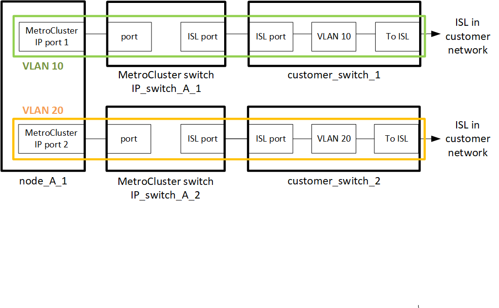
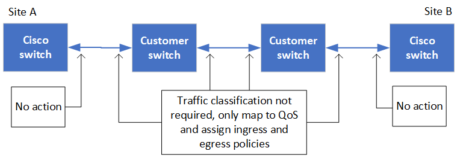
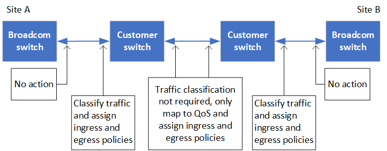

= Considerations when deploying MetroCluster in shared layer 2 or layer 3 networks

:icons: font
:imagesdir: ../media/

[.lead]
Depending on your requirements, you can use shared layer 2 or layer 3 networks to deploy MetroCluster. 

Beginning with ONTAP 9.6, MetroCluster IP configurations with supported Cisco switches can share existing networks for Inter-Switch Links (ISLs) instead of using dedicated MetroCluster ISLs. This topology is known as _shared layer 2 networks_.

Beginning with ONTAP 9.9.1, MetroCluster IP configurations can be implemented with IP-routed (layer 3) backend connections. This topology is known as _shared layer 3 networks_.

[NOTE] 
====
* You must verify that you have adequate network capacity and that the ISL size is appropriate for your configuration. Low latency is critical for replication of data between the MetroCluster sites. Latency issues on these connections can impact client I/O.
* All references to MetroCluster backend switches refer to switches that are NetApp-validated switches or MetroCluster-compliant. See link:overview_isl_requirements.html#metrocluster-switch-requirements[MetroCluster switch requirements] for more details.
====

== ISL requirements for layer 2 and layer 3 networks

The following applies to layer 2 and layer 3 networks:

* The speed and number of ISLs between the MetroCluster switches and the intermediate network switches does not need to match. Similarly, the speed between the intermediate network switches does not need to match.
+
For example, MetroCluster switches can connect using one 40Gbps ISL to the intermediate switches, and the intermediate switches can connect to each other using two 100Gbps ISLs.

* Network monitoring should be configured on the intermediate network to monitor the ISLs for utilization, errors (drops, link flaps, corruption, and so on), and failures.
* The MTU size must be set to 9216 on all ports carrying MetroCluster end-to-end traffic.
* No other traffic can be configured with a higher priority than class of service (COS) 5.
* ECN (explicit congestion notifications) must be configured on all paths carrying end-to-end MetroCluster traffic.
* ISLs carrying MetroCluster traffic must be native links between the switches. 
+
Link sharing services such as Multiprotocol Label Switching (MPLS) links are not supported.
* The layer 2 VLANs must natively span the sites. VLAN overlay such as Virtual Extensible LAN (VXLAN) is not supported.
* The number of intermediate switches is not limited. However, NetApp recommends that you keep the number of switches to the minimum required.
* ISLs on MetroCluster switches are configured with the following:
** Switch port mode 'trunk' as part of an LACP port-channel
** The MTU size is 9216 
** No native VLAN is configured
** Only VLANs carrying cross site MetroCluster traffic are allowed
** The switch default VLAN is not allowed

== Considerations for layer 2 networks

The MetroCluster backend switches are connected to the customer network.

The intermediate customer-provided switches must meet the following requirements:

* The intermediate network must provide the same VLANs between the sites. This must match the MetroCluster VLANs set in the RCF file.
* The RcfFileGenerator does not allow the creation of an RCF file using VLANs that are not supported by the platform.
* The RcfFileGenerator might restrict the use of certain VLAN IDs, for example, if they are intended for future use. Generally, reserved VLANs are up to and including 100.
* Layer 2 VLANs with IDs that match the MetroCluster VLAN IDs must span the shared network. For all platforms listed below,

.VLAN configuration in ONTAP 

You can only specify the VLAN during interface creation. After the MetroCluster interfaces are created, the VLAN ID cannot not be changed. You can configure other VLANs during interface creation but they must be within the range 10/20 or within the range 101 to 4096 (or the number supported by the switch vendor, whichever is the lower number).

NOTE: Some switch vendors might reserve the use of certain VLANs. 

The following systems do not require VLAN configuration within ONTAP. The VLAN is specified by the switch port configuration:

* FAS8200 and AFF A300
* AFF A320
* FAS9000 and AFF A700
* AFF A800, ASA A800, AFF C800 and ASA C800

For all other systems, you must configure the VLAN when you create the MetroCluster interfaces in ONTAP. The following restrictions apply:

* The default VLAN is 10 and 20
* If you are running ONTAP 9.7 or earlier, you can only use the default VLAN 10 and 20.
* If you are running ONTAP 9.8 and later, you can use the default VLAN 10 and 20, and a VLAN over 100 (101 and higher) can also be used.

== Considerations for layer 3 networks

The MetroCluster backend switches are connected to the routed IP network, either directly to routers (as shown in the following simplified example) or through other intervening switches.

image::../media/mcc_layer3_backend.png[]

The MetroCluster environment is configured and cabled as a standard MetroCluster IP configuration as described in link:https://docs.netapp.com/us-en/ontap-metrocluster/install-ip/concept_parts_of_an_ip_mcc_configuration_mcc_ip.html[Configure the MetroCluster hardware components]. When you perform the installation and cabling procedure, you must perform the steps specific to a layer 3 configuration. The following applies to layer 3 configurations:

* MetroCluster switches can be connected directly to the router or to one or more intervening switches.
* MetroCluster IP interfaces can be connected directly to the router or to one of the intervening switches.
* The VLAN must be extended to the gateway device.
* You use the `-gateway parameter` to configure the MetroCluster IP interface address with an IP gateway address.
* The VLAN IDs for the MetroCluster VLANs must be the same at each site. However, the subnets can be different. 
* Dynamic routing is not supported for the MetroCluster traffic.
* The following features are not supported:
** Eight-node MetroCluster configurations
** Refreshing a four-node MetroCluster configuration
** Transition from MetroCluster FC to MetroCluster IP 
* Two subnets are required on each MetroCluster site—one in each network.
* Auto-IP assignment is not supported.

When you configure routers and gateway IP addresses, you must meet the following requirements:

* Two interfaces on one node cannot have the same gateway IP address.
* The corresponding interfaces on the HA pairs on each site must have the same gateway IP address.
* The corresponding interfaces on a node and its DR and AUX partners cannot have the same gateway IP address.
* The corresponding interfaces on a node and its DR and AUX partners must have the same VLAN ID.

== Required settings for intermediate switches

When MetroCluster traffic traverses an ISL in an intermediate network, you should verify that the configuration of the intermediate switches ensures that the MetroCluster traffic (RDMA and storage) meets the required service levels across the entire path between the MetroCluster sites.

The following diagram gives an overview of the required settings when using NetApp validated Cisco switches:

The following diagram gives an overview of the required settings for a shared network when the external switches are Broadcom IP switches.

In this example, the following policies and maps are created for MetroCluster traffic:

* The `MetroClusterIP_ISL_Ingress` policy is applied to ports on the intermediate switch that connects to the MetroCluster IP switches.
+
The `MetroClusterIP_ISL_Ingress` policy maps the incoming tagged traffic to the appropriate queue on the intermediate switch.

* A `MetroClusterIP_ISL_Egress` policy is applied to ports on the intermediate switch that connect to ISLs between intermediate switches.

* You must configure the intermediate switches with matching QoS access-maps, class-maps, and policy-maps along the path between the MetroCluster IP switches. The intermediate switches map RDMA traffic to COS5 and storage traffic to COS4.

The following examples are for Cisco Nexus 3232C and 9336C-FX2 switches. Depending on your switch vendor and model, you must make sure that your intermediate switches have an appropriate configuration.

.Configure the class map for the intermediate switch ISL port

The following example shows the class map definitions depending on whether you need to classify traffic on ingress. This matches the traffic, based on DSCP and COS values, and assigns it to Q4 and Q5 respectively. 

[role="tabbed-block"]
====
.Classify traffic on ingress:
--
----
ip access-list rdma
  10 permit tcp any eq 10006 any
  20 permit tcp any any eq 10006
ip access-list storage
  10 permit tcp any eq 65200 any
  20 permit tcp any any eq 65200

class-map type qos match-all rdma
  match access-group name rdma
class-map type qos match-all storage
  match access-group name storage
----
--
.Do not classify traffic on ingress:
--
----
class-map type qos match-any c5
  match cos 5
  match dscp 40
class-map type qos match-any c4
  match cos 4
  match dscp 32
----
====

.Create an ingress policy map on the ISL port of the intermediate switch:

The following examples show how to create an ingress policy map depending on whether you need to classify traffic on ingress. 

[role="tabbed-block"]
====
.Classify the traffic on ingress:
--
----
policy-map type qos MetroClusterIP_ISL_Ingress_Classify
  class rdma
    set dscp 40
    set cos 5
    set qos-group 5
  class storage
    set dscp 32
    set cos 4
    set qos-group 4
  class class-default
    set qos-group 0
----
--
.Do not match the traffic on ingress:
--
----
policy-map type qos MetroClusterIP_ISL_Ingress_Match
  class c5
    set dscp 40
    set cos 5
    set qos-group 5
  class c4
    set dscp 32
    set cos 4
    set qos-group 4
  class class-default
    set qos-group 0
----
====

.Configure the egress queuing policy for the ISL ports

The following example shows how to configure the egress queuing policy:

----
policy-map type queuing MetroClusterIP_ISL_Egress
   class type queuing c-out-8q-q7
      priority level 1
   class type queuing c-out-8q-q6
      priority level 2
   class type queuing c-out-8q-q5
      priority level 3
      random-detect threshold burst-optimized ecn
   class type queuing c-out-8q-q4
      priority level 4
      random-detect threshold burst-optimized ecn
   class type queuing c-out-8q-q3
      priority level 5
   class type queuing c-out-8q-q2
      priority level 6
   class type queuing c-out-8q-q1
      priority level 7
   class type queuing c-out-8q-q-default
      bandwidth remaining percent 100
      random-detect threshold burst-optimized ecn
----

These settings must be applied on all switches and ISLs carrying MetroCluster traffic.

In this example the Q4 and Q5 are configured with `random-detect threshold burst-optimized ecn`. Depending on your configuration, you might need to set the minimum and maximum thresholds, as shown in the following example:

-----
class type queuing c-out-8q-q5
  priority level 3
  random-detect minimum-threshold 3000 kbytes maximum-threshold 4000 kbytes drop-probability 0 weight 0 ecn
class type queuing c-out-8q-q4
  priority level 4
  random-detect minimum-threshold 2000 kbytes maximum-threshold 3000 kbytes drop-probability 0 weight 0 ecn
-----

NOTE: Minimum and maximum values vary depending on the switch and your requirements.

.Example 1: Cisco
If your configuration has Cisco switches, you do not need to classify on the first ingress port of the intermediate switch. You then configure the following:

*	`class-map type qos match-any c5`
*	`class-map type qos match-any c4`
*	`MetroClusterIP_ISL_Ingress_Match`

You assign the `MetroClusterIP_ISL_Ingress_Match` policy map to the ISL ports carrying MetroCluster traffic.

.Example 2: Broadcom
If your configuration has Broadcom switches, you must classify on the first ingress port of the intermediate switch. You then configure the following:

*	`ip access-list rdma`
*	`ip access-list storage`
*	`class-map type qos match-all rdma`
*	`class-map type qos match-all storage`
*	`MetroClusterIP_ISL_Ingress_Classify`
*	`class-map type qos match-any c5`
*	`class-map type qos match-any c4`
*	`MetroClusterIP_ISL_Ingress_Match`

You assign `the MetroClusterIP_ISL_Ingress_Classify` policy map to the ISL ports on the intermediate switch connecting the Broadcom switch.

You assign the `MetroClusterIP_ISL_Ingress_Match` policy map to the ISL ports on the intermediate switch that is carrying MetroCluster traffic but does not connect the Broadcom switch.
