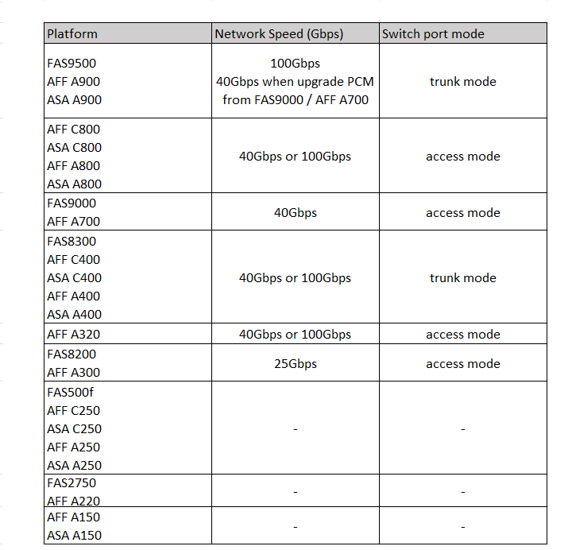

= Platform-specific network speeds and switch port modes for MetroCluster-compliant switches
:icons: font
:imagesdir: ../media/

[.lead]
If you are using MetroCluster compliant switches, you should be aware of the platform-specific network speeds and switch port mode requirements.

The following table provides platform-specific network speeds and switch port modes for MetroCluster-compliant switches. You should configure the switch port mode according to the table.

NOTE: Missing values indicate that the platform cannot be used with a MetroCluster-compliant switch.

// 2023-07-18, burt 1451528/ONTAPDOC-928