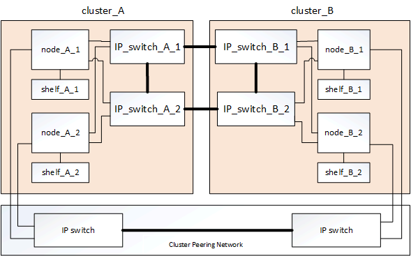
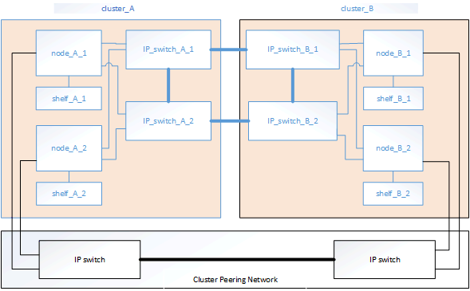

= Parts of a MetroCluster IP configuration
:icons: font
:imagesdir: ../media/

[.lead]
As you plan your MetroCluster IP configuration, you should understand the hardware components and how they interconnect.

== Key hardware elements

A MetroCluster IP configuration includes the following key hardware elements:

* Storage controllers
+
The storage controllers are configured as two two-node clusters.

* IP network
+
This back-end IP network provides connectivity for two distinct uses:

 ** Standard cluster connectivity for intra-cluster communications.
+
This is the same cluster switch functionality used in non-MetroCluster switched ONTAP clusters.

 ** MetroCluster back-end connectivity for replication of storage data and non-volatile cache.

* Cluster peering network
+
The cluster peering network provides connectivity for mirroring of the cluster configuration, which includes storage virtual machine (SVM) configuration. The configuration of all of the SVMs on one cluster is mirrored to the partner cluster.

== Disaster Recovery (DR) groups

A MetroCluster IP configuration consists of one DR group of four nodes.

The following illustration shows the organization of nodes in a four-node MetroCluster configuration:

image::../media/delete_me_mcc_dr_groups_4_node.gif[]

== Illustration of the local HA pairs in a MetroCluster configuration

[.lead]
Each MetroCluster site consists of storage controllers configured as an HA pair. This allows local redundancy so that if one storage controller fails, its local HA partner can take over. Such failures can be handled without a MetroCluster switchover operation.

Local HA failover and giveback operations are performed with the storage failover commands, in the same manner as a non-MetroCluster configuration.

image::../media/delete_me_mcc_ip_hardware_architecture_ha_pairs.gif[]

*Related information*

https://docs.netapp.com/ontap-9/topic/com.netapp.doc.dot-cm-concepts/home.html[ONTAP concepts]

== Illustration of the MetroCluster IP and cluster interconnect network

[.lead]
ONTAP clusters typically include a cluster interconnect network for traffic between the nodes in the cluster. In MetroCluster IP configurations, this network is also used for carrying data replication traffic between the MetroCluster sites.

image::../media/delete_me_mcc_ip_hardware_architecture_ip_interconnect.png[]

Each node in the MetroCluster IP configuration has specialized LIFs for connection to the back-end IP network:

* Two MetroCluster IP interfaces
* One intercluster LIF

The following illustration shows these interfaces. The port usage shown is for an AFF A700 or FAS9000 system.

image::../media/delete_me_mcc_ip_lif_usage.gif[]

*Related information*

link:concept_prepare_for_the_mcc_installation.md#[Considerations for MetroCluster IP configuration]

== Illustration of the cluster peering network

[.lead]
The two clusters in the MetroCluster configuration are peered through a customer-provided cluster peering network. Cluster peering supports the synchronous mirroring of storage virtual machines (SVMs, formerly known as Vservers) between the sites.

Intercluster LIFs must be configured on each node in the MetroCluster configuration, and the clusters must be configured for peering. The ports with the intercluster LIFs are connected to the customer-provided cluster peering network. Replication of the SVM configuration is carried out over this network through the Configuration Replication Service.

*Related information*

http://docs.netapp.com/ontap-9/topic/com.netapp.doc.exp-clus-peer/home.html[Cluster and SVM peering express configuration]

link:concept_prepare_for_the_mcc_installation.md#[Considerations for configuring cluster peering]

link:task_install_and_cable_the_mcc_components.md#[Cabling the cluster peering connections]

link:concept_configure_the_mcc_software_in_ontap.md#[Peering the clusters]
