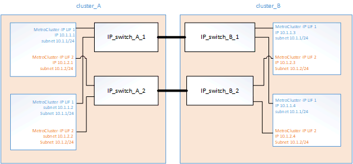
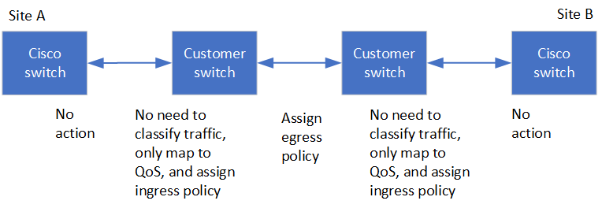
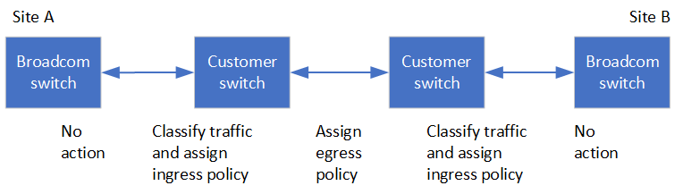
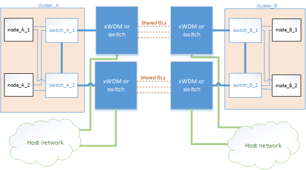
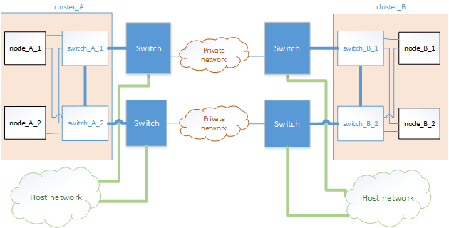
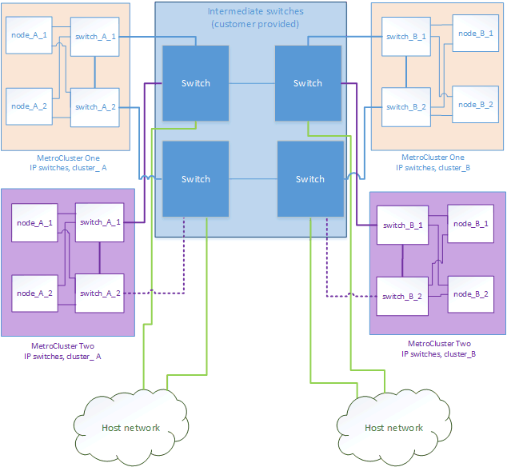
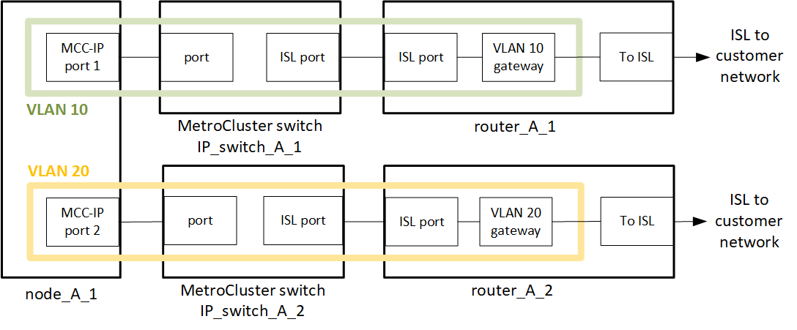

= Preparing for the MetroCluster installation
:icons: font
:imagesdir: ../media/

[.lead]
As you prepare for the MetroCluster installation, you should understand the MetroCluster hardware architecture and required components.

== Differences among the ONTAP MetroCluster configurations

// include reference
include::_include/differences_between_mcc_types.adoc[]
// end include reference

=== Access to remote storage in MetroCluster IP configurations

[.lead]
In MetroCluster IP configurations, the only way the local controllers can reach the remote storage pools is via the remote controllers. The IP switches are connected to the Ethernet ports on the controllers; they do not have direct connections to the disk shelves. If the remote controller is down, the local controllers cannot reach their remote storage pools.

This is different than MetroCluster FC configurations, in which the remote storage pools are connected to the local controllers via the FC fabric or the SAS connections. The local controllers still have access to the remote storage even if the remote controllers are down.

== Considerations for using ONTAP Mediator or MetroCluster Tiebreaker

[.lead]
Starting with ONTAP 9.7, you can use either the ONTAP Mediator-assisted automatic unplanned switchover (MAUSO) in the MetroCluster IP configuration or you can use the MetroCluster Tiebreaker software. Only one of the two services can be used with the MetroCluster IP configuration.

The different MetroCluster configurations perform automatic switchover under different circumstances:

* *MetroCluster FC configurations using the AUSO capability (not present in MetroCluster IP configurations)*
+
In these configurations, AUSO is initiated if controllers fail but the storage (and bridges, if present) remain operational.

* *MetroCluster IP configurations using the ONTAP Mediator service (ONTAP 9.7 and later)*
+
In these configurations, MAUSO is initiated in the same circumstances as AUSO, as described above, and also after a complete site failure (controllers, storage, and switches).
+
NOTE: MAUSO is initiated only if nonvolatile cache mirroring (_DR mirroring_) and SyncMirror plex mirroring is in sync at the time of the failure.

* *MetroCluster IP or FC configurations using the Tiebreaker software in active mode*
+
In these configurations, the Tiebreaker initiates unplanned switchover after a complete site failure.
+
Before using the Tiebreaker software, review the link:../tiebreaker/index.html[MetroCluster Tiebreaker Software Installation and Configuration Guide]

=== Interoperability of ONTAP Mediator with other applications and appliances

[.lead]
You cannot use any third-party applications or appliances that can trigger a switchover in combination with ONTAP Mediator. In addition, monitoring a MetroCluster configuration with MetroCluster Tiebreaker software is not supported when using ONTAP Mediator.

=== How the ONTAP Mediator supports automatic unplanned switchover

[.lead]
The ONTAP Mediator stores state information about the MetroCluster nodes in mailboxes located on the Mediator host. The MetroCluster nodes can use this information to monitor the state of their DR partners and implement a Mediator-assisted automatic unplanned switchover (MAUSO) in the case of a disaster.

When a node detects a site failure requiring a switchover, it takes steps to confirm that the switchover is appropriate and, if so, performs the switchover.

MAUSO is only initiated if both SyncMirror mirroring and DR mirroring of each node's nonvolatile cache is operating and the caches and mirrors are synchronized at the time of the failure.

== Considerations for MetroCluster IP configuration

[.lead]
You should be aware of how the MetroCluster IP addresses and interfaces are implemented in a MetroCluster IP configuration, as well as the associated requirements.

In a MetroCluster IP configuration, replication of storage and nonvolatile cache between the HA pairs and the DR partners is performed over high-bandwidth dedicated links in the MetroCluster IP fabric. iSCSI connections are used for storage replication. The IP switches are also used for all intra-cluster traffic within the local clusters. The MetroCluster traffic is kept separate from the intra-cluster traffic by using separate IP subnets and VLANs. The MetroCluster IP fabric is distinct and different from the cluster peering network.

The MetroCluster IP configuration requires two IP addresses on each node that are reserved for the back-end MetroCluster IP fabric. The reserved IP addresses are assigned to MetroCluster IP logical interfaces (LIFs) during initial configuration, and have the following requirements:

NOTE: You must choose the MetroCluster IP addresses carefully because you cannot change them after initial configuration.

* They must fall in a unique IP range.
+
They must not overlap with any IP space in the environment.

* They must reside in one of two IP subnets that separate them from all other traffic.

For example, the nodes might be configured with the following IP addresses:

[cols=4*,options="header"]
|===
| Node | Interface | IP address | Subnet

a| node_A_1
a| MetroCluster IP interface 1
a| 10.1.1.1
a| 10.1.1/24

a| node_A_1
a| MetroCluster IP interface 2
a| 10.1.2.1
a| 10.1.2/24

a| node_A_2
a| MetroCluster IP interface 1
a| 10.1.1.2
a| 10.1.1/24

a| node_A_2
a| MetroCluster IP interface 2
a| 10.1.2.2
a| 10.1.2/24

a| node_B_1
a| MetroCluster IP interface 1
a| 10.1.1.3
a| 10.1.1/24

a| node_B_1
a| MetroCluster IP interface 2
a| 10.1.2.3
a| 10.1.2/24

a| node_B_2
a| MetroCluster IP interface 1
a| 10.1.1.4
a| 10.1.1/24

a| node_B_2
a| MetroCluster IP interface 2
a| 10.1.2.4
a| 10.1.2/24
|===

=== Characteristics of MetroCluster IP interfaces

The MetroCluster IP interfaces are specific to MetroCluster IP configurations. They have different characteristics from other ONTAP interface types:

* They are created by the `metrocluster configuration-settings interface create` command as part the initial MetroCluster configuration.
+
// 22 APR 2021, BURT 1180776
NOTE: Starting with ONTAP 9.9.1, if you are using a layer 3 configuration, you must also specify the `-gateway` parameter when creating MetroCluster interfaces.

+
They are not created or modified by the network interface commands.

* They do not appear in the output of the `network interface show` command.
* They do not fail over, but remain associated with the port on which they were created.
* MetroCluster IP configurations use specific Ethernet ports (depending on the platform) for the MetroCluster IP interfaces.

== Considerations for automatic drive assignment and ADP systems in ONTAP 9.4 and later

[.lead]
Starting with ONTAP 9.4, MetroCluster IP configurations support new installations with AFF systems using ADP (Advanced Drive Partitioning). In most configurations, partitioning and disk assignment are performed automatically during the initial configuration of the MetroCluster sites.

ONTAP 9.4 and later releases include the following changes for ADP support:

* Pool 0 disk assignments are done at the factory.
* The unmirrored root is created at the factory.
* Data partition assignment is done at the customer site during the setup procedure.
* In most cases, drive assignment and partitioning is done automatically during the setup procedures.

NOTE: When upgrading from ONTAP 9.4 to 9.5, the system recognizes the existing disk assignments.

=== Automatic partitioning

ADP is performed automatically during initial configuration of the platform.

NOTE: Starting with ONTAP 9.5, `disk auto=assignment` must be enabled for automatic partitioning for ADP to occur.

=== How shelf-by-shelf automatic assignment works

If there are four external shelves per site, each shelf is assigned to a different node and different pool, as shown in the following example:

* All of the disks on site_A-shelf_1 are automatically assigned to pool 0 of node_A_1
* All of the disks on site_A-shelf_3 are automatically assigned to pool 0 of node_A_2
* All of the disks on site_B-shelf_1 are automatically assigned to pool 0 of node_B_1
* All of the disks on site_B-shelf_3 are automatically assigned to pool 0 of node_B_2
* All of the disks on site_B-shelf_2 are automatically assigned to pool 1 of node_A_1
* All of the disks on site_B-shelf_4 are automatically assigned to pool 1 of node_A_2
* All of the disks on site_A-shelf_2 are automatically assigned to pool 1 of node_B_1
* All of the disks on site_A-shelf_4 are automatically assigned to pool 1 of node_B_2

=== How to populate partially-full shelves

If your configuration is using shelves that are not fully populated (have empty drive bays) you must distribute the drives evenly throughout the shelf, depending on the disk assignment policy. The disk assignment policy depends on how many shelves are at each MetroCluster site.

If you are using a single shelf at each site (or just the internal shelf on an AFF A800 system), disks are assigned using a quarter-shelf policy. If the shelf is not fully populated,  install the drives equally on all quarters.

The following table shows an example of how to place 24 disks in a 48 drive internal shelf. The ownership for the drives is also shown.

[cols=2*,options="header"]
|===
| The 48 drive bays are divided into four quarters:| Install six drives in the first six bays in each quarter...
a|
Quarter 1: Bays 0 -11
a|
Bays 0-5
a|
Quarter 2: Bays 12-23
a|
Bays 12-17
a|
Quarter 3: Bays 24-35
a|
Bays 24-29
a|
Quarter 4: Bays 36-48
a|
Bays 36-41
|===
If you are using two shelves at each site, disks are assigned using a half-shelf policy. If the shelves are not fully populated, install the drives equally from either end of the shelf.

For example, if you are installing 12 drives in a 24 drive shelf, install drives in bays 0-5 and 18-23.

=== Manual drive assignment (ONTAP 9.5)

In ONTAP 9.5, manual drive assignment is required on systems with the following shelf configurations:

* Three external shelves per site.
+
Two shelves are assigned automatically using a half-shelf assignment policy, but the third shelf must be assigned manually.

* More than four shelves per site and the total number of external shelves is not a multiple of four.
+
Extra shelves above the nearest multiple of four are left unassigned and the drives must be assigned manually. For example, if there are five external shelves at the site, shelf five must be assigned manually.

You only need to manually assign a single drive on each unassigned shelf. The rest of the drives on the shelf are then automatically assigned.

=== Manual drive assignment (ONTAP 9.4)

In ONTAP 9.4, manual drive assignment is required on systems with the following shelf configurations:

* Fewer than four external shelves per site.
+
The drives must be assigned manually to ensure symmetrical assignment of the drives, with each pool having an equal number of drives.

* More than four external shelves per site and the total number of external shelves is not a multiple of four.
+
Extra shelves above the nearest multiple of four are left unassigned and the drives must be assigned manually.

When manually assigning drives, you should assign disks symmetrically, with an equal number of drives assigned to each pool. For example, if the configuration has two storage shelves at each site, you would one shelf to the local HA pair and one shelf to the remote HA pair:

* Assign half of the disks on site_A-shelf_1 to pool 0 of node_A_1.
* Assign half of the disks on site_A-shelf_1 to pool 0 of node_A_2.
* Assign half of the disks on site_A-shelf_2 to pool 1 of node_B_1.
* Assign half of the disks on site_A-shelf_2 to pool 1 of node_B_2.
* Assign half of the disks on site_B-shelf_1 to pool 0 of node_B_1.
* Assign half of the disks on site_B-shelf_1 to pool 0 of node_B_2.
* Assign half of the disks on site_B-shelf_2 to pool 1 of node_A_1.
* Assign half of the disks on site_B-shelf_2 to pool 1 of node_A_2.

=== Adding shelves to an existing configuration.

Automatic drive assignment supports the symmetrical addition of shelves to an existing configuration.

When new shelves are added, the system applies the same assignment policy to newly added shelves. For example, with a single shelf per site, if an additional shelf is added, the systems applies the quarter-shelf assignment rules to the new shelf.

*Related information*

xref:concept_required_mcc_ip_components_and_naming_guidelines_mcc_ip.adoc[Required MetroCluster IP components and naming conventions]

https://docs.netapp.com/ontap-9/topic/com.netapp.doc.dot-cm-psmg/home.html[Disk and aggregate management]

=== ADP and disk assignment differences by system in MetroCluster IP configurations

[.lead]
The operation of Advanced Drive Partitioning (ADP) and automatic disk assignment in MetroCluster IP configurations varies depending on the system model.

NOTE: In systems using ADP, aggregates are created using partitions in which each drive is partitioned in to P1, P2 and P3 partitions. The root aggregate is created using P3 partitions.

You must meet the MetroCluster limits for the maximum number of supported drives and other guidelines.

https://hwu.netapp.com[NetApp Hardware Universe]

==== ADP and disk assignment on AFF A320 systems

[cols=4*,options="header"]
|===
| Guideline| Shelves per site| Drive assignment rules| ADP layout for root partition
a|
Minimum recommended shelves (per site)
a|
Two shelves
a|
The drives on each external shelf are divided into two equal groups (halves). Each half-shelf  is automatically assigned to a separate pool.
a|
One shelf is used by the local HA pair. The second shelf is used by the remote HA pair.

Partitions on each shelf are used to create the root aggregate. Each of the two plexes in the root aggregate includes the following partitions::

* Eight partitions for data
* Two parity partitions
* Two spare partitions

a|
Minimum supported shelves (per site)
a|
One shelf
a|
The drives are divided into four equal groups. Each quarter-shelf is automatically assigned to a separate pool.
a|
Each of the two plexes in the root aggregate includes the following partitions:

* Three partitions for data
* Two parity partitions
* One spare partition

|===

==== ADP and disk assignment on AFF A220 systems

[cols=4*,options="header"]
|===
| Guideline| Shelves per site| Drive assignment rules| ADP layout for root partition
a|
Minimum recommended shelves (per site)
a|
Internal drives only
a|
The internal drives are divided into four equal groups. Each group is automatically assigned to a separate pool and each pool is assigned to a separate controller in the configuration.

NOTE: Half of the internal drives remain unassigned before MetroCluster is configured.

a|
Two quarters are used by the local HA pair. The other two quarters are used by the remote HA pair.

The root aggregate includes the following partitions in each plex:

* Three partitions for data
* Two parity partitions
* One spare partition

a|
Minimum supported shelves (per site)
a|
16 internal drives
a|
The drives are divided into four equal groups. Each quarter-shelf is automatically assigned to a separate pool.

Two quarters on a shelf can have the same pool. The pool is chosen based on the node that owns the quarter:

* If owned by the local node, pool0 is used.
* If owned by the remote node, pool1 is used.

For example: a shelf with quarters Q1 through Q4 can have following assignments:

* Q1: node_A_1 pool0
* Q2: node_A_2 pool0
* Q3: node_B_1 pool1
* Q4:node_B_2 pool1

NOTE: Half of the internal drives remain unassigned before MetroCluster is configured.

a|
Each of the two plexes in the root aggregate includes the following partitions:

* One partition for data
* Two parity partitions
* One spare partition

|===

==== ADP and disk assignment on AFF A250 systems

[cols=4*,options="header"]
|===
| Guideline| Shelves per site| Drive assignment rules| ADP layout for root partition
a|
Minimum recommended shelves (per site)
a|
Two shelves
a|
The drives on each external shelf are divided into two equal groups (halves). Each half-shelf  is automatically assigned to a separate pool.
a|
One shelf is used by the local HA pair. The second shelf is used by the remote HA pair.

Partitions on each shelf are used to create the root aggregate. The root aggregate includes the following partitions in each plex:

* Eight partitions for data
* Two parity partitions
* Two spare partitions

a|
Minimum supported shelves (per site)
a|
24 internal drives only
a|
The drives are divided into four equal groups. Each quarter-shelf is automatically assigned to a separate pool.
a|
Each of the two plexes in the root aggregate includes the following partitions:

* Three partitions for data
* Two parity partitions
* One spare partition

|===

==== ADP and disk assignment on AFF A300 systems

[cols=4*,options="header"]
|===
| Guideline| Shelves per site| Drive assignment rules| ADP layout for root partition
a|
Minimum recommended shelves (per site)
a|
Two shelves
a|
The drives on each external shelf are divided into two equal groups (halves). Each half-shelf  is automatically assigned to a separate pool.
a|
One shelf is used by the local HA pair. The second shelf is used by the remote HA pair.

Partitions on each shelf are used to create the root aggregate. The root aggregate includes the following partitions in each plex:

* Eight partitions for data
* Two parity partitions
* Two spare partitions

a|
Minimum supported shelves (per site)
a|
One shelf
a|
The drives are divided into four equal groups. Each quarter-shelf is automatically assigned to a separate pool.
a|
Each of the two plexes in the root aggregate includes the following partitions:

* Three partitions for data
* Two parity partitions
* One spare partition

|===

==== ADP and disk assignment on AFF A400 systems
// BURT 1384407
[cols=4*,options="header"]
|===
| Guideline| Shelves per site| Drive assignment rules| ADP layout for root partition
a|
Minimum recommended shelves (per site)
a|
Four shelves
a|
Drives are automatically assigned on a shelf-by-shelf basis.
a|
Each of the two plexes in the root aggregate includes:

* 20 partitions for data
* Two parity partitions
* Two spare partitions

a|
Minimum supported shelves (per site)
a|
One shelf
a|
The drives are divided into four equal groups (quarters). Each quarter-shelf is automatically assigned to a separate pool.
a|
Each of the two plexes in the root aggregate includes:

* Three partitions for data
* Two parity partitions
* One spare partition

|===

==== ADP and disk assignment on AFF A700 systems

[cols=4*,options="header"]
|===
| Guideline| Shelves per site| Drive assignment rules| ADP layout for root partition
a|
Minimum recommended shelves (per site)
a|
Four shelves
a|
Drives are automatically assigned on a shelf-by-shelf basis.
a|
Each of the two plexes in the root aggregate includes:

* 20 partitions for data
* Two parity partitions
* Two spare partitions

a|
Minimum supported shelves (per site)
a|
One shelf
a|
The drives are divided into four equal groups (quarters). Each quarter-shelf is automatically assigned to a separate pool.
a|
Each of the two plexes in the root aggregate includes:

* Three partitions for data
* Two parity partitions
* One spare partition

|===

==== ADP and disk assignment on AFF A800 systems

[cols=4*,options="header"]
|===
| Guideline| Shelves per site| Drive assignment rules| ADP layout for root aggregate
a|
Minimum recommended shelves (per site)
a|
Internal drives and four external shelves
a|
The internal partitions are divided into four equal groups (quarters). Each quarter is automatically assigned to a separate pool.The drives on the external shelves are automatically assigned on a shelf-by-shelf basis, with all of the drives on each shelf assigned to  one of the four nodes in the MetroCluster configuration.

a|
The root aggregate is created with 12 root partitions on the internal shelf.

Each of the two plexes in the root aggregate includes:

* Eight partitions for data
* Two parity partitions
* Two spare partitions

a|
Minimum supported shelves (per site)
a|
24 internal drives only
a|
The internal partitions are divided into four equal groups (quarters). Each quarter is automatically assigned to a separate pool.
a|
The root aggregate is created with 12 root partitions on the internal shelf.

Each of the two plexes in the root aggregate includes:

* Three partitions for data
* Two parity partitions
* One spare partitions

|===

==== Disk assignment on FAS2750 systems

[cols=4*,options="header"]
|===
| Guideline| Shelves per site| Drive assignment rules| ADP layout for root partition
a|
Minimum recommended shelves (per site)
a|
One internal and one external shelf
a|
The internal and external shelves are divided into two equal halves. Each half is automatically assigned to different pool
a|
Not applicable.
a|
Minimum supported shelves (per site) (active/passive HA configuration)
a|
Internal drives only
a|
Manual assignment required.
|===

==== Disk assignment on FAS8200 systems

[cols=4*,options="header"]
|===
| Guideline| Shelves per site| Drive assignment rules| ADP layout for root partition
a|
Minimum supported shelves (per site)
a|
Two shelves
a|
The drives on the external shelves are divided into two equal groups (halves). Each half-shelf  is automatically assigned to a separate pool.
a|
Not applicable.
a|
Minimum supported shelves (per site) (active/passive HA configuration)
a|
One shelf
a|
Manual assignment required.
|===

==== Disk assignment on FAS500f systems

[cols=4*,options="header"]
|===
| Guideline| Shelves per site| Drive assignment rules| ADP layout for root partition
a|
Minimum recommended shelves (per site)
a|
Four shelves
a|
Drives are automatically assigned on a shelf-by-shelf basis.
a|
Not applicable.
a|
Minimum supported shelves (per site)
a|
One shelf
a|
The drives are divided into four equal groups. Each quarter-shelf is automatically assigned to a separate pool.
|===

==== Disk assignment on FAS9000 systems

[cols=4*,options="header"]
|===
| Guideline| Shelves per site| Drive assignment rules| ADP layout for root partition
a|
Minimum recommended shelves (per site)
a|
Four shelves
a|
Drives are automatically assigned on a shelf-by-shelf basis.
a|
Not applicable.
a|
Minimum supported shelves (per site)
a|
Two shelves
a|
The drives on the shelves are divided into two equal groups (halves). Each half-shelf is automatically assigned to a separate pool.
a|
Minimum supported shelves (per site) (active/passive HA configuration)
a|
One shelf
a|
Manual assignment required.
|===

== Considerations for using All SAN Array systems in MetroCluster configurations

[.lead]
Some All SAN Arrays (ASAs) are supported in MetroCluster configurations. In the MetroCluster documentation, the information for AFF models applies to the corresponding ASA system. For example, all cabling and other information for the AFF A400 system also applies to the ASA AFF A400 system.

Supported platform configurations are listed in the https://hwu.netapp.com[NetApp Hardware Universe].

== Considerations for configuring cluster peering

[.lead]
Each MetroCluster site is configured as a peer to its partner site. You should be familiar with the prerequisites and guidelines for configuring the peering relationships and when deciding whether to use shared or dedicated ports for those relationships.

*Related information*

http://docs.netapp.com/ontap-9/topic/com.netapp.doc.exp-clus-peer/home.html[Cluster and SVM peering express configuration]

=== Prerequisites for cluster peering

[.lead]
Before you set up cluster peering, you should confirm that the connectivity, port, IP address, subnet, firewall, and cluster-naming requirements are met.

==== Connectivity requirements

Every intercluster LIF on the local cluster must be able to communicate with every intercluster LIF on the remote cluster.

Although it is not required, it is typically simpler to configure the IP addresses used for intercluster LIFs in the same subnet. The IP addresses can reside in the same subnet as data LIFs, or in a different subnet. The subnet used in each cluster must meet the following requirements:

* The subnet must have enough IP addresses available to allocate to one intercluster LIF per node.
+
For example, in a six-node cluster, the subnet used for intercluster communication must have six available IP addresses.

Each node must have an intercluster LIF with an IP address on the intercluster network.

Intercluster LIFs can have an IPv4 address or an IPv6 address.

NOTE: ONTAP 9 enables you to migrate your peering networks from IPv4 to IPv6 by optionally allowing both protocols to be present simultaneously on the intercluster LIFs. In earlier releases, all intercluster relationships for an entire cluster were either IPv4 or IPv6. This meant that changing protocols was a potentially disruptive event.

==== Port requirements

You can use dedicated ports for intercluster communication, or share ports used by the data network. Ports must meet the following requirements:

* All ports that are used to communicate with a given remote cluster must be in the same IPspace.
+
You can use multiple IPspaces to peer with multiple clusters. Pair-wise full-mesh connectivity is required only within an IPspace.

* The broadcast domain that is used for intercluster communication must include at least two ports per node so that intercluster communication can fail over from one port to another port.
+
Ports added to a broadcast domain can be physical network ports, VLANs, or interface groups (ifgrps).

* All ports must be cabled.
* All ports must be in a healthy state.
* The MTU settings of the ports must be consistent.

==== Firewall requirements

Firewalls and the intercluster firewall policy must allow the following protocols:

* ICMP service
* TCP to the IP addresses of all the intercluster LIFs over the ports 10000, 11104, and 11105
* Bidirectional HTTPS between the intercluster LIFs

The default intercluster firewall policy allows access through the HTTPS protocol and from all IP addresses (0.0.0.0/0). You can modify or replace the policy if necessary.

=== Considerations when using dedicated ports

[.lead]
When determining whether using a dedicated port for intercluster replication is the correct intercluster network solution, you should consider configurations and requirements such as LAN type, available WAN bandwidth, replication interval, change rate, and number of ports.

Consider the following aspects of your network to determine whether using a dedicated port is the best intercluster network solution:

* If the amount of available WAN bandwidth is similar to that of the LAN ports and the replication interval is such that replication occurs while regular client activity exists, then you should dedicate Ethernet ports for intercluster replication to avoid contention between replication and the data protocols.
* If the network utilization generated by the data protocols (CIFS, NFS, and iSCSI) is such that the network utilization is above 50 percent, then you should dedicate ports for replication to allow for nondegraded performance if a node failover occurs.
* When physical 10 GbE or faster ports are used for data and replication, you can create VLAN ports for replication and dedicate the logical ports for intercluster replication.
+
The bandwidth of the port is shared between all VLANs and the base port.

* Consider the data change rate and replication interval and whether the amount of data that must be replicated on each interval requires enough bandwidth that it might cause contention with data protocols if sharing data ports.

=== Considerations when sharing data ports

[.lead]
When determining whether sharing a data port for intercluster replication is the correct intercluster network solution, you should consider configurations and requirements such as LAN type, available WAN bandwidth, replication interval, change rate, and number of ports.

Consider the following aspects of your network to determine whether sharing data ports is the best intercluster connectivity solution:

* For a high-speed network, such as a 40-Gigabit Ethernet (40-GbE) network, a sufficient amount of local LAN bandwidth might be available to perform replication on the same 40-GbE ports that are used for data access.
+
In many cases, the available WAN bandwidth is far less than 10 GbE LAN bandwidth.

* All nodes in the cluster might have to replicate data and share the available WAN bandwidth, making data port sharing more acceptable.
* Sharing ports for data and replication eliminates the extra port counts required to dedicate ports for replication.
* The maximum transmission unit (MTU) size of the replication network will be the same size as that used on the data network.
* Consider the data change rate and replication interval and whether the amount of data that must be replicated on each interval requires enough bandwidth that it might cause contention with data protocols if sharing data ports.
* When data ports for intercluster replication are shared, the intercluster LIFs can be migrated to any other intercluster-capable port on the same node to control the specific data port that is used for replication.

== Considerations for ISLs

=== Basic MetroCluster ISL requirements

The following requirements must be met:

* A native-speed ISL switch port must connect to a native-speed ISL switch port.
+
For example, a 40 Gbps port connects to a 40 Gbps port.

* A 10 Gbps port that is in native mode (i.e., not using a breakout cable) can connect to a 10 Gbps port that is in native mode.
* The ISLs between the MetroCluster IP switches and the customer network, as well as the ISLs between the intermediate switches, follow the same rules in terms of speed.
* The number of ISLs that are between the MetroCluster switches and the customer network switches, and the number of ISLs that are between the customer network switches, do not need to match.
+
For example, the MetroCluster switches can connect using two ISLs to the intermediate switches, and the intermediate switches can connect to each other using 10 ISLs.

* The speed of ISLs that are between the MetroCluster switches and the customer network switches, and the speed of ISLs that are between the customer network switches, do not need to match.
+
For example, the MetroCluster switches can connect using a 40-Gbps ISL to the intermediate switches, and the intermediate switches can connect to each other using 100-Gbps ISLs.

* The number of and speed of ISLs connecting each MetroCluster switch to the intermediate switch must be the same on both MetroCluster sites.

== Considerations for sharing private layer 2 networks

[.lead]
Starting with ONTAP 9.6, MetroCluster IP configurations with supported Cisco switches can share existing networks for ISLs, rather than using dedicated MetroCluster ISLs. Earlier ONTAP versions require dedicated ISLs.

MetroCluster IP switches are dedicated to the MetroCluster configuration and cannot be shared. Therefore, a set of MetroCluster IP switches can only connect one MetroCluster configuration. Only the MetroCluster ISL ports on the MetroCluster IP switches can connect to the shared switches.

CAUTION:

If using a shared network, the customer is responsible for meeting the MetroCluster network requirements in the shared network.

=== MetroCluster ISL requirements in shared layer 2 networks

[.lead]
When sharing ISL traffic in a shared network, you must ensure that you have adequate capacity and size the ISLs appropriately. Low latency is critical for replication of data between the MetroCluster sites. Latency issues on these connections can impact client I/O.

You should review these sections to correctly calculate the required end-to-end capacity of the ISLs. Continuous nonvolatile cache and storage replication with low latency is critical for MetroCluster configurations. The latency in the back-end network impacts the latency and throughput seen by client IO.

==== Latency and packet loss limits in the ISLs

The following requirements must be met for round-trip traffic between the MetroCluster IP switches at site_A and site_B, with the MetroCluster configuration in steady state operation:

* Round trip latency must be less than or equal to 7 ms.
+
The maximum distance is 700 km, so the distance between the sites is limited by the latency or the maximum distance, whichever is reached first.
+
As the distance between two MetroCluster sites increases, latency increases, usually in the range of 1 ms round-trip delay time per 100 km (62 miles). This latency also depends on the network service level agreement (SLA) in terms of the bandwidth of the ISL links, packet drop rate, and jitter on the network. Low bandwidth, high jitter, and random packet drops lead to different recovery mechanisms by the switches or the TCP engine on the controller modules for successful packet delivery. These recovery mechanisms can increase overall latency.
+
Any device that contributes to latency must be accounted for.

* Packet loss must be less than or equal to 0.01%.
+
Packet loss includes physical loss or loss due to congestion or over-subscription.
+
Packet drops can cause retransmissions and a reduced congestion window.

* The supported jitter value is 3 ms for round trip (or 1.5 ms for one way).
* The network should allocate and maintain the SLA for the bandwidth required for MetroCluster traffic, accounting for microbursts and spikes in the traffic.
+
Low bandwidth can cause queuing delays and tail drops on switches. If you are using ONTAP 9.7 or later, the network intermediate between the two sites must provide a minimum bandwidth of 4.5 Gbps for the MetroCluster configuration.

* MetroCluster traffic should not consume the complete bandwidth and have negative impact on non-MetroCluster traffic.
* The shared network should have network monitoring configured to monitor the ISLs for utilization, errors (drops, link flaps, corruption, etc.) and failures.

==== Connection limits and trunking in the customer switches

The intermediate customer-provided switches must meet the following requirements:

* The number of intermediate switches is not limited, and more than two switches between the MetroCluster IP switches is supported.
+
The MetroCluster IP switches should be located as close as possible to the intermediate switches providing the long-haul link. All of the ISL connections along the route must meet all of the requirements for MetroCluster ISL.

* The ISLs in the customer network (the ISLs between the customer switches) must be configured in such way that sufficient bandwidth is provided and order of delivery is preserved.
+
This can be done with trunking a sufficient number of links and enforcing load balancing policies to preserve order.

==== Other network requirements

The intermediate customer-provided switches must meet the following requirements:

* The customer network must provide the same VLANs between the sites matching the MetroCluster VLANs as set in the RCF file.
+
Layer 2 VLANs with IDs that match the MetroCluster VLAN IDs must span the shared network.

** In ONTAP 9.7 and earlier, FAS2750 and AFF A220 systems require VLAN 10 and 20.
** In ONTAP 9.8 and later, FAS2750, AFF A220, FAS500f, AFF A250, FAS8300, AFF A400, and FAS8700 systems use VLAN 10 and 20 by default. You can configure other VLANs during interface creation, and they must be withing the range 101-4096.
For all the platforms mentioned previously, you can only specify the VLAN during interface creation. Once the MetroCluster interfaces are created, the VLAN ID cannot not be changed. For all other platforms not mentioned previously, you can use any VLAN and you can change the VLAN ID for those platforms at any time, but it requires that a new RCF file is created and applied.

NOTE: The RcfFileGenerator does not allow the creation of an RCF file using VLANs that are not supported by the platform.

NOTE: The RcfFileGenerator might restrict the use of certain VLAN IDs (for example, if they are intended for future use). Generally, reserved VLANs are up to and including 100.

* The MTU size must be set to 9216 on all devices in the end-to-end network.
* No other traffic can be configured with a higher priority than class of service (COS) five.
* ECN (explicit congestion notification) must be configured on all end-to-end paths.

=== ISL cabling requirements

[.lead]
When using shared ISLs in a MetroCluster IP configuration, you must be aware of the requirements for the end-to-end MetroCluster ISL running from controller ports on site A to controller ports on site B.

NOTE: You must follow the basic ISL requirements: xref:concept_prepare_for_the_mcc_installation.html#considerations-for-isls[Considerations for ISLs]

==== Number of ISLs and breakout cables in the shared network

The number of ISLs connecting the MetroCluster IP switches to the shared network varies depending on the switch model and port type.

[cols=3*,options="header"]
|===
| MetroCluster IP switch model | Port type | Number of ISLs

a| Broadcom-supported BES-53248 switches
a| Native ports
a| 4 ISLs using 10 or 25-Gbps ports

a| Cisco 3132Q-V
a| Native ports
a| 6 ISLs using 40-Gbps ports

a| Cisco 3132Q-V
a| Breakout cables
a| 16 x 10-Gbps ISLs

a| Cisco 3232C
a| Native ports
a| 6 ISLs using 40 or 100-Gbps ports

a| Cisco 3232C
a| Breakout cables
a| 16 x 10-Gbps ISLs
|===

* The use of breakout cables (one physical port is used as 4 x 10 Gbps ports) is supported on Cisco switches.
* The RCF files for the IP switches have ports in native and breakout mode configured.
+
A mix of ISL ports in native port speed mode and breakout mode is not supported. All ISLs from the MetroCluster IP switches to the intermediate switches in one network must be of same speed and length.

* The use of external encryption devices (for example, external link encryption or encryption provided via WDM devices) are supported as long as the round-trip latency remains within the above requirements.

For optimum performance, you should use at least a 1 x 40 Gbps or multiple 10 Gbps ISLs per network. Using a single 10 Gbps ISL per network for AFF A800 systems is strongly discouraged.

The maximum theoretical throughput of shared ISLs (for example, 240 Gbps with six 40 Gbps ISLs) is a best-case scenario. When using multiple ISLs, statistical load balancing can impact the maximum throughput. Uneven balancing can occur and reduce throughput to that of a single ISL.

If the configuration uses L2 VLANs, they must natively span the sites. VLAN overlay such as Virtual Extensible LAN (VXLAN) is not supported.

ISLs carrying MetroCluster traffic must be native links between the switches. Link sharing services such as Multiprotocol Label Switching (MPLS) links are not supported.

==== Support for WAN ISLs on the Broadcom BES53248 switch

* Minimum number of WAN ISLs per fabric: 1 (10 GbE, or 25 GbE, or 40 GbE, or 100 GbE)
* Maximum number of 10-GbE WAN ISLs per fabric: 4
* Maximum number of 25-GbE WAN ISLs per fabric: 4
* Maximum number of 40-GbE WAN ISLs per fabric: 2
* Maximum number of 100-GbE WAN ISLs per fabric: 2

A 40-GbE or 100-GbE WAN ISL requires an RCF file version 1.40 or higher.

NOTE: Extra licenses are required for additional ports.

=== Required settings on intermediate switches

[.lead]
When sharing ISL traffic in a shared network, the configuration of the intermediate switches provided by the customer must ensure that the MetroCluster traffic (RDMA and storage) meets the required service levels across the entire path between the MetroCluster sites.

The following examples are for Cisco Nexus 3000 switches and IP Broadcom switches. Depending on your switch vendor and models, you must ensure that your intermediate switches have an equivalent configuration.

==== Cisco Nexus switches

The following diagram gives an overview of the required settings for a shared network when the external switches are Cisco switches.

In this example, the following policies and maps are created for MetroCluster traffic:

* A MetroClusterIP_Ingress policy is applied to ports on the intermediate switch that connect to the MetroCluster IP switches.
+
The MetroClusterIP_Ingress policy maps the incoming tagged traffic to the appropriate queue on the intermediate switch. Tagging happens on the node-port, not on the ISL. Non-MetroCluster traffic that is using the same ports on the ISL remains in the default queue.

* A MetroClusterIP_Egress policy is applied to ports on the intermediate switch that connect to ISLs between intermediate switches

You must configure the intermediate switches with matching QoS access-maps, class-maps, and policy-maps along the path between the MetroCluster IP switches. The intermediate switches map RDMA traffic to COS5 and storage traffic to COS4.

The following example shows the configuration for a customer-provided Cisco Nexus 3000 switch. If you have Cisco switches, you can use the example to configure the switch along the path without much difficulty. If you do not have Cisco switches, you must determine and apply the equivalent configuration to your intermediate switches.

The following example shows the class map definitions:

NOTE: This example is for configurations using Cisco MetroCluster IP switches. You can follow this example regardless of the switch types of the switches carrying MetroCluster traffic that do not connect to a MetroCluster IP switch.

----
class-map type qos match-all rdma
   match cos 5
class-map type qos match-all storage
   match cos 4
----

The following example shows the policy map definitions:

----
policy-map type qos MetroClusterIP_Ingress
   class rdma
      set dscp 40
      set cos 5
      set qos-group 5
   class storage
      set dscp 32
      set cos 4
      set qos-group 4
policy-map type queuing MetroClusterIP_Egress
   class type queuing c-out-8q-q7
      priority level 1
   class type queuing c-out-8q-q6
      priority level 2
   class type queuing c-out-8q-q5
      priority level 3
      random-detect threshold burst-optimized ecn
   class type queuing c-out-8q-q4
      priority level 4
      random-detect threshold burst-optimized ecn
   class type queuing c-out-8q-q3
      priority level 5
   class type queuing c-out-8q-q2
      priority level 6
   class type queuing c-out-8q-q1
      priority level 7
   class type queuing c-out-8q-q-default
      bandwidth remaining percent 100
      random-detect threshold burst-optimized ecn
----

==== MetroCluster IP Broadcom switches

The following diagram gives an overview of the required settings for a shared network when the external switches are IP Broadcom switches.

Configurations using MetroCluster IP Broadcom switches require additional configuration:

* For exterior switches you must configure the access and class maps to classify the traffic on ingress to the customer network.

NOTE: This is not required on configurations using MetroCluster IP switches.

The following example shows how to configure the access and class maps on the first and last customer switches connecting the ISLs between the MetroCluster IP Broadcom switches.

----
ip access-list storage
  10 permit tcp any eq 65200 any
  20 permit tcp any any eq 65200
ip access-list rdma
  10 permit tcp any eq 10006 any
  20 permit tcp any any eq 10006

class-map type qos match-all storage
  match access-group name storage
class-map type qos match-all rdma
  match access-group name rdma
----

* You need to assign the ingress policy to the ISL switch port on the first customer switch.

The following example shows the class map definitions:

NOTE: This example is for configurations using Cisco MetroCluster IP switches. You can follow this example regardless of the switch types of the switches carrying MetroCluster traffic that do not connect to a MetroCluster IP switch.

----
class-map type qos match-all rdma
   match cos 5
class-map type qos match-all storage
   match cos 4
----

The following example shows the policy map definitions:

----
policy-map type qos MetroClusterIP_Ingress
   class rdma
      set dscp 40
      set cos 5
      set qos-group 5
   class storage
      set dscp 32
      set cos 4
      set qos-group 4
policy-map type queuing MetroClusterIP_Egress
   class type queuing c-out-8q-q7
      priority level 1
   class type queuing c-out-8q-q6
      priority level 2
   class type queuing c-out-8q-q5
      priority level 3
      random-detect threshold burst-optimized ecn
   class type queuing c-out-8q-q4
      priority level 4
      random-detect threshold burst-optimized ecn
   class type queuing c-out-8q-q3
      priority level 5
   class type queuing c-out-8q-q2
      priority level 6
   class type queuing c-out-8q-q1
      priority level 7
   class type queuing c-out-8q-q-default
      bandwidth remaining percent 100
      random-detect threshold burst-optimized ecn
----

==== Intermediate customer switches

* For intermediate customer switches, you must assign the egress policy to the ISL switch ports.
* For all other interior switches along the path that carry MetroCluster traffic, follow the class map and policy map examples in the section _Cisco Nexus 3000 switches_.

=== Examples of MetroCluster network topologies

[.lead]
Starting with ONTAP 9.6, some shared ISL network configurations are supported for MetroCluster IP configurations.

==== Shared network configuration with direct links

In this topology, two distinct sites are connected by direct links. These links can be between Wavelength Division Multiplexing equipment (xWDM) or switches. The capacity of the ISLs is not dedicated to the MetroCluster traffic but is shared with other traffic.

The ISL capacity must meet the minimum requirements. Depending on whether you use xWDM devices or switches a different combination of network configurations might apply.

==== Shared infrastructure with intermediate networks

In this topology, the MetroCluster IP core switch traffic and the host traffic travel through a network that is not provided by NetApp. The network infrastructure and the links (including leased direct links) are outside of the MetroCluster configuration. The network can consist of a series of xWDM and switches but unlike the shared configuration with direct ISLs, the links are not direct between the sites. Depending on the infrastructure between the sites, any combination of network configurations is possible. The intermediate infrastructure is represented as a "`cloud`" (multiple devices can exist between the sites), but it is still under the control of the customer. Capacity through this intermediate infrastructure is not dedicated to the MetroCluster traffic but is shared with other traffic.

The VLAN and network xWDM or switch configuration must meet the minimum requirements.

==== Two MetroCluster configurations sharing an intermediate network

In this topology, two separate MetroCluster configurations are sharing the same intermediate network. In the example, MetroCluster one switch_A_1 and MetroCluster two switch_A_1 both connect to the same intermediate switch.

The example is simplified for illustration purposes only:

==== Two MetroCluster configurations with one connecting directly to the intermediate network

This topology is supported beginning with ONTAP 9.7. Two separate MetroCluster configurations share the same intermediate network and one MetroCluster configuration's nodes is directly connected to the intermediate switch.

MetroCluster One is a MetroCluster configuration using NetApp validated switches, ONTAP 9.6 and a shared topology. MetroCluster Two is a MetroCluster configuration using NetApp compliant switches and ONTAP 9.7.

NOTE: The intermediate switches must be compliant with NetApp specifications.

The example is simplified for illustration purposes only:

image::../media/delete_me_mcc_ip_unsupported_two_mccs_direct_to_shared_switches.png[]

== Considerations for layer 3 wide-area networks

Starting with ONTAP 9.9.1, MetroCluster IP configurations can be implemented with IP-routed (layer 3) backend connections.

The MetroCluster backend switches are connected to the routed IP network, as shown in the following simplified example:

The MetroCluster environment is configured and cabled as a standard MetroCluster IP configuration as described in link:task_install_and_cable_the_mcc_components.html[Install and cable the MetroCluster components].  When you perform the installation and cabling procedure, use the steps labeled for a layer 3 network.  The steps that are specific to layer 3 include:

*	Cabling the MetroCluster switches to the routed IP network to provide the ISLs. The MetroCluster switches can be connected directly to the router or to one or more intervening switches. The VLAN must be extended to the gateway device.

*	Using the `-gateway` parameter to configure the MetroCluster IP (MCC-IP) interface address with an IP gateway address.

The switches can be NetApp-validated or MetroCluster-compliant switches (for detailed descriptions, refer to <<Considerations for using MetroCluster compliant switches>>).

*	*NetApp-compliant* switches are listed in the cabling section and supported by the RCF generator.

*	*MetroCluster-compliant* switches are not validated by NetApp, but they meet the requirements in Considers for using MetroCluster-compliant switches.

The MetroCluster VLANs must extend from the edge MetroCluster switch to the gateway router so that MetroCluster traffic reaches the gateway (refer to the diagram shown above).   The VLAN IDs for the MetroCluster VLANs must be the same at each site.  However, the subnets can be different.

You use the RCF files that are created by the RcfFileGenerator tool.  The network between the MetroCluster nodes and the gateway router must provide the same VLAN IDs as set in the RCF file.

=== IP-routed network requirements

The IP-routed network must meet the following requirements:

*	All the ISL requirements that are described in xref:concept_prepare_for_the_mcc_installation.html#metrocluster-isl-requirements-in-shared-networks[MetroCluster ISL requirements in shared networks] must be met, including the requirements for VLAN IDs.

*	All the intermediate switches must meet the requirements that are described in xref:concept_prepare_for_the_mcc_installation.html#required-settings-on-intermediate-switches[Required settings on intermediate switches].

*	Dynamic routing is not supported for the MetroCluster traffic.

*	Only four-node MetroCluster configurations are supported (two nodes at each site).

*	Two subnets are required on each MetroCluster site—one in each network.

*	Auto-IP assignment is not supported.

== Considerations for using MetroCluster compliant switches

[.lead]
MetroCluster IP switches provided by NetApp are NetApp validated. Beginning with ONTAP 9.7, MetroCluster IP configurations can support switches that are not NetApp validated provided that they are compliant with NetApp specifications.

=== General requirements

The requirements show how to configure MetroCluster compliant switches without using reference configuration (RCF) files.

* Only platforms that provide dedicated ports for switchless cluster interconnects are supported. Platforms such as FAS2750 and AFF A220 are not supported because MetroCluster traffic and MetroCluster interconnect traffic share the same network ports.
+
Connecting local cluster connections to a MetroCluster compliant switch is not supported.

* The MetroCluster IP interface can be connected to any switch port that can be configured to meet the requirements.
* The speed of the switch ports must be 25 Gbps for FAS8200 and AFF A300 platforms, and at least 40 Gbps for all other platforms (40 Gbps or 100 Gbps).
* The ISLs must be 10 Gbps or higher and must be sized appropriately for the load on the MetroCluster configuration.
* The MetroCluster configuration must be connected to two networks. Connecting both the MetroCluster interfaces to the same network or switch is not supported. Each MetroCluster node must be connected to two network switches.
* The network must meet the requirements as outlined in the sections xref:concept_prepare_for_the_mcc_installation.html#metrocluster-isl-requirements-in-shared-networks[MetroCluster ISL requirements in shared networks], xref:concept_prepare_for_the_mcc_installation.html#isl-cabling-requirements[ISL cabling requirements], and xref:concept_prepare_for_the_mcc_installation.html#required-settings-on-intermediate-switches[Required settings on intermediate switches].
* In MetroCluster IP configurations using open networks, reverting to ONTAP 9.6 or earlier is not supported.
* The MTU of 9216 must be configured on all switches that carry MetroCluster IP traffic.

=== Switch and cabling requirements

* The switches must support QoS/traffic classification.
* The switches must support explicit congestion notification (ECN).
* The switches must support L4 port-vlan load-balancing policies to preserve order along the path.
* The switches must support L2 Flow Control (L2FC).
* The cables connecting the nodes to the switches must be purchased from NetApp. The cables we provide must be supported by the switch vendor.

=== Limitations

Any configuration or feature that requires that the local cluster connections are connected to a switch is not supported. For example, the following configurations and procedures are not supported:

* Eight-node MetroCluster configurations
* Transitioning from MetroCluster FC to MetroCluster IP configurations
* Refreshing a four-node MetroCluster IP configuration

=== Platform-specific network speeds for MetroCluster-compliant switches

The following table provides platform-specific network speeds for MetroCluster compliant switches.

NOTE: Missing values indicate that the platform is not supported.

[cols=2*,options="header"]
|===
| Platform| Network Speed (Gbps)
a|
AFF A800
a|
40 or 100
a|
AFF A700
a|
40
a|
AFF A400
a|
100
a|
AFF A320
a|
100
a|
AFF A300
a|
25
a|
AFF A250
a|
-
a|
AFF A220
a|
-
a|
FAS9000
a|
40
a|
FAS8700
a|
100
a|
FAS8300
a|
100
a|
FAS8200
a|
25
a|
FAS2750
a|
-
a|
FAS500f
a|
-
|===

=== Assumptions for the examples

The examples provided are valid for Cisco NX31xx and NX32xx switches. If other switches are used, these commands can be used as guidance, but the commands might be different. If a feature shown in the examples is not available on the switch, this means that the switch does not meet the minimum requirements and cannot be used to deploy a MetroCluster configuration. This is true for any switch that is connecting a MetroCluster configuration and for all switches on the path between those switches.

* The ISL ports are 15 and 16 and operate at a speed of 40 Gbps.
* The VLAN in network 1 is 10 and the VLAN in network 2 is 20. Examples might be shown for one network only.
* The MetroCluster interface is connected to port 9 on each switch and operates at a speed of 100 Gbps.
* The full context of the examples is not set or shown. You might need to enter further configuration information such as the profile, VLAN, or interface, to execute the commands.

=== Generic switch configuration

A VLAN in each network must be configured. The example shows how to configure a VLAN in network 10.

Example:

----
# vlan 10
----

The load balancing policy should be set so that order is preserved.

Example:

----
# port-channel load-balance src-dst ip-l4port-vlan
----

You must configure the access and class maps, which map the RDMA and iSCSI traffic to the appropriate classes.

All TCP traffic to and from the port 65200 is mapped to the storage (iSCSI) class. All TCP traffic to and from the port 10006 is mapped to the RDMA class.

Example:

----

ip access-list storage
  10 permit tcp any eq 65200 any
  20 permit tcp any any eq 65200
ip access-list rdma
  10 permit tcp any eq 10006 any
  20 permit tcp any any eq 10006

class-map type qos match-all storage
  match access-group name storage
class-map type qos match-all rdma
  match access-group name rdma
----

You must configure the ingress policy. The ingress policy maps the traffic as classified to the different COS groups. In this example, the RDMA traffic is mapped to COS group 5 and iSCSI traffic is mapped to COS group 4.

Example:

----

policy-map type qos MetroClusterIP_Ingress
class rdma
  set dscp 40
  set cos 5
  set qos-group 5
class storage
  set dscp 32
  set cos 4
  set qos-group 4
----

You must configure the egress policy on the switch. The egress policy maps the traffic to the egress queues. In this example, RDMA traffic is mapped to queue 5 and iSCSI traffic is mapped to queue 4.

Example:

----

policy-map type queuing MetroClusterIP_Egress
class type queuing c-out-8q-q7
  priority level 1
class type queuing c-out-8q-q6
  priority level 2
class type queuing c-out-8q-q5
  priority level 3
  random-detect threshold burst-optimized ecn
class type queuing c-out-8q-q4
  priority level 4
  random-detect threshold burst-optimized ecn
class type queuing c-out-8q-q3
  priority level 5
class type queuing c-out-8q-q2
  priority level 6
class type queuing c-out-8q-q1
  priority level 7
class type queuing c-out-8q-q-default
  bandwidth remaining percent 100
  random-detect threshold burst-optimized ecn
----

You need to configure a switch that has MetroCluster traffic on an ISL but does not connect to any MetroCluster interfaces. In this case, the traffic is already classified and only needs to be mapped to the appropriate queue. In the following example, all of the COS5 traffic is mapped to the class RDMA, and all of the COS4 traffic is mapped to the class iSCSI. Note that this will affect *all* of the COS5 and COS4 traffic, not only the MetroCluster traffic. If you only want to map the MetroCluster traffic, then you must use the above class maps to identify the traffic using the access groups.

Example:

----

class-map type qos match-all rdma
  match cos 5
class-map type qos match-all storage
  match cos 4
----

=== Configuring the ISLs

You can configure a 'trunk' mode port when setting an allowed VLAN.

There are two commands, one to *set* the allowed VLAN list, and one to *add* to the existing allowed VLAN list.

You can *set* the allowed VLANs as shown in the example.

Example:

----
switchport trunk allowed vlan 10
----

You can *add* a VLAN to the allowed list as shown in the example.

Example:

----
switchport trunk allowed vlan add 10
----

In the example, port-channel 10 is configured for VLAN 10.

Example:

----

interface port-channel10
switchport mode trunk
switchport trunk allowed vlan 10
mtu 9216
service-policy type queuing output MetroClusterIP_Egress
----

The ISL ports should be configured as part of a port-channel and be assigned the egress queues as shown in the example.

Example:

----

interface eth1/15-16
switchport mode trunk
switchport trunk allowed vlan 10
no lldp transmit
no lldp receive
mtu 9216
channel-group 10 mode active
service-policy type queuing output MetroClusterIP_Egress
no shutdown
----

=== Configuring the node ports

You might need to configure the node port in breakout mode. In this example, ports 25 and 26 are configured in 4 x 25 Gbps breakout mode.

Example:

----
interface breakout module 1 port 25-26 map 25g-4x
----

You might need to configure the MetroCluster interface port speed. The example shows how to configure the speed to "auto".

Example:

----
speed auto
----

The following example shows how to fix the speed at 40 Gbps.

Example:

----
speed 40000
----

You might need to configure the interface. In the following example, the interface speed is set to "auto".

The port is in access mode in VLAN 10, MTU is set to 9216 and the MetroCluster ingress policy is assigned.

Example:

----

interface eth1/9
description MetroCluster-IP Node Port
speed auto
switchport access vlan 10
spanning-tree port type edge
spanning-tree bpduguard enable
mtu 9216
flowcontrol receive on
flowcontrol send on
service-policy type qos input MetroClusterIP_Ingress
no shutdown
----

On 25-Gbps ports, the FEC setting might need to be set to "off" as shown in the example.

Example:

----
fec off
----

NOTE: You must always run this command *after* the interface is configured. A transceiver module might need to be inserted for the command to work.

== Considerations for using virtual IP and Border Gateway Protocol with a MetroCluster configuration

[.lead]
Starting with ONTAP 9.5, ONTAP supports layer 3 connectivity using virtual IP (VIP) and Border Gateway Protocol (BGP). The combination VIP and BGP for redundancy in the front-end networking with the back-end MetroCluster redundancy provides a layer 3 disaster recovery solution.

Review the following guidelines and illustration when planning your layer 3 solution. For details on implementing VIP and BGP in ONTAP, refer to the following section:

http://docs.netapp.com/ontap-9/topic/com.netapp.doc.dot-cm-nmg/GUID-A8EF6D34-1717-4813-BBFA-AA33E104CF6F.html[*Configuring virtual IP (VIP) LIFs*]

image::../media/vip_and_bgp_in_metrocluster_2.png[]

=== ONTAP limitations

ONTAP does not automatically verify that all nodes on both sites of the MetroCluster configuration are configured with BGP peering.

ONTAP does not perform route aggregation but announces all individual virtual LIF IPs as unique host routes at all times.

ONTAP does not support true AnyCast -- only a single node in the cluster presents a specific virtual LIF IP (but is accepted by all physical interfaces, regardless of whether they are BGP LIFs, provided the physical port is part of the correct IPspace). Different LIFs can migrate independently of each other to different hosting nodes.

=== Guidelines for using this Layer 3 solution with a MetroCluster configuration

You must configure your BGP and VIP correctly to provide the required redundancy.

Simpler deployment scenarios are preferred over more complex architectures (for example, a BGP peering router is reachable across an intermediate, non-BGP router). However, ONTAP does not enforce network design or topology restrictions.

VIP LIFs only cover the frontend/data network.

Depending on your version of ONTAP, you must configure BGP peering LIFs in the node SVM, not the system or data SVM. In 9.8, the BGP LIFs are visible in the cluster (system) SVM and the node SVMs are no longer present.

Each data SVM requires the configuration of all potential first hop gateway addresses (typically, the BGP router peering IP address), so that the return data path is available if a LIF migration or MetroCluster failover occurs.

BGP LIFs are node specific, similar to intercluster LIFs -- each node has a unique configuration, which does not need to be replicated to DR site nodes.

configured, the existence of the v0a (v0b and so on.) continuously validates the connectivity, guaranteeing that a LIF migrate or failover succeeds (unlike L2, where a broken configuration is only visible after the outage).

A major architectural difference is that clients should no longer share the same IP subnet as the VIP of data SVMs. An L3 router with appropriate enterprise grade resiliency and redundancy features enabled (for example, VRRP/HSRP) should be on the path between storage and clients for the VIP to operate correctly.

The reliable update process of BGP allows for smoother LIF migrations because they are marginally faster and have a lower chance of interruption to some clients

You can configure BGP to detect some classes of network or switch misbehaviors faster than LACP, if configured accordingly.

External BGP (EBGP) uses different AS numbers between ONTAP node(s) and peering routers and is the preferred deployment to ease route aggregation and redistribution on the routers. Internal BGP (IBGP) and the use of route reflectors is not impossible but outside the scope of a straightforward VIP setup.

After deployment, you must check that the data SVM is accessible when the associated virtual LIF is migrated between all nodes on each site (including MetroCluster switchover) to verify the correct configuration of the static routes to the same data SVM.

VIP works for most IP-based protocols (NFS, SMB, iSCSI).

== Considerations for using TDM/xWDM and encryption equipment with MetroCluster IP configurations

[.lead]
You should be aware of certain considerations for using multiplexing equipment in the MetroCluster IP configuration.

These considerations apply only to direct, dedicated MetroCluster back-end links and switches, not links shared with non-MetroCluster traffic.

The Hardware Universe tool provides some notes about the requirements that TDM/xWDM equipment must meet to work with a MetroCluster IP configuration.

https://hwu.netapp.com[NetApp Hardware Universe]

=== Using encryption on WDM or external encryption devices

When using encryption on WDM devices in the MetroCluster IP configuration, your environment must meet the following requirements:

* The external encryption devices or DWDM equipment must have been certified by the vendor with the switch in question.
+
The certification should cover the operating mode (such as trunking and encryption).

* The overall end-to-end latency and jitter, including the encryption, cannot be above the maximum stated in the IMT or in this document.

=== SFP considerations

Any SFPs or QSFPs supported by the equipment vendor are supported for the MetroCluster ISLs. SFPs and QSFPs can be acquired from NetApp or the equipment vendor.

=== Considerations for ISLs

The ISLs on one fabric should all be the same speed and length.

The ISLs on one fabric should all have the same topology. For example, they should all be direct links, or if the configuration uses WDM, then they should all use WDM.

If you are sharing ISLs with a non-MetroCluster network, you must follow the guidelines in the section xref:concept_prepare_for_the_mcc_installation.html#considerations-for-sharing-private-layer-2-networks[Considerations for sharing private layer 2 networks].

The maximum supported difference in distance between fabric 1 and fabric 2 is 20 km.

== Considerations when using unmirrored aggregates

[.lead]
If your configuration includes unmirrored aggregates, you must be aware of potential access issues after switchover operations.

=== Considerations for unmirrored aggregates when doing maintenance requiring power shutdown

If you are performing negotiated switchover for maintenance reasons requiring site-wide power shutdown, you should first manually take offline any unmirrored aggregates owned by the disaster site.

If you do not, nodes at the surviving site might go down due to multi-disk panics. This could occur if switched-over unmirrored aggregates go offline or are missing because of the loss of connectivity to storage at the disaster site due to the power shutdown or a loss of ISLs.

=== Considerations for unmirrored aggregates and hierarchical namespaces

If you are using hierarchical namespaces, you should configure the junction path so that all of the volumes in that path are either on mirrored aggregates only or on unmirrored aggregates only. Configuring a mix of unmirrored and mirrored aggregates in the junction path might prevent access to the unmirrored aggregates after the switchover operation.

=== Considerations for unmirrored aggregates and CRS metadata volume and data SVM root volumes

The configuration replication service (CRS) metadata volume and data SVM root volumes must be on a mirrored aggregate. You cannot move these volumes to unmirrored aggregate. If they are on unmirrored aggregate, negotiated switchover and switchback operations are vetoed. The metrocluster check command provides a warning if this is the case.

=== Considerations for unmirrored aggregates and SVMs

SVMs should be configured on mirrored aggregates only or on unmirrored aggregates only. Configuring a mix of unmirrored and mirrored aggregates can result in a switchover operation that exceeds 120 seconds and result in a data outage if the unmirrored aggregates do not come online.

=== Considerations for unmirrored aggregates and SAN

A LUN should not be located on an unmirrored aggregate. Configuring a LUN on an unmirrored aggregate can result in a switchover operation that exceeds 120 seconds and a data outage.

=== Considerations for adding storage shelves for unmirrored aggregates

NOTE: If you are adding shelves that will be used for unmirrored aggregates in a MetroCluster IP configuration, you must do the following:

. Before starting the procedure to add the shelves, issue the following command: `metrocluster modify -enable-unmirrored-aggr-deployment true`
. Verify that automatic disk assignment is off: `disk option show`
. Follow the steps of the procedure to add the shelf.
. Manually assign all disks from new shelf to the node that will own the unmirrored aggregate or aggregates.
. Create the aggregates using the storage aggregate create command. .
. After completing the procedure, issue the following command: `metrocluster modify -enable-unmirrored-aggr-deployment false`
. Verify that automatic disk assignment is enabled: `disk option show`

== Considerations for firewall usage at MetroCluster sites

[.lead]
If you are using a firewall at a MetroCluster site, you must ensure access for certain required ports.

The following table shows TCP/UDP port usage in an external firewall positioned between two MetroCluster sites.

[cols=2*,options="header"]
|===
| Traffic type| Port/services
a|
Cluster peering
a|
11104 / TCP

11105 / TCP

a|
ONTAP System Manager
a|
443 / TCP
a|
MetroCluster IP intercluster LIFs
a|
65200 / TCP

10006 / TCP and UDP

a|
Hardware assist
a|
4444 / TCP
|===

== Preconfigured settings for new MetroCluster systems from the factory

[.lead]
New MetroCluster nodes are preconfigured with a root aggregate. Additional hardware and software settings are configured using the detailed procedures provided in this guide.

=== Hardware racking and cabling

Depending on the configuration you ordered, you might need to rack the systems and complete the cabling.

=== Software configuration of the MetroCluster configuration

Nodes received with the new MetroCluster configuration are preconfigured with a single root aggregate. Additional configuration must be performed using the detailed procedures provided in this guide.

=== Hardware setup checklist

[.lead]
You need to know which hardware setup steps were completed at the factory and which steps you need to complete at each MetroCluster site.

[cols=3*,options="header"]
|===
| Step| Completed at factory| Completed by you
a|
Mount components in one or more cabinets.
a|
Yes
a|
No
a|
Position cabinets in the desired location.
a|
No
a|
YesPosition them in the original order so that the supplied cables are long enough.

a|
Connect multiple cabinets to each other, if applicable.
a|
No
a|
YesUse the cabinet interconnect kit if it is included in the order. The kit box is labeled.

a|
Secure the cabinets to the floor, if applicable.
a|
No
a|
YesUse the universal bolt-down kit if it is included in the order. The kit box is labeled.

a|
Cable the components within the cabinet.
a|
YesCables 5 meters and longer are removed for shipping and placed in the accessories box.

a|
No
a|
Connect the cables between cabinets, if applicable.
a|
No
a|
YesCables are in the accessories box.

a|
Connect management cables to the customer's network.
a|
No
a|
YesConnect them directly or through the CN1601 management switches, if present.

IMPORTANT: To avoid address conflicts, do not connect management ports to the customer's network until after you change the default IP addresses to the customer's values.

a|
Connect console ports to the customer's terminal server, if applicable.
a|
No
a|
Yes
a|
Connect the customer's data cables to the cluster.
a|
No
a|
Yes
a|
Connect the cabinets to power and power on the components.
a|
No
a|
YesPower them on in the following order:

. PDUs
. Disk shelves
. Nodes

a|
Assign IP addresses to the management ports of the cluster switches and to the management ports of the management switches, if present.
a|
No
a|
Yes Connect to the serial console port of each switch and log in with user name "`admin`" with no password.

Suggested management addresses are 10.10.10.81, 10.10.10.82, 10.10.10.83, and 10.10.10.84.

a|
Verify cabling by running the Config Advisor tool.
a|
No
a|
Yes
|===
//2021-04-21 1374268
