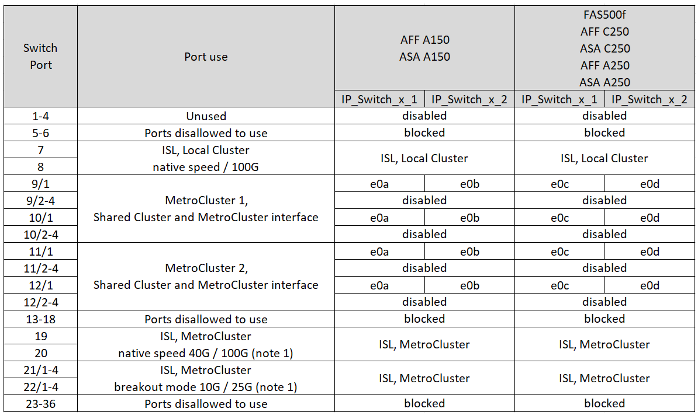
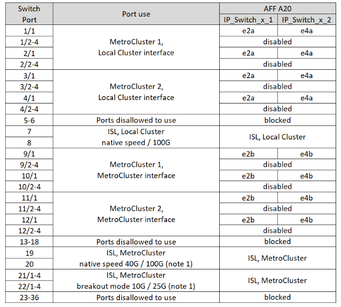
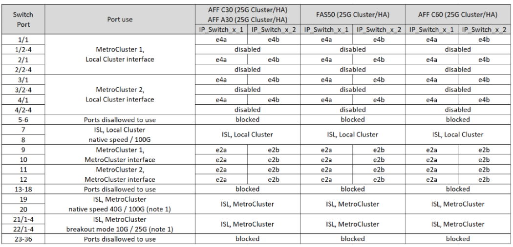
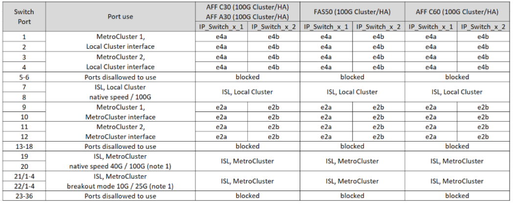
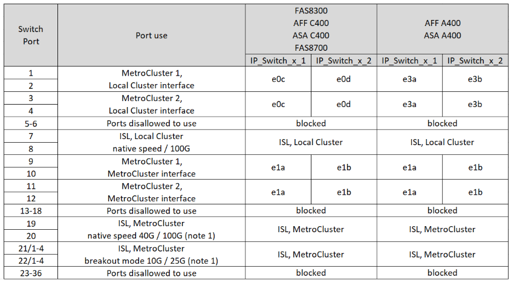
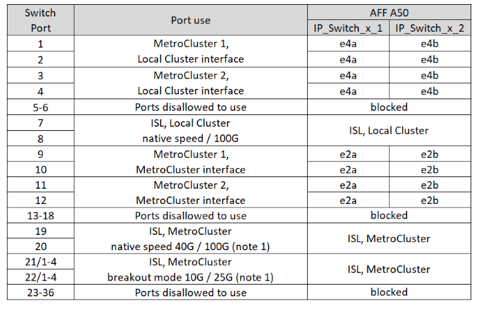
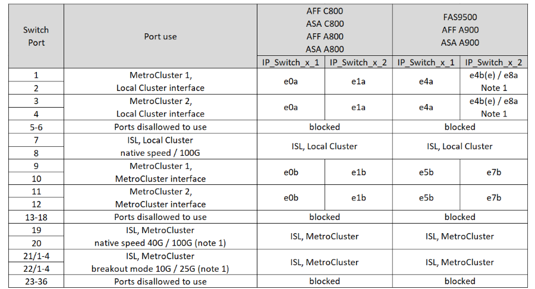
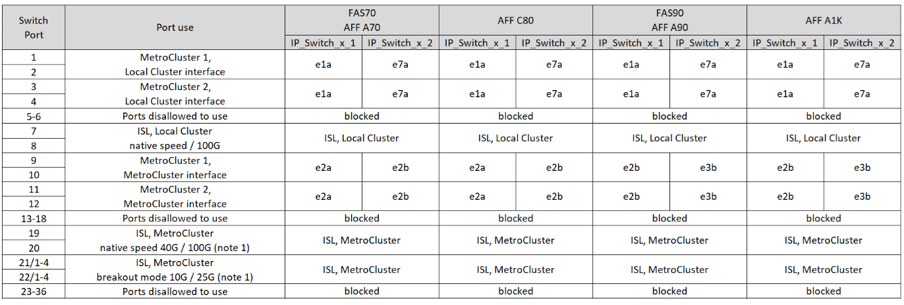

= Platform port assignments for 12-port Cisco 9336C-FX2 switches 
:icons: font
:imagesdir: ../media/

[.lead]
The port usage in a MetroCluster IP configuration depends on the switch model and platform type.

Review the following considerations before using the configuration tables:

* The tables in this section are for 12-port Cisco 9336C-FX2 switches.
+
If you have a 36-port Cisco 9336C-FX2 switch, use the tables in link:port_usage_3232c_9336c.html[Platform port assignments for Cisco 3232C or 36-port Cisco 9336C-FX2 switches].
+
If you have a 36-port Cisco 9336C-FX2 switch and at least one MetroCluster configuration or DR group is connecting NS224 shelves to the MetroCluster switch, use the tables in  link:port_usage_9336c_shared.html[Platform port assignments for a 36-port Cisco 9336C-FX2 switch connecting NS224 storage].
* The following tables show the port usage for site A. The same cabling is used for site B.
* The switches cannot be configured with ports of different speeds (for example, a mix of 100 Gbps ports and 40 Gbps ports).
* If you are configuring a single MetroCluster with the switches, use the *MetroCluster 1* port group.
+
Keep track of the MetroCluster port group (MetroCluster 1, MetroCluster 2). You'll need it when using the RcfFileGenerator tool as described later in this configuration procedure.

* The RcfFileGenerator for MetroCluster IP also provides a per-port cabling overview for each switch.

== Choose the correct cabling table for your configuration

Use the following table to determine which cabling table you should follow. 

[cols=2*,options="header",cols="25,75"]
|===
| If your system is...
| Use this cabling table...
|
AFF A150, ASA A150

FAS500f,

AFF C250, ASA C250

AFF A250, ASA A250 | <<table_1_cisco_12port_9336c,Cisco 9336C-FX2 12-port platform port assignments (group 1)>>
|
AFF A20| <<table_2_cisco_12port_9336c,Cisco 9336C-FX2 12-port platform port assignments (group 2)>>
|
AFF A30, AFF C30

FAS50 

AFF C60
a|
The table you follow depends on whether you are using a 25G (group 3a) or 100G (group 3b) Ethernet card. 

 * <<table_3a_cisco_12port_9336c,Cisco 9336C-FX2 12-port platform port assignments (group 3a - 25G)>> 
 * <<table_3b_cisco_12port_9336c,Cisco 9336C-FX2 12-port platform port assignments (group 3b - 100G)>>
| 
FAS8300, AFF C400, ASA C400, FAS8700

AFF A400, ASA A400 | <<table_4_cisco_12port_9336c,Cisco 9336C-FX2 12-port platform port assignments (group 4)>>
| AFF A50| <<table_5_cisco_12port_9336c,Cisco 9336C-FX2 12-port platform port assignments (group 5)>>
| 

AFF C800, ASA C800, AFF A800, ASA A800

FAS9500, AFF A900, ASA A900 | <<table_6_cisco_12port_9336c,Cisco 9336C-FX2 12-port platform port assignments (group 6)>>
|
FAS70, AFF A70

AFF C80

FAS90, AFF A90

AFF A1K

 | <<table_7_cisco_12port_9336c,Cisco 9336C-FX2 12-port platform port assignments (group 7)>>
|===

[[table_1_cisco_12port_9336c]]
.Cisco 9336C-FX2 12-port platform port assignments (group 1)

Review the platform port assignments to cable an AFF A150, ASA A150, FAS500f, AFF C250, ASA C250, AFF A250, or ASA A250 system to a 12-port Cisco 9336C-FX2 switch:

*Note 1:* You can only configure either ports 19 and 20 *or* ports 21 and 22. If you use ports 19 and 20, then ports 21 and 22 are blocked. If you use ports 21 and 22, then ports 19 and 20 are blocked.

[[table_2_cisco_12port_9336c]]
.Cisco 9336C-FX2 12-port platform port assignments (group 2)

Review the platform port assignments to cable an AFF A20 system to a 12-port Cisco 9336C-FX2 switch:

*Note 1:* You can only configure either ports 19 and 20 *or* ports 21 and 22. If you use ports 19 and 20, then ports 21 and 22 are blocked. If you use ports 21 and 22, then ports 19 and 20 are blocked.

[[table_3a_cisco_12port_9336c]]
.Cisco 9336C-FX2 12-port platform port assignments (group 3a)

Review the platform port assignments to cable an AFF A30, AFF C30, AFF C60, or FAS50 system to a 12-port Cisco 9336C-FX2 switch using a four-port 25G Ethernet card.

NOTE: This configuration requires a four-port 25G Ethernet card in slot 4 to connect the local cluster and HA interfaces.

*Note 1:* You can only configure either ports 19 and 20 *or* ports 21 and 22. If you use ports 19 and 20, then ports 21 and 22 are blocked. If you use ports 21 and 22, then ports 19 and 20 are blocked.

[[table_3b_cisco_12port_9336c]]
.Cisco 9336C-FX2 12-port platform port assignments (group 3b)

Review the platform port assignments to cable an AFF A30, AFF C30, AFF C60, or FAS50 system to a 12-port Cisco 9336C-FX2 switch using a two-port 100G Ethernet card.

NOTE: This configuration requires a two-port 100G Ethernet card in slot 4 to connect the local cluster and HA interfaces.

 
*Note 1:* You can only configure either ports 19 and 20 *or* ports 21 and 22. If you use ports 19 and 20, then ports 21 and 22 are blocked. If you use ports 21 and 22, then ports 19 and 20 are blocked.

[[table_4_cisco_12port_9336c]]
.Cisco 9336C-FX2 12-port platform port assignments (group 4)

Review the platform port assignments to cable an  FAS8300, AFF C400, ASA C400, FAS8700, AFF A400, or ASA A400 system to a 12-port Cisco 9336C-FX2 switch:

*Note 1:* You can only configure either ports 19 and 20 *or* ports 21 and 22. If you use ports 19 and 20, then ports 21 and 22 are blocked. If you use ports 21 and 22, then ports 19 and 20 are blocked.

[[table_5_cisco_12port_9336c]]
.Cisco 9336C-FX2 12-port platform port assignments (group 5)

Review the platform port assignments to cable an AFF A50 system to a 12-port Cisco 9336C-FX2 switch:

*Note 1:* You can only configure either ports 19 and 20 *or* ports 21 and 22. If you use ports 19 and 20, then ports 21 and 22 are blocked. If you use ports 21 and 22, then ports 19 and 20 are blocked.

[[table_6_cisco_12port_9336c]]
.Cisco 9336C-FX2 12-port platform port assignments (group 6)

Review the platform port assignments to cable an AFF C800, ASA C800, AFF A800, ASA A800, FAS9500, AFF A900, or ASA A900 system to a 12-port Cisco 9336C-FX2 switch:

*Note 1:* You can only configure either ports 19 and 20 *or* ports 21 and 22. If you use ports 19 and 20, then ports 21 and 22 are blocked. If you use ports 21 and 22, then ports 19 and 20 are blocked.

*Note 2:* Use either ports e4a and e4e or e4a and e8a if you are using an X91440A adapter (40Gbps). Use either ports e4a and e4b or e4a and e8a if you are using an X91153A adapter (100Gbps).

[[table_7_cisco_12port_9336c]]
.Cisco 9336C-FX2 12-port platform port assignments (group 7)

Review the platform port assignments to cable an AFF A70, FAS70, AFF C80, FAS90, AFF A90, or AFF A1K system to a 12-port Cisco 9336C-FX2 switch:

*Note 1:* You can only configure either ports 19 and 20 *or* ports 21 and 22. If you use ports 19 and 20, then ports 21 and 22 are blocked. If you use ports 21 and 22, then ports 19 and 20 are blocked.

// 2025 Feb 13, ONTAPDOC-2386
// 2024 Dec 09, ONTAPDOC-2349
// 2024 Jun 07, ONTAPDOC-1734 
// 2023 Oct 25, ONTAPDOC-1201
// 2023 Apr 28, change Cisco 9336C-FX2-FX2 table
// BURT 1501501 Sept 7th, 2022
// 2023-MAR-9, BURT 1533595 (new C-Series platforms)

