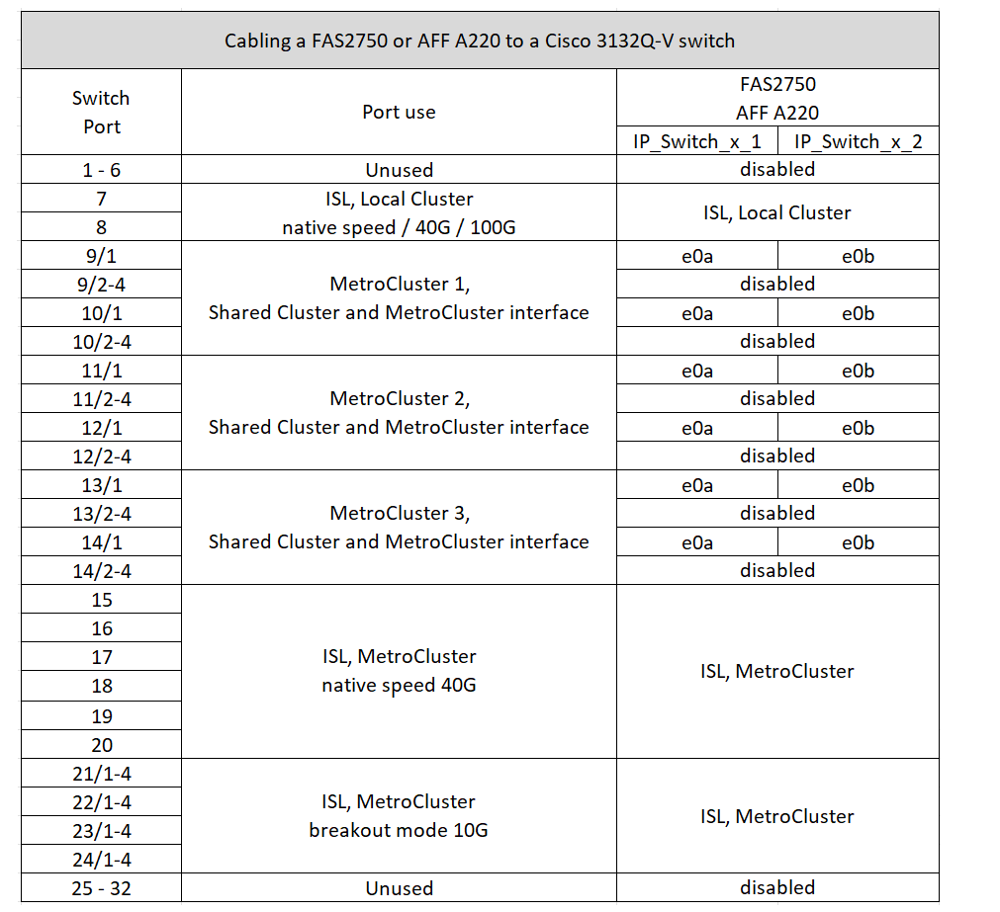
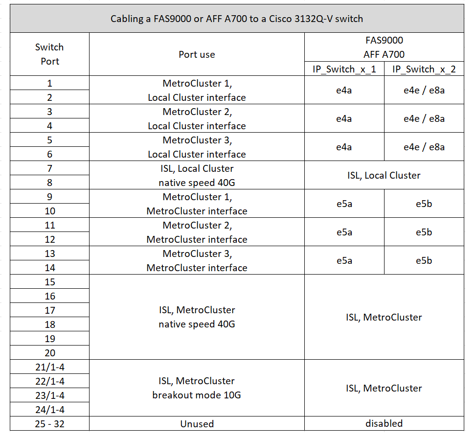
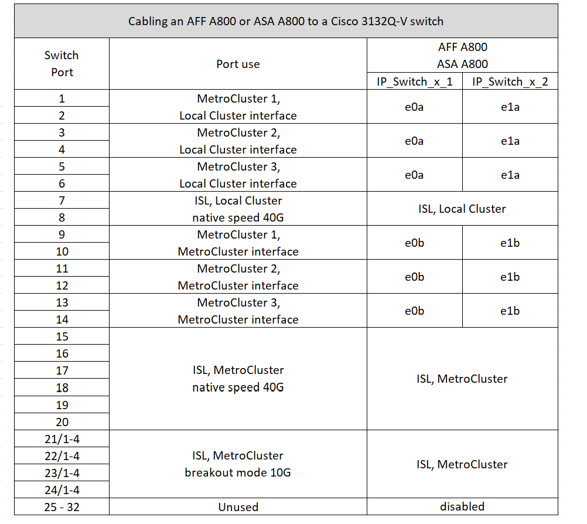

= Platform port assignments for Cisco 3132Q-V switches
:icons: font
:imagesdir: ../media/

[.lead]
The port usage in a MetroCluster IP configuration depends on the switch model and platform type.

Review these guidelines before using the tables:

* If you configure the switch for MetroCluster FC to IP transition, port 5, port 6, port 13, or port 14 can be used to connect the local cluster interfaces of the MetroCluster FC node. Refer to the link:https://mysupport.netapp.com/site/tools/tool-eula/rcffilegenerator[RcfFileGenerator^] and the generated cabling files for more details on cabling this configuration. For all other connections, you can use the port usage assignments listed in the tables.

== Choose the correct cabling table for your configuration

Use the following table to determine which cabling table you should follow. 

[cols=2*,options="header"]
|===
| If your system is...
| Use this cabling table...
a|
FAS2750, AFF A220 | <<table_1_cisco_3132q,Table 1: Cisco 3132Q-V platform port assignments>>
| FAS9000, AFF A700 | <<table_2_cisco_3132q,Table 2: Cisco 3132Q-V platform port assignments>>
| AFF A800, ASA A800 | <<table_3_cisco_3132q,Table 3: Cisco 3132Q-V platform port assignments>>

|===

[[table_1_cisco_3132q]]
.Table 1: Cisco 3132Q-V platform port assignments

Review the platform port assignments to cable a FAS2750 or AFF A220 system to a Cisco 3132Q-V switch:

[[table_2_cisco_3132q]]
.Table 2: Cisco 3132Q-V platform port assignments

Review the platform port assignments to cable a FAS9000 or AFF A700 system to a Cisco 3132Q-V switch:

[[table_3_cisco_3132q]]
.Table 3: Cisco 3132Q-V platform port assignments

Review the platform port assignments to cable a AFF A800 or ASA A800 system to a Cisco 3132Q-V switch:

// 2024 Jun 07, ONTAPDOC-1734 
// 2023 Oct 25, ONTAPDOC-1201