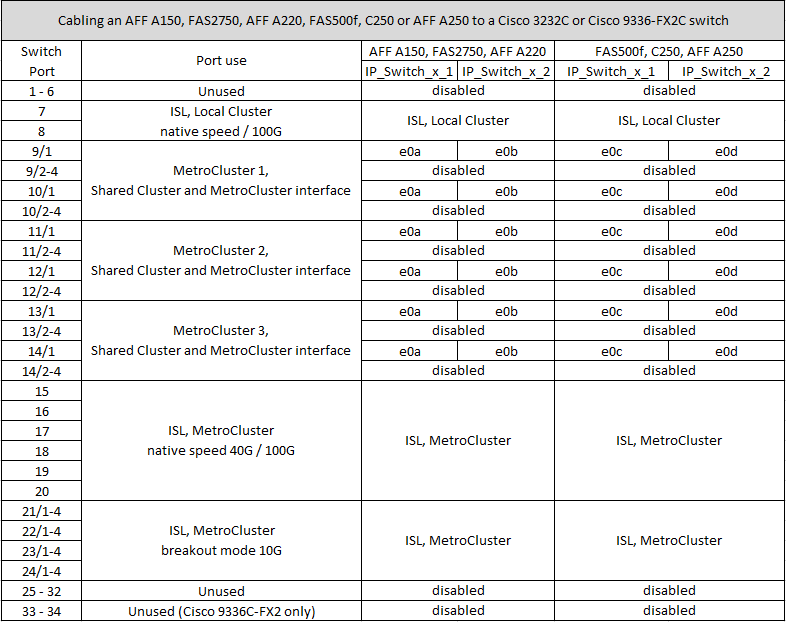
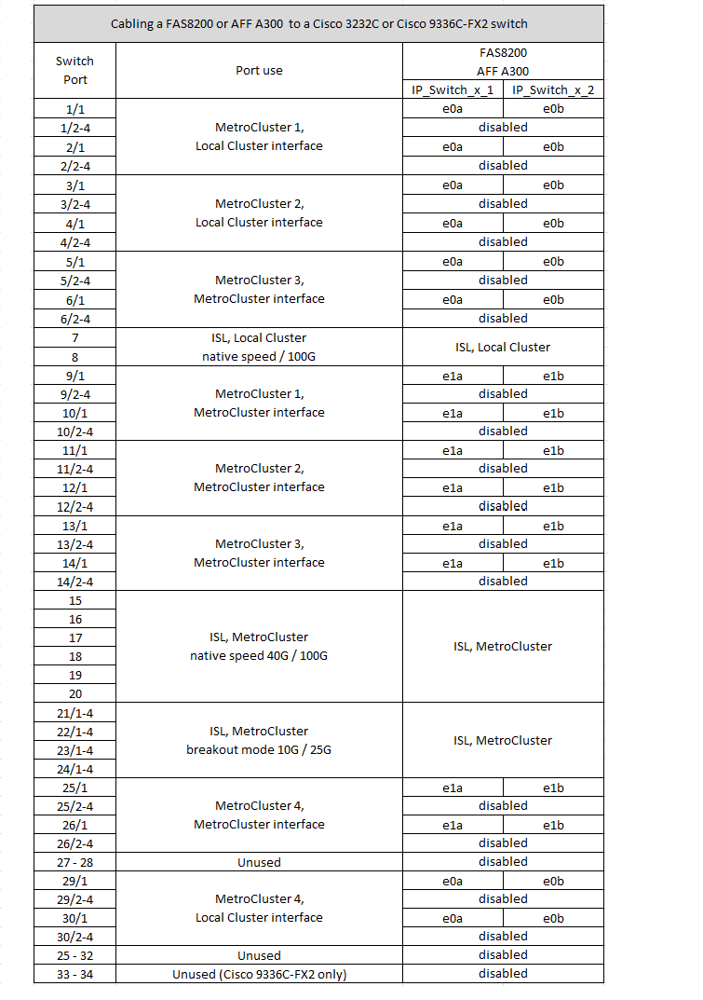
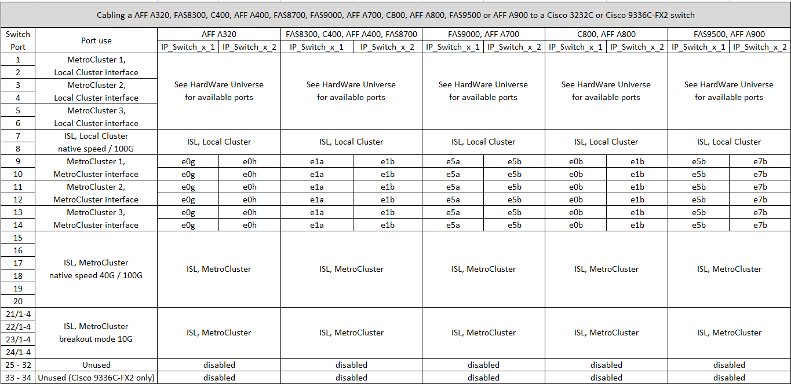

= Platform port assignments for Cisco 3232C or Cisco 9336C switches
:icons: font
:imagesdir: ../media/

[.lead]
The port usage in a MetroCluster IP configuration depends on the switch model and platform type.

Review these considerations before using the tables:

* The following tables show the port usage for site A. The same cabling is used for site B.
* The switches cannot be configured with ports of different speeds (for example, a mix of 100 Gbps ports and 40 Gbps ports).
* If you are configuring a single MetroCluster with the switches, use the *MetroCluster 1* port group.
+
Keep track of the MetroCluster port group (MetroCluster 1, MetroCluster 2, MetroCluster 3, or MetroCluster 4). You will need it when using the RcfFileGenerator tool as described later in this configuration procedure.

* The RcfFileGenerator for MetroCluster IP also provides a per-port cabling overview for each switch.
+
Use this cabling overview to verify your cabling.

* RCF file version v2.10 or later is required for 25G breakout mode for MetroCluster ISLs. 
* ONTAP 9.13.1 or later and RCF file version 2.00 is required to use a platform other than FAS8200 or AFF a300 in the "MetroCluster 4" group. 

== Cabling two MetroCluster configurations to the switches

When cabling more than one MetroCluster configuration to a Cisco 3132Q-V switch, you must cable each MetroCluster according to the appropriate table. For example, if cabling a FAS2750 and an AFF A700 to the same Cisco 3132Q-V switch. Then you cable the FAS2750 as per "MetroCluster 1" in Table 1, and the AFF A700 as per "MetroCluster 2" or "MetroCluster 3" in Table 2. You cannot physically cable both the FAS2750 and the AFF A700 as "MetroCluster 1".

== Cabling an AFF A150, ASA A150, FAS2750, AFF A220, FAS500f, AFF C250, ASA C250, AFF A250, or ASA A250 system to a Cisco 3232C or Cisco 9336-FX2C switch

== Cabling a FAS8200 or an AFF A300 system to a Cisco 3232C or Cisco 9336C switch

If you are upgrading from older RCF files, the cabling configuration might be using ports in the "MetroCluster 4" group (ports 25/26 and 29/30). 

== Cabling an AFF A320, FAS8300, AFF C400, ASA C400, AFF A400, ASA A400, FAS8700, FAS9000, AFF A700, AFF C800, ASA C800, AFF A800, ASA A800, FAS9500, AFF A900, or ASA A900 system to a Cisco 3232C or Cisco 9336C-FX2 switch

*Note 1*: If you are using an X91440A adapter (40Gbps), then use either ports e4a and e4e or e4a and e8a. If you are an X91153A adapter(100Gbps), then use either ports e4a and e4b or e4a and e8a.

Using ports in the "MetroCluster 4" group requires ONTAP 9.13.1 or later.

// 2023 Oct 25, ONTAPDOC-1201
// 2023 Apr 28, change Cisco 9336C-FX2 table
// BURT 1501501 Sept 7th, 2022
// 2023-MAR-9, BURT 1533595 (new C-Series platforms)

