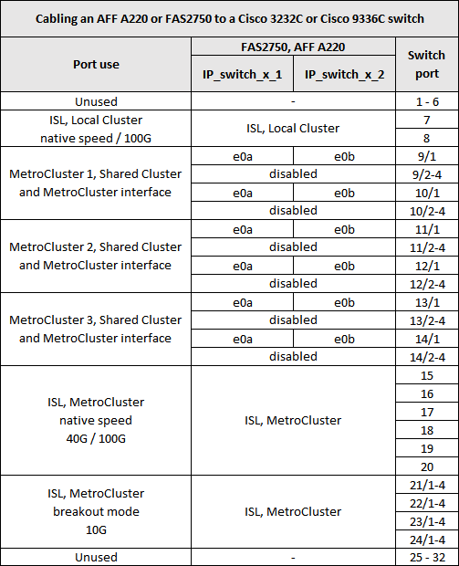
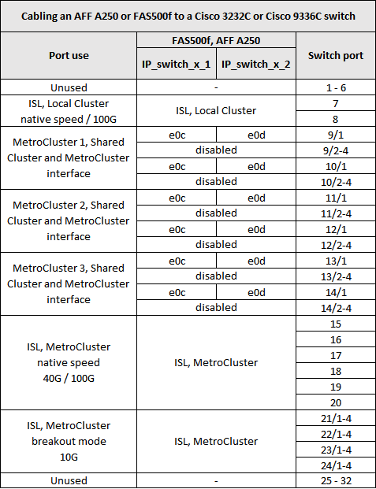
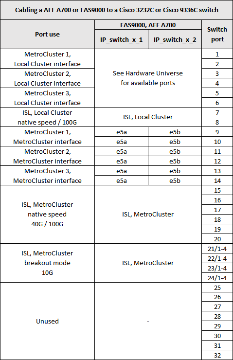
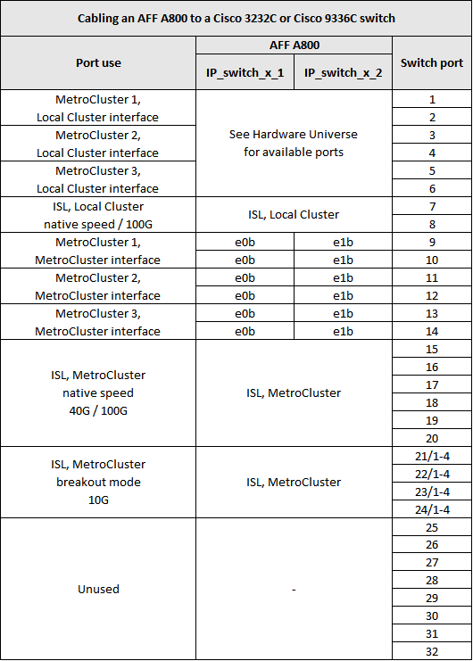
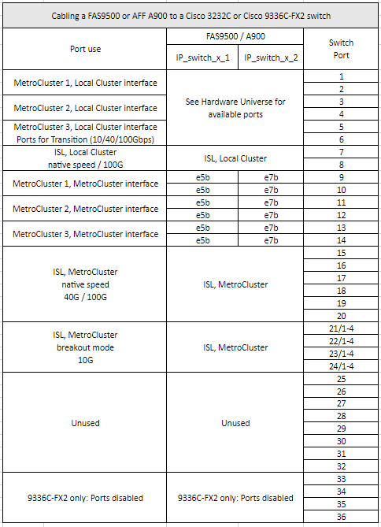
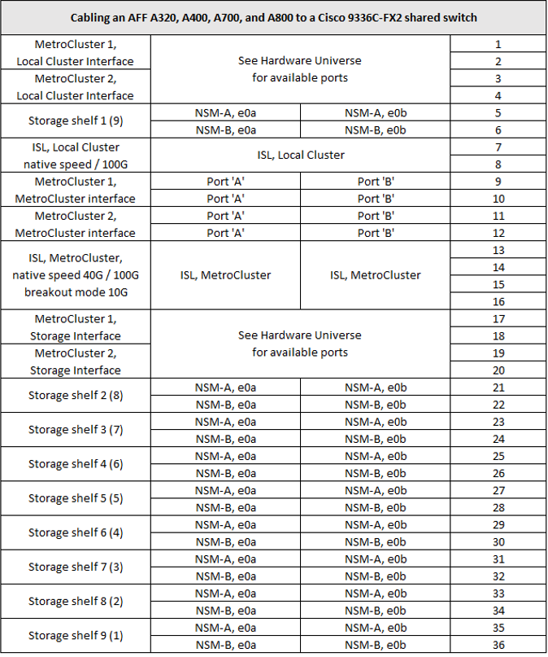
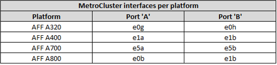

= Platform port assignments for Cisco 3232C or Cisco 9336C switches
:icons: font
:imagesdir: ../media/

[.lead]
The port usage in a MetroCluster IP configuration depends on the switch model and platform type.

Review these considerations before using the tables:

* The following tables show the port usage for site A. The same cabling is used for site B.
* The switches cannot be configured with ports of different speeds (for example, a mix of 100 Gbps ports and 40 Gbps ports).
* If you are configuring a single MetroCluster with the switches, use the *MetroCluster 1* port group.
+
Keep track of the MetroCluster port group (MetroCluster 1, MetroCluster 2, or MetroCluster 3). You will need it when using the RcfFileGenerator tool as described later in this configuration procedure.

* The RcfFileGenerator for MetroCluster IP also provides a per-port cabling overview for each switch.
+
Use this cabling overview to verify your cabling.

== Cabling two MetroCluster configurations to the switches

When cabling more than one MetroCluster configuration to a Cisco 3132Q-V switch, then cable each MetroCluster according to the appropriate table. For example, if cabling a FAS2750 and an A700 to the same Cisco 3132Q-V switch. Then you cable the FAS2750 as per 'MetroCluster 1' in Table 1, and the A700 as per 'MetroCluster 2' or 'MetroCluster 3' in Table 2. You cannot physically cable both the FAS2750 and A700 as 'MetroCluster 1'.

== Cabling a FAS2750 or AFF A220 system to a Cisco 3232C or Cisco 9336C switch

== Cabling a AFF A300 or FAS8200 to a Cisco 3232C or Cisco 9336C switch

image::../media/mcc_ip_cabling_a_aff_a300_or_fas8200_to_a_cisco_3232c_or_cisco_9336c_switch.png[]

== Cabling a AFF A250 or FAS500f to a Cisco 3232C or Cisco 9336C switch

== Cabling a AFF A320 to a Cisco 3232C or Cisco 9336C switch

image::../media/cabling_a_aff_a320_to_a_cisco_3232c_or_cisco_9336c_switch.png[]

== Cabling an AFF A400, FAS8300 or FAS8700 to a Cisco 3232C or Cisco 9336C switch

image::../media/cabling_a_mcc_ip_aff_a400_fas8300_or_fas8700_to_a_cisco_3232c_or_cisco_9336c_switch.png[]

== Cabling a AFF A700 or FAS9000 to a Cisco 3232C or Cisco 9336C switch

== Cabling a AFF A800 to a Cisco 3232C or Cisco 9336C switch

== Cabling a AFF A900 or FAS9500 to a Cisco 3232C or Cisco 9336C switch

== Cabling an AFF A320, AFF A400, AFF A700 or AFF A800 to a Cisco 9336C-FX2 shared switch

