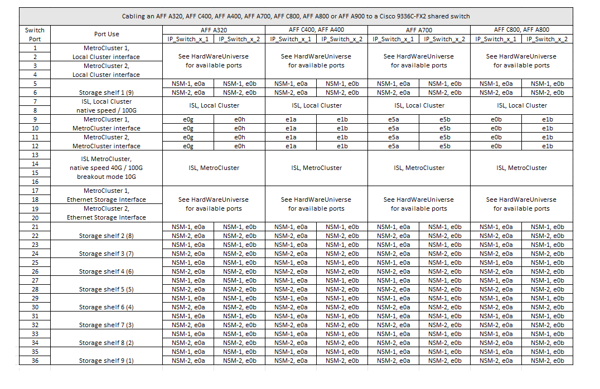

= Platform port assignments for Cisco 3232C or Cisco 9336C switches
:icons: font
:imagesdir: ../media/

[.lead]
The port usage in a MetroCluster IP configuration depends on the switch model and platform type.

Review these considerations before using the tables:

* The following tables show the port usage for site A. The same cabling is used for site B.
* The switches cannot be configured with ports of different speeds (for example, a mix of 100 Gbps ports and 40 Gbps ports).
* If you are configuring a single MetroCluster with the switches, use the *MetroCluster 1* port group.
+
Keep track of the MetroCluster port group (MetroCluster 1, MetroCluster 2, or MetroCluster 3). You will need it when using the RcfFileGenerator tool as described later in this configuration procedure.

* The RcfFileGenerator for MetroCluster IP also provides a per-port cabling overview for each switch.
+
Use this cabling overview to verify your cabling.

== Cabling two MetroCluster configurations to the switches

When cabling more than one MetroCluster configuration to a Cisco 3132Q-V switch, you must cable each MetroCluster according to the appropriate table. For example, if cabling a FAS2750 and an AFF A700 to the same Cisco 3132Q-V switch. Then you cable the FAS2750 as per "MetroCluster 1" in Table 1, and the AFF A700 as per "MetroCluster 2" or "MetroCluster 3" in Table 2. You cannot physically cable both the FAS2750 and the AFF A700 as "MetroCluster 1".

== Cabling an AFF A150, FAS2750, AFF A220, FAS500f, AFF C250 or AFF A250 to a Cisco 3232C or Cisco 9336-FX2C switch

image::../media/mcc_ip_cabling_a150_a220_a250_to_a_cisco_3232c_or_cisco_9336c_switch.png[]

== Cabling a FAS8200 or an AFF A300 to a Cisco 3232C or Cisco 9336C switch

image::../media/mcc_ip_cabling_a_aff_a300_or_fas8200_to_a_cisco_3232c_or_cisco_9336c_switch.png[]

== Cabling an AFF A320, FAS8300, AFF C400, AFF A400, FAS8700, FAS9000, AFF A700, AFF C800, AFF A800, FAS9500 or AFF A900 

image::../media/mcc_ip_cabling_a320_a400_a700_a800_a900 _cisco_3232C or_9336c_switch.png[]

== Cabling an AFF A320, AFF C400, AFF A400, AFF A700, AFF C800, or AFF A800 to a Cisco 9336C-FX2 shared switch

// BURT 1501501 Sept 7th, 2022
// 2023-MAR-9, BURT 1533595 (new C-Series platforms)

