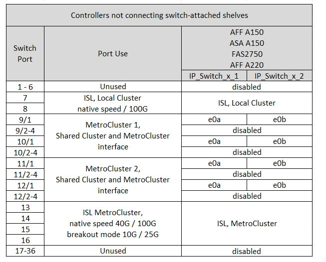
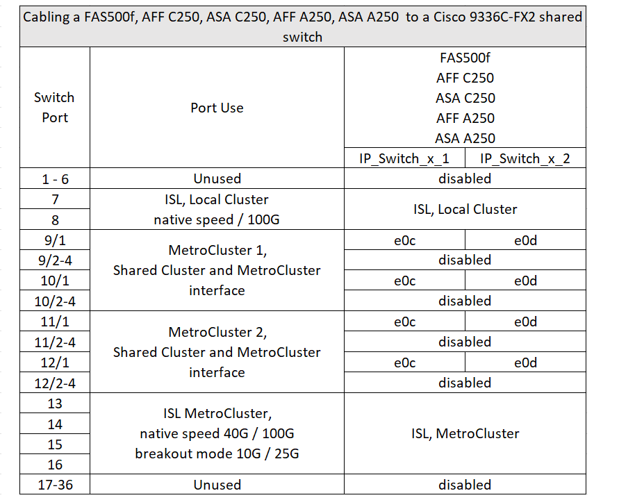
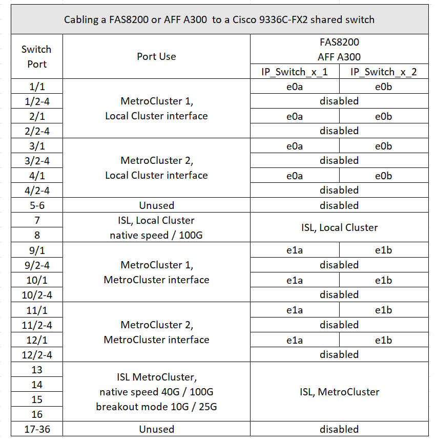
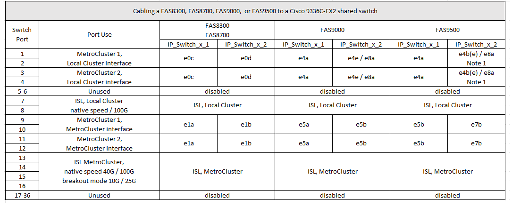

= Platform port assignments for a Cisco 9336C-FX2 shared switch
:icons: font
:imagesdir: ../media/

[.lead]
The port usage in a MetroCluster IP configuration depends on the switch model and platform type.

Review these considerations before using the tables:

* At least one MetroCluster configuration or DR group must support switch attached NS224 shelves.
* Platforms that do not support switch attached NS224 shelves can only be connected as a second MetroCluster configuration or as a second DR group.
* The RcfFileGenerator only shows eligible platforms when the first platform is selected.
* Connecting one eight-node or two four-node MetroCluster configurations requires ONTAP 9.14.1 or later.

== Cabling an AFF A320, AFF C400, ASA C400, AFF A400, ASA A400, AFF A700, AFF C800, ASA C800, AFF A800, AFF A900, or ASA A900 system to a Cisco 9336C-FX2 shared switch

image::../media/mcc_ip_cabling_a320_c400_a400_a700_c800_a800_a900_to_cisco_9336c_shared_switch.png[]

*Note 1*: If you are using an X91440A adapter (40Gbps), then use either ports e4a and e4e or e4a and e8a. If you are using an X91153A adapter(100Gbps), then use either ports e4a and e4b or e4a and e8a.

== Cabling an AFF A150, ASA A150, FAS2750 or AFF A220 system to a Cisco 9336C-FX2 shared switch

== Cabling a FAS500f, AFF C250, ASA C250, AFF A250, or ASA A250 system to a Cisco 9336C-FX2 shared switch

== Cabling a FAS8200 or AFF A300 system to a Cisco 9336C-FX2 shared switch					
							

== Cabling a FAS8300, FAS8700, FAS9000, or FAS9500 system to a Cisco 9336C-FX2 shared switch	

*Note 1*: If you are using an X91440A adapter (40Gbps), then use either ports e4a and e4e or e4a and e8a. If you are using an X91153A adapter(100Gbps), then use either ports e4a and e4b or e4a and e8a.

// 2023 Oct 25, ONTAPDOC-1201
