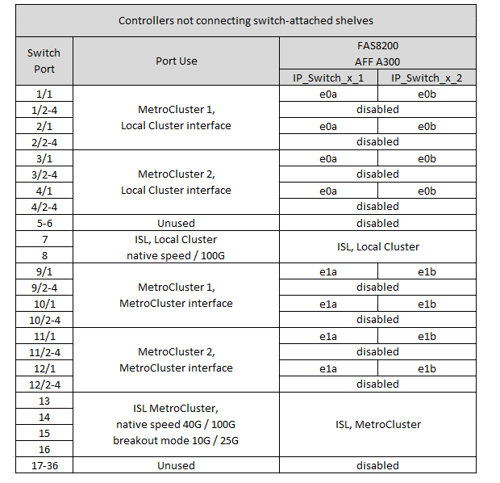

= Platform port assignments for a Cisco 9336C-FX2 switch with NS224 storage
:icons: font
:imagesdir: ../media/

[.lead]
The port usage in a MetroCluster IP configuration depends on the switch model and platform type.

Review the following considerations before using the configuration tables:

* At least one MetroCluster configuration or DR group must support switch-attached NS224 shelves.
* Platforms that do not support switch-attached NS224 shelves can only be connected as a second MetroCluster configuration or as a second DR group.
* The RcfFileGenerator only shows eligible platforms when the first platform is selected.
* Connecting one eight-node or two four-node MetroCluster configurations requires ONTAP 9.14.1 or later.

== Choose the correct cabling table for your configuration 

Review the correct port assignments table for your configuration. There are two sets of cabling tables in this section: 

* <<tables_connecting_ns224, Cabling tables for controllers directly connecting to switch-attached NS224 shelves>>
* <<tables_not_connecting_ns224,Cabling tables for controllers not directly connecting to switch-attached NS224 shelves>>

[[tables_connecting_ns224]]
=== Controllers directly connecting to switch-attached NS224 shelves

Determine which port assignments table you should follow for controllers directly connecting to switch-attached NS224 shelves.

[cols=2*,options="header"]
|===
| Platform 
| Use this cabling table...
|
AFF C30, AFF A30

AFF C60
a| 
The table you follow depends on whether you are using a 25G (group 1a) or 100G (group 1b) Ethernet card. 

* <<table_1a_cisco_9336c_fx2,Cisco 9336C-FX2 switch with NS224 storage platform port assignments (group 1a - 25G) >> 
* <<table_1b_cisco_9336c_fx2,Cisco 9336C-FX2 switch with NS224 storage platform port assignments (group 1b - 100G) >> 
|
AFF A320

AFF C400, ASA C400 

AFF A400, ASA A400 |  <<table_2_cisco_9336c_fx2,Cisco 9336C-FX2 switch with NS224 storage platform port assignments (group 2) >> 
| AFF A50|  <<table_3_cisco_9336c_fx2,Cisco 9336C-FX2 switch with NS224 storage platform port assignments (group 3) >> 
|  
AFF A700

AFF C800, ASA C800, AFF A800

AFF A900, ASA A900 | <<table_4_cisco_9336c_fx2,Cisco 9336C-FX2 switch with NS224 storage platform port assignments (group 4) >>
| AFF A70

AFF C80

AFF A90

AFF A1K

| <<table_5_cisco_9336c_fx2,Cisco 9336C-FX2 switch with NS224 storage platform port assignments (group 5) >> 

|===

[[table_1a_cisco_9336c_fx2]]
.Cisco 9336C-FX2 switch with NS224 storage platform port assignments (group 1a)
Review the platform port assignments to cable an AFF A30, AFF C30, or AFF C60 system that is connecting switch-attached NSS24 shelves to a Cisco 9336C-FX2 switch using a four-port 25G Ethernet card.

NOTE: This configuration requires a four-port 25G Ethernet card in slot 4 to connect the local cluster and HA interfaces.

image:../media/mccip-cabling-greeley-connecting-a30-c30-fas50-c60-25G.png[Shows Cisco 9336C-FX2 switch with NS224 storage platform port assignments]

[[table_1b_cisco_9336c_fx2]]
.Cisco 9336C-FX2 switch with NS224 storage platform port assignments (group 1b)

Review the platform port assignments to cable an AFF A30, AFF C30, or AFF C60  system that is connecting switch-attached NSS24 shelves to aCisco 9336C-FX2 switch using a two-port 100G Ethernet card.

NOTE: This configuration requires a two-port 100G Ethernet card in slot 4 to connect the local cluster and HA interfaces.

image:../media/mccip-cabling-greeley-connecting-a30-c30-fas50-c60-100G.png[Shows Cisco 9336C-FX2 switch with NS224 storage platform port assignments]

[[table_2_cisco_9336c_fx2]]
.Cisco 9336C-FX2 switch with NS224 storage platform port assignments (group 2)

Review the platform port assignments to cable an AFF A320, AFF C400, ASA C400, AFF A400, or ASA A400 system that is connecting switch-attached NSS24 shelves to aCisco 9336C-FX2 switch: 

image::../media/mcc_ip_cabling_a320_c400_a400_to_cisco_9336c_shared_switch.png[Shows Cisco 9336C-FX2 switch with NS224 storage platform port assignments]

[[table_3_cisco_9336c_fx2]]
.Cisco 9336C-FX2 switch with NS224 storage platform port assignments (group 3)
Review the platform port assignments to cable an AFF A50 system that is connecting switch-attached NSS24 shelves to aCisco 9336C-FX2 switch: 

image:../media/mccip-cabling-greeley-connecting-a50-updated.png[Shows Cisco 9336C-FX2 switch with NS224 storage platform port assignments]

[[table_4_cisco_9336c_fx2]]
.Cisco 9336C-FX2 switch with NS224 storage platform port assignments (group 4)

Review the platform port assignments to cable an AFF A700, AFF C800, ASA C800, AFF A800, AFF A900, or ASA A900 system that is connecting switch-attached NSS24 shelves to aCisco 9336C-FX2 switch: 

image:../media/mcc_ip_cabling_a700_c800_a800_a900_to_cisco_9336c_shared_switch.png[Shows Cisco 9336C-FX2 switch with NS224 storage platform port assignments]

*Note 1*: Use either ports e4a and e4e or e4a and e8a if you are using an X91440A adapter (40Gbps). Use either ports e4a and e4b or e4a and e8a if you are using an X91153A adapter (100Gbps).

[[table_5_cisco_9336c_fx2]]
.Cisco 9336C-FX2 switch with NS224 storage platform port assignments (group 5)

Review the platform port assignments to cable an AFF A70, AFF C80, AFF A90, or AFF A1K system that is connecting switch-attached NSS24 shelves to aCisco 9336C-FX2 switch: 

image::../media/mccip-cabling-greeley-connecting-a70-c80-a-90-fas90-a1k.png[Shows Cisco 9336C-FX2 switch with NS224 storage platform port assignments]

[[tables_not_connecting_ns224]]
=== Controllers not connecting to switch-attached NS224 shelves

Determine which port assignments table you should follow for controllers that are not connecting to switch-attached NS224 shelves.

[cols=2*,options="header"]
|===
| Platform 
| Use this cabling table...
| AFF A150, ASA A150

FAS2750, AFF A220 | <<table_6_cisco_9336c_fx2,Cisco 9336C-FX2 switch with NS224 storage platform port assignments (group 6)>>
| AFF A20 | <<table_7_cisco_9336c_fx2,Cisco 9336C-FX2 switch with NS224 storage platform port assignments (group 7)>>
| 
FAS500f

AFF C250, ASA C250 

AFF A250, ASA A250| <<table_8_cisco_9336c_fx2,Cisco 9336C-FX2 switch with NS224 storage platform port assignments (group 8)>>
| AFF C30, AFF A30

FAS50

AFF C60 
a| 
The table you follow depends on whether you are using a 25G (group 9a) or 100G (group 9b) Ethernet card. 

* <<table_9a_cisco_9336c_fx2,Cisco 9336C-FX2 switch with NS224 storage platform port assignments (group 9a)>>
* <<table_9b_cisco_9336c_fx2,Cisco 9336C-FX2 switch with NS224 storage platform port assignments (group 9b)>>
| FAS8200, AFF A300 | <<table_10_cisco_9336c_fx2,Cisco 9336C-FX2 switch with NS224 storage platform port assignments (group 10)>>
|  
AFF A320

FAS8300, AFF C400, ASA C400, FAS8700

AFF A400, ASA A400 | <<table_11_cisco_9336c_fx2,Cisco 9336C-FX2 switch with NS224 storage platform port assignments (group 11)>>
| AFF A50 | <<table_12_cisco_9336c_fx2,Cisco 9336C-FX2 switch with NS224 storage platform port assignments (group 12)>>
|  
FAS9000, AFF A700

AFF C800, ASA C800, AFF A800, ASA A800

FAS9500, AFF A900, ASA A900 |  <<table_13_cisco_9336c_fx2,Cisco 9336C-FX2 switch with NS224 storage platform port assignments (group 13)>>

|  
FAS70, AFF A70

AFF C80

FAS90, AFF A90

AFF A1K

| <<table_14_cisco_9336c_fx2,Cisco 9336C-FX2 switch with NS224 storage platform port assignments (group 14)>>

|===

[[table_6_cisco_9336c_fx2]]
.Cisco 9336C-FX2 switch with NS224 storage platform port assignments (group 6)

Review the platform port assignments to cable an AFF A150, ASA A150, FAS2750, or AFF A220 system that isn't connecting switch-attached NSS24 shelves to aCisco 9336C-FX2 switch: 

image::../media/mcc-ip-cabling-a-aff-a150-asa-a150-fas2750-aff-a220-to-a-cisco-9336c-shared-switch.png[Shows Cisco 9336C-FX2 switch with NS224 storage platform port assignments]

[[table_7_cisco_9336c_fx2]]
.Cisco 9336C-FX2 switch with NS224 storage platform port assignments (group 7)

Review the platform port assignments to cable an AFF A20 system that isn't connecting switch-attached NSS24 shelves to aCisco 9336C-FX2 switch: 

image:../media/mcc-ip-aff-a20-to-a-cisco-9336c-shared-switch-not-connecting.png[Shows Cisco 9336C-FX2 switch with NS224 storage platform port assignments]

[[table_8_cisco_9336c_fx2]]
.Cisco 9336C-FX2 switch with NS224 storage platform port assignments (group 8)

Review the platform port assignments to cable a FAS500f, AFF C250, ASA C250, AFF A250, or ASA A250 system that isn't connecting switch-attached NSS24 shelves to aCisco 9336C-FX2 switch: 

image::../media/mcc-ip-cabling-c250-asa-c250-a250-asa-a250-to-cisco-9336c-shared-switch.png[Shows Cisco 9336C-FX2 switch with NS224 storage platform port assignments]

[[table_9a_cisco_9336c_fx2]]
.Cisco 9336C-FX2 switch with NS224 storage platform port assignments (group 9a)

Review the platform port assignments to cable an AFF A30, AFF C30, AFF C60, or FAS50 system that isn't connecting switch-attached NSS24 shelves to aCisco 9336C-FX2 switch using a four-port 25G Ethernet card:

NOTE: This configuration requires a four-port 25G Ethernet card in slot 4 to connect the local cluster and HA interfaces.

image:../media/mccip-cabling-greeley-not-connecting-a30-c30-fas50-c60-25G.png[Shows Cisco 9336C-FX2 switch with NS224 storage platform port assignments]

[[table_9b_cisco_9336c_fx2]]
.Cisco 9336C-FX2 switch with NS224 storage platform port assignments (group 9b)

Review the platform port assignments to cable an AFF A30, AFF C30, AFF C60, or FAS50 system that isn't connecting switch-attached NSS24 shelves to aCisco 9336C-FX2 switch using a two-port 100G Ethernet card:

NOTE: This configuration requires a two-port 100G Ethernet card in slot 4 to connect the local cluster and HA interfaces.

image:../media/mccip-cabling-greeley-not-connecting-a30-c30-fas50-c60-100G.png[Shows Cisco 9336C-FX2 switch with NS224 storage platform port assignments]

[[table_10_cisco_9336c_fx2]]
.Cisco 9336C-FX2 switch with NS224 storage platform port assignments (group 10)				

Review the platform port assignments to cable a FAS8200 or AFF A300 system that isn't connecting switch-attached NSS24 shelves to aCisco 9336C-FX2 switch: 

[[table_11_cisco_9336c_fx2]]
.Cisco 9336C-FX2 switch with NS224 storage platform port assignments (group 11)	

Review the platform port assignments to cable an AFF A320, FAS8300, AFF C400, ASA C400, FAS8700, AFF A400, or ASA A400 system that isn't connecting switch-attached NSS24 shelves to aCisco 9336C-FX2 switch: 

image::../media/mcc_ip_cabling_a320_fas8300_a400_fas8700_to_a_cisco_9336c_shared_switch.png[Shows Cisco 9336C-FX2 switch with NS224 storage platform port assignments]

[[table_12_cisco_9336c_fx2]]
.Cisco 9336C-FX2 switch with NS224 storage platform port assignments (group 12)	

Review the platform port assignments to cable an AFF A50 system that isn't connecting switch-attached NSS24 shelves to aCisco 9336C-FX2 switch: 

image::../media/mcc-ip-cabling-aff-a50-cisco-9336c-shared-switch-not-connecting.png[Shows Cisco 9336C-FX2 switch with NS224 storage platform port assignments]

[[table_13_cisco_9336c_fx2]]
.Cisco 9336C-FX2 switch with NS224 storage platform port assignments (group 13)	

Review the platform port assignments to cable a FAS9000, AFF A700, AFF C800, ASA C800, AFF A800, ASA A800, FAS9500, AFF A900, or ASA A900 system that isn't connecting switch-attached NSS24 shelves to aCisco 9336C-FX2 switch: 

image::../media/mcc_ip_cabling_a700_a800_fas9000_fas9500_to_cisco_9336c_shared_switch.png[Shows Cisco 9336C-FX2 switch with NS224 storage platform port assignments]

*Note 1*: Use either ports e4a and e4e or e4a and e8a if you are using an X91440A adapter (40Gbps). Use either ports e4a and e4b or e4a and e8a if you are using an X91153A adapter (100Gbps).

[[table_14_cisco_9336c_fx2]]
.Cisco 9336C-FX2 switch with NS224 storage platform port assignments (group 14)	

Review the platform port assignments to cable an AFF A70, FAS70, AFF C80, FAS90, AFF A90, or AFF A1K system that isn't connecting switch-attached NSS24 shelves to aCisco 9336C-FX2 switch: 

image::../media/mccip-cabling-greeley-not-connecting-a70-c80-a-90-fas90-a1k.png[Shows Cisco 9336C-FX2 switch with NS224 storage platform port assignments]

// 2024 Dec 09, ONTAPDOC-2349
// 2024 Jun 07, ONTAPDOC-1734
// 2023 Oct 25, ONTAPDOC-1201
