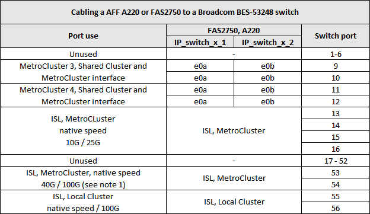
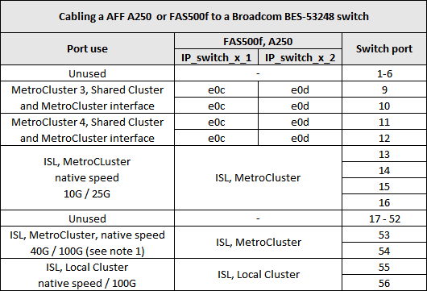
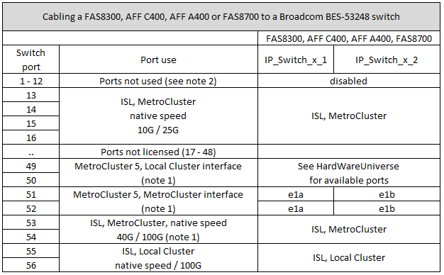

= Platform port assignments for Broadcom supported BES-53248 IP switches
:icons: font
:imagesdir: ../media/

[.lead]
The port usage in a MetroCluster IP configuration depends on the switch model and platform type.

The switches cannot be used with remote ISL ports of different speeds (for example, a 25 Gbps port connected to a 10 Gbps ISL port).
//1386105 2021.11.23

.Notes for the tables below:

. For some platforms, you can use ports 49 - 54 for MetroCluster ISLs or MetroCluster interface connections.
+
These ports require an additional license.

. Only a single four-node MetroCluster using A320 systems can be connected to the switch.
+
Features that require a switched cluster are not supported in this configuration, including MetroCluster FC to IP transition and tech refresh procedures.

. AFF A320 systems configured with Broadcom BES-53248 switches might not support all features.
+
Any configuration or feature that requires that the local cluster connections are connected to a switch is not supported. For example, the following configurations and procedures are not supported:

 ** Eight-node MetroCluster configurations
 ** Transitioning from MetroCluster FC to MetroCluster IP configurations
 ** Refreshing a four-node MetroCluster IP configuration (ONTAP 9.8 and later)

== Switch port usage for AFF A220 or FAS2750 systems

== Switch port usage for AFF A250 or FAS500f systems

== Switch port usage for AFF A300 or FAS8200 systems

image::../media/mcc_ip_cabling_a_aff_a300_or_fas8200_to_a_broadcom_bes_53248_switch.png[]

image::../media/mcc_ip_cabling_a_aff_a320_to_a_broadcom_bes_53248_switch.png[]

== Switch port usage for AFF A400, FAS8300 or FAS8700 systems

