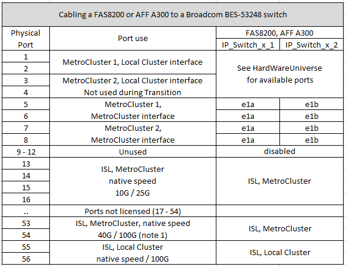
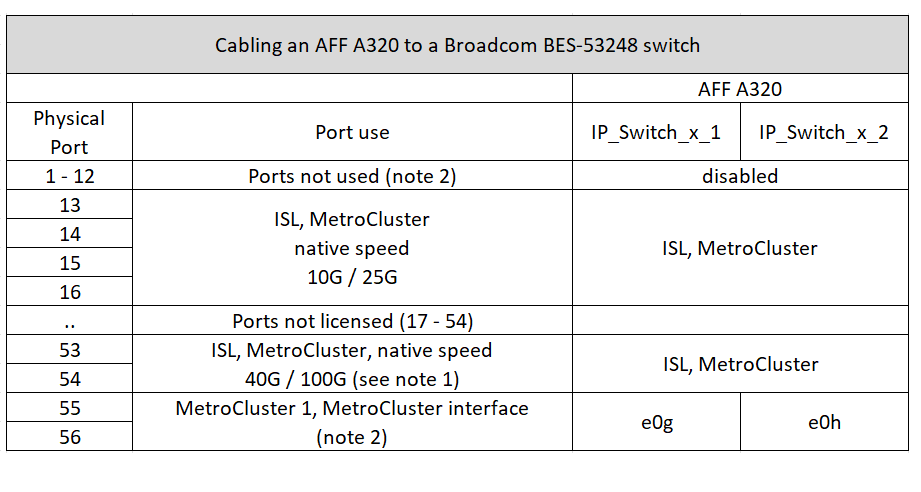
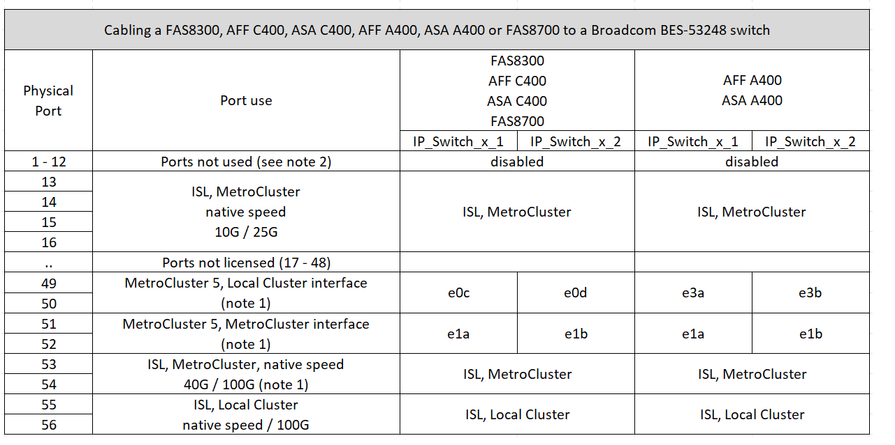

= Platform port assignments for Broadcom supported BES-53248 IP switches
:icons: font
:imagesdir: ../media/

[.lead]
The port usage in a MetroCluster IP configuration depends on the switch model and platform type.

The switches cannot be used with remote ISL ports of different speeds (for example, a 25 Gbps port connected to a 10 Gbps ISL port).
//1386105 2021.11.23

.Review this information before using the tables: 

* If you configure the switch for MetroCluster FC to IP Transition, the following ports are used depending on the target platform that you choose:
+
[cols=2*,options="header",cols="75,25"]
|===
| Target platform
| Port
| FAS500f, AFF C250, ASA C250, AFF A250, ASA A250, FAS8300, AFF C400, ASA C400, AFF A400, ASA A400, or FAS8700 platforms | ports 1 - 6, 10Gbps
| FAS8200 or AFF A300 platforms| ports 3 - 4 and 9 - 12, 10Gbps
|===

* AFF A320 systems configured with Broadcom BES-53248 switches might not support all features.
+
Any configuration or feature that requires that the local cluster connections are connected to a switch is not supported. For example, the following configurations and procedures are not supported:

 ** Eight-node MetroCluster configurations
 ** Transitioning from MetroCluster FC to MetroCluster IP configurations
 ** Refreshing a four-node MetroCluster IP configuration (ONTAP 9.8 and later)

* The BES-53248 switch requires all ports in a four-port group to operate at the same speed. To connect a mix of AFF 150, ASA A150, FAS2750, AFF A220 and FAS500f, AFF C250, ASA C250, AFF A250, and ASA A250 platforms, switch ports that are located in separate four-port groups must be used. If you require this type of configuration, the following applies:
**  In the https://mysupport.netapp.com/site/tools/tool-eula/rcffilegenerator[RcfFileGenerator for MetroCluster IP], drop-down fields for "MetroCluster 1" and "MetroCluster 2" are only populated after you select a platform for MetroCluster 3 or "MetroCluster 4".  Refer to link:../install-ip/using_rcf_generator.html[Using the port tables with the RcfFileGenerator tool or multiple MetroCluster configurations] for more information on how to use the port tables.
** If both MetroCluster configurations are using the same the platform, NetApp recommends that you select the group "MetroCluster 3" for one configuration and the group "MetroCluster 4" for the other configuration. If the platforms are different, then you must select "MetroCluster 3" or "MetroCluster 4" for the first configuration, and select "MetroCluster 1" or "MetroCluster 2" for the second configuration.

.Notes referenced in the tables:

* *Note 1*: Using these ports requires an additional license.

* *Note 2*: Only a single four-node MetroCluster using AFF A320 systems can be connected to the switch.
+
Features that require a switched cluster are not supported in this configuration, including the MetroCluster FC to IP transition and tech refresh procedures.

== Choose the correct cabling table for your configuration

Use the following table to determine which cabling table you should follow. 

[cols=2*,options="header"]
|===
| If your system is...
| Use this cabling table...
a|
AFF A150, ASA A150, 

FAS2750, 

AFF A220 | <<table_1_bes_53248,Table 1: Broadcom BES-53248 platform port assignments>>
|
FAS500f, 

AFF C250, ASA C250

AFF A250 or ASA A250 | <<table_2_bes_53248,Table 2: Broadcom BES-53248 platform port assignments>>
| FAS8200, AFF A300 | <<table_3_bes_53248,Table 3: Broadcom BES-53248 platform port assignments>>

|AFF A320 | <<table_4_bes_53248,Table 4: Broadcom BES-53248 platform port assignments>>
| FAS8300, 

AFF C400, ASA C400, 

AFF A400, ASA A400 

FAS8700| <<table_5_bes_53248,Table 5: Broadcom BES-53248 platform port assignments>>

|===

[[table_1_bes_53248]]
.Table 1: Broadcom BES-53248 platform port assignments

Review the platform port assignments to cable your system to a Broadcom BES-53248 switch: 

image::../media/mcc_ip_cabling_a_aff_asa_a150_a220_fas2750_to_a_broadcom_bes_53248_switch.png[]

[[table_2_bes_53248]]
.Table 2: Broadcom BES-53248 platform port assignments

Review the platform port assignments to cable your system to a Broadcom BES-53248 switch:

image::../media/mcc_ip_cabling_a_aff_asa_c250_a250_fas500f_to_a_broadcom_bes_53248_switch.png[]

[[table_3_bes_53248]]
.Table 3: Broadcom BES-53248 platform port assignments

Review the platform port assignments to cable your system to a Broadcom BES-53248 switch:

[[table_4_bes_53248]]
.Table 4: Broadcom BES-53248 platform port assignments

Review the platform port assignments to cable your system to a Broadcom BES-53248 switch:

[[table_5_bes_53248]]
.Table 5: Broadcom BES-53248 platform port assignments				

Review the platform port assignments to cable your system to a Broadcom BES-53248 switch:

// 2023-MAR-3, BURT 1533595, BURT 1533593

