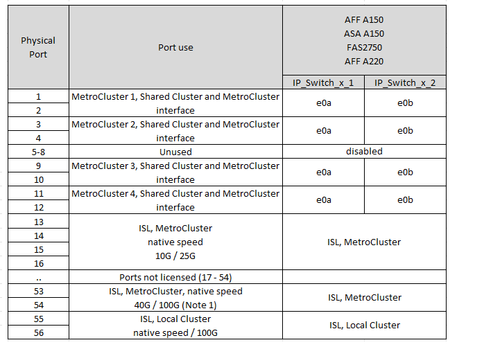
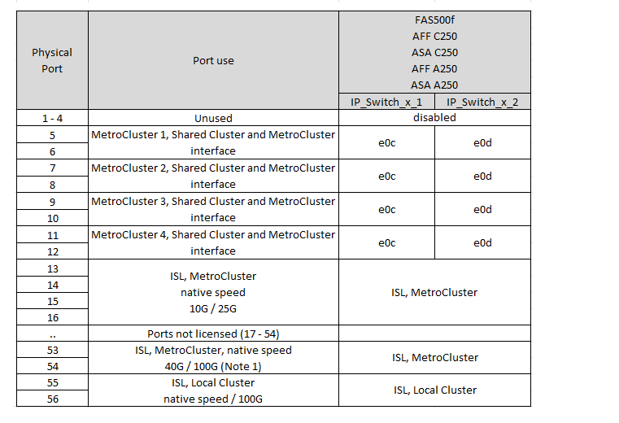
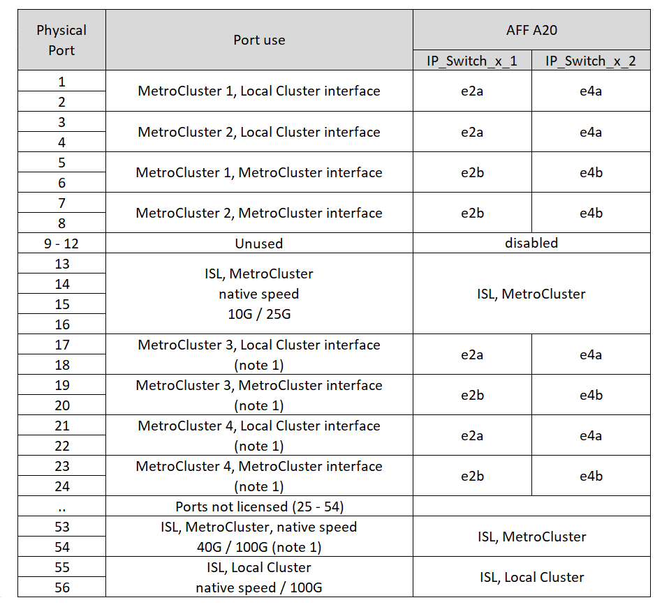
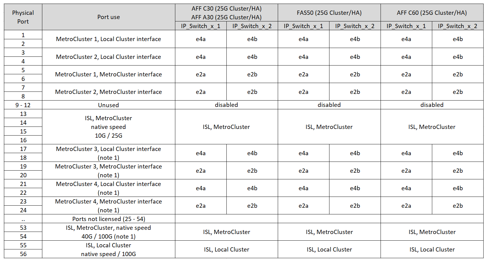
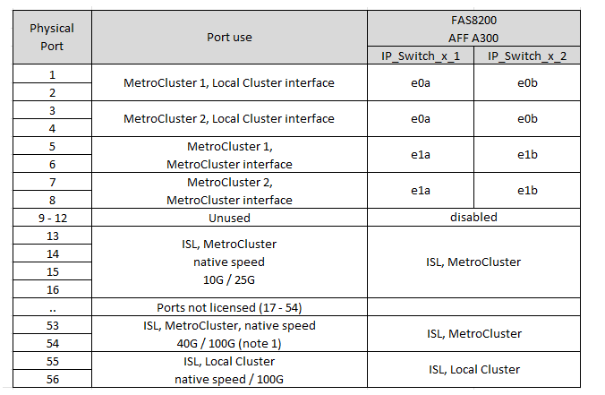
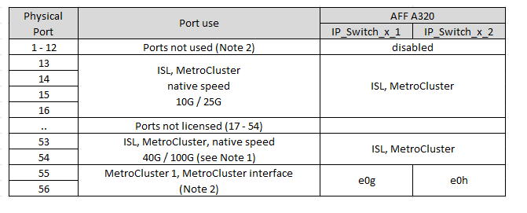
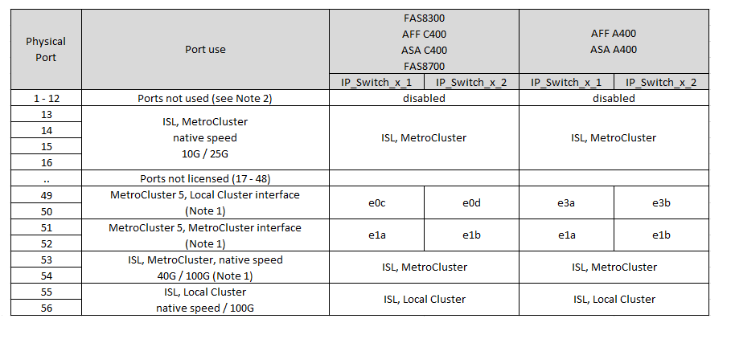

= Platform port assignments for Broadcom supported BES-53248 IP switches in a MetroCluster IP configuration
:icons: font
:imagesdir: ../media/

[.lead]
The port usage in a MetroCluster IP configuration depends on the switch model and platform type.

Review the following considerations before using the configuration tables: 

* You cannot use the switches with remote ISL ports of different speeds (for example, a 25 Gbps port connected to a 10 Gbps ISL port).
//1386105 2021.11.23

* If you configure the switch for MetroCluster FC to IP Transition, the following ports are used depending on the target platform that you choose:
+
[cols=2*,options="header",cols="75,25"]
|===
| Target platform
| Port
| FAS500f, AFF C250, ASA C250, AFF A250, ASA A250, FAS8300, AFF C400, ASA C400, AFF A400, ASA A400, or FAS8700 platforms | ports 1 - 6, 10Gbps
| FAS8200 or AFF A300 platforms| ports 3 - 4 and 9 - 12, 10Gbps
|===

* AFF A320 systems configured with Broadcom BES-53248 switches might not support all features.
+
Any configuration or feature that requires that the local cluster connections are connected to a switch is not supported. For example, the following configurations and procedures are not supported:

 ** Eight-node MetroCluster configurations
 ** Transitioning from MetroCluster FC to MetroCluster IP configurations
 ** Refreshing a four-node MetroCluster IP configuration (ONTAP 9.8 and later)

== Choose the correct cabling table for your configuration

Use the following table to determine which cabling table you should follow. 

[cols=2*,options="header",cols="25,75"]
|===
| If your system is...
| Use this cabling table...
a|
AFF A150, ASA A150

FAS2750 

AFF A220 | <<table_1_bes_53248,Broadcom BES-53248 platform port assignments (group 1)>>
|
FAS500f 

AFF C250, ASA C250

AFF A250, ASA A250 | <<table_2_bes_53248,Broadcom BES-53248 platform port assignments (group 2)>>
| AFF A20 | <<table_3_bes_53248,Broadcom BES-53248 platform port assignments (group 3)>>

|AFF C30, AFF A30

FAS50

AFF C60 | <<table_4_bes_53248,Broadcom BES-53248 platform port assignments (group 4)>>
|FAS8200, AFF A300 | <<table_5_bes_53248,Broadcom BES-53248 platform port assignments (group 5)>>

|AFF A320 | <<table_6_bes_53248,Broadcom BES-53248 platform port assignments (group 6)>>
| FAS8300

AFF C400, ASA C400

AFF A400, ASA A400 

FAS8700| <<table_7_bes_53248,Broadcom BES-53248 platform port assignments (group 7)>>

|===

[[table_1_bes_53248]]
.Broadcom BES-53248 platform port assignments (group 1)

Review the platform port assignments to cable an AFF A150, ASA A150, FAS2750, or AFF A220 system to a Broadcom BES-53248 switch: 

* *Note 1*: Using these ports requires an additional license.

* If both MetroCluster configurations are using the same the platform, NetApp recommends selecting group "MetroCluster 3" for one configuration and group "MetroCluster 4" for the other configuration. If the platforms are different, then you must select "MetroCluster 3" or "MetroCluster 4" for the first configuration, and "MetroCluster 1" or "MetroCluster 2" for the second configuration.

[[table_2_bes_53248]]
.Broadcom BES-53248 platform port assignments (group 2)

Review the platform port assignments to cable a FAS500f, AFF C250, ASA C250, AFF A250, or ASA A250 system to a Broadcom BES-53248 switch:

* *Note 1*: Using these ports requires an additional license.

* If both MetroCluster configurations are using the same the platform, NetApp recommends selecting group "MetroCluster 3" for one configuration and group "MetroCluster 4" for the other configuration. If the platforms are different, then you must select "MetroCluster 3" or "MetroCluster 4" for the first configuration, and "MetroCluster 1" or "MetroCluster 2" for the second configuration.

[[table_3_bes_53248]]
.Broadcom BES-53248 platform port assignments (group 3)

Review the platform port assignments to cable an AFF A20 system to a Broadcom BES-53248 switch:

* *Note 1*: Using these ports requires an additional license.

[[table_4_bes_53248]]
.Broadcom BES-53248 platform port assignments (group 4)

Review the platform port assignments to cable an AFF A30, AFF C30, AFF C60, or FAS50 system to a Broadcom BES-53248 switch using  a four-port 25G Ethernet card.

[NOTE] 
====
* This configuration requires a four-port 25G Ethernet card in slot 4 to connect the local cluster and HA interfaces. 
* This configuration requires a QSFP-to-SFP+ adapter in the card on the controller to support a 25Gbps network speed.
====

* *Note 1*: Using these ports requires an additional license.

[[table_5_bes_53248]]
.Broadcom BES-53248 platform port assignments (group 5)

Review the platform port assignments to cable a FAS8200 or AFF A300 system to a Broadcom BES-53248 switch:

* *Note 1*: Using these ports requires an additional license.

[[table_6_bes_53248]]
.Broadcom BES-53248 platform port assignments (group 6)

Review the platform port assignments to cable an AFF A320 system to a Broadcom BES-53248 switch:

* *Note 1*: Using these ports requires an additional license.

* *Note 2*: Only a single four-node MetroCluster using AFF A320 systems can be connected to the switch.
+
Features that require a switched cluster are not supported in this configuration. This includes the MetroCluster FC to IP transition and tech refresh procedures.

[[table_7_bes_53248]]
.Broadcom BES-53248 platform port assignments (group 7)				

Review the platform port assignments to cable a FAS8300, AFF C400, ASA C400, AFF A400, ASA A400, or FAS8700 system to a Broadcom BES-53248 switch:

* *Note 1*: Using these ports requires an additional license.

* *Note 2*: Only a single four-node MetroCluster using AFF A320 systems can be connected to the switch.
+
Features that require a switched cluster are not supported in this configuration. This includes the MetroCluster FC to IP transition and tech refresh procedures.

// 2024 Dec 09, ONTAPDOC-2349
// 2024 Jun 07, ONTAPDOC-1734
// 2023-MAR-3, BURT 1533595, BURT 1533593

