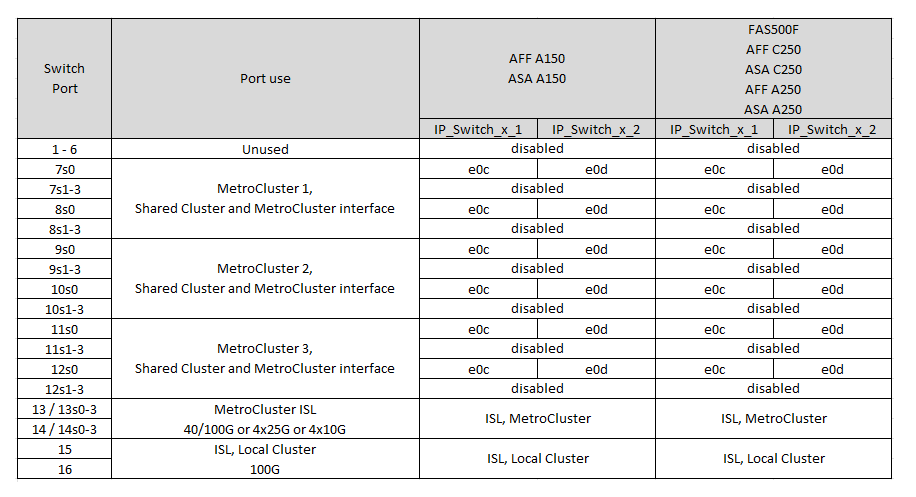
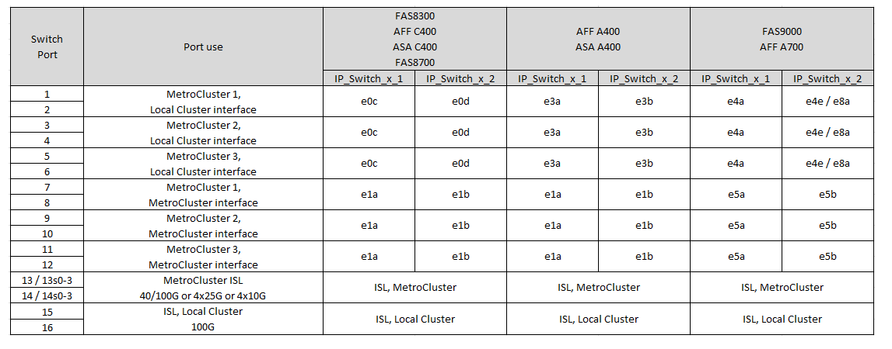
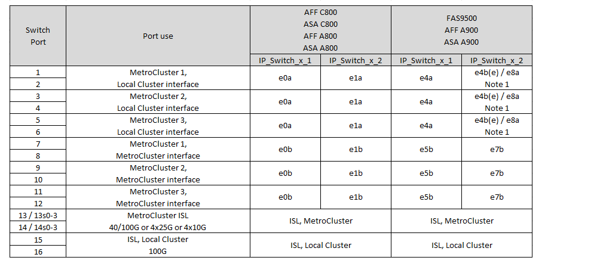
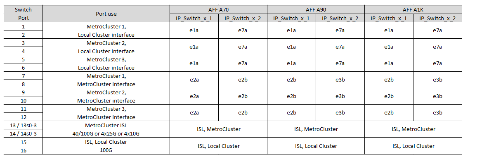

= Platform port assignments for NVIDIA supported SN2100 IP switches
:icons: font
:imagesdir: ../media/

[.lead]
The port usage in a MetroCluster IP configuration depends on the switch model and platform type.

== Supported configurations

The following configurations are not currently supported:

* MetroCluster FC-to-IP Transition

.Review these considerations before using the configuration tables

* Connecting an eight-node or two four-node MetroCluster configurations requires ONTAP 9.14.1 or later and RCF file version 2.00 or later. 

* If you cable multiple MetroCluster configurations then follow the respective table.
For example:

** If you cable two four-node MetroCluster configurations of type AFF A700, then connect the first MetroCluster shown as "MetroCluster 1", and the second MetroCluster shown as "MetroCluster 2" in the AFF A700 table.

NOTE: Ports 13 and 14 can be used in native speed mode supporting 40 Gbps and 100 Gbps, or in breakout mode to support 4 × 25 Gbps or 4 × 10 Gbps. If they use native speed mode they are represented as ports 13 and 14. If they use breakout mode, either 4 × 25 Gbps or 4 × 10 Gbps, then they are represented as ports 13s0-3 and 14s0-3.

The following sections describe the physical cabling outline.  You can also refer to the https://mysupport.netapp.com/site/tools/tool-eula/rcffilegenerator[RcfFileGenerator] for detailed cabling information.

== Choose the correct cabling table for your configuration

Use the following table to determine which cabling table you should follow. 

[cols=2*,options="header"]
|===
| If your system is...
| Use this cabling table...
a|
AFF A150, ASA A150

FAS500f

AFF C250, ASA C250

AFF A250,  ASA A250 | <<table_1_nvidia_sn2100,NVIDIA SN2100 platform port assignments (group 1)>>
| 
FAS8300

AFF C400, ASA C400
 
AFF A400, ASA A400 
  
FAS8700 
  
FAS9000, AFF A700 | <<table_2_nvidia_sn2100,NVIDIA SN2100 platform port assignments (group 2)>>
| AFF C800, ASA C800 

AFF A800, ASA A800

FAS9500
 
AFF A900, ASA A900| <<table_3_nvidia_sn2100,NVIDIA SN2100 platform port assignments (group 3)>>

| AFF A70

AFF A90

AFF A1K

*Note:* These systems require ONTAP 9.15.1 or later.
| <<table_4_nvidia_sn2100,NVIDIA SN2100 platform port assignments (group 4)>>

|===

.NVIDIA SN2100 platform port assignments (group 1)

Review the platform port assignments to cable an AFF A150, ASA A150, FAS500f, AFF C250, ASA C250, AFF A250, or ASA A250 system to a NVIDIA SN2100 switch:

[[table_1_nvidia_sn2100]]

[[table_2_nvidia_sn2100]]
.NVIDIA SN2100 platform port assignments (group 2)

Review the platform port assignments to cable a FAS8300, AFF C400, ASA C400, AFF A400, ASA A400, FAS8700, FAS9000, or AFF A700 system to a NVIDIA SN2100 switch:

*Note 1*: If you are using an X91440A adapter (40Gbps), then use either ports e4a and e4e or e4a and e8a. If you are using an X91153A adapter (100Gbps), then use either ports e4a and e4b or e4a and e8a.

[[table_3_nvidia_sn2100]]
.NVIDIA SN2100 platform port assignments (group 3)

Review the platform port assignments to cable an AFF C800, ASA C800, AFF A800, ASA A800, FAS9500, AFF A900, or ASA A900 system to a NVIDIA SN2100 switch:

*Note 1*: If you are using an X91440A adapter (40Gbps), then use either ports e4a and e4e or e4a and e8a. If you are using an X91153A adapter (100Gbps), then use either ports e4a and e4b or e4a and e8a.

[[table_4_nvidia_sn2100]]
.NVIDIA SN2100 platform port assignments (group 4)

Review the platform port assignments to cable an AFF A90, AFF A70, or AFF A1K system to a NVIDIA SN2100 switch:

NOTE: The systems in this table require ONTAP 9.15.1 or later. 

// 2024 Jun 07, ONTAPDOC-1734
// 2023 Feb 01, ONTAPDOC-1628
// 2023-05-15, GitHub issue #287
// 2023-MAR-9, BURT 1533595 (new C-Series platforms)

