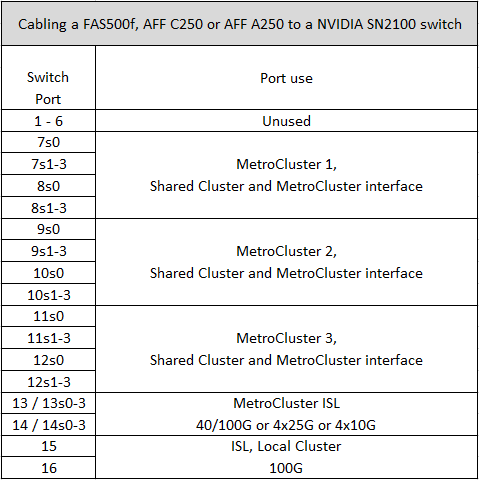
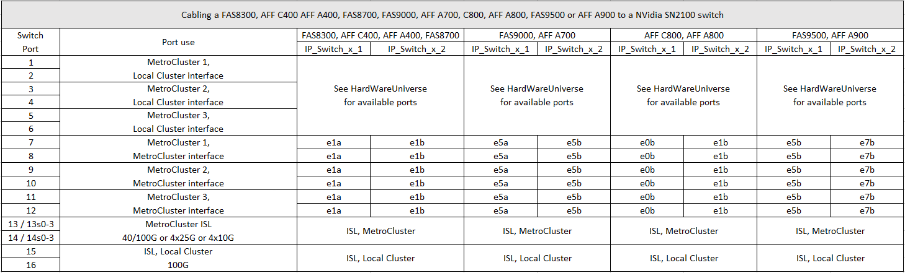

= Platform port assignments for NVIDIA supported SN2100 IP switches
:icons: font
:imagesdir: ../media/

[.lead]
The port usage in a MetroCluster IP configuration depends on the switch model and platform type.

== Supported configurations
The following platforms are currently supported:

* FAS500f / AFF C250 / AFF A250
* FAS8300 / AFF C400 / AFF A400
* FAS8700
* FAS9000 / AFF A700
* AFF C800 / AFF A800

The following platforms and configurations are not currently supported:

* MetroCluster FC-to-IP Transition
* An eight-node MetroCluster configuration

.Review these considerations before using the configuration tables

If you cable multiple MetroCluster configurations then follow the respective table.
For example:

* If you cable two four-node MetroCluster configurations of type AFF A700, then connect the first MetroCluster shown as "MetroCluster 1", and the second MetroCluster shown as "MetroCluster 2" in the AFF A700 table.

NOTE: Ports 13 and 14 can be used in native speed mode supporting 40 Gbps and 100 Gbps, or in breakout mode to support 4 × 25 Gbps or 4 × 10 Gbps. If they use native speed mode they are represented as ports 13 and 14. If they use breakout mode, either 4 × 25 Gbps or 4 × 10 Gbps, then they are represented as ports 13s0-3 and 14s0-3.

The following sections describe the physical cabling outline.  You can also refer to the https://mysupport.netapp.com/site/tools/tool-eula/rcffilegenerator[RcfFileGenerator] for detailed cabling information.

== Switch port usage for FAS500f, AFF C250, or AFF A250 

== Switch port usage for AFF C400, AFF A400, AFF A700 or FAS9000, FAS8300 or FAS8700 AFF A800

// 2023-MAR-9, BURT 1533595 (new C-Series platforms)

