= Cabling the IP switches
:icons: font
:imagesdir: ../media/

[.lead]
You must cable each IP switch to the local controller modules and to the ISLs.

* This task must be repeated for each switch in the MetroCluster configuration.
* The controller module Ethernet port usage depends on the model of the controller module.

== Using the port tables with the RcfFileGenerator tool or multiple MetroCluster configurations

[.lead]
You must understand how to use the information in the port tables to correctly generate your RCF files.

Review these considerations before using the tables:

* The following tables show the port usage for site A. The same cabling is used for site B.
* The switches cannot be configured with ports of different speeds (for example, a mix of 100 Gbps ports and 40 Gbps ports).
* Keep track of the MetroCluster port group (MetroCluster 1, MetroCluster 2, etc.). You will need it when using the RcfFileGenerator tool as described later in this configuration procedure.

* The RcfFileGenerator for MetroCluster IP also provides a per-port cabling overview for each switch.
+
Use this cabling overview to verify your cabling.

=== Cabling eight-node MetroCluster configurations

For MetroCluster configuration running ONTAP 9.8 and earlier, some procedures that are performed to transition an upgrade require the addition of a second four-node DR group to the configuration to create a temporary eight-node configuration.  Starting with ONTAP 9.9.1, permanent 8-node MetroCluster configurations are supported.

For such configurations, you use the same method as described above. Instead of a second MetroCluster, you are cabling an additional four-node DR group.

For example, your configuration includes the following:

* Cisco 3132Q-V switches
* MetroCluster 1: FAS2750 platforms
* MetroCluster 2: AFF A700 platforms (these platforms are being added as a second four-node DR group)

For MetroCluster 1, cable the Cisco 3132Q-V switches using the table for the FAS2750 platform and the rows for MetroCluster 1 interfaces.

For MetroCluster 2 (the second DR group), cable the Cisco 3132Q-V switches using the table for the AFF A700 platform and the rows for MetroCluster 2 interfaces.

// 21 APR 2021, BURT 1374268

== Platform port assignments for Cisco 3132Q-V switches

[.lead]
The port usage in a MetroCluster IP configuration depends on the switch model and platform type.

=== Port usage for FAS2750 or AFF A220 systems and a Cisco 3132Q-V switch

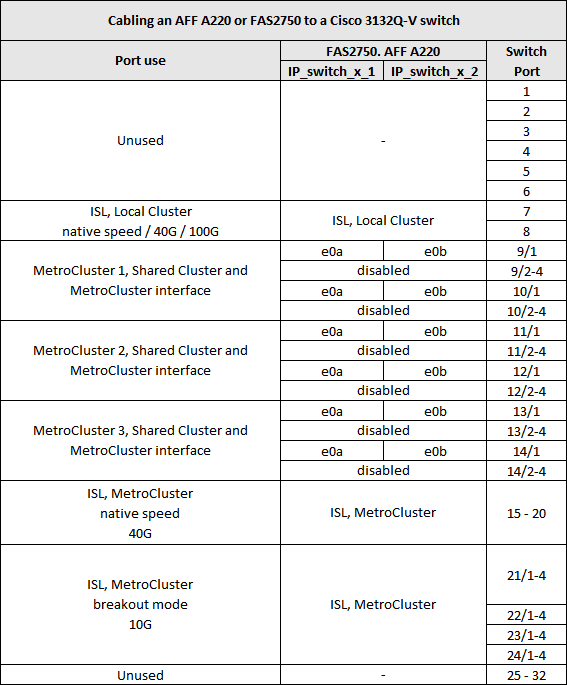

=== Port usage for FAS9000, AFF A700 and a Cisco 3132Q-V switch

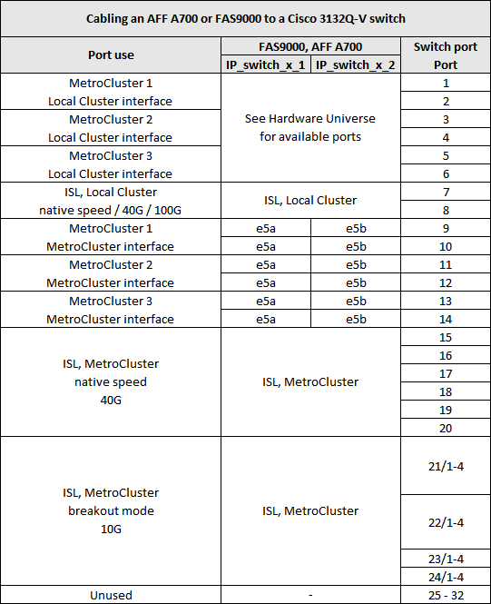

=== Port usage for AFF A800 and a Cisco 3132Q-V switch

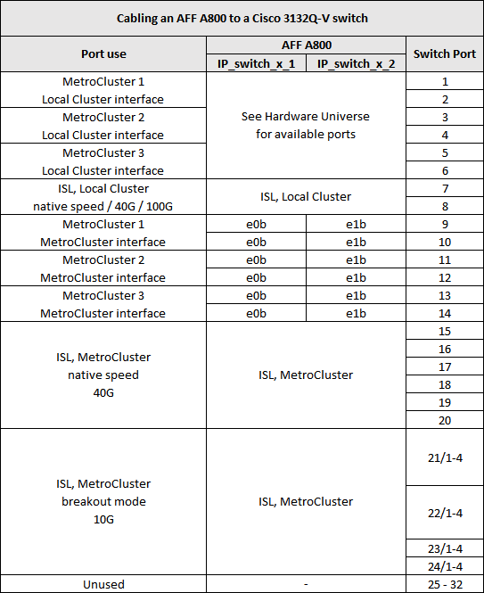

== Platform port assignments for Cisco 3232C or Cisco 9336C switches

[.lead]
The port usage in a MetroCluster IP configuration depends on the switch model and platform type.

Review these considerations before using the tables:

* The following tables show the port usage for site A. The same cabling is used for site B.
* The switches cannot be configured with ports of different speeds (for example, a mix of 100 Gbps ports and 40 Gbps ports).
* If you are configuring a single MetroCluster with the switches, use the *MetroCluster 1* port group.
+
Keep track of the MetroCluster port group (MetroCluster 1, MetroCluster 2, or MetroCluster 3). You will need it when using the RcfFileGenerator tool as described later in this configuration procedure.

* The RcfFileGenerator for MetroCluster IP also provides a per-port cabling overview for each switch.
+
Use this cabling overview to verify your cabling.

=== Cabling two MetroCluster configurations to the switches

When cabling more than one MetroCluster configuration to a Cisco 3132Q-V switch, then cable each MetroCluster according to the appropriate table. For example, if cabling a FAS2750 and an A700 to the same Cisco 3132Q-V switch. Then you cable the FAS2750 as per 'MetroCluster 1' in Table 1, and the A700 as per 'MetroCluster 2' or 'MetroCluster 3' in Table 2. You cannot physically cable both the FAS2750 and A700 as 'MetroCluster 1'.

=== Cabling a FAS2750 or AFF A220 system to a Cisco 3232C or Cisco 9336C switch

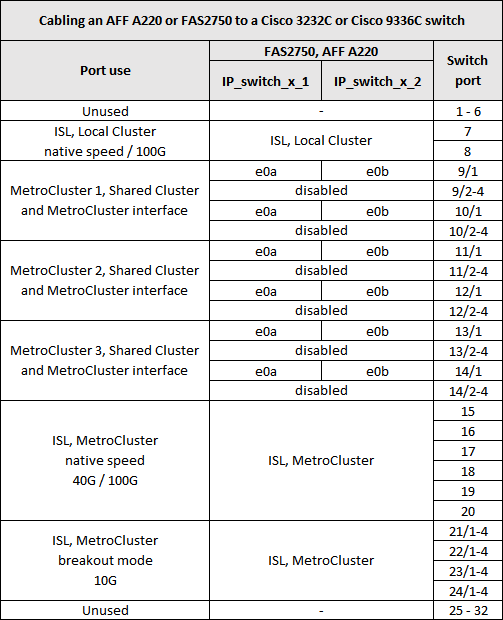

=== Cabling a AFF A300 or FAS8200 to a Cisco 3232C or Cisco 9336C switch

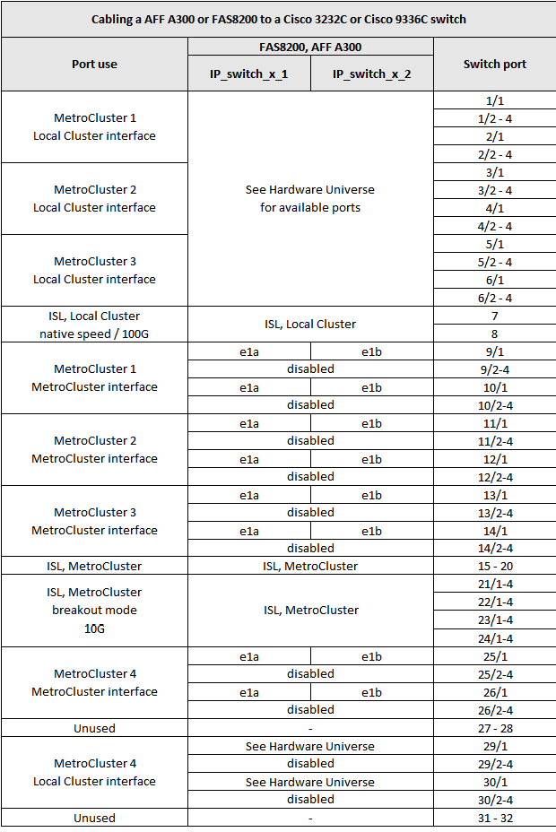

=== Cabling a AFF A250 or FAS500f to a Cisco 3232C or Cisco 9336C switch

image::../media/delete_me_mcc_ip_cabling_an_aff_a250_or_fas500f_to_a_cisco_3232c_or_cisco_9336c_switch.png[]

=== Cabling a AFF A320 to a Cisco 3232C or Cisco 9336C switch

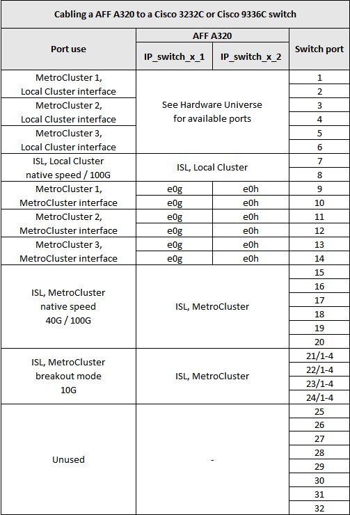

=== Cabling an AFF A400, FAS8300 or FAS8700 to a Cisco 3232C or Cisco 9336C switch

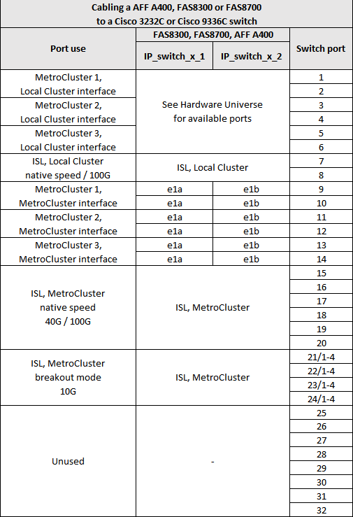

=== Cabling a AFF A700 or FAS9000 to a Cisco 3232C or Cisco 9336C switch

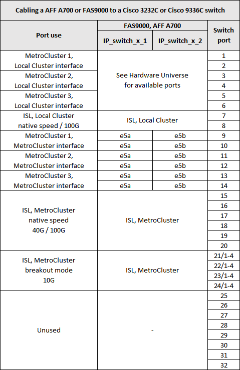

=== Cabling a AFF A800 to a Cisco 3232C or Cisco 9336C switch

image::../media/delete_me_cabling_an_aff_a800_to_a_cisco_3232c_or_cisco_9336c_switch.png[]

=== Cabling an AFF A320, AFF A400, AFF A700 or AFF A800 to a Cisco 9336C-FX2 shared switch

image::../media/mcc_ip_cabling_aff_a320_a400_a700_a800_to_cisco_9336c_shared_switch.png[]

image::../media/mcc_interfaces_per_platform_9336-shared.png[]

== Platform port assignments for Broadcom supported BES-53248 IP switches

[.lead]
The port usage in a MetroCluster IP configuration depends on the switch model and platform type.

The switches cannot be configured with ports of different speeds (for example, a mix of 25 Gbps ports and 10 Gbps ports).

Notes for the tables below:

. For some platforms, you can use ports 49 - 54 for MetroCluster ISLs or MetroCluster interface connections.
+
These ports requires an additional license.

. Only a single AFF A320 system can be connected to the switch and no other platform can be connected at the same time.
+
Features that require a switched cluster are not supported in this configuration, including MetroCluster FC to IP transition and tech refresh procedures.

. AFF A320 systems configured with Broadcom BES-53248 switches might not support all features.
+
Any configuration or feature that requires that the local cluster connections are connected to a switch is not supported. For example, the following configurations and procedures are not supported:

 ** Eight-node MetroCluster configurations
 ** Transitioning from MetroCluster FC to MetroCluster IP configurations
 ** Refreshing a four-node MetroCluster IP configuration (ONTAP 9.8 and later)

=== Switch port usage for AFF A220 or FAS2750 systems

image::../media/delete_me_mcc_ip_cabling_a_aff_a220_or_fas2750_to_a_broadcom_bes_53248_switch.png[]

=== Switch port usage for AFF A250 or FAS500f systems

image::../media/delete_me_mcc_ip_cabling_a_aff_a250_or_fas500f_to_a_broadcom_bes_53248_switch.png[]

=== Switch port usage for AFF A300 or FAS8200 systems

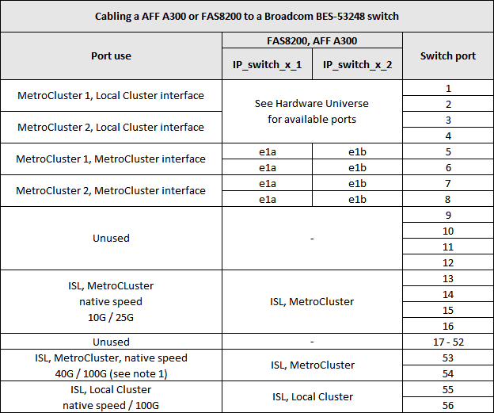

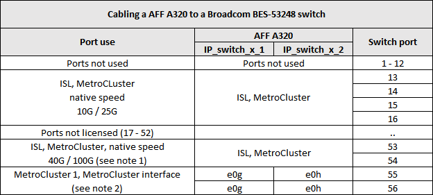

=== Switch port usage for AFF A400, FAS8300 or FAS8700 systems

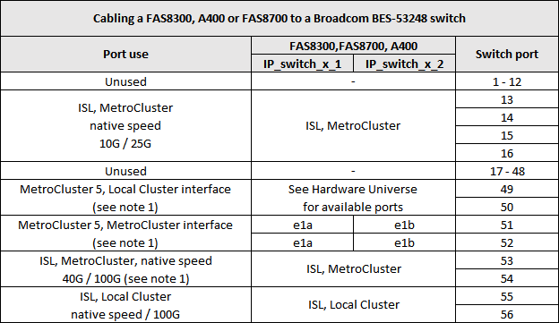
