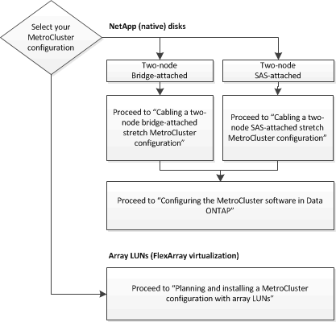

= Choosing the correct installation procedure for your configuration
:icons: font
:imagesdir: ../media/

[.lead]
You must choose the correct installation procedure based on whether you are using FlexArray LUNs and how the storage controllers connect to storage shelves.

[options="header"]
|===
| For this installation type...| Use these procedures...
a|
Two-node stretch configuration with FC-to SAS bridges
a|

. link:task_configure_the_mcc_hardware_components_2_node_stretch_atto.html[Cabling a two-node bridge-attached stretch MetroCluster configuration]
. link:concept_configuring_the_mcc_software_in_ontap.html[Configuring the MetroCluster software in ONTAP]

a|
Two-node stretch configuration with direct-attached SAS cabling
a|

. link:task_configure_the_mcc_hardware_components_2_node_stretch_sas.html[Cabling a two-node SAS-attached stretch MetroCluster configuration]
. link:concept_configuring_the_mcc_software_in_ontap.html[Configuring the MetroCluster software in ONTAP]

a|
Installation with array LUNs
a|
link:concept_stretch_mcc_configuration_with_array_luns.html[Connections in a stretch MetroCluster configurations with array LUNs]
|===
