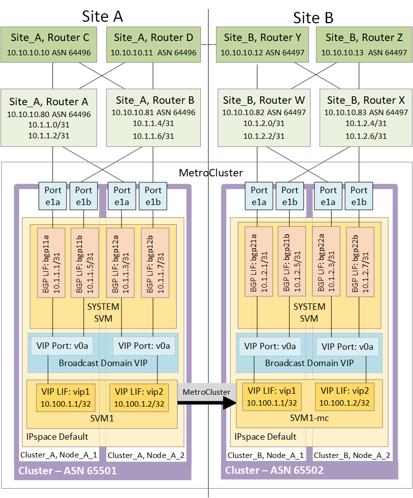

= Considerations for using virtual IP and Border Gateway Protocol with a MetroCluster configuration
:icons: font
:imagesdir: ../media/

[.lead]
Beginning with ONTAP 9.5, ONTAP supports layer 3 connectivity using virtual IP (VIP) and Border Gateway Protocol (BGP). The combination VIP and BGP for redundancy in the front-end networking with the back-end MetroCluster redundancy provides a layer 3 disaster recovery solution.

Review the following guidelines and illustration when planning your layer 3 solution. For details on implementing VIP and BGP in ONTAP, refer to the following section:

http://docs.netapp.com/ontap-9/topic/com.netapp.doc.dot-cm-nmg/GUID-A8EF6D34-1717-4813-BBFA-AA33E104CF6F.html[*Configuring virtual IP (VIP) LIFs*]

*ONTAP limitations*

ONTAP does not automatically verify that all nodes on both sites of the MetroCluster configuration are configured with BGP peering.

ONTAP does not perform route aggregation but announces all individual virtual LIF IPs as unique host routes at all times.

ONTAP does not support true AnyCast -- only a single node in the cluster presents a specific virtual LIF IP (but is accepted by all physical interfaces, regardless of whether they are BGP LIFs, provided the physical port is part of the correct IPspace). Different LIFs can migrate independently of each other to different hosting nodes.

*Guidelines for using this Layer 3 solution with a MetroCluster configuration*

You must configure your BGP and VIP correctly to provide the required redundancy.

Simpler deployment scenarios are preferred over more complex architectures (for example, a BGP peering router is reachable across an intermediate, non-BGP router). However, ONTAP does not enforce network design or topology restrictions.

VIP LIFs only cover the frontend/data network.

Depending on your version of ONTAP, you must configure BGP peering LIFs in the node SVM, not the system or data SVM. In ONTAP 9.8, the BGP LIFs are visible in the cluster (system) SVM and the node SVMs are no longer present.

Each data SVM requires the configuration of all potential first hop gateway addresses (typically, the BGP router peering IP address), so that the return data path is available if a LIF migration or MetroCluster failover occurs.

BGP LIFs are node specific, similar to intercluster LIFs -- each node has a unique configuration, which does not need to be replicated to DR site nodes.

The existence of the v0a (v0b and so on.) continuously validates the connectivity, guaranteeing that a LIF migrate or failover succeeds (unlike L2, where a broken configuration is only visible after the outage).

A major architectural difference is that clients should no longer share the same IP subnet as the VIP of data SVMs. An L3 router with appropriate enterprise grade resiliency and redundancy features enabled (for example, VRRP/HSRP) should be on the path between storage and clients for the VIP to operate correctly.

The reliable update process of BGP allows for smoother LIF migrations because they are marginally faster and have a lower chance of interruption to some clients.

You can configure BGP to detect some classes of network or switch misbehaviors faster than LACP, if configured accordingly.

External BGP (EBGP) uses different AS numbers between ONTAP node(s) and peering routers and is the preferred deployment to ease route aggregation and redistribution on the routers. Internal BGP (IBGP) and the use of route reflectors is not impossible but outside the scope of a straightforward VIP setup.

After deployment, you must check that the data SVM is accessible when the associated virtual LIF is migrated between all nodes on each site (including MetroCluster switchover) to verify the correct configuration of the static routes to the same data SVM.

VIP works for most IP-based protocols (NFS, SMB, iSCSI).
