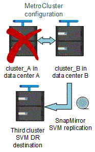

= Considerations when using ONTAP in a MetroCluster configuration
:icons: font
:imagesdir: ../media/

[.lead]
When using ONTAP in a MetroCluster configuration, you should be aware of certain considerations for licensing, peering to clusters outside the MetroCluster configuration, performing volume operations, NVFAIL operations, and other ONTAP operations.

== Licensing considerations

* Both sites should be licensed for the same site-licensed features.
* All nodes should be licensed for the same node-locked features.

== SnapMirror consideration

* SnapMirror SVM disaster recovery is only supported on MetroCluster configurations running versions of ONTAP 9.5 or later.

== MetroCluster operations in ONTAP System Manager

[.lead]
Depending on your ONTAP version, some MetroCluster-specific operations can be performed using ONTAP System Manager.

* Switchover and switchback in MetroCluster IP configurations (starting in ONTAP 9.7).
* Provision and grow of mirrored aggregates in the MetroCluster IP configurations (starting in ONTAP 9.8).
+
Unmirrored aggregates are not supported in System Manager.

== FlexCache support in a MetroCluster configuration

[.lead]
Starting with ONTAP 9.7, FlexCache volumes are supported on MetroCluster configurations. You should be aware of requirements for manual repeering after switchover or switchback operations.

=== SVM repeering after switchover when FlexCache origin and cache are within the same MetroCluster site

After a negotiated or unplanned switchover, any SVM FlexCache peering relationship within the cluster must be manually configured.

For example, SVMs vs1 (cache) and vs2 (origin) are on site_A. These SVMs are peered.

After switchover, SVMs vs1-mc and vs2-mc are activated at the partner site (site_B). They must be manually repeered for FlexCache to work using the `vserver peer repeer` command.

=== SVM repeering after switchover or switchback when a FlexCache destination is on a third cluster and in disconnected mode

For FlexCache relationships to a cluster outside of the MetroCluster configuration, the peering must always be manually reconfigured after a switchover if the involved clusters are in disconnected mode during switchover.

For example:

* One end of the FlexCache (cache_1 on vs1) resides on MetroCluster site_A has one end of the FlexCache
* The other end of the FlexCache (origin_1 on vs2) resides on site_C (not in the MetroCluster configuration)

When switchover is triggered, and if site_A and site_C are not connected, you must manually repeer the SVMs on site_B (the switchover cluster) and site_C using the `vserver peer repeer` command after the switchover.

When switchback is performed, you must again repeer the SVMs on site_A (the original cluster) and site_C.

== FabricPool support in MetroCluster configurations

[.lead]
Starting with ONTAP 9.7, MetroCluster configurations support FabricPool storage tiers.

For general information on using FabricPools, see the link:https://docs.netapp.com/ontap-9/topic/com.netapp.doc.dot-cm-psmg/home.html[Disks and Aggregates Power Guide].

=== Considerations when using FabricPools

* The clusters must have FabricPool licenses with matching capacity limits.
* The clusters must have IPSpaces with matching names.
+
This can be the default IPSpace, or an IP space an administer has created. This IPSpace will be used for FabricPool object store configuration setups.

* For the selected IPSpace, each cluster must have an intercluster LIF defined that can reach the external object store

=== Configuring an aggregate for use in a mirrored FabricPool

NOTE: Before you configure the aggregate you must set up object stores as described in "Setting up object stores for FabricPool in a MetroCluster configuration" in the link:https://docs.netapp.com/ontap-9/topic/com.netapp.doc.dot-cm-psmg/home.html[Disks and Aggregates Power Guide].

To configure an aggregate for use in a FabricPool:

. Create the aggregate or select an existing aggregate.
. Mirror the aggregate as a typical mirrored aggregate within the MetroCluster configuration.
. Create the FabricPool mirror with the aggregate, as described in the link:https://docs.netapp.com/ontap-9/topic/com.netapp.doc.dot-cm-psmg/home.html[Disks and Aggregates Power Guide]:

 .. Attach a primary object store.
+
This object store is physically closer to the cluster.

 .. Add a mirror object store.
+
This object store is physically further distant to the cluster than the primary object store.

== FlexGroup support in MetroCluster configurations

Starting with ONTAP 9.6 MetroCluster configurations support FlexGroup volumes.

== Job schedules in a MetroCluster configuration

[.lead]
In ONTAP 9.3 and later, user-created job schedules are automatically replicated between clusters in a MetroCluster configuration. If you create, modify, or delete a job schedule on a cluster, the same schedule is automatically created on the partner cluster, using Configuration Replication Service (CRS).

NOTE: System-created schedules are not replicated and you must manually perform the same operation on the partner cluster so that job schedules on both clusters are identical.

== Cluster peering from the MetroCluster site to a third cluster

[.lead]
Because the peering configuration is not replicated, if you peer one of the clusters in the MetroCluster configuration to a third cluster outside of that configuration, you must also configure the peering on the partner MetroCluster cluster. This is so that peering can be maintained if a switchover occurs.

The non-MetroCluster cluster must be running ONTAP 8.3 or later. If not, peering is lost if a switchover occurs even if the peering has been configured on both MetroCluster partners.

== LDAP client configuration replication in a MetroCluster configuration

An LDAP client configuration created on a storage virtual machine (SVM) on a local cluster is replicated to its partner data SVM on the remote cluster. For example, if the LDAP client configuration is created on the admin SVM on the local cluster, then it is replicated to all the admin data SVMs on the remote cluster. This MetroCluster feature is intentional so that the LDAP client configuration is active on all the partner SVMs on the remote cluster.

== Networking and LIF creation guidelines for MetroCluster configurations

[.lead]
You should be aware of how LIFs are created and replicated in a MetroCluster configuration. You must also know about the requirement for consistency so that you can make proper decisions when configuring your network.

*Related information*

https://docs.netapp.com/ontap-9/topic/com.netapp.doc.dot-cm-concepts/home.html[ONTAP concepts]

=== IPspace object replication and subnet configuration requirements

[.lead]
You should be aware of the requirements for replicating IPspace objects to the partner cluster and for configuring subnets and IPv6 in a MetroCluster configuration.

==== IPspace replication

You must consider the following guidelines while replicating IPspace objects to the partner cluster:

* The IPspace names of the two sites must match.
* IPspace objects must be manually replicated to the partner cluster.
+
Any storage virtual machines (SVMs) that are created and assigned to an IPspace before the IPspace is replicated will not be replicated to the partner cluster.

==== Subnet configuration

You must consider the following guidelines while configuring subnets in a MetroCluster configuration:

* Both clusters of the MetroCluster configuration must have a subnet in the same IPspace with the same subnet name, subnet, broadcast domain, and gateway.
* The IP ranges of the two clusters must be different.
+
In the following example, the IP ranges are different:
+
----
cluster_A::> network subnet show

IPspace: Default
Subnet                     Broadcast                   Avail/
Name      Subnet           Domain    Gateway           Total    Ranges
--------- ---------------- --------- ------------      -------  ---------------
subnet1   192.168.2.0/24   Default   192.168.2.1       10/10    192.168.2.11-192.168.2.20

cluster_B::> network subnet show
 IPspace: Default
Subnet                     Broadcast                   Avail/
Name      Subnet           Domain    Gateway           Total    Ranges
--------- ---------------- --------- ------------     --------  ---------------
subnet1   192.168.2.0/24   Default   192.168.2.1       10/10    192.168.2.21-192.168.2.30
----

==== IPv6 configuration

If IPv6 is configured on one site, IPv6 must be configured on the other site as well.

=== Requirements for LIF creation in a MetroCluster configuration

[.lead]
You should be aware of the requirements for creating LIFs when configuring your network in a MetroCluster configuration.

You must consider the following guidelines when creating LIFs:

* Fibre Channel: You must use stretched VSAN or stretched fabrics
* IP/iSCSI: You must use layer 2 stretched network
* ARP broadcasts: You must enable ARP broadcasts between the two clusters
* Duplicate LIFs: You must not create multiple LIFs with the same IP address (duplicate LIFs) in an IPspace
* NFS and SAN configurations: You must use different storage virtual machines (SVMs) for both the unmirrored and mirrored aggregates

==== Verify LIF creation

You can confirm the successful creation of a LIF in a MetroCluster configuration by running the `metrocluster check lif show` command. If you encounter any issues while creating the LIF, you can use the `metrocluster check lif repair-placement` command to fix the issues.

=== LIF replication and placement requirements and issues

[.lead]
You should be aware of the LIF replication requirements in a MetroCluster configuration. You should also know how a replicated LIF is placed on a partner cluster, and you should be aware of the issues that occur when LIF replication or LIF placement fails.

==== Replication of LIFs to the partner cluster

When you create a LIF on a cluster in a MetroCluster configuration, the LIF is replicated on the partner cluster. LIFs are not placed on a one-to-one name basis. For availability of LIFs after a switchover operation, the LIF placement process verifies that the ports are able to host the LIF based on reachability and port attribute checks.

The system must meet the following conditions to place the replicated LIFs on the partner cluster:

[options="header"]
|===
| Condition| LIF type: FC| LIF type: IP/iSCSI
a|
Node identification
a|
ONTAP attempts to place the replicated LIF on the disaster recovery (DR) partner of the node on which it was created.

If the DR partner is unavailable, the DR auxiliary partner is used for placement.

a|
ONTAP attempts to place the replicated LIF on the DR partner of the node on which it was created.

If the DR partner is unavailable, the DR auxiliary partner is used for placement.

a|
Port identification
a|
ONTAP identifies the connected FC target ports on the DR cluster.
a|
The ports on the DR cluster that are in the same IPspace as the source LIF are selected for a reachability check.

If there are no ports in the DR cluster in the same IPspace, the LIF cannot be placed.

All of the ports in the DR cluster that are already hosting a LIF in the same IPspace and subnet are automatically marked as reachable; and can be used for placement. These ports are not included in the reachability check.

a|
Reachability check
a|
Reachability is determined by checking for the connectivity of the source fabric WWN on the ports in the DR cluster.

If the same fabric is not present at the DR site, the LIF is placed on a random port on the DR partner.

a|
Reachability is determined by the response to an Address Resolution Protocol (ARP) broadcast from each previously identified port on the DR cluster to the source IP address of the LIF to be placed.

For reachability checks to succeed, ARP broadcasts must be allowed between the two clusters.

Each port that receives a response from the source LIF will be marked as possible for placement.

a|
Port selection
a|
ONTAP categorizes the ports based on attributes such as adapter type and speed, and then selects the ports with matching attributes.

If no ports with matching attributes are found, the LIF is placed on a random connected port on the DR partner.

a|
From the ports that are marked as reachable during the reachability check, ONTAP prefers ports that are in the broadcast domain that is associated with the subnet of the LIF.

If there are no network ports available on the DR cluster that are in the broadcast domain that is associated with the subnet of the LIF, then ONTAP selects ports that have reachability to the source LIF.

If there are no ports with reachability to the source LIF, a port is selected from the broadcast domain that is associated with the subnet of the source LIF, and if no such broadcast domain exists, a random port is selected.

ONTAP categorizes the ports based on attributes such as adapter type, interface type, and speed, and then selects the ports with matching attributes.

a|
LIF placement
a|
From the reachable ports, ONTAP selects the least loaded port for placement.
a|
From the selected ports, ONTAP selects the least loaded port for placement.
|===

==== Placement of replicated LIFs when the DR partner node is down

When an iSCSI or FC LIF is created on a node whose DR partner has been taken over, the replicated LIF is placed on the DR auxiliary partner node. After a subsequent giveback operation, the LIFs are not automatically moved to the DR partner. This can lead to LIFs being concentrated on a single node in the partner cluster. During a MetroCluster switchover operation, subsequent attempts to map LUNs belonging to the storage virtual machine (SVM) fail.

You should run the `metrocluster check lif show` command after a takeover operation or giveback operation to verify that the LIF placement is correct. If errors exist, you can run the `metrocluster check lif repair-placement` command to resolve the issues.

==== LIF placement errors

LIF placement errors that are displayed by the `metrocluster check lif show` command are retained after a switchover operation. If the `network interface modify`, `network interface rename`, or `network interface delete` command is issued for a LIF with a placement error, the error is removed and does not appear in the output of the `metrocluster check lif show` command.

==== LIF replication failure

You can also check whether LIF replication was successful by using the `metrocluster check lif show` command. An EMS message is displayed if LIF replication fails.

You can correct a replication failure by running the `metrocluster check lif repair-placement` command for any LIF that fails to find a correct port. You should resolve any LIF replication failures as soon as possible to verify the availability of LIF during a MetroCluster switchover operation.

NOTE: Even if the source SVM is down, LIF placement might proceed normally if there is a LIF belonging to a different SVM in a port with the same IPspace and network in the destination SVM.

=== Volume creation on a root aggregate

[.lead]
The system does not allow the creation of new volumes on the root aggregate (an aggregate with an HA policy of CFO) of a node in a MetroCluster configuration.

Because of this restriction, root aggregates cannot be added to an SVM using the `vserver add-aggregates` command.

== SVM disaster recovery in a MetroCluster configuration

[.lead]
Starting with ONTAP 9.5, active storage virtual machines (SVMs) in a MetroCluster configuration can be used as sources with the SnapMirror SVM disaster recovery feature. The destination SVM must be on the third cluster outside of the MetroCluster configuration.

You should be aware of the following requirements and limitations of using SVMs with SnapMirror disaster recovery:

* Only an active SVM within a MetroCluster configuration can be the source of an SVM disaster recovery relationship.
+
A source can be a sync-source SVM before switchover or a sync-destination SVM after switchover.

* When a MetroCluster configuration is in a steady state, the MetroCluster sync-destination SVM cannot be the source of an SVM disaster recovery relationship, since the volumes are not online.
+
The following image shows the SVM disaster recovery behavior in a steady state:
+
image::../media/delete_me2_svm_dr_normal_behavior.gif[]

* When the sync-source SVM is the source of an SVM DR relationship, the source SVM DR relationship information is replicated to the MetroCluster partner.
+
This enables the SVM DR updates to continue after a switchover as shown in the following image:
+

* During the switchover and switchback processes, replication to the SVM DR destination might fail.
+
However, after the switchover or switchback process completes, the next SVM DR scheduled updates will succeed.

See the section "`Replicating the SVM configuration`" in the http://docs.netapp.com/ontap-9/topic/com.netapp.doc.pow-dap/home.html:[Data Protection Power Guide] for details on configuring an SVM DR relationship.

=== SVM resynchronization at a disaster recovery site

[.lead]
During resynchronization, the storage virtual machines (SVMs) disaster recovery (DR) source on the MetroCluster configuration is restored from the destination SVM on the non-MetroCluster site.

During resynchronization, the source SVM (cluster_A) temporarily acts as a destination SVM as shown in the following image:

image::../media/delete_me2_svm_dr_resynchronization.gif[]

==== If an unplanned switchover occurs during resynchronization

Unplanned switchovers that occur during the resynchronization will halt the resynchronization transfer. If an unplanned switchover occurs, the following conditions are true:

* The destination SVM on the MetroCluster site (which was a source SVM prior to resynchronization) remains as a destination SVM. The SVM at the partner cluster will continue to retain its subtype and remain inactive.
* The SnapMirror relationship must be re-created manually with the sync-destination SVM as the destination.
* The SnapMirror relationship does not appear in the SnapMirror show output after a switchover at the survivor site unless a SnapMirror create operation is executed.

==== Performing switchback after an unplanned switchover during resynchronization

To successfully perform the switchback process, the resynchronization relationship must be broken and deleted. Switchback is not permitted if there are any SnapMirror DR destination SVMs in the MetroCluster configuration or if the cluster has an SVM of subtype "`dp-destination`".

== Output of the storage disk show and storage shelf show commands in a two-node stretch MetroCluster configuration

[.lead]
In a two-node stretch MetroCluster configuration, the `is-local-attach` field of the `storage disk show` and `storage shelf show` commands shows all of the disks and storage shelves as local, regardless of the node to which they are attached.

== Output for the storage aggregate plex show command is indeterminate after a MetroCluster switchover

[.lead]
When you run the `storage aggregate plex show` command after a MetroCluster switchover, the status of plex0 of the switched over root aggregate is indeterminate and is displayed as `failed`. During this time, the switched over root is not updated. The actual status of this plex can only be determined after the MetroCluster healing phase.

== Modifying volumes to set the NVFAIL flag in case of switchover

[.lead]
You can modify a volume so that the NVFAIL flag is set on the volume in the event of a MetroCluster switchover. The NVFAIL flag causes the volume to be fenced off from any modification. This is required for volumes that need to be handled as if committed writes to the volume were lost after the switchover.

NOTE: In ONTAP versions earlier than 9.0, the NVFAIL flag is used for each switchover. In ONTAP 9.0 and later versions, the unplanned switchover (USO) is used.

.Steps
. Enable MetroCluster configuration to trigger NVFAIL on switchover by setting the `vol -dr-force-nvfail` parameter to on:
+
`*vol modify -vserver _vserver-name_ -volume _volume-name_ -dr-force-nvfail on*`
