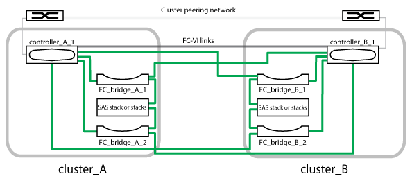

= Parts of a two-node bridge-attached stretch MetroCluster configuration
:icons: font
:imagesdir: ../media/

[.lead]
As you plan your MetroCluster configuration, you should understand the parts of the configuration and how they work together.

The MetroCluster configuration includes the following key hardware elements:

* Storage controllers
+
The storage controllers are not connected directly to the storage but connected to FC-to-SAS bridges. The storage controllers are connected to each other by FC cables between each controller's FC-VI adapters.
+
Each storage controller is configured as a DR partner to a storage controller on the partner site.

* FC-to-SAS bridges
+
The FC-to-SAS bridges connect the SAS storage stacks to the FC initiator ports on the controllers, providing bridging between the two protocols.

* Cluster peering network
+
The cluster peering network provides connectivity for mirroring of the storage virtual machine (SVM) configuration. The configuration of all SVMs on one cluster is mirrored to the partner cluster.

The following illustration shows a simplified view of the MetroCluster configuration. For some connections, a single line represents multiple, redundant connections between the components. Data and management network connections are not shown.

* The configuration consists of two single-node clusters.
* Each site has one or more stacks of SAS storage.
+
NOTE: SAS shelves in MetroCluster configurations are not supported with ACP cabling.
+
Additional storage stacks are supported, but only one is shown at each site.
