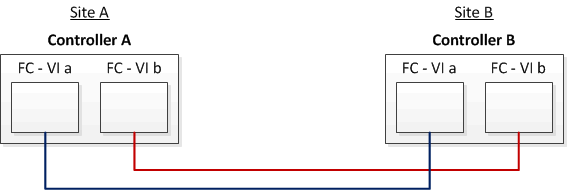

= Example of a stretch MetroCluster configuration with array LUNs
:icons: font
:imagesdir: ../media/

[.lead]
In a stretch MetroCluster configuration with array LUNs, you must cable the FC-VI ports for direct connectivity between the controllers. In addition, you must cable each controller's HBA ports to switch ports on the corresponding FC switches. Cabling to the array LUNs is the same as that in a fabric-attached MetroCluster, except for E-Series array LUNs, which can be directly connected.

The following illustration shows the FC-VI ports cabled across controllers A and B in a stretch MetroCluster configuration:

NOTE: FAS9000 storage systems controller modules use four FC-VI ports each.

For configurations with E-Series array LUNs, you can directly attach the E-Series LUNs.

https://kb.netapp.com/Advice_and_Troubleshooting/Data_Protection_and_Security/MetroCluster/Direct_Attach_support_for_Stretch_MetroCluster_Configuration_with_NetApp_E-Series_array[Direct Attach support for Stretch MetroCluster Configuration with NetApp E-Series array]

Except for connecting the FC-VI ports, the rest of the procedure for setting up a MetroCluster configuration with array LUNs that are not using E-Series array LUNs requires FC switches and is the same as using array LUNs in fabric-attached configurations.

https://docs.netapp.com/ontap-9/topic/com.netapp.doc.dot-mcc-inst-cnfg-fabric/home.html[Fabric-attached MetroCluster installation and configuration]
