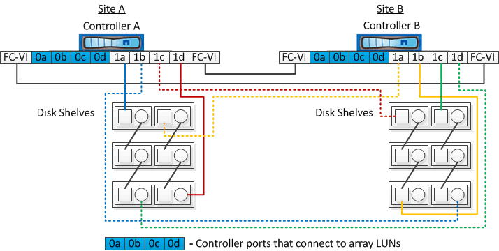
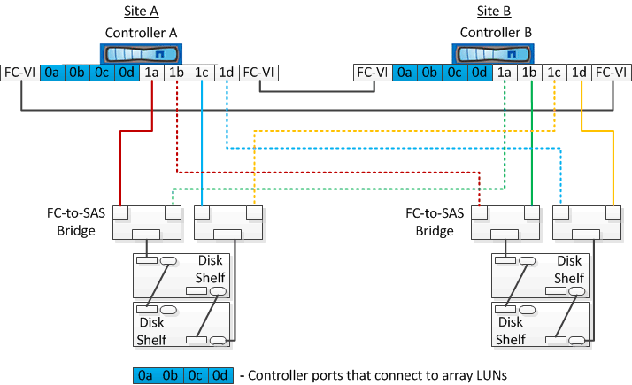

= Examples of two-node stretch MetroCluster configurations with disks and array LUNs
:icons: font
:imagesdir: ../media/

[.lead]
For setting up a stretch MetroCluster configuration with native disks and array LUNs, you must use either FC-to-SAS bridges or SAS optical cables to connect the ONTAP systems to the disk shelves. You must use FC switches for connecting array LUNs to the ONTAP systems.

A minimum of eight HBA ports is required for an ONTAP system to connect to both native disks and array LUNs.

In the following examples representing two-node stretch MetroCluster configurations with disks and array LUNs, HBA ports 0a through 0d are used for connection with array LUNs, while ports 1a through 1d are used for connections with native disks.

The following illustration shows a two-node stretch MetroCluster configuration in which the native disks are connected to the ONTAP systems through SAS optical cables:

The following illustration shows a two-node stretch MetroCluster configuration in which the native disks are connected to the ONTAP systems through FC-to-SAS bridges:

The following illustration shows a two-node stretch MetroCluster configuration with the array LUN connections:

image::../media/two_node_mcc_combined_array_luns.gif[]

NOTE: If required, you can also use the same FC switches to connect both native disks and array LUNs to the controllers in the MetroCluster configuration.

https://docs.netapp.com/us-en/ontap-metrocluster/install-fc/index.html[Fabric-attached MetroCluster installation and configuration]
