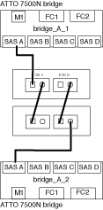

= Cabling a FibreBridge 7600N or 7500N bridge with shelves using IOM6 or IOM3 modules
:icons: font
:imagesdir: ../media/

[.lead]
After configuring the bridge, you can start cabling your new system. The FibreBridge 7600N or 7500N bridge uses mini-SAS connectors and supports shelves that use IOM6 or IOM3 modules.

IOM3 modules are not supported with FibreBridge 7600N bridges.

For disk shelves, you insert a SAS cable connector with the pull tab oriented down (on the underside of the connector).

. Daisy-chain the shelves in each stack.
 .. For the first stack of shelves, cable IOM A square port of the first shelf to SAS port A on FibreBridge A.
 .. For the first stack of shelves, cable IOM B circle port of the last shelf to SAS port A on FibreBridge B.

+
The _Installation and Service Guide_ for your shelf model provides detailed information about daisy-chaining shelves.
+
https://library.netapp.com/ecm/ecm_download_file/ECMP1119629[SAS Disk Shelves Installation and Service Guide for DS4243, DS2246, DS4486, and DS4246]
+
The following illustration shows a set of bridges cabled to a stack of shelves:
+

. For additional shelf stacks, repeat the previous steps using the next available SAS port on the FibreBridge bridges, using port B for a second stack, port C for a third stack, and port D for a fourth stack.
+
The following illustration shows four stacks connected to a pair of FibreBridge 7600N or 7500N bridges.
+
image::../media/delete_me2_mcc_cabling_bridge_and_sas_stack_with_7500n_four_stacks.gif[]
