= Replacing a pair of FibreBridge 6500N bridges with 7600N or 7500N bridges
:icons: font
:imagesdir: ../media/

[.lead]
To take advantage of the additional FC2 port on the FibreBridge 7600N or 7500N bridges and reduce rack utilization, you can nondisruptively replace 6500N bridges and consolidate up to four storage stacks behind a single pair of FibreBridge 7600N or 7500N bridges.

You need the admin password and access to an FTP or SCP server.

You should use this procedure if:

* You are replacing a pair of FibreBridge 6500N bridges with FibreBridge 7600N or 7500N bridges.
+
After the replacement, both bridges in the pair must be the same model.

* You previously replaced a single FibreBridge 6500N bridge with a 7600N or 7500N bridge and are now replacing the second bridge in the pair.
* You have a pair of FibreBridge 7600N or 7500N bridges with available SAS ports and you are consolidating SAS storage stacks that are currently connected using FibreBridge 6500N bridges.

This procedure is nondisruptive and takes approximately two hours to complete.

*Related information*

xref:task_replace_a_sle_fc_to_sas_bridge.adoc[Replacing a single FC-to-SAS bridge]

== Verifying storage connectivity

[.lead]
Before replacing bridges, you should verify bridge and storage connectivity. Familiarizing yourself with the command output enables you to subsequently confirm connectivity after making configuration changes.

You can issue these commands from the admin prompt of any of the controller modules in the MetroCluster configuration at the site undergoing maintenance.

. Confirm connectivity to the disks by entering the following command on any one of the MetroCluster nodes: `run local sysconfig -v`
+
The output shows the disks attached to the initiator ports on the controller, and identifies the shelves connected to the FC-to-SAS bridges:
+
----

node_A_1> run local sysconfig -v
NetApp Release 9.3.2X18: Sun Dec 13 01:23:24 PST 2017
System ID: 4068741258 (node_A_1); partner ID: 4068741260 (node_B_1)
System Serial Number: 940001025471 (node_A_1)
System Rev: 70
System Storage Configuration: Multi-Path HA**<=== Configuration should be multi-path HA**
.
.
.
slot 0: FC Host Adapter 0g (QLogic 8324 rev. 2, N-port, <UP>)**<=== Initiator port**
		Firmware rev:      7.5.0
		Flash rev:         0.0.0
		Host Port Id:      0x60130
		FC Node Name:      5:00a:098201:bae312
		FC Port Name:      5:00a:098201:bae312
		SFP Vendor:        UTILITIES CORP.
		SFP Part Number:   FTLF8529P3BCVAN1
		SFP Serial Number: URQ0Q9R
		SFP Capabilities:  4, 8 or 16 Gbit
		Link Data Rate:    16 Gbit
		Switch Port:       brcd6505-fcs40:1
  **<List of disks visible to port\>**
		 ID     Vendor   Model            FW    Size
		brcd6505-fcs29:12.126L1527     : NETAPP   X302_HJUPI01TSSM NA04 847.5GB (1953525168 512B/sect)
		brcd6505-fcs29:12.126L1528     : NETAPP   X302_HJUPI01TSSA NA02 847.5GB (1953525168 512B/sect)
		.
		.
		.
		**<List of FC-to-SAS bridges visible to port\>**
		FC-to-SAS Bridge:
		brcd6505-fcs40:12.126L0        : ATTO     FibreBridge6500N 1.61  FB6500N102980
		brcd6505-fcs42:13.126L0        : ATTO     FibreBridge6500N 1.61  FB6500N102980
		brcd6505-fcs42:6.126L0         : ATTO     FibreBridge6500N 1.61  FB6500N101167
		brcd6505-fcs42:7.126L0         : ATTO     FibreBridge6500N 1.61  FB6500N102974
		.
		.
		.
  **<List of storage shelves visible to port\>**
		brcd6505-fcs40:12.shelf6: DS4243  Firmware rev. IOM3 A: 0200  IOM3 B: 0200
		brcd6505-fcs40:12.shelf8: DS4243  Firmware rev. IOM3 A: 0200  IOM3 B: 0200
		.
		.
		.
----

== Hot-swapping FibreBridge 6500N bridges to create a pair of FibreBridge 7600N or 7500N bridges

[.lead]
To hot-swap one or two FibreBridge 6500N bridges to create a configuration with a pair of FibreBridge 7600N or 7500N bridges, you must replace the bridges one at a time and follow the correct cabling procedure. The new cabling is different from the original cabling.

You can also use this procedure if the following conditions are true:

* You are replacing a pair of FibreBridge 6500N bridges that are both connected to the same stack of SAS storage.
* You previously replaced one FibreBridge 6500N bridge in the pair, and your storage stack is configured with one FibreBridge 6500N bridge and one FibreBridge 7600N or 7500N bridge.
+
In this case, you should begin with xref:task_fb_consolidate_replace_a_pair_of_fibrebridge_6500n_bridges_with_7500n_bridges.adocSTEP_A73E3284C4DA4802BB16B212AA558349[Step 3].

The following diagram shows an example of the initial configuration, in which four FibreBridge 6500N bridges are connecting two SAS storage stacks:

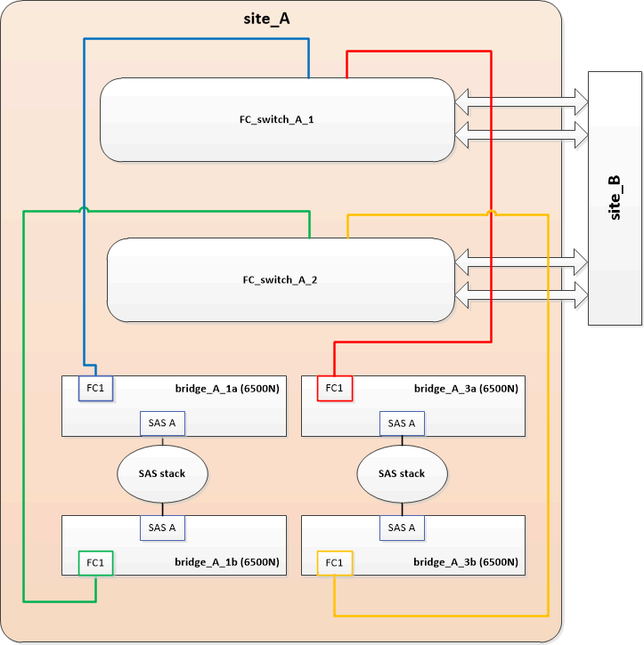

. Using the following guidelines, hot-swap the "`top`"FibreBridge 6500N bridge with a FibreBridge 7600N or 7500N bridge using the procedure in xref:task_replace_a_sle_fc_to_sas_bridge.adoc[Hot-swapping a FibreBridge 6500N bridge with a FibreBridge 7600N or 7500N bridge]:
 ** Connect the FibreBridge 7600N or 7500N bridge FC1 port to the switch or controller.
+
This is the same connection that was made to the FibreBridge 6500N bridge FC1 port.

 ** Do not connect the FibreBridge 7600N or 7500N bridge FC2 port at this time.
The following diagram shows that bridge_A_1a has been replaced and is now a FibreBridge 7600N or 7500N bridge:

+
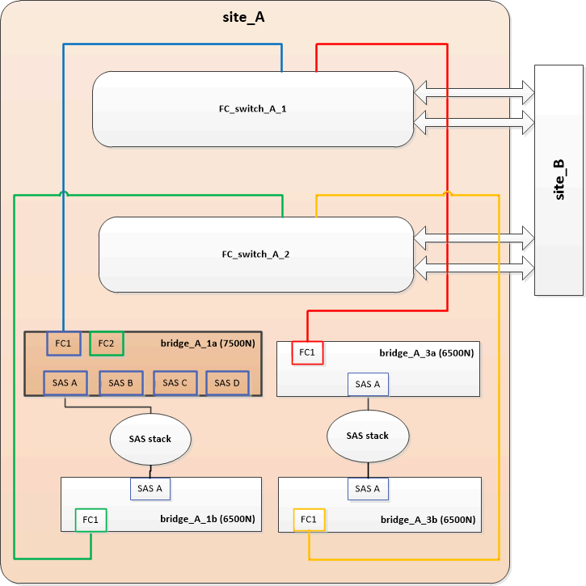
. Confirm connectivity to the bridge-connected disks and that the new FibreBridge 7500N is visible in the configuration: `run local sysconfig -v`
+
----

node_A_1> run local sysconfig -v
NetApp Release 9.3.2X18: Sun Dec 13 01:23:24 PST 2015
System ID: 0536872165 (node_A_1); partner ID: 0536872141 (node_B_1)
System Serial Number: 940001025465 (node_A_1)
System Rev: 70
System Storage Configuration: Multi-Path HA**<=== Configuration should be multi-path HA**
.
.
.
slot 0: FC Host Adapter 0g (QLogic 8324 rev. 2, N-port, <UP>)**<=== Initiator port**
		Firmware rev:      7.5.0
		Flash rev:         0.0.0
		Host Port Id:      0x60100
		FC Node Name:      5:00a:098201:bae312
		FC Port Name:      5:00a:098201:bae312
		SFP Vendor:        FINISAR CORP.
		SFP Part Number:   FTLF8529P3BCVAN1
		SFP Serial Number: URQ0R1R
		SFP Capabilities:  4, 8 or 16 Gbit
		Link Data Rate:    16 Gbit
		Switch Port:       brcd6505-fcs40:1
  **<List of disks visible to port\>**
		 ID     Vendor   Model            FW    Size
		brcd6505-fcs40:12.126L1527     : NETAPP   X302_HJUPI01TSSM NA04 847.5GB (1953525168 512B/sect)
		brcd6505-fcs40:12.126L1528     : NETAPP   X302_HJUPI01TSSA NA02 847.5GB (1953525168 512B/sect)
		.
		.
		.
		**<List of FC-to-SAS bridges visible to port\>**
		FC-to-SAS Bridge:
		brcd6505-fcs40:12.126L0        : ATTO     FibreBridge7500N A30H  FB7500N100104**<===**
		brcd6505-fcs42:13.126L0        : ATTO     FibreBridge6500N 1.61  FB6500N102980
		brcd6505-fcs42:6.126L0         : ATTO     FibreBridge6500N 1.61  FB6500N101167
		brcd6505-fcs42:7.126L0         : ATTO     FibreBridge6500N 1.61  FB6500N102974
		.
		.
		.
  **<List of storage shelves visible to port\>**
		brcd6505-fcs40:12.shelf6: DS4243  Firmware rev. IOM3 A: 0200  IOM3 B: 0200
		brcd6505-fcs40:12.shelf8: DS4243  Firmware rev. IOM3 A: 0200  IOM3 B: 0200
		.
		.
		.
----

. Using the following guidelines, hot-swap the "`bottom`"FibreBridge 6500N bridge with a FibreBridge 7600N or 7500N bridge using the procedure in xref:task_replace_a_sle_fc_to_sas_bridge.adoc[Hot-swapping a FibreBridge 6500N bridge with a FibreBridge 7600N or 7500N bridge]:
 ** Connect the FibreBridge 7600N or 7500N bridge FC2 port to the switch or controller.
+
This is the same connection that was made to the FibreBridge 6500N bridge FC1 port.

 ** Do not connect the FibreBridge 7600N or 7500N bridge FC1 port at this time.
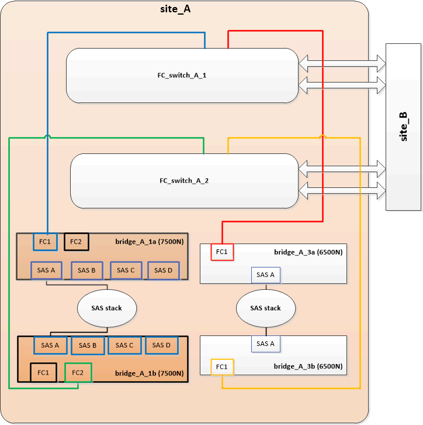
. Confirm connectivity to the bridge-connected disks: `run local sysconfig -v`
+
The output shows the disks attached to the initiator ports on the controller, and identifies the shelves connected to the FC-to-SAS bridges:
+
----

node_A_1> run local sysconfig -v
NetApp Release 9.3.2X18: Sun Dec 13 01:23:24 PST 2015
System ID: 0536872165 (node_A_1); partner ID: 0536872141 (node_B_1)
System Serial Number: 940001025465 (node_A_1)
System Rev: 70
System Storage Configuration: Multi-Path HA**<=== Configuration should be multi-path HA**
.
.
.
slot 0: FC Host Adapter 0g (QLogic 8324 rev. 2, N-port, <UP>)**<=== Initiator port**
		Firmware rev:      7.5.0
		Flash rev:         0.0.0
		Host Port Id:      0x60100
		FC Node Name:      5:00a:098201:bae312
		FC Port Name:      5:00a:098201:bae312
		SFP Vendor:        FINISAR CORP.
		SFP Part Number:   FTLF8529P3BCVAN1
		SFP Serial Number: URQ0R1R
		SFP Capabilities:  4, 8 or 16 Gbit
		Link Data Rate:    16 Gbit
		Switch Port:       brcd6505-fcs40:1
  **<List of disks visible to port\>**
		 ID     Vendor   Model            FW    Size
		brcd6505-fcs40:12.126L1527     : NETAPP   X302_HJUPI01TSSM NA04 847.5GB (1953525168 512B/sect)
		brcd6505-fcs40:12.126L1528     : NETAPP   X302_HJUPI01TSSA NA02 847.5GB (1953525168 512B/sect)
		.
		.
		.
		**<List of FC-to-SAS bridges visible to port\>**
		FC-to-SAS Bridge:
		brcd6505-fcs40:12.126L0        : ATTO     FibreBridge7500N A30H  FB7500N100104
		brcd6505-fcs42:13.126L0        : ATTO     FibreBridge7500N A30H  FB7500N100104
		.
		.
		.
  **<List of storage shelves visible to port\>**
		brcd6505-fcs40:12.shelf6: DS4243  Firmware rev. IOM3 A: 0200  IOM3 B: 0200
		brcd6505-fcs40:12.shelf8: DS4243  Firmware rev. IOM3 A: 0200  IOM3 B: 0200
		.
		.
		.
----

== Cabling the bridge SAS ports when consolidating storage behind FibreBridge 7600N or 7500N bridges

[.lead]
When consolidating multiple SAS storage stacks behind a single pair of FibreBridge 7600N or 7500N bridges with available SAS ports, you must move the top and bottom SAS cables to the new bridges.

The FibreBridge 6500N bridge SAS ports use QSFP connectors. The FibreBridge 7600N or 7500N bridge SAS ports use mini-SAS connectors.

IMPORTANT: If you insert a SAS cable into the wrong port, when you remove the cable from a SAS port, you must wait at least 120 seconds before plugging the cable into a different SAS port. If you fail to do so, the system will not recognize that the cable has been moved to another port.

NOTE: Wait at least 10 seconds before connecting the port. The SAS cable connectors are keyed; when oriented correctly into a SAS port, the connector clicks into place and the disk shelf SAS port LNK LED illuminates green. For disk shelves, you insert a SAS cable connector with the pull tab oriented down (on the underside of the connector).

. Remove the cable that connects the SAS A port of the top FibreBridge 6500N bridge to the top SAS shelf, being sure to note the SAS port on the storage shelf to which it connects.
+
The cable is shown in blue in the following example:
+
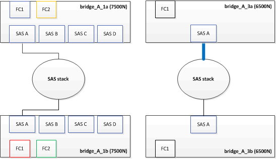

. Using a cable with a mini-SAS connector, connect the same SAS port on the storage shelf to the SAS B port of the top FibreBridge 7600N or 7500N bridge.
+
The cable is shown in blue in the following example:
+
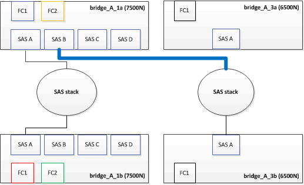

. Remove the cable that connects the SAS A port of the bottom FibreBridge 6500N bridge to the top SAS shelf, being sure to note the SAS port on the storage shelf to which it connects.
+
This cable is shown in green in the following example:
+
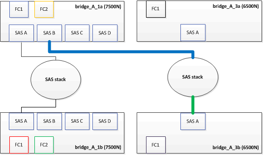

. Using a cable with a mini-SAS connector, connect the same SAS port on the storage shelf to the SAS B port of the bottom FibreBridge 7600N or 7500N bridge.
+
This cable is shown in green in the following example:
+
image::../media/consolidating_stacks_sas_bottom_after.gif[]

. Confirm connectivity to the bridge-connected disks: `run local sysconfig -v`
+
The output shows the disks attached to the initiator ports on the controller, and identifies the shelves connected to the FC-to-SAS bridges:
+
----

node_A_1> run local sysconfig -v
NetApp Release 9.3.2X18: Sun Dec 13 01:23:24 PST 2015
System ID: 0536872165 (node_A_1); partner ID: 0536872141 (node_B_1)
System Serial Number: 940001025465 (node_A_1)
System Rev: 70
System Storage Configuration: Multi-Path HA**<=== Configuration should be multi-path HA**
.
.
.
slot 0: FC Host Adapter 0g (QLogic 8324 rev. 2, N-port, <UP>)**<=== Initiator port**
		Firmware rev:      7.5.0
		Flash rev:         0.0.0
		Host Port Id:      0x60100
		FC Node Name:      5:00a:098201:bae312
		FC Port Name:      5:00a:098201:bae312
		SFP Vendor:        FINISAR CORP.
		SFP Part Number:   FTLF8529P3BCVAN1
		SFP Serial Number: URQ0R1R
		SFP Capabilities:  4, 8 or 16 Gbit
		Link Data Rate:    16 Gbit
		Switch Port:       brcd6505-fcs40:1
  **<List of disks visible to port\>**
		 ID     Vendor   Model            FW    Size
		brcd6505-fcs40:12.126L1527     : NETAPP   X302_HJUPI01TSSM NA04 847.5GB (1953525168 512B/sect)
		brcd6505-fcs40:12.126L1528     : NETAPP   X302_HJUPI01TSSA NA02 847.5GB (1953525168 512B/sect)
		.
		.
		.
		**<List of FC-to-SAS bridges visible to port\>**
		FC-to-SAS Bridge:
		brcd6505-fcs40:12.126L0        : ATTO     FibreBridge7500N A30H  FB7500N100104
		brcd6505-fcs42:13.126L0        : ATTO     FibreBridge7500N A30H  FB7500N100104
		.
		.
		.
  **<List of storage shelves visible to port\>**
		brcd6505-fcs40:12.shelf6: DS4243  Firmware rev. IOM3 A: 0200  IOM3 B: 0200
		brcd6505-fcs40:12.shelf8: DS4243  Firmware rev. IOM3 A: 0200  IOM3 B: 0200
		.
		.
		.
----

. Remove the old FibreBridge 6500N bridges that are no longer connected to the SAS storage.
. Wait two minutes for the system to recognize the changes.
. If the system was miscabled, remove the cable, correct the cabling, and then reconnect the correct cable.
. If necessary, repeat the preceding steps to move up to two additional SAS stacks behind the new FibreBridge 7600N or 7500N bridges, using SAS ports C and then D.
+
Each SAS stack must be connected to the same SAS port on the top and bottom bridge. For example, if the top connection of the stack is connected to the top bridge SAS B port, the bottom connection must be connected to the SAS B port of the bottom bridge.
+
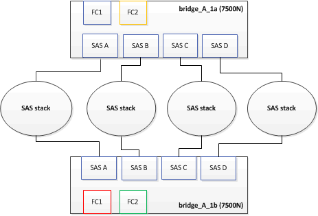

== Updating zoning when adding FibreBridge 7600N or 7500N bridges to a configuration

[.lead]
The zoning must be changed when you are replacing FibreBridge 6500N bridges with FibreBridge 7600N or 7500N bridges and using both FC ports on the FibreBridge 7600N or 7500N bridges. The required changes depend on whether you are running a version of ONTAP earlier than 9.1 or 9.1 and later.

=== Updating zoning when adding FibreBridge 7500N bridges to a configuration (prior to ONTAP 9.1)

[.lead]
The zoning must be changed when you are replacing FibreBridge 6500N bridges with FibreBridge 7500N bridges and using both FC ports on the FibreBridge 7500N bridges. Each zone can have no more than four initiator ports. The zoning you use depends on whether you are running ONTAP prior to version 9.1 or 9.1 and later

The specific zoning in this task is for versions of ONTAP prior to version 9.1.

The zoning changes are required to avoid issues with ONTAP, which requires that no more than four FC initiator ports can have a path to a disk. After recabling to consolidate the shelves, the existing zoning would result in each disk being reachable by eight FC ports. You must change the zoning to reduce the initiator ports in each zone to four.

The following diagram shows the zoning on site_A before the changes:

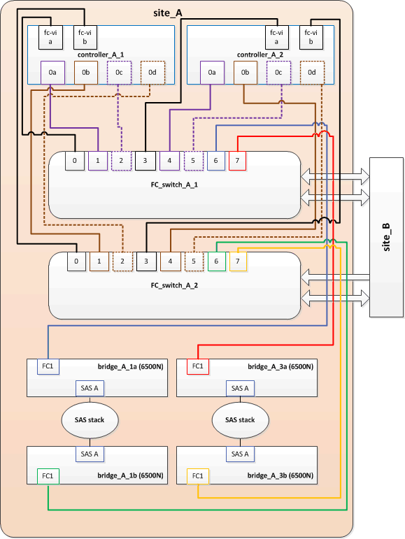

. Update the storage zones for the FC switches by removing half of the initiator ports from each existing zone and creating new zones for the FibreBridge 7500N FC2 ports.
+
The zones for the new FC2 ports will contain the initiator ports removed from the existing zones. In the diagrams, these zones are shown with dashed lines.
+
For details about the zoning commands, see the FC switch sections of the https://docs.netapp.com/ontap-9/topic/com.netapp.doc.dot-mcc-inst-cnfg-fabric/home.html[Fabric-attached MetroCluster installation and configuration] or https://docs.netapp.com/ontap-9/topic/com.netapp.doc.dot-mcc-inst-cnfg-stretch/home.html[Stretch MetroCluster installation and configuration].
+
The following examples show the storage zones and the ports in each zone before and after the consolidation. The ports are identified by _domain, port_ pairs.

 ** Domain 5 consists of switch FC_switch_A_1.
 ** Domain 6 consists of switch FC_switch_A_2.
 ** Domain 7 consists of switch FC_switch_B_1.
 ** Domain 8 consists of switch FC_switch_B_2.
|===
| Before or after consolidation| Zone| Domains and ports| Colors in diagram*
a|
Zones before the consolidation.    There is a zone for each FC port on the four FibreBridge 6500N bridges.

a|
STOR_A_1a-FC1
a|
5,1; 5,2; 5,4; 5,5; 7,1; 7,2; 7,4; 7,5; 5,6
a|
Purple + dashed purple + blue
a|
STOR_A_1b-FC1
a|
6,1; 6,2; 6,4; 6,5; 8,1; 8,2; 8,4; 8,5; 6,6
a|
Brown + dashed brown + green
a|
STOR_A_2a-FC1
a|
5,1; 5,2; 5,4; 5,5; 7,1; 7,2; 7,4; 7,5; 5,7
a|
Purple + dashed purple + red
a|
STOR_A_2b-FC1
a|
6,1; 6,2; 6,4; 6,5; 8,1; 8,2; 8,4; 8,5; 6,7
a|
Brown + dashed brown + orange
a|
Zones after the consolidation.    There is a zone for each FC port on the two FibreBridge 7500N bridges.
a|
STOR_A_1a-FC1
a|
7,1; 7,4; 5,1; 5,4; 5,6
a|
Purple + blue
a|
STOR_A_1b-FC1
a|
7,2; 7,5; 5,2; 5,5; 5,7
a|
Dashed purple + red
a|
STOR_A_1a-FC2
a|
8,1; 8,4; 6,1; 6,4; 6,6
a|
Brown + green
a|
STOR_A_1b-FC2
a|
8,2; 8,5; 6,2; 6,5; 6,7
a|
Dashed brown + orange
|===
* The diagrams only show site_A.
+
The following diagram shows zoning at site_A after the consolidation:
+
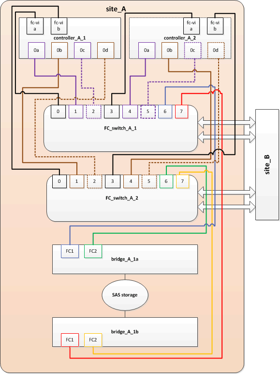

=== Updating zoning when adding FibreBridge 7600N or 7500N bridges to a configuration (ONTAP 9.1 and later)

[.lead]
The zoning must be changed when you are replacing FibreBridge 6500N bridges with FibreBridge 7600N or 7500N bridges and using both FC ports on the FibreBridge 7600N or 7500N bridges. Each zone can have no more than four initiator ports.

* This task applies to ONTAP 9.1 and later.
* FibreBridge 7600N bridges are supported in ONTAP 9.6 and later.
* The specific zoning in this task is for ONTAP 9.1 and later.
* The zoning changes are required to avoid issues with ONTAP, which requires that no more than four FC initiator ports can have a path to a disk.
+
After recabling to consolidate the shelves, the existing zoning would result in each disk being reachable by eight FC ports. You must change the zoning to reduce the initiator ports in each zone to four.

. Update the storage zones for the FC switches by removing half of the initiator ports from each existing zone and creating new zones for the FibreBridge 7600N or 7500N FC2 ports.
+
The zones for the new FC2 ports will contain the initiator ports removed from the existing zones.
+
The FC switch section of the _Fabric-attached MetroCluster Installation and Configuration Guide_ contains details about the zoning commands.
+
https://docs.netapp.com/ontap-9/topic/com.netapp.doc.dot-mcc-inst-cnfg-fabric/home.html[Fabric-attached MetroCluster installation and configuration]

== Cabling the second bridge FC port when adding FibreBridge 7600N or 7500N bridges to a configuration

[.lead]
To provide multiple paths to the storage stacks, you can cable the second FC port on each FibreBridge 7600N or 7500N bridge when you have added the FibreBridge 7600N or 7500N bridge to your configuration.

The zoning must have been adjusted to provide zones for the second FC ports.

. Cable the FC2 port of the top bridge to the correct port on FC_switch_A_2.
+
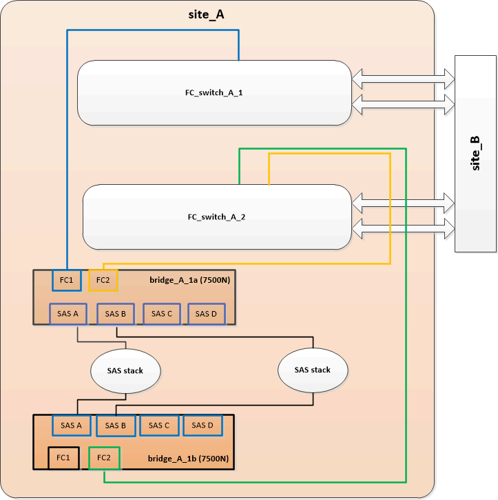

. Cable the FC1 port of the bottom bridge to the correct port on FC_switch_A_1.
+
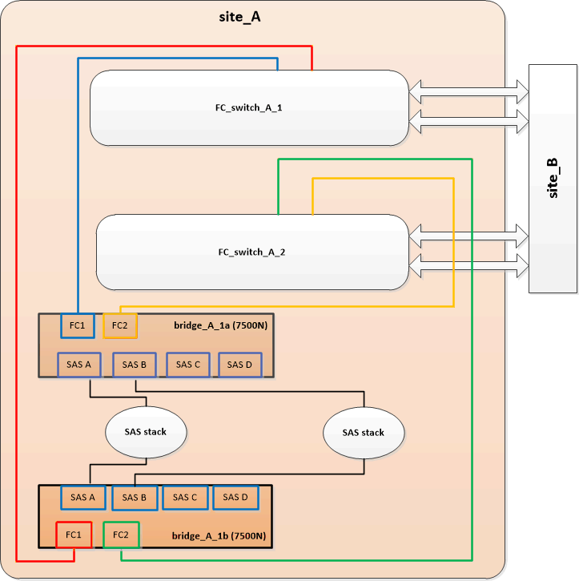

. Confirm connectivity to the bridge-connected disks: `run local sysconfig -v`
+
The output shows the disks attached to the initiator ports on the controller, and identifies the shelves connected to the FC-to-SAS bridges:
+
----

node_A_1> run local sysconfig -v
NetApp Release 9.3.2X18: Sun Dec 13 01:23:24 PST 2015
System ID: 0536872165 (node_A_1); partner ID: 0536872141 (node_B_1)
System Serial Number: 940001025465 (node_A_1)
System Rev: 70
System Storage Configuration: Multi-Path HA**<=== Configuration should be multi-path HA**
.
.
.
slot 0: FC Host Adapter 0g (QLogic 8324 rev. 2, N-port, <UP>)**<=== Initiator port**
		Firmware rev:      7.5.0
		Flash rev:         0.0.0
		Host Port Id:      0x60100
		FC Node Name:      5:00a:098201:bae312
		FC Port Name:      5:00a:098201:bae312
		SFP Vendor:        FINISAR CORP.
		SFP Part Number:   FTLF8529P3BCVAN1
		SFP Serial Number: URQ0R1R
		SFP Capabilities:  4, 8 or 16 Gbit
		Link Data Rate:    16 Gbit
		Switch Port:       brcd6505-fcs40:1
  **<List of disks visible to port\>**
		 ID     Vendor   Model            FW    Size
		brcd6505-fcs40:12.126L1527     : NETAPP   X302_HJUPI01TSSM NA04 847.5GB (1953525168 512B/sect)
		brcd6505-fcs40:12.126L1528     : NETAPP   X302_HJUPI01TSSA NA02 847.5GB (1953525168 512B/sect)
		.
		.
		.
		**<List of FC-to-SAS bridges visible to port\>**
		FC-to-SAS Bridge:
		brcd6505-fcs40:12.126L0        : ATTO     FibreBridge7500N A30H  FB7500N100104
		brcd6505-fcs42:13.126L0        : ATTO     FibreBridge7500N A30H  FB7500N100104
		.
		.
		.
  **<List of storage shelves visible to port\>**
		brcd6505-fcs40:12.shelf6: DS4243  Firmware rev. IOM3 A: 0200  IOM3 B: 0200
		brcd6505-fcs40:12.shelf8: DS4243  Firmware rev. IOM3 A: 0200  IOM3 B: 0200
		.
		.
		.
----

== Disabling unused SAS ports on the FC-to-SAS bridges

[.lead]
After making cabling changes to the bridge, you should disable any unused SAS ports on FC-to-SAS bridges to avoid health monitor alerts related to the unused ports.

. Disable unused SAS ports on the top FC-to-SAS bridge:
 .. Log in to the bridge CLI.
 .. Disable any unused ports.
+
NOTE: If you have configured an ATTO 7500N bridge, then all of the SAS ports (A through D) are enabled by default, and you must disable the SAS ports that are not being used: `SASPortDisable sas port`
+
If SAS ports A and B are used, then SAS ports C and D must be disabled. In the following example, the unused SAS ports C and D are disabled:
+
----
Ready. *
`SASPortDisable C`

SAS Port C has been disabled.

Ready. *
`SASPortDisable D`

SAS Port D has been disabled.

Ready. *
----

 .. Save the bridge configuration: `SaveConfiguration`
+
The following example shows that SAS ports C and D have been disabled. Note that the asterisk no longer appears, indicating that the configuration has been saved.
+
----
Ready. *
`SaveConfiguration`

Ready.
----
. Repeat xref:task_fb_consolidate_replace_a_pair_of_fibrebridge_6500n_bridges_with_7500n_bridges.adocSTEP_EE5FD70E743949168A4C5818FDFCAF2F[Step 1] on the bottom FC-to-SAS bridge.
