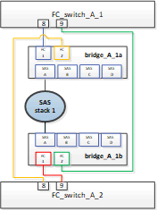
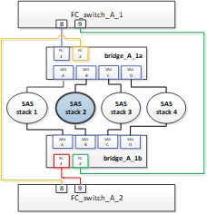

= Replacing a shelf nondisruptively in a fabric-attached MetroCluster configuration
:icons: font
:imagesdir: ../media/

[.lead]
You might need to know how to replace a shelf nondisruptively in a fabric-attached MetroCluster configuration.

NOTE: This procedure is only for use in a fabric-attached MetroCluster configuration.

== Disabling access to the shelf

You must disable access to the shelf before you replace the shelf modules.

Check the overall health of the configuration. If the system does not appear healthy, address the issue first before proceeding.

.Steps
. From both clusters, offline all plexes with disks on the affected shelf stack:
//ontap-metrocluster/issues/65 2021.11.21
+
`aggr offline _plex_name_`
+
The example shows the commands for offlining plexes for a controller running ONTAP.
+
----

cluster_A_1::> storage aggregate plex offline -aggr aggrA_1_0 -plex plex0
cluster_A_1::> storage aggregate plex offline -aggr dataA_1_data -plex plex0
cluster_A_2::> storage aggregate plex offline -aggr aggrA_2_0 -plex plex0
cluster_A_2::> storage aggregate plex offline -aggr dataA_2_data -plex plex0
----

. Verify that the plexes are offline:
+
`aggr status _-raggr_name_`
+
The example shows the commands for verifying that the aggregates are offline for a controller running cMode.
+
----

Cluster_A_1::> storage aggregate show -aggr aggrA_1_0
Cluster_A_1::> storage aggregate show -aggr dataA_1_data
Cluster_A_2::> storage aggregate show -aggr aggrA_2_0
Cluster_A_2::> storage aggregate show -aggr dataA_2_data
----

. Disable the SAS ports or switch ports depending on whether the bridges connecting the target shelf are connecting a single SAS stack or two or more SAS stacks:
 ** If the bridges are connecting a single SAS stack, disable the switch ports that the bridges are connected to using the appropriate command for your switch.
+
The following example shows a pair of bridges that connect a single SAS stack, which contains the target shelf:
+

+
Switch ports 8 and 9 on each switch connect the bridges to the network.
+
The following example shows ports 8 and 9 being disabled on a Brocade switch.
+
----
FC_switch_A_1:admin> portDisable 8
FC_switch_A_1:admin> portDisable 9

FC_switch_A_2:admin> portDisable 8
FC_switch_A_2:admin> portDisable 9
----
+
The following example shows port 8 and 9 being disabled on a Cisco switch.
+
----
FC_switch_A_1# conf t
FC_switch_A_1(config)# int fc1/8
FC_switch_A_1(config)# shut
FC_switch_A_1(config)# int fc1/9
FC_switch_A_1(config)# shut
FC_switch_A_1(config)# end

FC_switch_A_2# conf t
FC_switch_A_2(config)# int fc1/8
FC_switch_A_2(config)# shut
FC_switch_A_2(config)# int fc1/9
FC_switch_A_2(config)# shut
FC_switch_A_2(config)# end
----

 ** If the bridges are connecting two or more SAS stacks, disable the SAS ports connecting the bridges to the target shelf:
 +
`SASportDisable _port number_`
+
The following example shows a pair of bridges that connect four SAS stacks. SAS stack 2 contains the target shelf:
+

+
SAS port B connects the bridges to the target shelf. By disabling only SAS port B on both shelves, the other SAS stacks can continue to serve data during the replacement procedure.
+
In this case, disable the SAS port connecting the bridge to the target shelf:
+
`SASportDisable _port number_`
+
The following example shows SAS port B being disabled from the bridge and also verifies that it is disabled. You must repeat the command on both bridges.
+
----
Ready. *
SASPortDisable B

SAS Port B has been disabled.
----
. If you previously disabled the switch ports, verify that they are disabled:
+
`switchShow`
+
The example shows that the switch ports are disabled on a Brocade switch.
+
----

FC_switch_A_1:admin> switchShow
FC_switch_A_2:admin> switchShow
----
+
The example shows that the switch ports are disabled on a Cisco switch.
+
----

FC_switch_A_1# show interface fc1/6
FC_switch_A_2# show interface fc1/6
----

. Wait for ONTAP to realize that the disk is missing.
. Power off the shelf that you want to replace.

== Replacing the shelf

You must physically remove all of the cables and the shelf before inserting and cabling the new shelf and shelf modules.

.Steps

. Remove all disks and disconnect all cables from the shelf that is being replaced.
. Remove the shelf modules.
. Insert the new shelf.
. Insert the new disks into the new shelf.
. Insert the shelf modules.
. Cable the shelf (SAS or Power).
. Power on the shelf.

== Reenabling access and verifying the operation

After the shelf has been replaced, you need to reenable access and verify that the new shelf is operating correctly.

.Steps
. Verify that the shelf powers properly and the links on the IOM modules are present.
. Enable the switch ports or SAS port according to the following scenarios:
+
[cols="1,3"]
|===

h| Option h| Step

a|
*If you previously disabled switch ports*
a|
.. Enable the switch ports:
+
`portEnable _port number_`
+
The example shows the switch port being enabled on a Brocade switch.

+
----

Switch_A_1:admin> portEnable 6
Switch_A_2:admin> portEnable 6
----
+
The example shows the switch port being enabled on a Cisco switch.
+
----

Switch_A_1# conf t
Switch_A_1(config)# int fc1/6
Switch_A_1(config)# no shut
Switch_A_1(config)# end

Switch_A_2# conf t
Switch_A_2(config)# int fc1/6
Switch_A_2(config)# no shut
Switch_A_2(config)# end
----
a|
*If you previously disabled a SAS port*
a|

.. Enable the SAS port connecting the stack to the shelf location:
+
`SASportEnable _port number_`
+
The example shows SAS port A being enabled from the bridge and also verifies that it is enabled.
+
----
Ready. *
SASPortEnable A

SAS Port A has been enabled.
----

|===

. If you previously disabled the switch ports, verify that they are enabled and online and that and all devices are logged in correctly:
+
`switchShow`
+
The example shows the `switchShow` command for verifying that a Brocade switch is online.
+
----

Switch_A_1:admin> SwitchShow
Switch_A_2:admin> SwitchShow
----
+
The example shows the `switchShow` command for verifying that a Cisco switch is online.
+
----

Switch_A_1# show interface fc1/6
Switch_A_2# show interface fc1/6
----
+
NOTE: After several minutes, ONTAP detects that new disks have been inserted and displays a message for each new disk.

. Verify that the disks have been detected by ONTAP:
+
`sysconfig -a`
. Online the plexes that were offline earlier:
+
`aggr online__plex_name__`
+
The example shows the commands for placing plexes on a controller running cMode back online.
+
----

Cluster_A_1::> storage aggregate plex online -aggr aggr1 -plex plex2
Cluster_A_1::> storage aggregate plex online -aggr aggr2 -plex plex6
Cluster_A_1::> storage aggregate plex online -aggr aggr3 -plex plex1
----
+
The plexes begin to resynchronize.
+
NOTE: You can monitor the progress of resynchronization using the `aggr status _-raggr_name_` command.

// 2024 APR 8, ONTAPDOC-1710