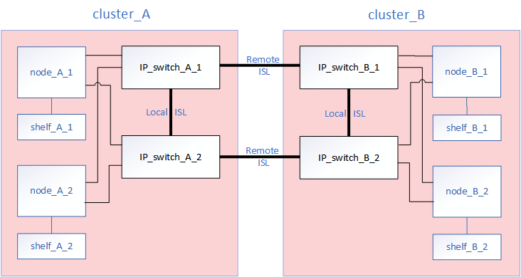
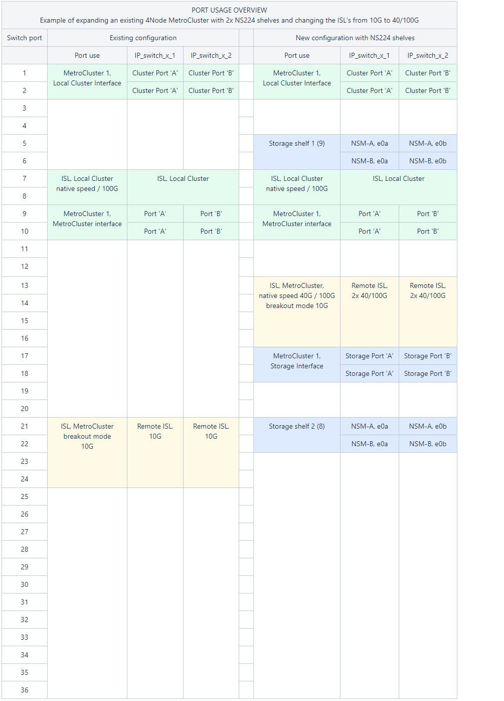

= Replace an IP switch or change the use of existing MetroCluster IP switches
:icons: font
:imagesdir: ../media/

[.lead]
You might need to replace a failed switch, upgrade or downgrade a switch, or change the use of existing MetroCluster IP switches. 

.About this task 
This procedure applies when you are using NetApp-validated switches. If you are using MetroCluster-compliant switches, refer to the switch vendor.
//GH issue #64 25/01/2022

link:enable-console-logging-before-maintenance.html[Enable console logging] before performing this task.

// 2024 Aug 13, ONTAPDOC-1988

This procedure supports the following conversions:

* Changing the switch vendor, type, or both. The new switch can be the same as the old switch when a switch has failed, or you can change the switch type (upgrade or downgrade the switch). 
+
For example, to expand a MetroCluster IP configuration from a single four-node configuration using AFF A400 controllers and BES-53248 switches to an eight-node configuration using AFF A400 controllers, you must change the switches to a supported type for the configuration because BES-53248 switches are not supported in the new configuration.
+
If you want to replace a failed switch with the same type of switch, you only replace the failed switch. If you want to upgrade or downgrade a switch, you must adjust two switches that are in the same network. Two switches are in the same network when they are connected with an inter-switch link (ISL) and are not located at the same site. For example, Network 1 includes IP_switch_A_1 and IP_switch_B_1, and Network 2 includes IP_switch_A_2 and IP_switch_B_2, as shown in the diagram below:
+

+
NOTE: If you replace a switch or upgrade to different switches, then you can pre-configure the switches by installing the switch firmware and RCF file.

* Convert a MetroCluster IP configuration to a MetroCluster IP configuration using shared storage MetroCluster switches.
+
For example, if you have a regular MetroCluster IP configuration using AFF A700 controllers and you want to reconfigure the MetroCluster to connect NS224 shelves to the same switches. 
+
[NOTE] 
====
* If you are adding or removing shelves in a MetroCluster IP configuration using shared storage MetroCluster IP switches, follow the steps in link:https://docs.netapp.com/us-en/ontap-metrocluster/maintain/task_add_shelves_using_shared_storage.html[Adding shelves to a MetroCluster IP using shared storage MetroCluster switches]
* Your MetroCluster IP configuration might already directly connect to NS224 shelves or to dedicated storage switches.
====

[[port_usage_worksheet]]
.Port usage worksheet

The following is an example worksheet for converting a MetroCluster IP configuration to a shared storage configuration connecting two NS224 shelves using the existing switches.

Worksheet definitions:

* Existing configuration: The cabling of the existing MetroCluster configuration.
* New configuration with NS224 shelves: The target configuration where the switches are shared between storage and the MetroCluster.

The highlighted fields in this worksheet indicate the following:

* Green: You do not need to change the cabling.
* Yellow: You must move ports with the same or a different configuration.
* Blue: Ports that are new connections.

.Steps

. [[all_step1]]Check the health of the configuration.
 .. Check that the MetroCluster is configured and in normal mode on each cluster: `*metrocluster show*`
+
----
cluster_A::> metrocluster show
Cluster                   Entry Name          State
------------------------- ------------------- -----------
 Local: cluster_A         Configuration state configured
                          Mode                normal
                          AUSO Failure Domain auso-on-cluster-disaster
Remote: cluster_B         Configuration state configured
                          Mode                normal
                          AUSO Failure Domain auso-on-cluster-disaster
----

 .. Check that mirroring is enabled on each node: `*metrocluster node show*`
+
----
cluster_A::> metrocluster node show
DR                           Configuration  DR
Group Cluster Node           State          Mirroring Mode
----- ------- -------------- -------------- --------- --------------------
1     cluster_A
              node_A_1       configured     enabled   normal
      cluster_B
              node_B_1       configured     enabled   normal
2 entries were displayed.
----

 .. Check that the MetroCluster components are healthy: `*metrocluster check run*`
+
----
cluster_A::> metrocluster check run

Last Checked On: 10/1/2014 16:03:37

Component           Result
------------------- ---------
nodes               ok
lifs                ok
config-replication  ok
aggregates          ok
4 entries were displayed.

Command completed. Use the "metrocluster check show -instance" command or sub-commands in "metrocluster check" directory for detailed results.
To check if the nodes are ready to do a switchover or switchback operation, run "metrocluster switchover -simulate" or "metrocluster switchback -simulate", respectively.
----

 .. Check that there are no health alerts: `*system health alert show*`
. Configure the new switch before installation.
+
If you are reusing existing switches, go to <<existing_step4,Step 4>>.
+
NOTE: If you are upgrading or downgrading the switches, you must configure all the switches in the network.
+
Follow the steps in the section _Configuring the IP switches_ in the link:https://docs.netapp.com/us-en/ontap-metrocluster/install-ip/using_rcf_generator.html[MetroCluster IP installation and configuration.]
+
Make sure that you apply the correct RCF file for switch _A_1, _A_2, _B_1 or _B_2. If the new switch is the same as the old switch, you need to apply the same RCF file.
+
If you upgrade or downgrade a switch, apply the latest supported RCF file for the new switch.

. Run the port show command to view information about the network ports:
+
`*network port show*`

.. Modify all cluster LIFs to disable auto-revert:
+
[source,asciidoc]
----
network interface modify -vserver <vserver_name> -lif <lif_name> -auto-revert false
----

. [[existing_step4]]Disconnect the connections from the old switch. 
+
NOTE: You only disconnect connections that are not using the same port in the old and new configurations. If you are using new switches, you must disconnect all connections.
+
Remove the connections in the following order:
+
.. Disconnect the local cluster interfaces
.. Disconnect the local cluster ISLs
.. Disconnect the MetroCluster IP interfaces
.. Disconnect the MetroCluster ISLs
+
In the example <<port_usage_worksheet>>, the switches do not change. The MetroCluster ISLs are relocated and must be disconnected. You do not need to disconnect the connections marked in green on the worksheet.

. If you are using new switches, power off the old switch, remove the cables, and physically remove the old switch.
+
If you are reusing existing switches, go to <<existing_step6,Step 6>>.
+
NOTE: Do *not* cable the new switches except for the management interface (if used).

. [[existing_step6]]Configure the existing switches.
+ 
If you have pre-configured the switches already, you can skip this step.
+
To configure the existing switches, follow the steps to install and upgrade the firmware and RCF files:
+
* link:https://docs.netapp.com/us-en/ontap-metrocluster/maintain/task_upgrade_firmware_on_mcc_ip_switches.html[Upgrading firmware on MetroCluster IP switches]
+
* link:https://docs.netapp.com/us-en/ontap-metrocluster/maintain/task_upgrade_rcf_files_on_mcc_ip_switches.html[Upgrade RCF files on MetroCluster IP switches]

. Cable the switches. 
+
You can follow the steps in the  _Cabling the IP switches_ section in link:https://docs.netapp.com/us-en/ontap-metrocluster/install-ip/using_rcf_generator.html[MetroCluster IP installation and configuration]. 
+
Cable the switches in the following order (if required): 
+
.. Cable the ISLs to the remote site.
.. Cable the MetroCluster IP interfaces.
.. Cable the local cluster interfaces.
+
[NOTE]
====
* The used ports might be different from those on the old switch if the switch type is different.
If you are upgrading or downgrading the switches, do *NOT* cable the local ISLs. Only cable the local ISLs if you are upgrading or downgrading the switches in the second network and both switches at one site are the same type and cabling.
* If you are upgrading Switch-A1 and Switch-B1, you must perform steps 1 to 6 for switches Switch-A2 and Switch-B2.
====

. Finalize the local cluster cabling.
+
.. If the local cluster interfaces are connected to a switch:
+
... Cable the local cluster ISLs.

.. If the local cluster interfaces are *not* connected to a switch:
+
... Use the link:https://docs.netapp.com/us-en/ontap-systems-switches/switch-bes-53248/migrate-to-2n-switched.html[Migrate to a switched NetApp cluster environment] procedure to convert a switchless cluster to a switched cluster. Use the ports indicated in link:https://docs.netapp.com/us-en/ontap-metrocluster/install-ip/using_rcf_generator.html[MetroCluster IP installation and configuration] or the RCF cabling files to connect the local cluster interface.

. Power up the switch or switches.
+
If the new switch is the same, power up the new switch. If you are upgrading or downgrading the switches, then power up both switches. The configuration can operate with two different switches at each site until the second network is updated.

. Verify that the MetroCluster configuration is healthy by repeating <<all_step1,Step 1>>.
+
If you are upgrading or downgrading the switches in the first network, you might see some alerts related to local clustering.
+
NOTE: If you upgrade or downgrade the networks, then repeat all of the steps for the second network.

. Modify all cluster LIFs to re-enable auto-revert: 
+
[source,asciidoc]
----
network interface modify -vserver <vserver_name> -lif <lif_name> -auto-revert true
----

. Optionally, move the NS224 shelves.
+
If you are reconfiguring a MetroCluster IP configuration that does not connect NS224 shelves to the MetroCluster IP switches, use the appropriate procedure to add or move the NS224 shelves:
+
* link:https://docs.netapp.com/us-en/ontap-metrocluster/maintain/task_add_shelves_using_shared_storage.html[Adding shelves to a MetroCluster IP using shared storage MetroCluster switches]
* link:https://docs.netapp.com/us-en/ontap-systems-switches/switch-cisco-9336c-fx2-shared/migrate-from-switchless-cluster-dat-storage.html[Migrate from a switchless cluster with direct-attached storage^]
* link:https://docs.netapp.com/us-en/ontap-systems-switches/switch-cisco-9336c-fx2-shared/migrate-from-switchless-configuration-sat-storage.html[Migrate from a switchless configuration with switch-attached storage by reusing the storage switches^]

// 2022 Apr 13, BURT 1536708
// 2022 May 04, Issue 235
// 2023 Dec 14, ONTAPDOC-1502
// 2024 Apr 04, ONTAPDOC-1875
