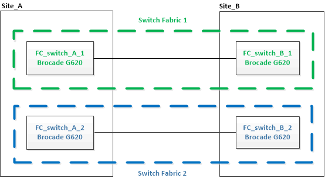
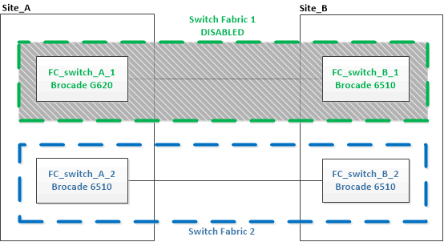
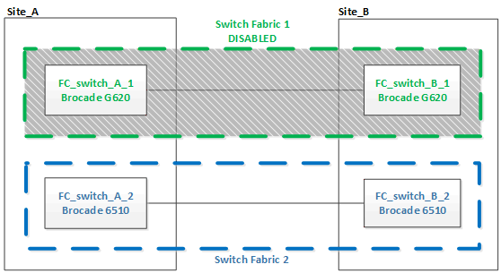

= Upgrading to new Brocade FC switches
:icons: font
:imagesdir: ../media/

[.lead]
If you are upgrading to new Brocade FC switches, you must replace the switches in the first fabric, verify that the MetroCluster configuration is fully operational, and then replace the switches in the second fabric.

* The MetroCluster configuration must be healthy and in normal operation.
* The MetroCluster switch fabrics consist of four Brocade switches.
+
The illustrations in the following steps show current switches.

* The switches must be running the most recent supported firmware.
+
https://mysupport.netapp.com/matrix[NetApp Interoperability Matrix Tool^]

* This procedure is nondisruptive and takes approximately two hours to complete.
* You need the admin password and access to an FTP or SCP server.
* link:enable-console-logging-before-maintenance.html[Enable console logging] before performing this task.

The switch fabrics are upgraded one at a time.

At the end of this procedure, all four switches will be upgraded to new switches.

.Steps

. Disable the first switch fabric:
+
`*FC_switch_A_1:admin> switchCfgPersistentDisable*`
+
----
FC_switch_A_1:admin> switchCfgPersistentDisable
----
+

. Replace the old switches at one MetroCluster site.
 .. Uncable and remove the disabled switch.
 .. Install the new switch in the rack.
+

.. Disable the new switches:
+
`switchCfgPersistentDisable`
+
The command disables both switches in the switch fabric.
+
----
FC_switch_A_1:admin> switchCfgPersistentDisable
----

.. Cable the new switch using the recommended port assignments.
+
link:concept_port_assignments_for_fc_switches_when_using_ontap_9_1_and_later.html[Port assignments for FC switches when using ONTAP 9.1 and later]

.. Repeat these substeps at the partner MetroCluster site to replace the second switch in the first switch fabric.
+
Both switches in fabric 1 have been replaced.
+

. Power up the new switches and let them boot up.
. Download the RCF files for the new switch.
. Apply the RCF files to both new switches in the fabric, following the directions on the download page.
. Save the switch configuration:
+
`cfgSave`
. Wait 10 minutes to allow the configuration to stabilize.
. Confirm connectivity to the disks by entering the following command on any one of the MetroCluster nodes:
+
`run local sysconfig -v`
+
The output shows the disks attached to the initiator ports on the controller, and identifies the shelves connected to the FC-to-SAS bridges:
+
----

node_A_1> run local sysconfig -v
NetApp Release 9.3.2X18: Sun Dec 13 01:23:24 PST 2017
System ID: 4068741258 (node_A_1); partner ID: 4068741260 (node_B_1)
System Serial Number: 940001025471 (node_A_1)
System Rev: 70
System Storage Configuration: Multi-Path HA**<=== Configuration should be multi-path HA**
.
.
.
slot 0: FC Host Adapter 0g (QLogic 8324 rev. 2, N-port, <UP>)**<=== Initiator port**
		Firmware rev:      7.5.0
		Flash rev:         0.0.0
		Host Port Id:      0x60130
		FC Node Name:      5:00a:098201:bae312
		FC Port Name:      5:00a:098201:bae312
		SFP Vendor:        UTILITIES CORP.
		SFP Part Number:   FTLF8529P3BCVAN1
		SFP Serial Number: URQ0Q9R
		SFP Capabilities:  4, 8 or 16 Gbit
		Link Data Rate:    16 Gbit
		Switch Port:       brcd6505-fcs40:1
  **<List of disks visible to port\>**
		 ID     Vendor   Model            FW    Size
		brcd6505-fcs29:12.126L1527     : NETAPP   X302_HJUPI01TSSM NA04 847.5GB (1953525168 512B/sect)
		brcd6505-fcs29:12.126L1528     : NETAPP   X302_HJUPI01TSSA NA02 847.5GB (1953525168 512B/sect)
		.
		.
		.
		**<List of FC-to-SAS bridges visible to port\>**
		FC-to-SAS Bridge:
		brcd6505-fcs40:12.126L0        : ATTO     FibreBridge6500N 1.61  FB6500N102980
		brcd6505-fcs42:13.126L0        : ATTO     FibreBridge6500N 1.61  FB6500N102980
		brcd6505-fcs42:6.126L0         : ATTO     FibreBridge6500N 1.61  FB6500N101167
		brcd6505-fcs42:7.126L0         : ATTO     FibreBridge6500N 1.61  FB6500N102974
		.
		.
		.
  **<List of storage shelves visible to port\>**
		brcd6505-fcs40:12.shelf6: DS4243  Firmware rev. IOM3 A: 0200  IOM3 B: 0200
		brcd6505-fcs40:12.shelf8: DS4243  Firmware rev. IOM3 A: 0200  IOM3 B: 0200
		.
		.
		.
----

. Returning to the switch prompt, verify the switch firmware version:
+
`firmwareShow`
+
The switches must be running the most recent supported firmware.
+
https://mysupport.netapp.com/matrix[NetApp Interoperability Matrix Tool]

. Simulate a switchover operation:
 .. From any node's prompt, change to the advanced privilege level:
 +
`set -privilege advanced`
+
You need to respond with "`y`" when prompted to continue into advanced mode and see the advanced mode prompt (*>).

.. Perform the switchover operation with the `-simulate` parameter:
+
`metrocluster switchover -simulate`
.. Return to the admin privilege level:
+
`set -privilege admin`
. Repeat the previous steps on the second switch fabric.

After repeating the steps, all four switches have been upgraded and the MetroCluster configuration is in normal operation.

// BURT 1448684, 03 FEB 2022
