= Understanding MetroCluster data protection and disaster recovery
:icons: font
:imagesdir: ../media/

[.lead]
It is helpful to understand how MetroCluster protects data and provides transparent recovery from failures so that you can manage your switchover and switchback activities easily and efficiently.

MetroCluster uses mirroring to protect the data in a cluster. It provides disaster recovery through a single MetroCluster command that activates a secondary on the survivor site to serve the mirrored data originally owned by a primary site affected by disaster.

== How eight- and four-node MetroCluster configurations provide local failover and switchover

[.lead]
Eight- and four-node MetroCluster configurations protect data on both a local level and cluster level. If you are setting up a MetroCluster configuration, you need to know how MetroCluster configurations protect your data.

MetroCluster configurations protect data by using two physically separated, mirrored clusters. Each cluster synchronously mirrors the data and storage virtual machine (SVM) configuration of the other. When a disaster occurs at one site, an administrator can activate the mirrored SVM and begin serving the mirrored data from the surviving site. Additionally, the nodes in each cluster are configured as an HA pair, providing a level of local failover.

IMPORTANT:

=== How local HA data protection works in a MetroCluster configuration

[.lead]
You need to understand how HA pairs work in the MetroCluster configuration.

The two clusters in the peered network provide bidirectional disaster recovery, where each cluster can be the source and backup of the other cluster. Each cluster includes two nodes, which are configured as an HA pair. In the case of a failure or required maintenance within a single node's configuration, storage failover can transfer that node's operations to its local HA partner.

The following illustration shows a MetroCluster FC configuration. The HA functionality is the same in MetroCluster IP configurations, except that the HA interconnect is provided by the cluster switches.

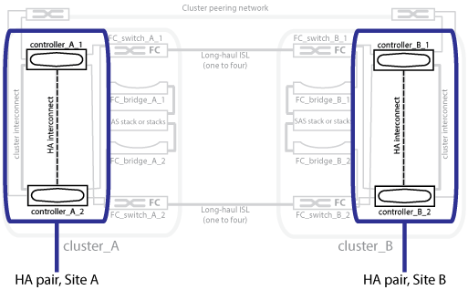

*Related information*

https://docs.netapp.com/ontap-9/topic/com.netapp.doc.dot-cm-hacg/home.html[High-availability configuration]

== How MetroCluster configurations provide data and configuration replication

[.lead]
MetroCluster configurations use a variety of ONTAP features to provide synchronous replication of data and configuration between the two MetroCluster sites.

=== Configuration protection with the configuration replication service

[.lead]
The ONTAP configuration replication service (CRS) protects the MetroCluster configuration by automatically replicating the information to the DR partner.

The CRS synchronously replicates local node configuration to the DR partner in the partner cluster. This replication is carried out over the cluster peering network.

The information replicated includes the cluster configuration and the SVM configuration.

=== Replication of SVMs during MetroCluster operations

[.lead]
The ONTAP configuration replication service (CRS) provides redundant data server configuration and mirroring of data volumes that belong to the SVM. If a switchover occurs, the source SVM is brought down and the destination SVM, located on the surviving cluster, becomes active.

NOTE: Destination SVMs in the MetroCluster configuration have the suffix "`-mc`" automatically appended to their name to help identify them. A MetroCluster configuration appends the suffix "`-mc`" to the name of the destination SVMs, if the SVM name contains a period, the suffix "`-mc`" is applied prior to the first period. For example, if the SVM name is SVM.DNS.NAME, then the suffix "`-mc`" is appended as SVM-MC.DNS.NAME.

The following example shows the SVMs for a MetroCluster configuration, where SVM_cluster_A is an SVM on the source site and SVM_cluster_A-mc is a sync-destination aggregate on the disaster recovery site.

* SVM_cluster_A serves data on cluster A.
+
It is a sync-source SVM that represents the SVM configuration (LIFs, protocols, and services) and data in volumes belonging to the SVM. The configuration and data are replicated to SVM_cluster_A-mc, a sync-destination SVM located on cluster B.

* SVM_cluster_B serves data on cluster B.
+
It is a sync-source SVM that represents configuration and data to SVM_cluster_B-mc located on cluster A.

* SVM_cluster_B-mc is a sync-destination SVM that is stopped during normal, healthy operation of the MetroCluster configuration.
+
In a successful switchover from cluster B to cluster A, SVM_cluster_B is stopped and SVM_cluster_B-mc is activated and begins serving data from cluster A.

* SVM_cluster_A-mc is a sync-destination SVM that is stopped during normal, healthy operation of the MetroCluster configuration.
+
In a successful switchover from cluster A to cluster B, SVM_cluster_A is stopped and SVM_cluster_A-mc is activated and begins serving data from cluster B.

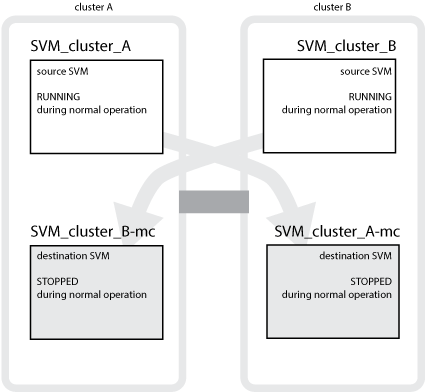

If a switchover occurs, the remote plex on the surviving cluster comes online and the secondary SVM begins serving the data.

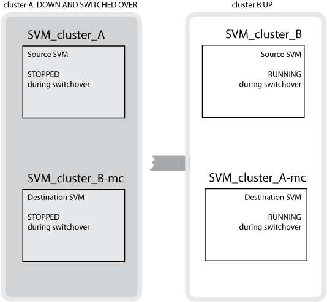

The availability of remote plexes after switchover depends on the MetroCluster configuration type:

* For MetroCluster FC configurations, after switchover, both local and remote plexes remain online if the disaster site storage is accessible via the ISLs.
+
If the ISLs have failed and the disaster site storage is not available, the sync-destination SVM begins serving data from the surviving site.

* For MetroCluster IP configurations the availability of the remote plexes depends on the ONTAP version:
 ** Starting with ONTAP 9.5, both local and remote plexes remain online if the disaster site nodes remain booted up.
 ** Prior to ONTAP 9.5, storage is available only from local plex on the surviving site.
+
The sync-destination SVM begins serving data from the surviving site.

*Related information*

https://docs.netapp.com/ontap-9/topic/com.netapp.doc.dot-cm-sag/home.html[System administration]

=== How MetroCluster configurations use SyncMirror to provide data redundancy

[.lead]
Mirrored aggregates using SyncMirror functionality provide data redundancy and contain the volumes owned by the source and destination storage virtual machine (SVM). Data is replicated into disk pools on the partner cluster. Unmirrored aggregates are also supported.

IMPORTANT:

The following table shows the state (online or offline) of an unmirrored aggregate after a switchover:

|===
| Type of switchover| State
a|
Negotiated switchover (NSO)

a|
Online

a|
Automatic unplanned switchover (AUSO)

a|
Online

a|
Unplanned switchover (USO)

a|

* If storage is not available: Offline
* If storage is available: Online

|===
*Note:* After a switchover, if the unmirrored aggregate is at the DR partner node and there is an inter-switch link (ISL) failure, then that local node might fail.

The following illustration shows how disk pools are mirrored between the partner clusters. Data in local plexes (in pool0) is replicated to remote plexes (in pool1).

IMPORTANT: If hybrid aggregates are used, performance degradation can occur after a SyncMirror plex has failed due to the solid-state disk (SSD) layer filling up.

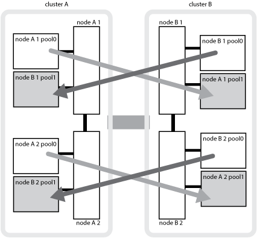

=== How NVRAM or NVMEM cache mirroring and dynamic mirroring work in MetroCluster configurations

[.lead]
The nonvolatile memory (NVRAM or NVMEM, depending on the platform model) in the storage controllers is mirrored both locally to a local HA partner and remotely to a remote disaster recovery (DR) partner on the partner site. In the event of a local failover or switchover, this configuration enables data in the nonvolatile cache to be preserved.

In an HA pair that is not part of a MetroCluster configuration, each storage controller maintains two nonvolatile cache partitions: one for itself and one for its HA partner.

In a four-node MetroCluster configuration, the nonvolatile cache of each storage controller is divided into four partitions. In a two-node MetroCluster configuration, the HA partner partition and DR auxiliary partition are not used, because the storage controllers are not configured as an HA pair.

|===
| Nonvolatile caches for a storage controller
| In a MetroCluster configuration| In a non-MetroCluster HA pair
a|
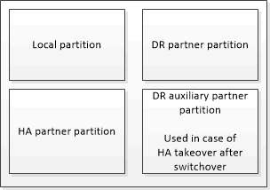

a|
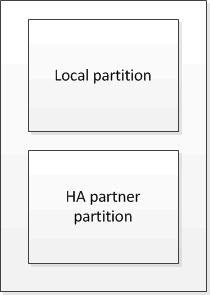

|===
The nonvolatile caches store the following content:

* The local partition holds data that the storage controller has not yet written to disk.
* The HA partner partition holds a copy of the local cache of the storage controller's HA partner.
+
In a two-node MetroCluster configuration, there is no HA partner partition because the storage controllers are not configured as an HA pair.

* The DR partner partition holds a copy of the local cache of the storage controller's DR partner.
+
The DR partner is a node in the partner cluster that is paired with the local node.

* The DR auxiliary partner partition holds a copy of the local cache of the storage controller's DR auxiliary partner.
+
The DR auxiliary partner is the HA partner of the local node's DR partner. This cache is needed if there is an HA takeover (either when the configuration is in normal operation or after a MetroCluster switchover).
+
In a two-node MetroCluster configuration, there is no DR auxiliary partner partition because the storage controllers are not configured as an HA pair.

For example, the local cache of a node (node_A_1) is mirrored both locally and remotely at the MetroCluster sites. The following illustration shows that the local cache of node_A_1 is mirrored to the HA partner (node_A_2) and DR partner (node_B_1):

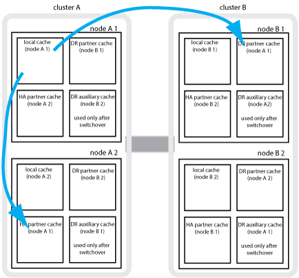

==== Dynamic mirroring in event of a local HA takeover

If a local HA takeover occurs in a four-node MetroCluster configuration, the taken-over node can no longer act as a mirror for its DR partner. To allow DR mirroring to continue, the mirroring automatically switches to the DR auxiliary partner. After a successful giveback, mirroring automatically returns to the DR partner.

For example, node_B_1 fails and is taken over by node_B_2. The local cache of node_A_1 can no longer be mirrored to node_B_1. The mirroring switches to the DR auxiliary partner, node_B_2.

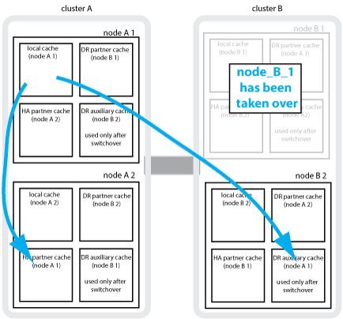

== Types of disasters and recovery methods

[.lead]
You need to be familiar with different types of failures and disasters so that you can use the MetroCluster configuration to respond appropriately.

* Single-node failure
+
A single component in the local HA pair fails.
+
In a four-node MetroCluster configuration, this failure might lead to an automatic or a negotiated takeover of the impaired node, depending on the component that failed. Data recovery is described in the _High Availability Configuration Guide_.
+
In a two-node MetroCluster configuration, this failure leads to an automatic unplanned switchover (AUSO).

* Site-wide controller failure
+
All controller modules fail at a site because of loss of power, replacement of equipment, or disaster. Typically, MetroCluster configurations cannot differentiate between failures and disasters. However, witness software, such as the MetroCluster Tiebreaker software, can differentiate between them. A site-wide controller failure condition can lead to an automatic switchover if Inter-Switch Link (ISL) links and switches are up and the storage is accessible.
+
The _High-Availability Configuration Guide_ has more information about how to recover from site-wide controller failures that do not include controller failures, as well as failures that include of one or more controllers.

* ISL failure
+
The links between the sites fail. The MetroCluster configuration takes no action. Each node continues to serve data normally, but the mirrors are not written to the respective disaster recovery sites because access to them is lost.

* Multiple sequential failures
+
Multiple components fail in a sequence. For example, a controller module, a switch fabric, and a shelf fail in a sequence and result in a storage failover, fabric redundancy, and SyncMirror sequentially protecting against downtime and data loss.

The following table shows failure types, and the corresponding disaster recovery (DR) mechanism and recovery method:

NOTE: AUSO (automatic unscheduled switchover) is not supported on MetroCluster IP configurations.

|===
| Failure type| DR mechanism| Summary of recovery method
| Four-node configuration| Two-node configuration| Four-node configuration| Two-node configuration
a|
Single-node failure
a|
Local HA failover
a|
AUSO
a|
Not required if automatic failover and giveback is enabled.
a|
After the node is restored, manual healing and switchback using the metrocluster heal -phase aggregates, metrocluster heal -phase root-aggregates, and metrocluster switchback commands is required.*Note:* The metrocluster heal commands are not required on MetroCluster IP configurations running ONTAP 9.5.

a|
Site failure
a|
MetroCluster switchover
a|
After the node is restored, manual healing and switchback using the metrocluster healing and metrocluster switchback commands is required. *Note:* The metrocluster heal commands are not required on MetroCluster IP configurations running ONTAP 9.5.

a|
Site-wide controller failure
a|
AUSOOnly if the storage at the disaster site is accessible.

a|
AUSO (same as single-node failure)
a|
Multiple sequential failures
a|
Local HA failover followed by MetroCluster forced switchover using the metrocluster switchover -forced-on-disaster command.*Note:* Depending on the component that failed, a forced switchover might not be required.

a|
MetroCluster forced switchover using the metrocluster switchover -forced-on-disaster command.
a|
ISL failure
a|
No MetroCluster switchover; the two clusters independently serve their data
a|
Not required for this type of failure. After you restore connectivity, the storage resynchronizes automatically.
|===
Performing a forced switchover after a disaster CATALYST MIGRATION -- FIX LINKS

== How an eight-node or four-node MetroCluster configuration provides nondisruptive operations

[.lead]
In the case of an issue limited to a single node, a failover and giveback within the local HA pair provides continued nondisruptive operation. In this case, the MetroCluster configuration does not require a switchover to the remote site.

Because the eight-node or four-node MetroCluster configuration consists of one or more HA pair at each site, each site can withstand local failures and perform nondisruptive operations without requiring a switchover to the partner site. The operation of the HA pair is the same as HA pairs in non-MetroCluster configurations.

For four-node and eight-node MetroCluster configurations, node failures due to panic or power loss can cause an automatic switchover.

https://docs.netapp.com/ontap-9/topic/com.netapp.doc.dot-cm-hacg/home.html[High-availability configuration]

If a second failure occurs after a local failover, the MetroCluster switchover event provides continued nondisruptive operations. Similarly, after a switchover operation, in the event of a second failure in one of the surviving nodes, a local failover event provides continued nondisruptive operations. In this case, the single surviving node serves data for the other three nodes in the DR group.

=== Switchover and switchback during MetroCluster transition

MetroCluster FC-to-IP transition involves adding MetroCluster IP nodes and IP switches to an existing MetroCluster FC configuration, and then retiring the MetroCluster FC nodes. Depending on the stage of the transition process, the MetroCluster switchover, healing, and switchback operations use different workflows.

See http://docs.netapp.com/ontap-9/topic/com.netapp.doc.dot-mcc-upgrade/GUID-1870FDC4-1774-4604-86A7-5C979C297ADA.html[Switchover, healing, and switchback operations during transition].

=== Consequences of local failover after switchover

[.lead]
If a MetroCluster switchover occurs, and then an issue arises at the surviving site, a local failover can provide continued, nondisruptive operation. However, the system is at risk because it is no longer in a redundant configuration.

If a local failover occurs after a switchover has occurred, a single controller serves data for all storage systems in the MetroCluster configuration, leading to possible resource issues, and is vulnerable to additional failures.

== How a two-node MetroCluster configuration provides nondisruptive operations

[.lead]
If one of the two sites has an issue due to panic, the MetroCluster switchover provides continued nondisruptive operation. If the power loss impacts both the node and the storage, then the switchover is not automatic and there is a disruption until the metrocluster switchover command is issued.

Because all storage is mirrored, a switchover operation can be used to provide nondisruptive resiliency in case of a site failure similar to that found in a storage failover in an HA pair for a node failure.

For two-node configurations, the same events that trigger an automatic storage failover in an HA pair trigger an automatic unplanned switchover (AUSO). This means that a two-node MetroCluster configuration has the same level of protection as an HA pair.

*Related information*

xref:concept_understanding_mcc_data_protection_and_disaster_recovery.adoc[Automatic unplanned switchover in MetroCluster FC configurations]

== Overview of the switchover process

[.lead]
The MetroCluster switchover operation enables immediate resumption of services following a disaster by moving storage and client access from the source cluster to the remote site. You must be aware of what changes to expect and which actions you need to perform if a switchover occurs.

During a switchover operation, the system takes the following actions:

* Ownership of the disks that belong to the disaster site is changed to the disaster recovery (DR) partner.
+
This is similar to the case of a local failover in a high-availability (HA) pair, in which ownership of the disks belonging to the partner that is down is changed to the healthy partner.

* The surviving plexes that are located on the surviving site but belong to the nodes in the disaster cluster are brought online on the cluster at the surviving site.
* The sync-source storage virtual machine (SVM) that belongs to the disaster site is brought down only during a negotiated switchover.
+
NOTE: This is applicable only to a negotiated switchover.

* The sync-destination SVM belonging to the disaster site is brought up.

While being switched over, the root aggregates of the DR partner are not brought online.

The metrocluster switchover command switches over the nodes in all DR groups in the MetroCluster configuration. For example, in an eight-node MetroCluster configuration, it switches over the nodes in both DR groups.

If you are switching over only services to the remote site, you should perform a negotiated switchover without fencing the site. If storage or equipment is unreliable, you should fence the disaster site, and then perform an unplanned switchover. Fencing prevents RAID reconstructions when the disks power up in a staggered manner.

NOTE: This procedure should be only used if the other site is stable and not intended to be taken offline.

=== Availability of commands during switchover

The following table shows the availability of commands during switchover:

|===
| Command| Availability
a|
storage aggregate create
a|
You can create an aggregate:

* If it is owned by a node that is part of the surviving cluster

You cannot create an aggregate:

* For a node at the disaster site
* For a node that is part of the surviving cluster

a|
storage aggregate delete
a|
You can delete a data aggregate.
a|
storage aggregate mirror
a|
You can create a plex for a non-mirrored aggregate.
a|
storage aggregate plex delete
a|
You can delete a plex for a mirrored aggregate.
a|
vserver create
a|
You can create an SVM:

* If its root volume resides in a data aggregate owned by the surviving cluster

You cannot create an SVM:

* If its root volume resides in a data aggregate owned by the disaster-site cluster

a|
vserver delete
a|
You can delete both sync-source and sync-destination SVMs.
a|
network interface create -lif
a|
You can create a data SVM LIF for both sync-source and sync-destination SVMs.
a|
network interface delete -lif
a|
You can delete a data SVM LIF for both sync-source and sync-destination SVMs.
a|
lif create
a|
You can create LIFs.
a|
lif delete
a|
You can delete LIFs.
a|
volume create
a|
You can create a volume for both sync-source and sync-destination SVMs.

* For a sync-source SVM, the volume must reside in a data aggregate owned by the surviving cluster
* For a sync-destination SVM, the volume must reside in a data aggregate owned by the disaster-site cluster

a|
volume delete
a|
You can delete a volume for both sync-source and sync-destination SVMs.
a|
volume move
a|
You can move a volume for both sync-source and sync-destination SVMs.

* For a sync-source SVM, the surviving cluster must own the destination aggregate
* For a sync-destination SVM, the disaster-site cluster must own the destination aggregate

a|
snapmirror break
a|
You can break a SnapMirror relationship between a source and destination endpoint of a data protection mirror.
|===

=== Differences in switchover between MetroCluster FC and IP configurations

In MetroCluster IP configurations, because the remote disks are accessed through the remote DR partner nodes acting as iSCSI targets, the remote disks are not accessible when the remote nodes are taken down in a switchover operation. This results in differences with MetroCluster FC configurations:

* Mirrored aggregates that are owned by the local cluster become degraded.
* Mirrored aggregates that were switched over from the remote cluster become degraded.

NOTE: When unmirrored aggregates are supported on a MetroCluster IP configuration, the unmirrored aggregates that are not switched over from the remote cluster are not accessible.

=== Disk ownership changes during HA takeover and MetroCluster switchover in a four-node MetroCluster configuration

[.lead]
The ownership of disks temporarily changes automatically during high availability and MetroCluster operations. It is helpful to know how the system tracks which node owns which disks.

In ONTAP, a controller module's unique system ID (obtained from a node's NVRAM card or NVMEM board) is used to identify which node owns a specific disk. Depending on the HA or DR state of the system, the ownership of the disk might temporarily change. If the ownership changes because of an HA takeover or a DR switchover, the system records which node is the original (called "`home`") owner of the disk, so that it can return the ownership after HA giveback or DR switchback. The system uses the following fields to track disk ownership:

* Owner
* Home owner
* DR Home owner

In the MetroCluster configuration, in the event of a switchover, a node can take ownership of an aggregate originally owned by nodes in the partner cluster. Such aggregates are referred to as cluster-foreign aggregates. The distinguishing feature of a cluster-foreign aggregate is that it is an aggregate not currently known to the cluster, and so the DR Home owner field is used to show that it is owned by a node from the partner cluster. A traditional foreign aggregate within an HA pair is identified by Owner and Home owner values being different, but the Owner and Home owner values are the same for a cluster-foreign aggregate; thus, you can identify a cluster-foreign aggregate by the DR Home owner value.

As the state of the system changes, the values of the fields change, as shown in the following table:

|===
|  | Value during...
| Field| Normal operation| Local HA takeover| MetroCluster switchover| Takeover during switchover
a|
Owner
a|
ID of the node that has access to the disk.
a|
ID of the HA partner, which temporarily has access to the disk.
a|
ID of the DR partner, which temporarily has access to the disk.
a|
ID of the DR auxiliary partner, which temporarily has access to the disk.
a|
Home owner
a|
ID of the original owner of the disk within the HA pair.
a|
ID of the original owner of the disk within the HA pair.
a|
ID of the DR partner, which is the Home owner in the HA pair during the switchover.
a|
ID of the DR partner, which is the Home owner in the HA pair during the switchover.
a|
DR Home owner
a|
Empty
a|
Empty
a|
ID of the original owner of the disk within the MetroCluster configuration.
a|
ID of the original owner of the disk within the MetroCluster configuration.
|===
The following illustration and table provide an example of how ownership changes, for a disk in node_A_1's disk pool1, physically located in cluster_B.

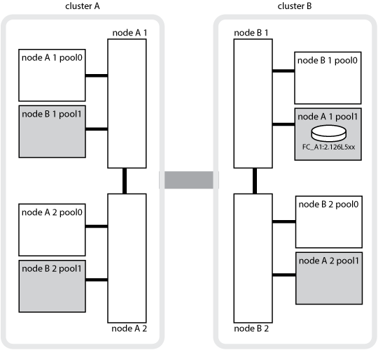

|===
| MetroCluster state| Owner| Home owner| DR Home owner| Notes
a|
Normal with all nodes fully operational.
a|
node_A_1
a|
node_A_1
a|
not applicable
a|

a|
Local HA takeover, node_A_2 has taken over disks belonging to its HA partner node_A_1.
a|
node_A_2
a|
node_A_1
a|
not applicable
a|

a|
DR switchover, node_B_1 has taken over disks belong to its DR partner, node_A_1.
a|
node_B_1
a|
node_B_1
a|
node_A_1
a|
The original home node ID is moved to the DR Home owner field. After aggregate switchback or healing, ownership goes back to node_A_1.

a|
In DR switchover and local HA takeover (double failure), node_B_2 has taken over disks belonging to its HA node_B_1.
a|
node_B_2
a|
node_B_1
a|
node_A_1
a|
After giveback, ownership goes back to node_B_1. After switchback or healing, ownership goes back to node_A_1.

a|
After HA giveback and DR switchback, all nodes fully operational.
a|
node_A_1
a|
node_A_1
a|
not applicable
a|

|===

=== Considerations when using unmirrored aggregates

[.lead]
If your configuration includes unmirrored aggregates, you must be aware of potential access issues after switchover operations.

==== Considerations for unmirrored aggregates when doing maintenance requiring power shutdown

If you are performing negotiated switchover for maintenance reasons requiring site-wide power shutdown, you should first manually take offline any unmirrored aggregates owned by the disaster site.

If you do not, nodes at the surviving site might go down due to multi-disk panics. This could occur if switched-over unmirrored aggregates go offline or are missing because of the loss of connectivity to storage at the disaster site due to the power shutdown or a loss of ISLs.

==== Considerations for unmirrored aggregates and hierarchical namespaces

If you are using hierarchical namespaces, you should configure the junction path so that all of the volumes in that path are either on mirrored aggregates only or on unmirrored aggregates only. Configuring a mix of unmirrored and mirrored aggregates in the junction path might prevent access to the unmirrored aggregates after the switchover operation.

==== Considerations for unmirrored aggregates and CRS metadata volume and data SVM root volumes

The configuration replication service (CRS) metadata volume and data SVM root volumes must be on a mirrored aggregate. You cannot move these volumes to unmirrored aggregate. If they are on unmirrored aggregate, negotiated switchover and switchback operations are vetoed. The metrocluster check command provides a warning if this is the case.

==== Considerations for unmirrored aggregates and SVMs

SVMs should be configured on mirrored aggregates only or on unmirrored aggregates only. Configuring a mix of unmirrored and mirrored aggregates can result in a switchover operation that exceeds 120 seconds and result in a data outage if the unmirrored aggregates do not come online.

==== Considerations for unmirrored aggregates and SAN

A LUN should not be located on an unmirrored aggregate. Configuring a LUN on an unmirrored aggregate can result in a switchover operation that exceeds 120 seconds and a data outage.

=== Automatic unplanned switchover in MetroCluster FC configurations

[.lead]
In MetroCluster FC configurations, certain scenarios can trigger an automatic unplanned switchover (AUSO) in the event of a site-wide controller failure to provide nondisruptive operations. AUSO can be disabled if desired.

NOTE: Automatic unplanned switchover is not supported in MetroCluster IP configurations.

In a MetroCluster FC configuration, an AUSO can be triggered if all nodes at a site are failed because of the following reasons:

* Power down
* Power loss
* Power panic

NOTE: In an eight-node MetroCluster FC configuration, you can set an option to trigger an AUSO if both nodes in an HA pair fail.

Because there is no local HA failover available in a two-node MetroCluster configuration, the system performs an AUSO to provide continued operation after a controller failure. This functionality is similar to the HA takeover capability in an HA pair. In a two-node MetroCluster configuration, an AUSO can be triggered in the following scenarios:

* Node power down
* Node power loss
* Node panic
* Node reboot

If an AUSO occurs, disk ownership for the impaired node's pool0 and pool1 disks is changed to the disaster recovery (DR) partner. This ownership change prevents the aggregates from going into a degraded state after the switchover.

After the automatic switchover, you must manually proceed through the healing and switchback operations to return the controller to normal operation.

==== Hardware-assisted AUSO in two-node MetroCluster configurations

In a two-node MetroCluster configuration, the controller module's service processor (SP) monitors the configuration. In some scenarios, the SP can detect a failure faster than the ONTAP software. In this case, the SP triggers AUSO. This feature is automatically enabled.

The SP sends and receives SNMP traffic to and from its DR partner to monitor its health.

==== Changing the AUSO setting

AUSO is set to auso-on-cluster-disaster by default. Its status can be viewed in the metrocluster show command.

You can disable AUSO with the metrocluster modify -auto-switchover-failure-domain auto-disabled command. This command prevents triggering AUSO in DR site-wide controller failure. It should be run on both the sites if you want to disable AUSO on both the sites.

AUSO can be reenabled with the metrocluster modify -auto-switchover-failure-domain auso-on-cluster-disaster command.

AUSO can also be set to auso-on-dr-group-disaster. This advance level command triggers AUSO on HA failover at one site. It should be run on both the sites with the metrocluster modify -auto-switchover-failure-domain auso-on-dr-group-disaster command.

==== The AUSO setting during switchover

When switchover occurs, the AUSO setting is disabled internally because if a site is in switchover, it cannot automatically switch over.

==== Recovering from AUSO

To recover from an AUSO, you perform the same steps as for a planned switchover.

xref:task_perform_switchover_for_tests_or_maintenance.adoc[Performing switchover for tests or maintenance]

=== Mediator-assisted automatic unplanned switchover in MetroCluster IP configurations

[.lead]
In MetroCluster IP configurations, the system can use the ONTAP Mediator to detect failures and perform a Mediator-assisted automatic unplanned switchover (MAUSO).

NOTE: MAUSO is not supported in MetroCluster FC configurations.

The ONTAP Mediator provides mailbox LUNs for the MetroCluster IP nodes. These LUNs are colocated with the ONTAP Mediator, which runs on a Linux host physically separate from the MetroCluster sites.

The MetroCluster nodes use the mailbox information to determine if a MAUSO is required. MAUSO will not be initiated if the nonvolatile memory (NVRAM or NVMEM, depending on the platform model) in the storage controllers is not mirrored to the remote disaster recovery (DR) partner on the partner site

== What happens during healing (MetroCluster FC configurations)

[.lead]
During healing in MetroCluster FC configurations, the resynchronization of mirrored aggregates occurs in a phased process that prepares the nodes at the repaired disaster site for switchback. It is a planned event, thereby giving you full control of each step to minimize downtime. Healing is a two-step process that occurs on the storage and controller components.

=== Data aggregate healing

After the problem at the disaster site is resolved, you start the storage healing phase:

. Checks that all nodes are up and running at the surviving site.
. Changes ownership of all the pool 0 disks at the disaster site, including root aggregates.

During this phase of healing, the RAID subsystem resynchronizes mirrored aggregates, and the WAFL subsystem replays the nvsave files of mirrored aggregates that had a failed pool 1 plex at the time of switchover.

If some source storage components failed, the command reports the errors at applicable levels: Storage, Sanown, or RAID.

If no errors are reported, the aggregates are successfully resynchronized. This process can sometimes take hours to complete.

Healing the data aggregates CATALYST MIGRATION -- FIX LINKS

=== Root aggregate healing

After the aggregates are synchronized, you start the controller healing phase by giving back the CFO aggregates and root aggregates to their respective DR partners.

Healing the root aggregates CATALYST MIGRATION -- FIX LINKS

== What happens during healing (MetroCluster IP configurations)

[.lead]
During healing in MetroCluster IP configurations, the resynchronization of mirrored aggregates occurs in a phased process that prepares the nodes at the repaired disaster site for switchback. It is a planned event, thereby giving you full control of each step to minimize downtime. Healing is a two-step process that occurs on the storage and controller components.

=== Differences with MetroCluster FC configurations

In MetroCluster IP configurations, you must boot the nodes in the disaster site cluster before the healing operation is performed.

The nodes in the disaster site cluster must be running so that the remote iSCSI disks can be accessed when aggregates are resynchronized.

If the disaster site nodes are not running, the healing operation fails because the disaster node cannot perform the disk ownership changes needed.

=== Data aggregate healing

After the problem at the disaster site is resolved, you start the storage healing phase:

. Checks that all nodes are up and running at the surviving site.
. Changes ownership of all the pool 0 disks at the disaster site, including root aggregates.

During this phase of healing, the RAID subsystem resynchronizes mirrored aggregates, and the WAFL subsystem replays the nvsave files of mirrored aggregates that had a failed pool 1 plex at the time of switchover.

If some source storage components failed, the command reports the errors at applicable levels: Storage, Sanown, or RAID.

If no errors are reported, the aggregates are successfully resynchronized. This process can sometimes take hours to complete.

Healing the data aggregates CATALYST MIGRATION -- FIX LINKS

=== Root aggregate healing

After the aggregates are synchronized, you perform the root aggregate healing phase. In MetroCluster IP configurations, this phase confirms that aggregates have been healed.

Healing the root aggregates CATALYST MIGRATION -- FIX LINKS

== Automatic healing of aggregates on MetroCluster IP configurations after switchover

[.lead]
Starting with ONTAP 9.5, healing is automated during negotiated switchover operations on MetroCluster IP configurations. Starting with ONTAP 9.6, automated healing after unscheduled switchover is supported. This removes the requirement to issue the metrocluster heal commands.

=== Automatic healing after negotiated switchover (starting with ONTAP 9.5)

After performing a negotiated switchover (a switchover command issued without the -forced-on-disaster true option), the automatic healing functionality simplifies the steps required to return the system to normal operation. On systems with automatic healing, the following occurs after the switchover:

* The disaster site nodes remain up.
+
Because they are in switchover state, they are not serving data from their local mirrored plexes.

* The disaster site nodes are moved to the `Waiting for switchback` state.
+
You can confirm the status of the disaster site nodes by using the metrocluster operation show command.

* You can perform the switchback operation without issuing the healing commands.

This feature applies to MetroCluster IP configurations running ONTAP 9.5 and later. It does not apply to MetroCluster FC configurations.

The manual healing commands are still required on MetroCluster IP configurations running ONTAP 9.4 and earlier.

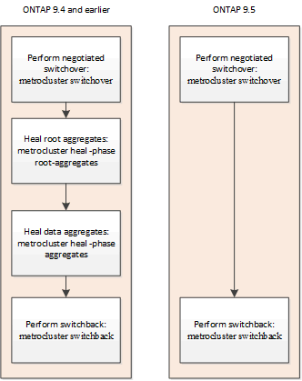

=== Automatic healing after unscheduled switchover (starting with ONTAP 9.6)

Automatic healing after an unscheduled switchover is supported on MetroCluster IP configurations starting with ONTAP 9.6. An unscheduled switchover is one in which in you issue the switchover command with the -forced-on-disaster true option.

Automatic healing after an unscheduled switchover is not supported on MetroCluster FC configurations, and the manual healing commands are still required after unscheduled switchover on MetroCluster IP configurations running ONTAP 9.5 and earlier.

On systems running ONTAP 9.6 and later, the following occurs after the unscheduled switchover:

* Depending on the extent of the disaster, the disaster site nodes can be down.
+
Because they are in switchover state, they are not serving data from their local mirrored plexes, even if they are powered up.

* If the disaster sites were down, when booted up, the disaster site nodes are moved to the `Waiting for switchback` state.
+
If the disaster sites remained up, they are immediately moved to the `Waiting for switchback` state.

* The healing operations are performed automatically.
+
You can confirm the status of the disaster site nodes, and that healing operations succeeded, by using the metrocluster operation show command.

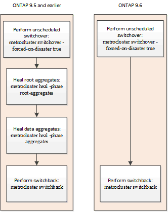

=== If automatic healing fails

If the automatic healing operation fails for any reason, you must issue the metrocluster heal commands manually as done in ONTAP versions prior to ONTAP 9.6. You can use the metrocluster operation show and metrocluster operation history show -instance commands to monitor the status of healing and determine the cause of a failure.

== Creating SVMs for a MetroCluster configuration

[.lead]
You can create SVMs for a MetroCluster configuration to provide synchronous disaster recovery and high availability of data on clusters that are set up for a MetroCluster configuration.

* The two clusters must be in a MetroCluster configuration.
* Aggregates must be available and online in both clusters.
* If required, IPspaces with the same names must be created on both clusters.
* If one of the clusters forming the MetroCluster configuration is rebooted without utilizing a switchover, then the sync-source SVMs might come online as `stopped` rather than `started`.

When you create an SVM on one of the clusters in a MetroCluster configuration, the SVM is created as the source SVM, and the partner SVM is automatically created with the same name but with the "`-mc`" suffix on the partner cluster. If the SVM name contains a period, the "`-mc`" suffix is applied prior to the first period, for example, SVM-MC.DNS.NAME.

In a MetroCluster configuration, you can create 64 SVMs on a cluster. A MetroCluster configuration supports 128 SVMs.

. Use the vserver create command.
+
The following example shows the SVM with the subtype sync-source on the local site and the SVM with the subtype sync-destination on the partner site:
+
----
cluster_A::>vserver create -vserver vs4 -rootvolume vs4_root -aggregate aggr1
-rootvolume-security-style mixed
[Job 196] Job succeeded:
Vserver creation completed
----
+
The SVM vs4 is created on the local site and the SVM vs4-mc is created on the partner site.

. View the newly created SVMs.
 ** On the local cluster, verify the configuration state of SVMs: `metrocluster vserver show`
+
The following example shows the partner SVMs and their configuration state:
+
----
cluster_A::> metrocluster vserver show

                      Partner    Configuration
Cluster     Vserver   Vserver    State
---------  --------  --------- -----------------
cluster_A   vs4       vs4-mc     healthy
cluster_B   vs1       vs1-mc     healthy
----

 ** From the local and partner clusters, verify the state of the newly configured SVMs: `vserver show command`
+
The following example displays the administrative and operational states of the SVMs:
+
----
cluster_A::> vserver show

                             Admin   Operational Root
Vserver Type  Subtype        State   State       Volume     Aggregate
------- ----- -------       ------- --------    ----------- ----------
vs4     data  sync-source   running   running    vs4_root   aggr1

cluster_B::> vserver show

                               Admin   Operational  Root
Vserver Type  Subtype          State   State        Volume      Aggregate
------- ----- -------          ------  ---------    ----------- ----------
vs4-mc  data  sync-destination running stopped      vs4_root    aggr1
----

+
SVM creation might fail if any intermediate operations, such as root volume creation, fail and the SVM is in the `initializing` state. You must delete the SVM and re-create it.

The SVMs for the MetroCluster configuration are created with a root volume size of 1 GB. The sync-source SVM is in the `running` state, and the sync-destination SVM is in the `stopped` state.

== What happens during a switchback

[.lead]
After the disaster site has recovered and aggregates have healed, the MetroCluster switchback process returns storage and client access from the disaster recovery site to the home cluster.

The metrocluster switchback command returns the primary site to full, normal MetroCluster operation. Any configuration changes are propagated to the original SVMs. Data server operation is then returned to the sync-source SVMs on the disaster site and the sync-dest SVMs that had been operating on the surviving site are deactivated.

If SVMs were deleted on the surviving site while the MetroCluster configuration was in switchover state, the switchback process does the following:

* Deletes the corresponding SVMs on the partner site (the former disaster site).
* Deletes any peering relationships of the deleted SVMs.
