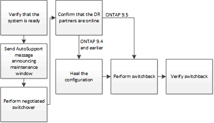

= Performing switchover for tests or maintenance
:icons: font
:imagesdir: ../media/

[.lead]
If you want to test the MetroCluster functionality or to perform planned maintenance, you can perform a negotiated switchover in which one cluster is cleanly switched over to the partner cluster. You can then heal and switch back the configuration.

